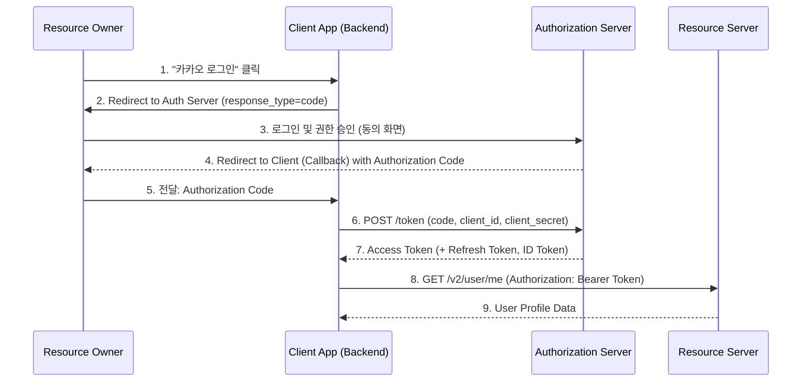
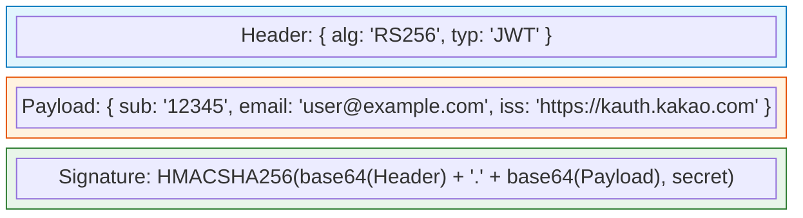

## 이 글에서 얻는 것

- **OAuth 2.0**의 4가지 역할(Role)과 **Authorization Code Grant** 흐름을 완벽하게 이해합니다.
- **OIDC(OpenID Connect)**가 OAuth 2.0 위에서 어떻게 **인증(Authentication)**을 처리하는지 배웁니다.
- **Access Token**과 **ID Token**의 차이를 명확히 구분합니다.

## 0) OAuth 2.0 vs OIDC, 무엇이 다른가?

많은 개발자가 헷갈려합니다.

- **OAuth 2.0**: **인가(Authorization) 프로토콜**입니다. "이 애플리케이션이 내 구글 캘린더에 접근해도 좋다" (권한 부여)
- **OIDC (OpenID Connect)**: **인증(Authentication) 프로토콜**입니다. "이 사용자는 누구다" (신원 확인)

OIDC는 OAuth 2.0 프로토콜 위에 올라간 **Layer**이며, `ID Token`(JWT)을 추가로 발급해줍니다.

## 1) OAuth 2.0의 4가지 역할

| 역할 (Role) | 설명 | 예시 |
|:---|:---|:---|
| **Resource Owner** | 자원(데이터)의 주인 | 사용자 (User) |
| **Client** | 자원을 이용하려는 애플리케이션 | 우리가 개발한 웹/앱 서비스 |
| **Authorization Server** | 권한을 부여하고 토큰을 발급하는 서버 | 카카오 인증 서버, 구글 로그인 서버 |
| **Resource Server** | 실제 자원을 가지고 있는 서버 | 카카오 API 서버 (프로필, 친구목록) |

## 2) Authorization Code Grant Flow (가장 중요!)

서버 사이드 웹 앱에서 가장 많이 쓰이는 방식입니다. 보안성이 가장 높습니다.

**핵심 포인트:**
- **Authorization Code**는 **일회용**이며, 매우 짧은 유효기간을 가집니다.
- **Access Token**을 발급받기 위해서는 `Client Secret`이 필요하므로, 이 단계(6번)는 반드시 **백엔드 서버**에서 수행해야 안전합니다.

## 3) OIDC와 ID Token (JWT)

OIDC를 사용하면(scope에 `openid` 포함), 7번 단계에서 `ID Token`을 함께 받습니다.
ID Token은 **JWT(JSON Web Token)** 형식이며, 사용자의 신원 정보(이름, 이메일, 고유 ID)를 담고 있습니다.

- **Header**: 알고리즘 정보.
- **Payload (Claims)**: 사용자 정보 (`sub`: 유저 고유 식별자, `iss`: 발급자).
- **Signature**: 위변조 방지 서명.

## 4) Access Token vs Refresh Token

| 토큰 | 용도 | 유효 기간 | 특징 |
|:---|:---|:---|:---|
| **Access Token** | 실제 리소스 접근용 | 짧음 (30분~1시간) | 만료 시 API 호출 불가 |
| **Refresh Token** | Access Token 재발급용 | 김 (2주~한달) | 탈취 위험 때문에 안전하게 저장 필수 |

**Refresh Rotation**: Refresh Token을 사용할 때마다 새로운 Refresh Token으로 교체하여, 탈취되더라도 한 번만 사용되고 버려지게 만드는 보안 기법입니다.

## 요약

- **OAuth 2.0**은 권한 부여, **OIDC**는 신원 인증입니다.
- **Authorization Code Flow**는 Code를 먼저 받고, Server-to-Server 통신으로 Token을 교환하므로 안전합니다.
- **ID Token**은 JWT 형식으로 사용자 정보를 담고 있습니다.

## 다음 단계

- **Spring Security 구현**: Oauth2 Client 설정을 통해 실제로 카카오/구글 로그인을 붙여봅니다.
- **HTTPS/SSL**: `/learning/deep-dive/deep-dive-https-ssl-handshake/` 보안 통신의 기본.
