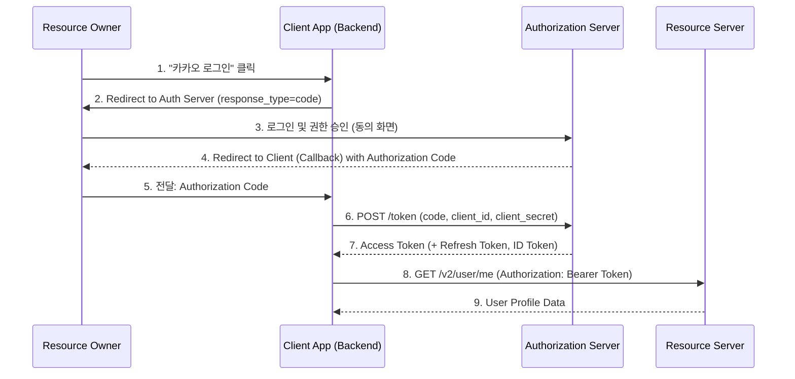
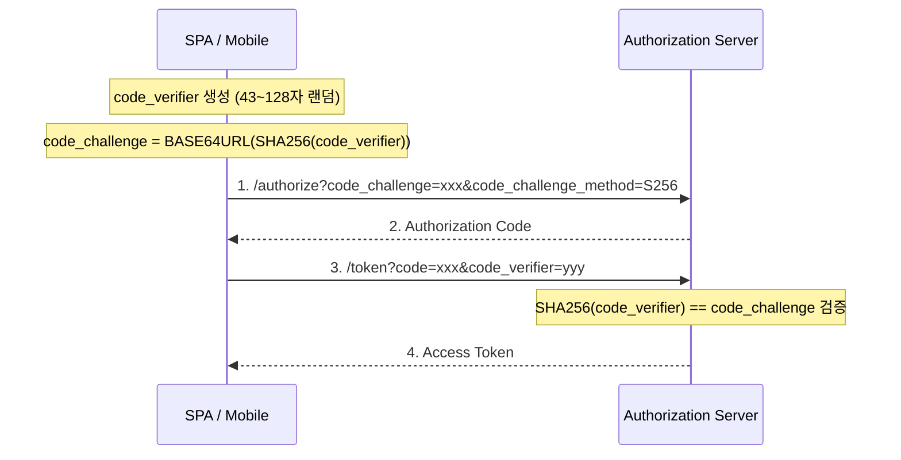
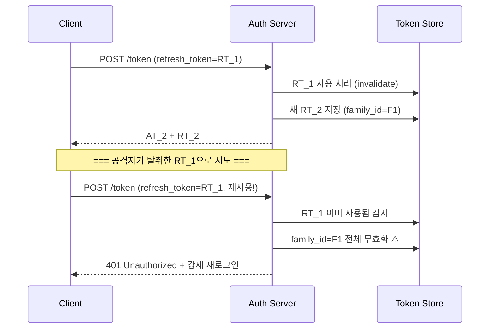

## 이 글에서 얻는 것

- **OAuth 2.0**의 4가지 역할(Role)과 **Authorization Code Grant** 흐름을 완벽하게 이해합니다.
- **OIDC(OpenID Connect)**가 OAuth 2.0 위에서 어떻게 **인증(Authentication)**을 처리하는지 배웁니다.
- **PKCE**로 SPA/모바일 앱의 인가 코드 탈취를 방어하는 방법을 구현합니다.
- **BFF(Backend For Frontend)** 패턴으로 토큰을 안전하게 관리하는 아키텍처를 설계합니다.
- **Access Token** 저장 전략 5가지의 트레이드오프를 비교합니다.
- **Spring Security OAuth2 Client**로 멀티 프로바이더(구글/카카오)를 한 번에 설정합니다.

---

## 0) OAuth 2.0 vs OIDC, 무엇이 다른가?

많은 개발자가 헷갈려합니다.

- **OAuth 2.0**: **인가(Authorization) 프로토콜**입니다. "이 애플리케이션이 내 구글 캘린더에 접근해도 좋다" (권한 부여)
- **OIDC (OpenID Connect)**: **인증(Authentication) 프로토콜**입니다. "이 사용자는 누구다" (신원 확인)

OIDC는 OAuth 2.0 프로토콜 위에 올라간 **Layer**이며, `ID Token`(JWT)을 추가로 발급해줍니다.

| 구분 | OAuth 2.0 | OIDC |
|:---|:---|:---|
| 목적 | 리소스 접근 권한 위임 | 사용자 신원 확인 |
| 발급 토큰 | Access Token (+Refresh Token) | **ID Token** + Access Token |
| ID Token 형식 | 없음 | JWT (서명 검증 가능) |
| 표준 scope | 없음 (프로바이더마다 다름) | `openid`, `profile`, `email` |
| Discovery | 없음 | `/.well-known/openid-configuration` |
| UserInfo 엔드포인트 | 없음 (프로바이더 독자 API) | 표준화 (`/userinfo`) |

---

## 1) OAuth 2.0의 4가지 역할

| 역할 (Role) | 설명 | 예시 |
|:---|:---|:---|
| **Resource Owner** | 자원(데이터)의 주인 | 사용자 (User) |
| **Client** | 자원을 이용하려는 애플리케이션 | 우리가 개발한 웹/앱 서비스 |
| **Authorization Server** | 권한을 부여하고 토큰을 발급하는 서버 | 카카오 인증 서버, 구글 로그인 서버 |
| **Resource Server** | 실제 자원을 가지고 있는 서버 | 카카오 API 서버 (프로필, 친구목록) |

---

## 2) Grant Type 비교표

| Grant Type | 사용 시나리오 | 보안 수준 | Client Secret 필요 | 비고 |
|:---|:---|:---|:---|:---|
| **Authorization Code** | 서버 사이드 웹 앱 | ★★★★★ | ✅ | 가장 권장 |
| **Authorization Code + PKCE** | SPA / 모바일 / CLI | ★★★★★ | ❌ | Secret 없이 안전 |
| **Client Credentials** | 서버 → 서버 (M2M) | ★★★★ | ✅ | 사용자 없는 서비스 간 통신 |
| **Device Authorization** | 스마트 TV / IoT / CLI | ★★★ | ❌ | 제한된 입력 장치용 |
| ~~Implicit~~ | ~~SPA (레거시)~~ | ★ | ❌ | **폐기 예정**, PKCE로 대체 |
| ~~Resource Owner Password~~ | ~~1st party 앱~~ | ★★ | ✅ | **폐기 예정**, 사용 금지 |

---

## 3) Authorization Code Grant Flow (가장 중요!)

서버 사이드 웹 앱에서 가장 많이 쓰이는 방식입니다.


```mermaid
sequenceDiagram
    participant User as Resource Owner
    participant Client as Client App (Backend)
    participant AuthServer as Authorization Server
    participant ResourceServer as Resource Server
    
    User->>Client: 1. "카카오 로그인" 클릭
    Client->>User: 2. Redirect to Auth Server (response_type=code)
    User->>AuthServer: 3. 로그인 및 권한 승인 (동의 화면)
    AuthServer-->>User: 4. Redirect to Client (Callback) with Authorization Code
    User->>Client: 5. 전달: Authorization Code
    
    Client->>AuthServer: 6. POST /token (code, client_id, client_secret)
    AuthServer-->>Client: 7. Access Token (+ Refresh Token, ID Token)
    
    Client->>ResourceServer: 8. GET /v2/user/me (Authorization: Bearer Token)
    ResourceServer-->>Client: 9. User Profile Data
```

**핵심 포인트:**
- **Authorization Code**는 **일회용**이며, 매우 짧은 유효기간을 가집니다 (보통 10분).
- **Access Token**을 발급받기 위해서는 `Client Secret`이 필요하므로, 이 단계(6번)는 반드시 **백엔드 서버**에서 수행해야 안전합니다.
- **state 파라미터**를 반드시 포함하여 CSRF를 방어합니다 (아래 보안 체크리스트 참고).

---

## 4) PKCE — SPA/모바일에서 Authorization Code를 안전하게

SPA나 모바일 앱은 `Client Secret`을 안전하게 저장할 수 없습니다.
**PKCE(Proof Key for Code Exchange, RFC 7636)**는 Secret 없이도 Authorization Code 가로채기 공격을 방어합니다.

### 4-1. PKCE 동작 원리


```mermaid
sequenceDiagram
    participant SPA as SPA / Mobile
    participant Auth as Authorization Server
    
    Note over SPA: code_verifier 생성 (43~128자 랜덤)
    Note over SPA: code_challenge = BASE64URL(SHA256(code_verifier))
    
    SPA->>Auth: 1. /authorize?code_challenge=xxx&code_challenge_method=S256
    Auth-->>SPA: 2. Authorization Code
    SPA->>Auth: 3. /token?code=xxx&code_verifier=yyy
    Note over Auth: SHA256(code_verifier) == code_challenge 검증
    Auth-->>SPA: 4. Access Token
```

### 4-2. Java 구현

```java
import java.security.MessageDigest;
import java.security.SecureRandom;
import java.util.Base64;

public class PkceGenerator {
    
    /**
     * code_verifier 생성 (43~128자, URL-safe random)
     */
    public static String generateCodeVerifier() {
        byte[] bytes = new byte[32]; // 32 bytes → 43 chars (Base64URL)
        new SecureRandom().nextBytes(bytes);
        return Base64.getUrlEncoder().withoutPadding().encodeToString(bytes);
    }
    
    /**
     * code_challenge 생성 (S256 방식)
     */
    public static String generateCodeChallenge(String codeVerifier) throws Exception {
        MessageDigest digest = MessageDigest.getInstance("SHA-256");
        byte[] hash = digest.digest(codeVerifier.getBytes("US-ASCII"));
        return Base64.getUrlEncoder().withoutPadding().encodeToString(hash);
    }
    
    // 사용 예시
    public static void main(String[] args) throws Exception {
        String verifier  = generateCodeVerifier();
        String challenge = generateCodeChallenge(verifier);
        
        // 인가 요청: ?code_challenge={challenge}&code_challenge_method=S256
        // 토큰 요청: &code_verifier={verifier}
        System.out.println("verifier:  " + verifier);
        System.out.println("challenge: " + challenge);
    }
}
```

### 4-3. PKCE가 방어하는 공격

| 공격 | 설명 | PKCE 없을 때 | PKCE 있을 때 |
|:---|:---|:---|:---|
| Authorization Code 가로채기 | 커스텀 스킴이나 인텐트 가로채기로 code 탈취 | code + redirect_uri만으로 토큰 발급 가능 | code_verifier 없으면 토큰 발급 불가 |
| Code Injection | 공격자가 자기 code를 피해자에게 주입 | 피해자의 세션에 공격자 계정이 연결됨 | verifier 불일치로 거부 |

> **팁**: OAuth 2.1(draft)에서는 모든 Client에 PKCE가 필수입니다. 서버 사이드 앱에서도 적용하는 것이 권장됩니다.

---

## 5) OIDC와 ID Token (JWT)

OIDC를 사용하면(scope에 `openid` 포함), 토큰 응답에서 `ID Token`을 함께 받습니다.

### 5-1. ID Token의 표준 Claims

```json
{
  "iss": "https://accounts.google.com",
  "sub": "110248495921238986420",
  "aud": "my-app-client-id",
  "exp": 1711876800,
  "iat": 1711873200,
  "nonce": "abc123",
  "email": "user@example.com",
  "email_verified": true,
  "name": "홍길동",
  "picture": "https://lh3.googleusercontent.com/..."
}
```

| Claim | 의미 | 검증 필수 |
|:---|:---|:---|
| `iss` | 발급자 (Authorization Server URL) | ✅ 신뢰하는 issuer인지 |
| `sub` | 사용자 고유 식별자 | ✅ (이 값으로 회원 매칭) |
| `aud` | 대상 Client ID | ✅ 내 client_id와 일치하는지 |
| `exp` | 만료 시각 (Unix epoch) | ✅ 현재 시각보다 미래인지 |
| `nonce` | 리플레이 방지 | ✅ (인가 요청 시 보낸 값과 동일한지) |
| `iat` | 발급 시각 | 참고 |
| `at_hash` | Access Token 해시 (반반 SHA256) | Implicit/Hybrid에서 ✅ |

### 5-2. ID Token 검증 코드 (nimbus-jose-jwt)

```java
import com.nimbusds.jwt.*;
import com.nimbusds.jose.jwk.source.*;
import com.nimbusds.jose.proc.*;
import com.nimbusds.jwt.proc.*;

public class IdTokenValidator {
    
    private final ConfigurableJWTProcessor<SecurityContext> processor;
    
    public IdTokenValidator(String issuerUrl, String clientId) throws Exception {
        // 1. JWKS 엔드포인트에서 공개키 자동 로드
        JWKSource<SecurityContext> keySource = new RemoteJWKSet<>(
            new URL(issuerUrl + "/.well-known/jwks.json")
        );
        
        // 2. 프로세서 설정
        processor = new DefaultJWTProcessor<>();
        processor.setJWSKeySelector(
            new JWSVerificationKeySelector<>(JWSAlgorithm.RS256, keySource)
        );
        
        // 3. Claims 검증 (iss, aud, exp, nbf)
        processor.setJWTClaimsSetVerifier(
            new DefaultJWTClaimsVerifier<>(
                new JWTClaimsSet.Builder()
                    .issuer(issuerUrl)
                    .audience(clientId)
                    .build(),
                Set.of("sub", "iat", "exp")  // 반드시 있어야 하는 claims
            )
        );
    }
    
    public JWTClaimsSet validate(String idToken) throws Exception {
        return processor.process(idToken, null);
    }
}
```

> **주의**: ID Token은 **절대 Access Token처럼 API 호출에 사용하면 안 됩니다**. ID Token의 `aud`는 클라이언트이고, Resource Server는 Access Token의 scope/audience로 권한을 판단합니다.

---

## 6) Token 저장 전략 비교

### 6-1. 5가지 저장 방식

| 저장 위치 | XSS 방어 | CSRF 방어 | 유출 경로 | 권장 대상 |
|:---|:---|:---|:---|:---|
| **HttpOnly Secure Cookie** | ✅ JS 접근 불가 | ⚠️ SameSite=Strict로 완화 | 네트워크 (HTTPS면 안전) | 서버 렌더링 앱 |
| **서버 세션 (SessionID만 쿠키)** | ✅ 토큰 서버에만 | ✅ 세션 ID만 전달 | 세션 하이재킹 | 전통적 MPA |
| **BFF 패턴** | ✅ 토큰 서버에만 | ✅ BFF가 중계 | BFF 서버 침투 | **SPA (권장)** |
| **localStorage** | ❌ XSS에 노출 | ✅ 자동 전송 안 됨 | XSS 스크립트 | 비추천 |
| **메모리 (JS 변수)** | ⚠️ XSS에도 노출 가능 | ✅ | 새로고침 시 소실 | 초단기 세션 |

### 6-2. BFF (Backend For Frontend) 패턴 아키텍처

```
┌──────────┐     ①/login     ┌──────────┐    ②Authorization    ┌─────────────────┐
│          │ ─────────────→  │          │ ──────Code Flow──→   │  Auth Server    │
│  SPA     │                 │   BFF    │ ←──Token Response──  │  (Google/Kakao) │
│ (React)  │ ←─SessionID──  │ (Spring) │                      └─────────────────┘
│          │   HttpOnly      │          │    ③API 호출
│          │   Cookie        │          │ ─Bearer Token──→  ┌──────────────────┐
│          │ ────────────→   │          │ ←──Response────    │  Resource Server │
└──────────┘  ④API 프록시    └──────────┘                    └──────────────────┘
```

**핵심**: SPA는 토큰을 전혀 모릅니다. 모든 토큰은 BFF 서버에 저장되고, SPA↔BFF 간에는 HttpOnly 세션 쿠키만 오갑니다.

### 6-3. Spring Cloud Gateway BFF 설정

```yaml
# application.yml (Spring Cloud Gateway + OAuth2 Login)
spring:
  security:
    oauth2:
      client:
        registration:
          google:
            client-id: ${GOOGLE_CLIENT_ID}
            client-secret: ${GOOGLE_CLIENT_SECRET}
            scope: openid, profile, email
            redirect-uri: "{baseUrl}/login/oauth2/code/{registrationId}"
        provider:
          google:
            issuer-uri: https://accounts.google.com
  cloud:
    gateway:
      routes:
        - id: api-route
          uri: http://localhost:8081   # 실제 API 서버
          predicates:
            - Path=/api/**
          filters:
            - TokenRelay   # ← 자동으로 Bearer Token 헤더 추가
  session:
    store-type: redis        # 세션을 Redis에 저장 (수평 확장)
    timeout: 30m

server:
  servlet:
    session:
      cookie:
        same-site: strict    # CSRF 방어
        http-only: true      # XSS 방어
        secure: true         # HTTPS만
```

---

## 7) Access Token vs Refresh Token

| 토큰 | 용도 | 유효 기간 | 특징 |
|:---|:---|:---|:---|
| **Access Token** | 실제 리소스 접근용 | 짧음 (5분~1시간) | 만료 시 API 호출 불가 |
| **Refresh Token** | Access Token 재발급용 | 김 (7일~90일) | 탈취 위험 때문에 안전하게 저장 필수 |

### 7-1. Refresh Token Rotation (필수 보안 기법)


```mermaid
sequenceDiagram
    participant Client
    participant Auth as Auth Server
    participant DB as Token Store
    
    Client->>Auth: POST /token (refresh_token=RT_1)
    Auth->>DB: RT_1 사용 처리 (invalidate)
    Auth->>DB: 새 RT_2 저장 (family_id=F1)
    Auth-->>Client: AT_2 + RT_2
    
    Note over Client,Auth: === 공격자가 탈취한 RT_1으로 시도 ===
    
    Client->>Auth: POST /token (refresh_token=RT_1, 재사용!)
    Auth->>DB: RT_1 이미 사용됨 감지
    Auth->>DB: family_id=F1 전체 무효화 ⚠️
    Auth-->>Client: 401 Unauthorized + 강제 재로그인
```

**Rotation 구현 핵심:**
1. Refresh Token을 **한 번만 사용 가능**(one-time use)하게 발급
2. 사용 시 새 Refresh Token과 교환
3. **이미 사용된 토큰이 다시 제출되면**: 해당 family의 모든 토큰을 무효화 (탈취 감지)
4. `jti` claim으로 고유 식별 + DB에 사용 여부 기록

### 7-2. Token Revocation (RFC 7009)

```java
// Access Token 또는 Refresh Token 즉시 무효화
@PostMapping("/api/logout")
public ResponseEntity<Void> logout(
        @AuthenticationPrincipal OAuth2User user,
        HttpServletRequest request) {
    
    OAuth2AuthorizedClient client = authorizedClientService
        .loadAuthorizedClient("google", user.getName());
    
    // 1. Authorization Server에 토큰 취소 요청
    restTemplate.postForEntity(
        "https://oauth2.googleapis.com/revoke",
        new LinkedMultiValueMap<>(Map.of(
            "token", List.of(client.getAccessToken().getTokenValue())
        )),
        Void.class
    );
    
    // 2. 서버 세션 무효화
    request.getSession().invalidate();
    
    return ResponseEntity.noContent().build();
}
```

---

## 8) Spring Security OAuth2 — 멀티 프로바이더 설정

### 8-1. application.yml

```yaml
spring:
  security:
    oauth2:
      client:
        registration:
          google:
            client-id: ${GOOGLE_CLIENT_ID}
            client-secret: ${GOOGLE_CLIENT_SECRET}
            scope: openid, profile, email
          kakao:
            client-id: ${KAKAO_CLIENT_ID}
            client-secret: ${KAKAO_CLIENT_SECRET}
            scope: profile_nickname, profile_image, account_email
            authorization-grant-type: authorization_code
            redirect-uri: "{baseUrl}/login/oauth2/code/{registrationId}"
            client-authentication-method: client_secret_post
          github:
            client-id: ${GITHUB_CLIENT_ID}
            client-secret: ${GITHUB_CLIENT_SECRET}
            scope: read:user, user:email
        provider:
          google:
            issuer-uri: https://accounts.google.com
          kakao:
            authorization-uri: https://kauth.kakao.com/oauth/authorize
            token-uri: https://kauth.kakao.com/oauth/token
            user-info-uri: https://kapi.kakao.com/v2/user/me
            user-name-attribute: id
          github:
            # GitHub은 OIDC 미지원 → UserInfo로 대체
            user-info-uri: https://api.github.com/user
            user-name-attribute: id
```

### 8-2. CustomOAuth2UserService (회원 자동 등록/갱신)

```java
@Service
@RequiredArgsConstructor
public class CustomOAuth2UserService extends DefaultOAuth2UserService {
    
    private final MemberRepository memberRepo;
    
    @Override
    @Transactional
    public OAuth2User loadUser(OAuth2UserRequest request) throws OAuth2AuthenticationException {
        OAuth2User oAuth2User = super.loadUser(request);
        
        String registrationId = request.getClientRegistration().getRegistrationId();
        String providerId = extractProviderId(registrationId, oAuth2User);
        String email = extractEmail(registrationId, oAuth2User);
        String name  = extractName(registrationId, oAuth2User);
        
        // Upsert: 기존 회원이면 갱신, 없으면 생성
        Member member = memberRepo
            .findByProviderAndProviderId(registrationId, providerId)
            .map(m -> m.updateProfile(name, email))
            .orElseGet(() -> memberRepo.save(
                Member.builder()
                    .provider(registrationId)
                    .providerId(providerId)
                    .email(email)
                    .name(name)
                    .role(Role.USER)
                    .build()
            ));
        
        return new CustomOAuth2User(member, oAuth2User.getAttributes());
    }
    
    private String extractProviderId(String registrationId, OAuth2User user) {
        return switch (registrationId) {
            case "google" -> user.getAttribute("sub");
            case "kakao"  -> String.valueOf(user.getAttribute("id"));
            case "github" -> String.valueOf(user.getAttribute("id"));
            default -> throw new OAuth2AuthenticationException("Unsupported: " + registrationId);
        };
    }
    
    private String extractEmail(String registrationId, OAuth2User user) {
        return switch (registrationId) {
            case "google" -> user.getAttribute("email");
            case "kakao"  -> {
                Map<String, Object> account = user.getAttribute("kakao_account");
                yield account != null ? (String) account.get("email") : null;
            }
            case "github" -> user.getAttribute("email");
            default -> null;
        };
    }
    
    private String extractName(String registrationId, OAuth2User user) {
        return switch (registrationId) {
            case "google" -> user.getAttribute("name");
            case "kakao"  -> {
                Map<String, Object> props = user.getAttribute("properties");
                yield props != null ? (String) props.get("nickname") : "Unknown";
            }
            case "github" -> user.getAttribute("login");
            default -> "Unknown";
        };
    }
}
```

### 8-3. Security Configuration

```java
@Configuration
@EnableWebSecurity
public class SecurityConfig {
    
    @Bean
    public SecurityFilterChain filterChain(HttpSecurity http,
            CustomOAuth2UserService customUserService) throws Exception {
        return http
            .csrf(csrf -> csrf
                .csrfTokenRepository(CookieCsrfTokenRepository.withHttpOnlyFalse())
            )
            .authorizeHttpRequests(auth -> auth
                .requestMatchers("/", "/login/**", "/css/**", "/js/**").permitAll()
                .requestMatchers("/api/admin/**").hasRole("ADMIN")
                .anyRequest().authenticated()
            )
            .oauth2Login(oauth2 -> oauth2
                .userInfoEndpoint(info -> info.userService(customUserService))
                .successHandler(oAuth2SuccessHandler())
                .failureUrl("/login?error=true")
            )
            .logout(logout -> logout
                .logoutSuccessUrl("/")
                .deleteCookies("JSESSIONID")
            )
            .sessionManagement(session -> session
                .maximumSessions(3)                   // 동시 세션 제한
                .maxSessionsPreventsLogin(false)       // 기존 세션 만료 (kick)
            )
            .build();
    }
}
```

---

## 9) Client Credentials Grant — 서버 간 통신 (M2M)

사용자 개입 없이 서비스끼리 인증이 필요한 경우:

```java
// Spring Security OAuth2 Client (client_credentials)
@Configuration
public class M2MClientConfig {
    
    @Bean
    public OAuth2AuthorizedClientManager authorizedClientManager(
            ClientRegistrationRepository registrations,
            OAuth2AuthorizedClientRepository clients) {
        
        var provider = OAuth2AuthorizedClientProviderBuilder.builder()
            .clientCredentials()  // client_credentials grant
            .build();
        
        var manager = new DefaultOAuth2AuthorizedClientManager(registrations, clients);
        manager.setAuthorizedClientProvider(provider);
        return manager;
    }
}

// WebClient에 자동 토큰 주입
@Bean
public WebClient paymentServiceClient(OAuth2AuthorizedClientManager manager) {
    var filter = new ServletOAuth2AuthorizedClientExchangeFilterFunction(manager);
    filter.setDefaultClientRegistrationId("payment-service");
    
    return WebClient.builder()
        .baseUrl("https://payment.internal.example.com")
        .apply(filter.oauth2Configuration())
        .build();
}
```

---

## 10) Device Authorization Grant — TV/IoT/CLI

브라우저가 없는 디바이스(스마트 TV, IoT, CLI 도구)에서 사용:

```
디바이스 → POST /device/code → { device_code, user_code, verification_uri }
사용자   → 브라우저에서 verification_uri 접속 → user_code 입력 → 승인
디바이스 → 폴링 POST /token (device_code) → 승인 시 Access Token 발급
```

```java
// CLI 도구에서 Device Authorization Flow
public class DeviceAuthFlow {
    
    public TokenResponse authenticate(String clientId) throws Exception {
        // 1. 디바이스 코드 요청
        var deviceResponse = httpClient.post("/device/code", Map.of(
            "client_id", clientId,
            "scope", "openid profile"
        ));
        
        String deviceCode = deviceResponse.get("device_code");
        String userCode   = deviceResponse.get("user_code");
        String verifyUri  = deviceResponse.get("verification_uri_complete");
        int interval      = deviceResponse.getInt("interval"); // 폴링 간격(초)
        
        // 2. 사용자에게 안내
        System.out.printf("브라우저에서 %s 에 접속하세요%n", verifyUri);
        System.out.printf("또는 %s 에서 코드 %s 를 입력하세요%n",
            deviceResponse.get("verification_uri"), userCode);
        
        // 3. 폴링으로 토큰 대기
        while (true) {
            Thread.sleep(interval * 1000L);
            try {
                return httpClient.post("/token", Map.of(
                    "grant_type", "urn:ietf:params:oauth:grant-type:device_code",
                    "device_code", deviceCode,
                    "client_id", clientId
                ));
            } catch (AuthorizationPendingException e) {
                continue; // 아직 사용자가 승인 안 함
            } catch (SlowDownException e) {
                interval += 5; // 서버가 폴링 간격 늘리라고 요청
            }
        }
    }
}
```

---

## 11) 보안 체크리스트

### 11-1. 인가 요청 보안

| 항목 | 검증 포인트 | 구현 |
|:---|:---|:---|
| **state 파라미터** | CSRF 방어 — 요청 시 랜덤 값 생성, 콜백에서 비교 | Spring Security 자동 처리 |
| **nonce** | 리플레이 방어 — ID Token에 포함되어 돌아옴 | scope에 `openid` 포함 시 자동 |
| **redirect_uri 화이트리스트** | Open Redirect 방어 — 정확히 일치하는 URI만 허용 | Auth Server 콘솔에서 등록 |
| **PKCE** | 코드 가로채기 방어 — SPA/모바일 필수, 서버 앱에도 권장 | `code_challenge_method=S256` |
| **scope 최소화** | 필요 권한만 요청 — 과도한 scope는 사용자 이탈 유발 | 필요한 것만 나열 |

### 11-2. 토큰 보안

| 항목 | 위험 | 대응 |
|:---|:---|:---|
| Access Token 노출 | API 무단 호출 | 짧은 TTL (5~15분), 불투명 토큰 선호 |
| Refresh Token 탈취 | 장기간 무단 접근 | Rotation + 재사용 감지, Secure/HttpOnly 저장 |
| ID Token 위변조 | 인증 우회 | 서명 검증 (JWKS), iss/aud/exp 검증 |
| Token in URL | 로그/Referer로 유출 | POST body 또는 Authorization 헤더 사용 |
| Token in localStorage | XSS로 탈취 | BFF 패턴 또는 HttpOnly Cookie |

### 11-3. 흔한 실수 체크리스트

```text
□ state 파라미터 검증을 빼먹지 않았는가?
□ redirect_uri를 와일드카드(*)로 등록하지 않았는가?
□ Client Secret이 프론트엔드 코드/JS 번들에 노출되지 않는가?
□ Access Token을 URL 쿼리 파라미터로 전달하지 않는가?
□ ID Token을 API 호출 Bearer 토큰으로 사용하지 않는가?
□ Refresh Token Rotation을 활성화했는가?
□ 로그아웃 시 서버측 토큰/세션을 무효화하는가?
□ HTTPS를 강제하고 있는가? (토큰 전송 시 평문 HTTP 차단)
□ CORS 설정이 Origin을 정확히 제한하는가?
□ 만료된 ID Token을 캐시해서 재사용하지 않는가?
```

---

## 12) Token Introspection vs JWT 검증 비교

| 방식 | 동작 | 실시간 무효화 | 성능 | 적합한 경우 |
|:---|:---|:---|:---|:---|
| **JWT 로컬 검증** | JWKS 공개키로 서명 검증 | ❌ (만료까지 유효) | ★★★★★ | 짧은 TTL + 마이크로서비스 |
| **Token Introspection (RFC 7662)** | Auth Server에 매번 조회 | ✅ (즉시 무효화 가능) | ★★★ | 긴 TTL + 즉시 revoke 필요 |
| **하이브리드** | JWT 로컬 + 주기적 introspection | ⚠️ (지연 있음) | ★★★★ | 절충안 |

```java
// Token Introspection 호출 예시
@Component
public class IntrospectionTokenVerifier {
    
    public boolean isActive(String accessToken) {
        ResponseEntity<Map> response = restTemplate.postForEntity(
            "https://auth.example.com/oauth2/introspect",
            new LinkedMultiValueMap<>(Map.of(
                "token", List.of(accessToken),
                "token_type_hint", List.of("access_token")
            )),
            Map.class
        );
        return Boolean.TRUE.equals(response.getBody().get("active"));
    }
}
```

---

## 13) 운영 트러블슈팅

### 13-1. 자주 만나는 에러와 원인

| 에러 | 원인 | 해결 |
|:---|:---|:---|
| `invalid_grant` | code 만료/재사용, redirect_uri 불일치 | 10분 내 교환, URI 정확히 일치 |
| `invalid_client` | client_id/secret 오류, 인증 방식 불일치 | 콘솔에서 재확인, `client_secret_post` vs `client_secret_basic` |
| `access_denied` | 사용자가 동의 거부 | 에러 페이지에서 재시도 안내 |
| `invalid_token` | 만료 또는 revoke된 토큰 | Refresh Token으로 재발급, 실패 시 재로그인 |
| `redirect_uri_mismatch` | 등록된 URI와 다른 URI로 요청 | 정확히 동일한 URI 등록 (슬래시까지) |

### 13-2. 디버깅 체크리스트

```bash
# 1. OIDC Discovery 확인
curl -s https://accounts.google.com/.well-known/openid-configuration | jq .

# 2. JWKS 엔드포인트 확인
curl -s https://www.googleapis.com/oauth2/v3/certs | jq '.keys | length'

# 3. ID Token 디코딩 (페이로드만)
echo "$ID_TOKEN" | cut -d. -f2 | base64 -d 2>/dev/null | jq .

# 4. Access Token Introspection (지원하는 서버)
curl -X POST https://auth.example.com/oauth2/introspect \
  -d "token=$ACCESS_TOKEN" \
  -u "client_id:client_secret"

# 5. Spring Security 디버그 로그
# application.yml에 추가:
# logging.level.org.springframework.security: DEBUG
# logging.level.org.springframework.security.oauth2: TRACE
```

---

## 요약

- **OAuth 2.0**은 권한 부여, **OIDC**는 신원 인증이다.
- **Authorization Code + PKCE**가 현대 애플리케이션의 표준이다 (서버/SPA/모바일 모두).
- **BFF 패턴**이 SPA에서 토큰을 가장 안전하게 관리하는 방법이다.
- **Refresh Token Rotation**은 선택이 아니라 필수다.
- 보안 체크리스트(state/nonce/redirect_uri/PKCE)를 빠짐없이 점검해야 한다.

---

## 관련 심화 학습

- [OAuth2 소셜 로그인 실전](/learning/deep-dive/deep-dive-oauth2-social-login/) — 구글/카카오 연동 구현
- [JWT 인증 심화](/learning/deep-dive/deep-dive-jwt-auth/) — 토큰 설계와 갱신 전략
- [Spring Security 아키텍처](/learning/deep-dive/deep-dive-spring-security-architecture/) — 필터 체인과 인증 흐름
- [Spring Security OAuth2 + JWT 실전](/learning/deep-dive/deep-dive-spring-security-oauth2-jwt-practical/) — 실전 구현 가이드
- [CORS/CSRF/보안 헤더](/learning/deep-dive/deep-dive-security-cors-csrf-headers/) — OAuth2와 함께 필요한 보안 설정
- [TLS Handshake](/learning/deep-dive/deep-dive-tls-handshake/) — HTTPS 보안 통신의 기반
- [Secret Management](/learning/deep-dive/deep-dive-secret-management/) — Client Secret/키 안전 관리
- [OWASP Top 10 체크리스트](/learning/deep-dive/deep-dive-owasp-top10-checklist/) — 웹 보안 전체 그림
