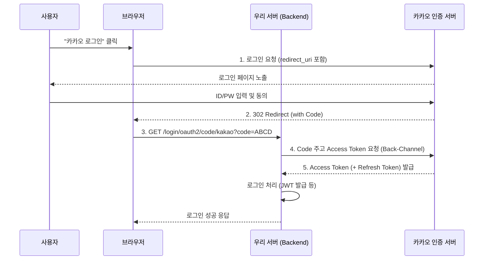

## 이 글에서 얻는 것

- **OAuth 2.0 흐름 마스터**: "승인 코드 방식"이 왜 안전한지, 어떻게 Access Token을 받아오는지 그림으로 이해합니다.
- **Provider 설정**: Google(OIDC 지원)과 Kakao/Naver(OIDC 미지원/커스텀) 설정의 차이를 배웁니다.
- **Spring Boot 설정**: `application.yml` 몇 줄로 소셜 로그인을 끝내는 마법을 체험합니다.

## 1. OAuth 2.0 등장 배경

과거에는 앱이 사용자의 구글 비밀번호를 직접 받아서 저장했습니다. (미친 짓이죠 😱)
OAuth는 **"비밀번호를 공유하지 않고, 권한(열쇠)만 빌려주는"** 프로토콜입니다.

### 핵심 용어

| 용어 | 설명 | 예시 |
| :--- | :--- | :--- |
| **Resource Owner** | 정보 주인 | 로그인하려는 **사용자(나)** |
| **Client** | 정보를 쓰려는 앱 | **우리의 웹 서비스** |
| **Authorization Server** | 권한 관리자 | **Kakao 인증 서버** |
| **Resource Server** | 정보 보관소 | **Kakao API 서버** (프로필, 친구목록) |

## 2. Authorization Code Grant (승인 코드 방식)

가장 표준적인 방식입니다.



**핵심 포인트**:
- **Code(ABCD)**는 일회용입니다.
- **Access Token**은 브라우저를 거치지 않고 서버끼리(Back-Channel) 주고받으므로 안전합니다.

## 3. Spring Security OAuth2 Client 설정

build.gradle:
```groovy
implementation 'org.springframework.boot:spring-boot-starter-oauth2-client'
```

application.yml:
```yaml
spring:
  security:
    oauth2:
      client:
        registration:
          google: # OIDC 지원 (설정 간단)
            client-id: "YOUR_GOOGLE_ID"
            client-secret: "YOUR_GOOGLE_SECRET"
            scope:
              - email
              - profile
          
          kakao: # 커스텀 Provider 필요
            client-id: "YOUR_KAKAO_ID"
            client-secret: "YOUR_KAKAO_SECRET"
            client-authentication-method: client_secret_post
            authorization-grant-type: authorization_code
            redirect-uri: "{baseUrl}/login/oauth2/code/{registrationId}"
            scope:
              - profile_nickname
              - account_email
            client-name: Kakao
            
        provider:
          kakao:
            authorization-uri: https://kauth.kakao.com/oauth/authorize
            token-uri: https://kauth.kakao.com/oauth/token
            user-info-uri: https://kapi.kakao.com/v2/user/me
            user-name-attribute: id
```

## 4. OIDC (OpenID Connect) vs OAuth 2.0

- **OAuth 2.0**: "권한 허가" (Authorization) 목적. (이 글쓰기 권한 줄게)
- **OIDC**: "신원 인증" (Authentication) 목적. (너 철수 맞지?)
    - 구글 로그인은 Access Token과 함께 **ID Token(JWT)**을 줍니다. 이를 까보면 유저 정보가 들어있습니다.

## 요약

1.  **Authorization Code** 방식이 표준입니다. (프론트엔드에 토큰 노출 X)
2.  Spring Boot는 `oauth2-client` 의존성만 있으면 복잡한 핸드셰이크를 자동화해줍니다.
3.  카카오/네이버 같은 국내 서비스는 `provider` 정보를 수동으로 입력해야 합니다.
