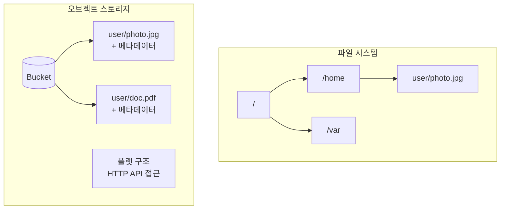
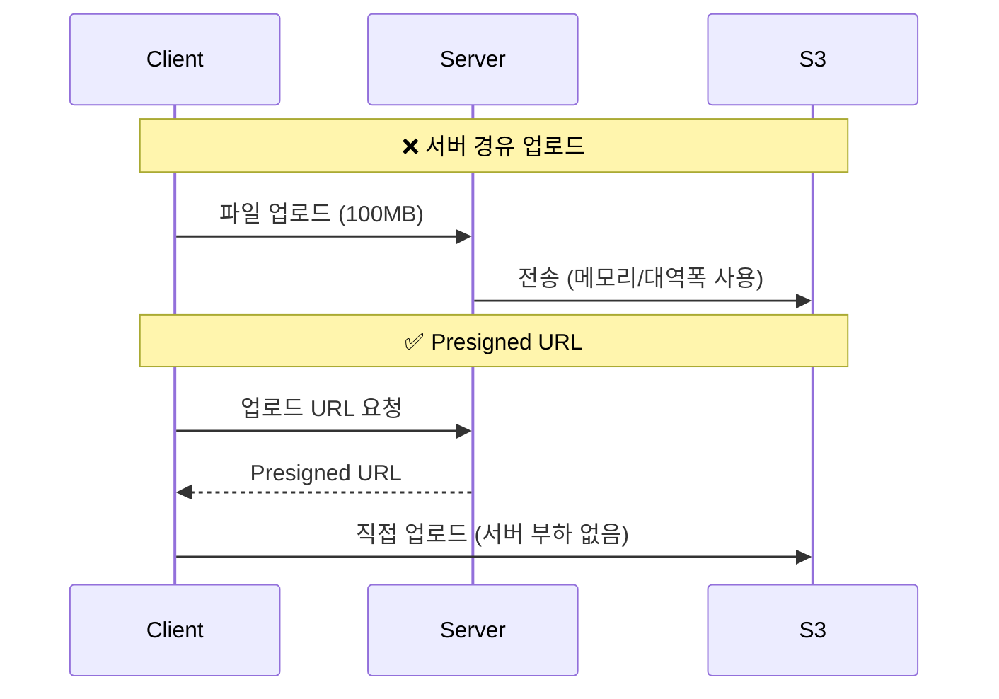
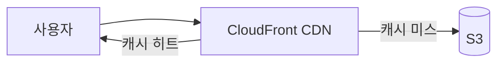

## 이 글에서 얻는 것

- **오브젝트 스토리지**의 개념과 파일 시스템과의 차이를 이해합니다
- **Presigned URL**로 안전한 업로드/다운로드를 구현합니다
- **대용량 파일 업로드**와 **비용 최적화** 전략을 알아봅니다

---

## 오브젝트 스토리지란?

### 파일 시스템 vs 오브젝트 스토리지



| 특성 | 파일 시스템 | 오브젝트 스토리지 |
|------|------------|------------------|
| 구조 | 계층적 (디렉토리) | 플랫 (Key-Value) |
| 접근 | 마운트, POSIX | HTTP API |
| 메타데이터 | 제한적 | 풍부 (커스텀 가능) |
| 확장성 | 제한적 | 무제한 |
| 비용 | 높음 | 저렴 |

---

## Spring Boot + AWS S3

### 설정

```xml
<dependency>
    <groupId>software.amazon.awssdk</groupId>
    <artifactId>s3</artifactId>
</dependency>
```

```java
@Configuration
public class S3Config {
    
    @Value("${aws.region}")
    private String region;
    
    @Bean
    public S3Client s3Client() {
        return S3Client.builder()
            .region(Region.of(region))
            .credentialsProvider(DefaultCredentialsProvider.create())
            .build();
    }
    
    @Bean
    public S3Presigner s3Presigner() {
        return S3Presigner.builder()
            .region(Region.of(region))
            .credentialsProvider(DefaultCredentialsProvider.create())
            .build();
    }
}
```

### 기본 업로드/다운로드

```java
@Service
public class S3StorageService {
    
    @Value("${aws.s3.bucket}")
    private String bucket;
    
    @Autowired
    private S3Client s3Client;
    
    // 업로드
    public String upload(String key, byte[] content, String contentType) {
        PutObjectRequest request = PutObjectRequest.builder()
            .bucket(bucket)
            .key(key)
            .contentType(contentType)
            .build();
        
        s3Client.putObject(request, RequestBody.fromBytes(content));
        
        return String.format("s3://%s/%s", bucket, key);
    }
    
    // 다운로드
    public byte[] download(String key) {
        GetObjectRequest request = GetObjectRequest.builder()
            .bucket(bucket)
            .key(key)
            .build();
        
        ResponseInputStream<GetObjectResponse> response = s3Client.getObject(request);
        return response.readAllBytes();
    }
    
    // 삭제
    public void delete(String key) {
        DeleteObjectRequest request = DeleteObjectRequest.builder()
            .bucket(bucket)
            .key(key)
            .build();
        
        s3Client.deleteObject(request);
    }
}
```

---

## Presigned URL

### 왜 필요한가?



### 구현

```java
@Service
public class PresignedUrlService {
    
    @Autowired
    private S3Presigner presigner;
    
    @Value("${aws.s3.bucket}")
    private String bucket;
    
    // 업로드용 Presigned URL
    public PresignedUrl generateUploadUrl(String key, String contentType) {
        PutObjectRequest objectRequest = PutObjectRequest.builder()
            .bucket(bucket)
            .key(key)
            .contentType(contentType)
            .build();
        
        PutObjectPresignRequest presignRequest = PutObjectPresignRequest.builder()
            .signatureDuration(Duration.ofMinutes(15))  // 15분 유효
            .putObjectRequest(objectRequest)
            .build();
        
        PresignedPutObjectRequest presignedRequest = 
            presigner.presignPutObject(presignRequest);
        
        return new PresignedUrl(
            presignedRequest.url().toString(),
            presignedRequest.expiration()
        );
    }
    
    // 다운로드용 Presigned URL
    public String generateDownloadUrl(String key) {
        GetObjectRequest objectRequest = GetObjectRequest.builder()
            .bucket(bucket)
            .key(key)
            .build();
        
        GetObjectPresignRequest presignRequest = GetObjectPresignRequest.builder()
            .signatureDuration(Duration.ofHours(1))  // 1시간 유효
            .getObjectRequest(objectRequest)
            .build();
        
        return presigner.presignGetObject(presignRequest).url().toString();
    }
}
```

### Controller

```java
@RestController
@RequestMapping("/api/files")
public class FileController {
    
    @Autowired
    private PresignedUrlService urlService;
    
    @PostMapping("/upload-url")
    public PresignedUrl getUploadUrl(@RequestBody UploadRequest request) {
        String key = generateKey(request.getFilename());
        return urlService.generateUploadUrl(key, request.getContentType());
    }
    
    @GetMapping("/{fileId}/download-url")
    public Map<String, String> getDownloadUrl(@PathVariable String fileId) {
        FileMetadata file = fileRepository.findById(fileId).orElseThrow();
        String url = urlService.generateDownloadUrl(file.getS3Key());
        return Map.of("url", url);
    }
    
    private String generateKey(String filename) {
        return String.format("uploads/%s/%s_%s",
            LocalDate.now().format(DateTimeFormatter.ISO_DATE),
            UUID.randomUUID(),
            filename
        );
    }
}
```

---

## 대용량 파일 (Multipart Upload)

### 5GB 이상 업로드

```java
@Service
public class MultipartUploadService {
    
    @Autowired
    private S3Client s3Client;
    
    private static final long PART_SIZE = 100 * 1024 * 1024;  // 100MB
    
    public String uploadLargeFile(String key, InputStream inputStream, long fileSize) {
        // 1. Multipart 업로드 시작
        CreateMultipartUploadRequest createRequest = CreateMultipartUploadRequest.builder()
            .bucket(bucket)
            .key(key)
            .build();
        
        CreateMultipartUploadResponse createResponse = 
            s3Client.createMultipartUpload(createRequest);
        String uploadId = createResponse.uploadId();
        
        List<CompletedPart> completedParts = new ArrayList<>();
        
        try {
            int partNumber = 1;
            byte[] buffer = new byte[(int) PART_SIZE];
            int bytesRead;
            
            while ((bytesRead = inputStream.read(buffer)) != -1) {
                // 2. 각 파트 업로드
                UploadPartRequest uploadRequest = UploadPartRequest.builder()
                    .bucket(bucket)
                    .key(key)
                    .uploadId(uploadId)
                    .partNumber(partNumber)
                    .build();
                
                UploadPartResponse uploadResponse = s3Client.uploadPart(
                    uploadRequest,
                    RequestBody.fromBytes(Arrays.copyOf(buffer, bytesRead))
                );
                
                completedParts.add(CompletedPart.builder()
                    .partNumber(partNumber)
                    .eTag(uploadResponse.eTag())
                    .build());
                
                partNumber++;
            }
            
            // 3. 완료
            CompleteMultipartUploadRequest completeRequest = 
                CompleteMultipartUploadRequest.builder()
                    .bucket(bucket)
                    .key(key)
                    .uploadId(uploadId)
                    .multipartUpload(CompletedMultipartUpload.builder()
                        .parts(completedParts)
                        .build())
                    .build();
            
            s3Client.completeMultipartUpload(completeRequest);
            return key;
            
        } catch (Exception e) {
            // 4. 실패 시 중단
            s3Client.abortMultipartUpload(AbortMultipartUploadRequest.builder()
                .bucket(bucket)
                .key(key)
                .uploadId(uploadId)
                .build());
            throw new RuntimeException("Upload failed", e);
        }
    }
}
```

---

## 비용 최적화

### 스토리지 클래스

| 클래스 | 비용 | 접근 빈도 | 사용 예 |
|--------|-----|---------|--------|
| S3 Standard | 높음 | 자주 | 활성 데이터 |
| S3 Standard-IA | 중간 | 가끔 | 백업, 오래된 로그 |
| S3 Glacier | 낮음 | 드물게 | 아카이브 |
| S3 Glacier Deep Archive | 매우 낮음 | 연 1-2회 | 규정 준수 보관 |

### Lifecycle 정책

```json
{
    "Rules": [
        {
            "ID": "MoveToIA",
            "Status": "Enabled",
            "Filter": { "Prefix": "logs/" },
            "Transitions": [
                {
                    "Days": 30,
                    "StorageClass": "STANDARD_IA"
                },
                {
                    "Days": 90,
                    "StorageClass": "GLACIER"
                }
            ],
            "Expiration": { "Days": 365 }
        }
    ]
}
```

### CloudFront 연동



---

## 요약

### S3 사용 체크리스트

| 항목 | 권장 |
|------|------|
| 업로드 방식 | Presigned URL (서버 부하 감소) |
| 대용량 파일 | Multipart Upload (5GB+) |
| 정적 파일 | CloudFront 연동 |
| 비용 최적화 | Lifecycle 정책 |
| 보안 | Presigned URL + IAM 최소 권한 |

---

## 🔗 Related Deep Dive

- **[Docker 기본](/learning/deep-dive/deep-dive-docker-basics/)**: 컨테이너 이미지 저장소.
- **[CI/CD 보안](/learning/deep-dive/deep-dive-cicd-security-supply-chain/)**: 아티팩트 저장.
