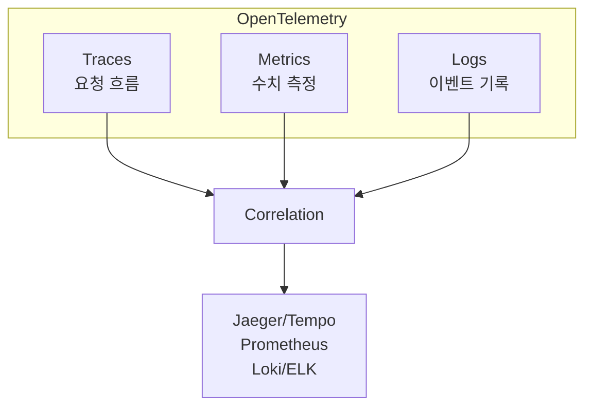
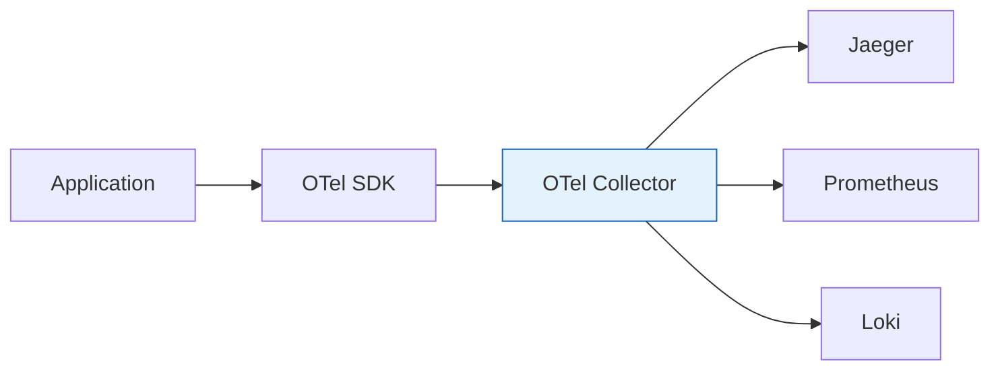
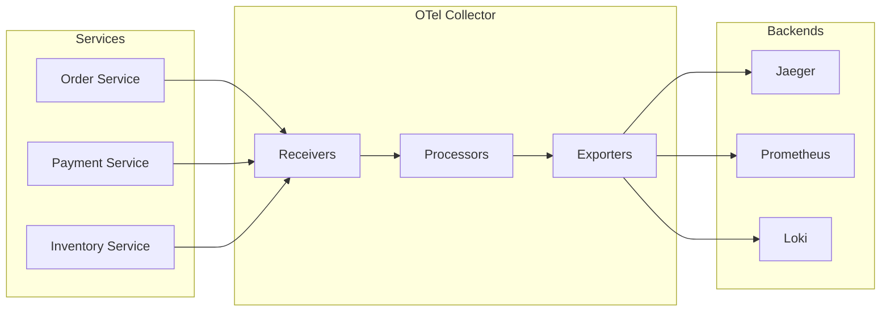

## 이 글에서 얻는 것

- **OpenTelemetry**의 3가지 신호(Traces, Metrics, Logs)를 이해합니다
- **자동 계측**과 **수동 계측** 방법을 알아봅니다
- **분산 컨텍스트 전파**로 요청을 추적합니다

---

## OpenTelemetry란?

### 관측 가능성의 3요소



| 신호 | 목적 | 질문 | 도구 |
|------|------|------|------|
| **Traces** | 요청 경로 | "어디서 느려졌나?" | Jaeger, Zipkin |
| **Metrics** | 상태 측정 | "얼마나 많이?" | Prometheus, InfluxDB |
| **Logs** | 이벤트 기록 | "무슨 일이 있었나?" | ELK, Loki |

### OpenTelemetry 컴포넌트



---

## Spring Boot + OpenTelemetry

### 자동 계측 (Java Agent)

```bash
# 1. Java Agent 다운로드
wget https://github.com/open-telemetry/opentelemetry-java-instrumentation/releases/latest/download/opentelemetry-javaagent.jar

# 2. 애플리케이션 실행
java -javaagent:opentelemetry-javaagent.jar \
     -Dotel.service.name=order-service \
     -Dotel.exporter.otlp.endpoint=http://localhost:4317 \
     -jar app.jar
```

**자동 계측 대상**:
- Spring MVC/WebFlux
- JDBC, JPA/Hibernate
- Kafka, RabbitMQ
- Redis, MongoDB
- HTTP 클라이언트 (RestTemplate, WebClient)

### 의존성 추가 (수동 계측)

```xml
<dependency>
    <groupId>io.opentelemetry</groupId>
    <artifactId>opentelemetry-api</artifactId>
</dependency>
<dependency>
    <groupId>io.opentelemetry</groupId>
    <artifactId>opentelemetry-sdk</artifactId>
</dependency>
<dependency>
    <groupId>io.opentelemetry</groupId>
    <artifactId>opentelemetry-exporter-otlp</artifactId>
</dependency>
```

---

## Traces (분산 트레이싱)

### Span 생성

```java
@Service
public class OrderService {
    
    @Autowired
    private Tracer tracer;
    
    public Order createOrder(OrderRequest request) {
        // 새 Span 생성
        Span span = tracer.spanBuilder("createOrder")
            .setAttribute("order.userId", request.getUserId())
            .setAttribute("order.itemCount", request.getItems().size())
            .startSpan();
        
        try (Scope scope = span.makeCurrent()) {
            // 비즈니스 로직
            Order order = processOrder(request);
            
            span.setAttribute("order.id", order.getId());
            span.setStatus(StatusCode.OK);
            
            return order;
            
        } catch (Exception e) {
            span.setStatus(StatusCode.ERROR, e.getMessage());
            span.recordException(e);
            throw e;
            
        } finally {
            span.end();
        }
    }
    
    private Order processOrder(OrderRequest request) {
        // 자식 Span 자동 생성 (현재 컨텍스트 상속)
        Span childSpan = tracer.spanBuilder("processPayment").startSpan();
        try (Scope scope = childSpan.makeCurrent()) {
            paymentService.process(request);
        } finally {
            childSpan.end();
        }
        // ...
    }
}
```

### Span 시각화

```
[order-service] createOrder (150ms)
├── [order-service] validateOrder (10ms)
├── [payment-service] processPayment (80ms)
│   └── [payment-gateway] charge (60ms)
└── [inventory-service] decreaseStock (40ms)
```

### 컨텍스트 전파

```java
// HTTP 요청 시 자동 전파 (W3C Trace Context)
// Request Headers:
// traceparent: 00-0af7651916cd43dd8448eb211c80319c-b7ad6b7169203331-01

// RestTemplate 자동 전파
@Bean
public RestTemplate restTemplate() {
    RestTemplate restTemplate = new RestTemplate();
    // OpenTelemetry agent가 자동으로 헤더 주입
    return restTemplate;
}

// 수동 전파
public void callExternalService(Order order) {
    Span currentSpan = Span.current();
    
    HttpHeaders headers = new HttpHeaders();
    // 컨텍스트 주입
    GlobalOpenTelemetry.getPropagators()
        .getTextMapPropagator()
        .inject(Context.current(), headers, HttpHeaders::set);
    
    // HTTP 호출
    restTemplate.exchange(url, HttpMethod.POST, 
        new HttpEntity<>(order, headers), String.class);
}
```

---

## Metrics

### Counter, Gauge, Histogram

```java
@Configuration
public class MetricsConfig {
    
    @Bean
    public Meter meter(MeterProvider meterProvider) {
        return meterProvider.get("order-service");
    }
}

@Service
public class OrderMetrics {
    
    private final LongCounter orderCounter;
    private final LongUpDownCounter activeOrders;
    private final DoubleHistogram orderDuration;
    
    public OrderMetrics(Meter meter) {
        // Counter: 단조 증가 (요청 수, 에러 수)
        this.orderCounter = meter.counterBuilder("orders.created")
            .setDescription("Number of orders created")
            .setUnit("1")
            .build();
        
        // UpDownCounter: 증감 가능 (활성 연결 수)
        this.activeOrders = meter.upDownCounterBuilder("orders.active")
            .setDescription("Currently processing orders")
            .build();
        
        // Histogram: 분포 측정 (지연 시간)
        this.orderDuration = meter.histogramBuilder("orders.duration")
            .setDescription("Order processing duration")
            .setUnit("ms")
            .build();
    }
    
    public void recordOrderCreated(String status) {
        orderCounter.add(1, Attributes.of(
            AttributeKey.stringKey("status"), status
        ));
    }
    
    public void recordDuration(long durationMs) {
        orderDuration.record(durationMs);
    }
}
```

### Micrometer 연동

```java
// Spring Boot + Micrometer + OTel
@Configuration
public class MicrometerOtelConfig {
    
    @Bean
    public MeterRegistry meterRegistry() {
        return new OtlpMeterRegistry(config, Clock.SYSTEM);
    }
}

// Micrometer 방식으로 메트릭 기록
@Service
public class OrderService {
    
    private final MeterRegistry registry;
    private final Timer orderTimer;
    
    public OrderService(MeterRegistry registry) {
        this.registry = registry;
        this.orderTimer = Timer.builder("order.process.time")
            .description("Order processing time")
            .register(registry);
    }
    
    public Order createOrder(OrderRequest request) {
        return orderTimer.record(() -> processOrder(request));
    }
}
```

---

## Logs 통합

### TraceId 포함 로깅

```java
// MDC에 TraceId 자동 주입 (Java Agent)
// 또는 수동 설정
@Aspect
@Component
public class TraceLoggingAspect {
    
    @Around("@within(org.springframework.stereotype.Service)")
    public Object addTraceToMdc(ProceedingJoinPoint pjp) throws Throwable {
        Span span = Span.current();
        SpanContext context = span.getSpanContext();
        
        if (context.isValid()) {
            MDC.put("traceId", context.getTraceId());
            MDC.put("spanId", context.getSpanId());
        }
        
        try {
            return pjp.proceed();
        } finally {
            MDC.remove("traceId");
            MDC.remove("spanId");
        }
    }
}
```

```xml
<!-- logback-spring.xml -->
<pattern>
    %d{HH:mm:ss} [%X{traceId:-}] [%X{spanId:-}] %-5level %logger - %msg%n
</pattern>
```

**출력 예시**:

```
10:23:45 [abc123def456] [111222333] INFO OrderService - Order created: order-789
10:23:45 [abc123def456] [444555666] INFO PaymentService - Payment processed
```

---

## OTel Collector

### 구성

```yaml
# otel-collector-config.yaml
receivers:
  otlp:
    protocols:
      grpc:
        endpoint: 0.0.0.0:4317
      http:
        endpoint: 0.0.0.0:4318

processors:
  batch:
    timeout: 1s
    send_batch_size: 1024

exporters:
  jaeger:
    endpoint: jaeger:14250
    tls:
      insecure: true
  
  prometheus:
    endpoint: 0.0.0.0:8889
  
  loki:
    endpoint: http://loki:3100/loki/api/v1/push

service:
  pipelines:
    traces:
      receivers: [otlp]
      processors: [batch]
      exporters: [jaeger]
    metrics:
      receivers: [otlp]
      processors: [batch]
      exporters: [prometheus]
    logs:
      receivers: [otlp]
      processors: [batch]
      exporters: [loki]
```

### 아키텍처



---

## 요약

### OpenTelemetry 도입 체크리스트

| 항목 | 권장 |
|------|------|
| 계측 방식 | Java Agent (자동) |
| Collector | 중앙 집중식 배포 |
| Traces | Jaeger / Tempo |
| Metrics | Prometheus |
| Logs | Loki / ELK |

### 핵심 원칙

1. **통합 표준**: 벤더 독립적인 관측 가능성
2. **자동 계측**: Agent로 코드 수정 최소화
3. **컨텍스트 전파**: 서비스 간 요청 추적
4. **상관 분석**: TraceId로 Logs-Traces-Metrics 연결

---

## 🔗 Related Deep Dive

- **[분산 트레이싱](/learning/deep-dive/deep-dive-distributed-tracing-advanced/)**: Span, Context 전파 상세.
- **[구조화 로깅](/learning/deep-dive/deep-dive-structured-logging/)**: JSON 로깅과 MDC.
- **[APM 기본](/learning/deep-dive/deep-dive-apm-basics/)**: 성능 모니터링 전략.
