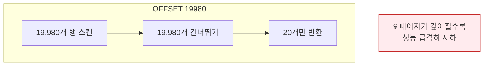
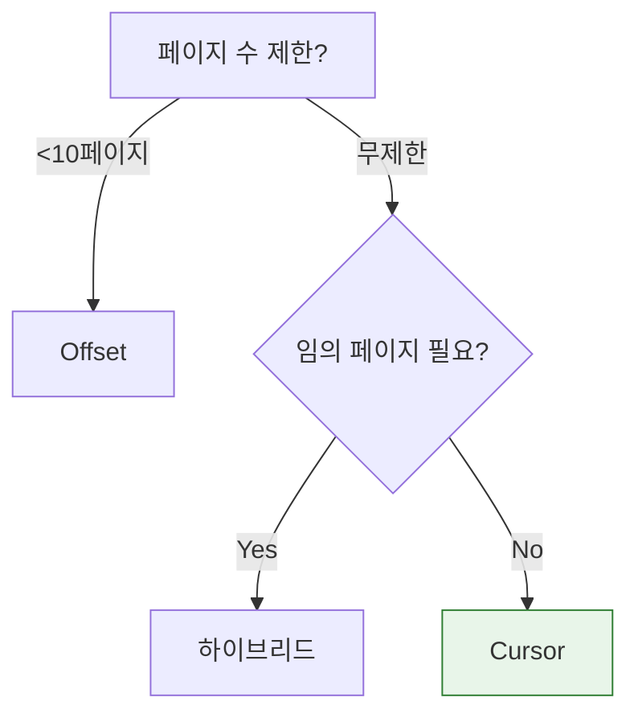

## 이 글에서 얻는 것

- **Offset 페이징의 한계**와 대안을 이해합니다
- **Cursor 기반 페이징**으로 대용량 데이터를 효율적으로 처리합니다
- **No-Offset 페이징** 패턴을 구현합니다

---

## Offset 페이징의 문제

### 기본 Offset 페이징

```sql
-- Page 1
SELECT * FROM orders ORDER BY created_at DESC LIMIT 20 OFFSET 0;

-- Page 1000
SELECT * FROM orders ORDER BY created_at DESC LIMIT 20 OFFSET 19980;
```

### 문제점



**실행 계획**:
```
type: index  -- 인덱스 사용
rows: 20000  -- 2만 행 스캔!
```

---

## 해결 1: No-Offset 페이징

### 개념

```sql
-- ❌ Offset 방식
SELECT * FROM orders ORDER BY id DESC LIMIT 20 OFFSET 19980;

-- ✅ No-Offset (키 기반)
SELECT * FROM orders WHERE id < 마지막_조회_id ORDER BY id DESC LIMIT 20;
```

### 구현

```java
@Repository
public interface OrderRepository extends JpaRepository<Order, Long> {
    
    // 첫 페이지
    @Query("SELECT o FROM Order o ORDER BY o.id DESC")
    List<Order> findFirstPage(Pageable pageable);
    
    // 다음 페이지 (No-Offset)
    @Query("SELECT o FROM Order o WHERE o.id < :lastId ORDER BY o.id DESC")
    List<Order> findNextPage(@Param("lastId") Long lastId, Pageable pageable);
}

@Service
public class OrderService {
    
    public OrderPageResponse getOrders(Long lastId, int size) {
        Pageable pageable = PageRequest.of(0, size);  // offset 무시
        
        List<Order> orders;
        if (lastId == null) {
            orders = orderRepository.findFirstPage(pageable);
        } else {
            orders = orderRepository.findNextPage(lastId, pageable);
        }
        
        Long nextLastId = orders.isEmpty() ? null : 
            orders.get(orders.size() - 1).getId();
        
        return new OrderPageResponse(orders, nextLastId, orders.size() == size);
    }
}

@Getter @AllArgsConstructor
public class OrderPageResponse {
    private List<Order> orders;
    private Long nextCursor;  // 다음 페이지 요청 시 사용
    private boolean hasNext;
}
```

### API

```http
# 첫 페이지
GET /api/orders?size=20

# 응답
{
    "orders": [...],
    "nextCursor": 12345,
    "hasNext": true
}

# 다음 페이지
GET /api/orders?cursor=12345&size=20
```

---

## 해결 2: Cursor 기반 페이징

### 여러 컬럼 정렬

```java
// 생성일 + ID로 정렬 (동일 시간 처리)
@Query("""
    SELECT o FROM Order o 
    WHERE (o.createdAt < :createdAt) 
       OR (o.createdAt = :createdAt AND o.id < :id)
    ORDER BY o.createdAt DESC, o.id DESC
    """)
List<Order> findNextPage(
    @Param("createdAt") LocalDateTime createdAt,
    @Param("id") Long id,
    Pageable pageable
);
```

### Cursor 인코딩

```java
@Service
public class CursorService {
    
    private final ObjectMapper objectMapper;
    
    public String encode(Order order) {
        CursorData data = new CursorData(order.getCreatedAt(), order.getId());
        return Base64.getEncoder().encodeToString(
            objectMapper.writeValueAsBytes(data)
        );
    }
    
    public CursorData decode(String cursor) {
        byte[] decoded = Base64.getDecoder().decode(cursor);
        return objectMapper.readValue(decoded, CursorData.class);
    }
    
    @Getter @AllArgsConstructor
    public static class CursorData {
        private LocalDateTime createdAt;
        private Long id;
    }
}
```

---

## QueryDSL 활용

### 동적 Cursor 조건

```java
@Repository
public class OrderQueryRepository {
    
    private final JPAQueryFactory queryFactory;
    
    public List<Order> findWithCursor(OrderSearchCondition condition) {
        return queryFactory
            .selectFrom(order)
            .where(
                cursorCondition(condition.getLastOrder()),
                statusEq(condition.getStatus())
            )
            .orderBy(order.createdAt.desc(), order.id.desc())
            .limit(condition.getSize())
            .fetch();
    }
    
    private BooleanExpression cursorCondition(Order lastOrder) {
        if (lastOrder == null) {
            return null;
        }
        
        return order.createdAt.lt(lastOrder.getCreatedAt())
            .or(
                order.createdAt.eq(lastOrder.getCreatedAt())
                    .and(order.id.lt(lastOrder.getId()))
            );
    }
}
```

---

## 총 개수 최적화

### 문제: COUNT(*) 느림

```sql
-- 대용량 테이블에서 매우 느림
SELECT COUNT(*) FROM orders WHERE status = 'COMPLETED';
```

### 해결 1: 총 개수 생략

```java
// hasNext만 제공, 총 개수 없음
public class CursorPageResponse<T> {
    private List<T> items;
    private String nextCursor;
    private boolean hasNext;
    // totalCount 없음!
}
```

### 해결 2: 예상 개수

```sql
-- 통계 기반 예상값 (빠름)
EXPLAIN SELECT * FROM orders WHERE status = 'COMPLETED';
-- rows: 12345 (예상값)
```

### 해결 3: 캐시된 COUNT

```java
@Service
public class OrderCountService {
    
    @Autowired
    private RedisTemplate<String, Long> redisTemplate;
    
    // 주기적으로 갱신되는 캐시된 카운트
    @Cacheable(value = "orderCount", key = "#status")
    public long getApproximateCount(OrderStatus status) {
        return orderRepository.countByStatus(status);
    }
    
    @Scheduled(fixedRate = 60000)  // 1분마다 갱신
    @CacheEvict(value = "orderCount", allEntries = true)
    public void refreshCount() {
        // 캐시 만료
    }
}
```

---

## 정렬 처리

### Spring Data Pageable

```java
@GetMapping("/orders")
public Page<OrderDto> getOrders(
        @PageableDefault(size = 20, sort = "createdAt", direction = DESC) Pageable pageable) {
    return orderService.findAll(pageable);
}

// 요청 예시
GET /api/orders?page=0&size=20&sort=createdAt,desc&sort=id,desc
```

### 인덱스와 정렬

```sql
-- 정렬 컬럼에 인덱스 필수
CREATE INDEX idx_orders_created_at ON orders(created_at DESC);

-- 복합 정렬
CREATE INDEX idx_orders_status_created ON orders(status, created_at DESC);
```

---

## Offset vs Cursor 비교

| 특성 | Offset | Cursor |
|------|--------|--------|
| 구현 복잡도 | 낮음 | 높음 |
| 깊은 페이지 성능 | ❌ 매우 느림 | ✅ 일정 |
| 임의 페이지 접근 | ✅ 가능 | ❌ 불가 |
| 데이터 변경 시 | 중복/누락 가능 | 안정적 |
| 총 개수 제공 | ✅ 쉬움 | 추가 작업 필요 |

### 선택 가이드



---

## 요약

### 페이지네이션 체크리스트

| 상황 | 권장 |
|------|------|
| 페이지 < 10 | Offset OK |
| 무한 스크롤 | Cursor |
| 대용량 테이블 | No-Offset |
| 실시간 데이터 | Cursor |

### 핵심 원칙

1. **깊은 페이지 피하기**: No-Offset 또는 Cursor
2. **정렬 인덱스**: ORDER BY 컬럼에 인덱스
3. **총 개수 캐시**: COUNT(*) 최적화
4. **hasNext 제공**: 다음 페이지 존재 여부

---

## 🔗 Related Deep Dive

- **[인덱스 기본](/learning/deep-dive/deep-dive-database-indexing/)**: 정렬 컬럼 인덱싱.
- **[JPA 성능](/learning/deep-dive/deep-dive-jpa-performance/)**: Fetch 전략과 페이징.
