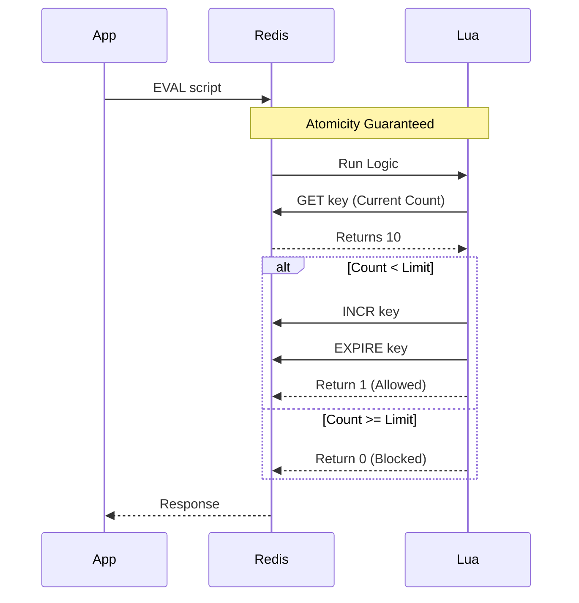

```mermaid
gantt
    title Fixed vs Sliding Window (Limit: 1/min)
    dateFormat X
    axisFormat %s
    
    section Traffic
    Req A (T=59s) :done, 59, 60
    Req B (T=61s) :active, 61, 62
    
    section Fixed Window
    Window 1 (0-60s) :crit, 0, 60
    Window 2 (60-120s) :crit, 60, 120
    
    section Sliding Window
    Window at T=61 (1-61s) :active, 1, 61
```

## 🚧 1. 왜 막아야 하나요?

"무한대로 받으면 좋은 거 아닌가요?"
아닙니다. 모든 시스템은 용량의 한계가 있습니다.

1. **Protection**: DDoS 공격이나 버그로 인한 트래픽 폭주 방지.
2. **Fairness**: 특정 사용자가 리소스를 독점하지 못하게 함 (Neighbor Problem).
3. **Business**: 유료 플랜에 따른 등급 나누기 (Free: 100req/min, Pro: 1000req/min).

---

## 🪣 2. Token Bucket 알고리즘

가장 널리 쓰이는 알고리즘입니다. AWS, Google Guava 등에서 채택했습니다.

```mermaid
graph TD
    Bucket[버킷 (Token 통)]
    Refill[충전 기계] -->|초당 N개| Bucket
    User["사용자 요청"] -->|"1. 토큰 있니?"| Bucket
    
    Bucket -->|Yes (토큰 -1)| Success[요청 처리]
    Bucket -->|No (0개)| Fail[429 Too Many Requests]
    
    style Bucket fill:#f9f,stroke:#333
```

- **버킷 크기 (Capacity)**: 최대 모을 수 있는 토큰 수. (이만큼의 **순간 트래픽(Burst)** 을 허용함)
- **충전 속도 (Refill Rate)**: 초당 몇 개씩 생기나. (지속 가능한 평균 처리량)

> **비유**: 지하철 개찰구에 표를 미리 10장 사둔 사람은 연속으로 10명 빠르게 지나갈 수 있습니다. 하지만 표가 떨어지면 매표소에서 한 장씩 사야 하니 속도가 느려집니다.

---

## 🪟 3. Sliding Window (슬라이딩 윈도우)

"1분에 100개 제한"인데, **59초에 100개, 01초에 100개**가 들어오면?
고정 윈도우(Fixed Window) 방식은 경계값 부근에서 2배의 트래픽을 허용하는 버그가 있습니다.

이를 막기 위해 **Sliding Window**는 시간을 겹쳐서 계산합니다.
(Redis의 `ZSET`을 이용해 타임스탬프 로그를 저장하고 `count`하는 방식이 정확하지만, 메모리를 많이 씁니다.)



---

## ⚡ 4. 분산 환경 구현의 핵심: Redis + Lua

서버가 여러 대일 때, 로컬 메모리(HashMap)에 카운트를 저장하면 구멍이 숭숭 뚫립니다.
**중앙 저장소(Redis)** 가 필요합니다.

하지만 `GET` -> `계산` -> `SET` 사이에 Race Condition이 발생합니다.
그래서 **Lua Script**로 원자성(Atomicity)을 보장해야 합니다.



```lua
-- redis_rate_limit.lua
local key = KEYS[1]
local limit = tonumber(ARGV[1])

local current = tonumber(redis.call('get', key) or "0")

if current + 1 > limit then
    return 0 -- 차단
else
    redis.call('incr', key)
    redis.call('expire', key, 60) -- 1분 TTL
    return 1 -- 통과
end
```

## 요약

1. **알고리즘**: **Token Bucket**이 표준. 버스트 혀용이 싫으면 Leaky Bucket.
2. **위치**: API Gateway나 앞단에서 막을수록 좋다. (App 서버 리소스 보호)
3. **구현**: 분산 환경에서는 Redis Lua Script로 원자성을 챙겨라.
4. **응답**: 그냥 거절하지 말고 `Retry-After` 헤더를 줘라. (클라이언트 예절)
