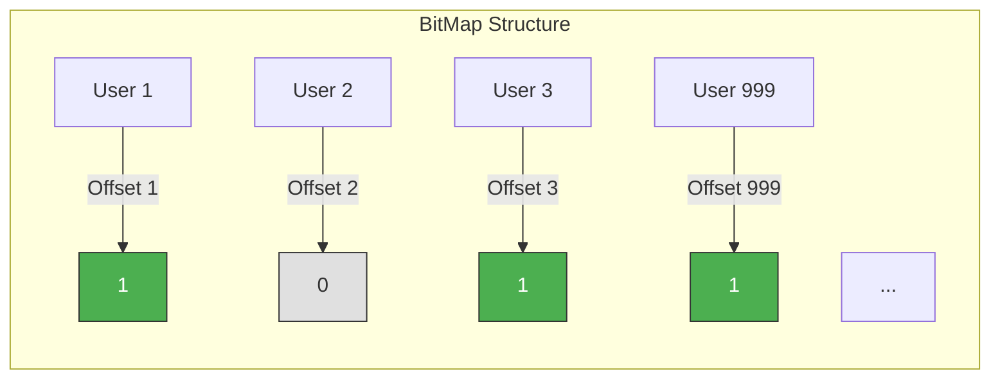
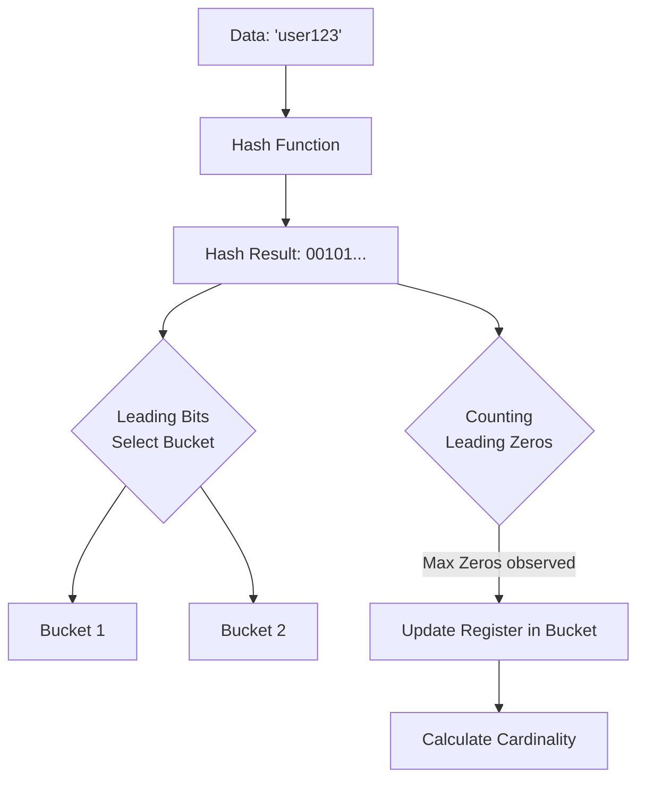
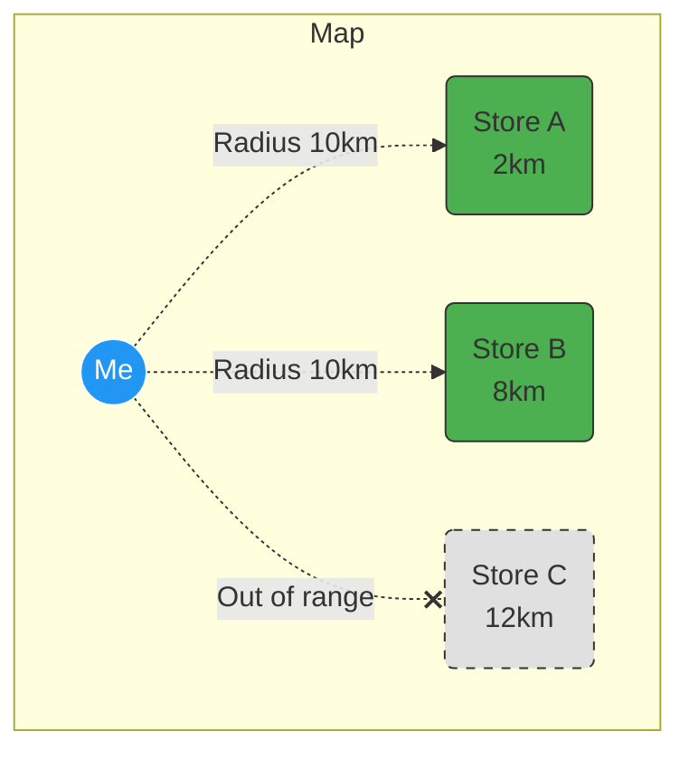
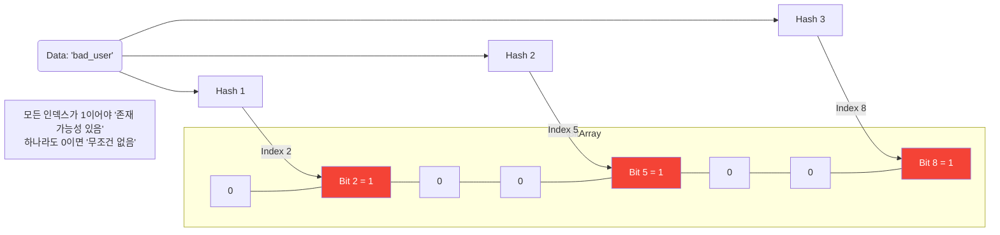

## 이 글에서 얻는 것

- **BitMap**으로 대용량 불리언 데이터를 효율적으로 저장합니다.
- **HyperLogLog**로 유니크 카운트를 메모리 효율적으로 구합니다.
- **Geo**로 위치 기반 서비스를 구현합니다.
- **Bloom Filter**로 존재 여부를 빠르게 확인합니다.

## 1) BitMap: 불리언 데이터의 효율적 저장

### 1-1) BitMap 기본

```bash
# 특정 비트 설정
SETBIT user:visited:20251216 123 1
# user ID 123이 오늘 방문함

# 비트 조회
GETBIT user:visited:20251216 123
# 1: 방문함, 0: 방문 안 함

# 비트 카운트
BITCOUNT user:visited:20251216
# 오늘 방문한 사용자 수
```

### 1-2) BitMap 시각화

BitMap은 0과 1로 이루어진 긴 배열입니다. 각 비트가 유저의 상태(방문 여부 등)를 나타냅니다.



### 1-3) 실전 사용: 일일 활성 사용자 (DAU)

```java
@Service
public class UserActivityService {

    @Autowired
    private StringRedisTemplate redisTemplate;

    // 사용자 방문 기록
    public void recordVisit(Long userId) {
        String key = "user:visited:" + LocalDate.now();
        redisTemplate.opsForValue().setBit(key, userId, true);
        
        // 30일 후 자동 삭제
        redisTemplate.expire(key, Duration.ofDays(30));
    }

    // DAU 조회
    public Long getDailyActiveUsers() {
        String key = "user:visited:" + LocalDate.now();
        return redisTemplate.execute((RedisCallback<Long>) connection -> {
            return connection.bitCount(key.getBytes());
        });
    }

    // 특정 사용자가 오늘 방문했는지
    public boolean hasVisitedToday(Long userId) {
        String key = "user:visited:" + LocalDate.now();
        return Boolean.TRUE.equals(redisTemplate.opsForValue().getBit(key, userId));
    }
}
```

**메모리 효율:**
```
일반 Set: 1억 명 × 8 bytes = 800MB
BitMap: 1억 비트 ÷ 8 = 12.5MB

약 64배 효율적!
```

## 2) HyperLogLog: 유니크 카운트

### 2-1) HyperLogLog 기본

```bash
# 요소 추가
PFADD unique:users:20251216 "user:1" "user:2" "user:3"

# 유니크 카운트
PFCOUNT unique:users:20251216
# 3

# 병합
PFMERGE unique:users:week unique:users:20251216 unique:users:20251217
```

### 2-2) HyperLogLog 원리 (확률적 카운팅)

HyperLogLog는 데이터를 실제로 저장하지 않고, "해시값의 패턴"을 기억합니다.



### 2-3) 실전 사용: UV (Unique Visitors)

```java
@Service
public class UniqueVisitorService {

    @Autowired
    private StringRedisTemplate redisTemplate;

    // 방문자 기록
    public void recordVisitor(String visitorId) {
        String key = "uv:" + LocalDate.now();
        redisTemplate.opsForHyperLogLog().add(key, visitorId);
        redisTemplate.expire(key, Duration.ofDays(90));
    }

    // UV 조회
    public Long getUniqueVisitors() {
        String key = "uv:" + LocalDate.now();
        return redisTemplate.opsForHyperLogLog().size(key);
    }

    // 주간 UV (병합)
    public Long getWeeklyUniqueVisitors() {
        List<String> keys = new ArrayList<>();
        for (int i = 0; i < 7; i++) {
            String key = "uv:" + LocalDate.now().minusDays(i);
            keys.add(key);
        }
        
        String weekKey = "uv:week:" + LocalDate.now();
        redisTemplate.opsForHyperLogLog().union(weekKey, keys.toArray(new String[0]));
        
        return redisTemplate.opsForHyperLogLog().size(weekKey);
    }
}
```

**메모리 효율:**
```
정확한 Set: 1억 명 × 평균 20 bytes = 2GB
HyperLogLog: 12KB (고정)

오차율: 0.81%
```

## 3) Geo: 위치 기반 서비스

### 3-1) Geo 기본

```bash
# 위치 추가 (경도, 위도, 멤버)
GEOADD stores 127.0276 37.4979 "seoul-gangnam"
GEOADD stores 126.9784 37.5665 "seoul-city-hall"

# 거리 계산
GEODIST stores "seoul-gangnam" "seoul-city-hall" km
# 9.2 (km)

# 반경 내 검색
GEORADIUS stores 127.0 37.5 10 km WITHDIST WITHCOORD
```

```bash
# 반경 내 검색
GEORADIUS stores 127.0 37.5 10 km WITHDIST WITHCOORD
```

### 3-2) Geo 검색 시각화

중심점(내 위치)에서 설정한 반경 내에 있는 점(매장)들을 찾습니다.



### 3-3) 실전 사용: 주변 매장 찾기

```java
@Service
public class StoreLocationService {

    @Autowired
    private StringRedisTemplate redisTemplate;

    // 매장 위치 등록
    public void registerStore(String storeId, double longitude, double latitude) {
        redisTemplate.opsForGeo().add("stores", 
            new Point(longitude, latitude), 
            storeId);
    }

    // 주변 매장 검색 (반경 5km 이내)
    public List<StoreDistance> findNearbyStores(double longitude, double latitude) {
        Circle circle = new Circle(new Point(longitude, latitude), 
            new Distance(5, Metrics.KILOMETERS));

        GeoResults<RedisGeoCommands.GeoLocation<String>> results = 
            redisTemplate.opsForGeo().radius("stores", circle);

        return results.getContent().stream()
            .map(result -> new StoreDistance(
                result.getContent().getName(),
                result.getDistance().getValue()
            ))
            .collect(Collectors.toList());
    }

    // 두 지점 간 거리
    public double getDistance(String store1, String store2) {
        Distance distance = redisTemplate.opsForGeo().distance(
            "stores", store1, store2, Metrics.KILOMETERS);
        
        return distance != null ? distance.getValue() : 0.0;
    }
}
```

## 4) Bloom Filter: 존재 여부 빠른 확인

## 4) Bloom Filter: 존재 여부 빠른 확인

Bloom Filter는 **"없다"는 100% 확실**하지만, **"있다"는 확률적(False Positive)**인 구조입니다.

### 4-1) 동작 원리



### 4-2) Redisson Bloom Filter

```java
@Service
public class UserBlockService {

    @Autowired
    private RedissonClient redissonClient;

    private RBloomFilter<String> blockedUsers;

    @PostConstruct
    public void init() {
        blockedUsers = redissonClient.getBloomFilter("blocked:users");
        
        // 예상 요소 수: 1백만, 오차율: 1%
        blockedUsers.tryInit(1000000, 0.01);
    }

    // 사용자 차단
    public void blockUser(String userId) {
        blockedUsers.add(userId);
        // 실제 차단 목록에도 추가
        actualBlockList.add(userId);
    }

    // 차단 여부 확인 (빠른 사전 필터링)
    public boolean isBlocked(String userId) {
        // Bloom Filter로 먼저 체크 (false positive 가능)
        if (!blockedUsers.contains(userId)) {
            return false;  // 확실히 차단 안 됨
        }
        
        // Bloom Filter가 true 반환 시 실제 DB 확인
        return actualBlockList.contains(userId);
    }
}
```

**사용 시나리오:**
```
1. Bloom Filter 체크 (매우 빠름)
   - false → 100% 차단 안 됨
   - true → 차단되었을 수도 있음 (DB 확인 필요)

2. DB 확인 (Bloom Filter가 true인 경우만)

→ 대부분의 요청을 Bloom Filter에서 빠르게 걸러냄
```

## 5) 실전 조합 패턴

### 5-1) 실시간 통계 대시보드

```java
@RestController
@RequestMapping("/api/dashboard")
public class DashboardController {

    @Autowired
    private UserActivityService activityService;

    @Autowired
    private UniqueVisitorService visitorService;

    @GetMapping("/stats")
    public DashboardStats getStats() {
        return DashboardStats.builder()
            .dau(activityService.getDailyActiveUsers())
            .uv(visitorService.getUniqueVisitors())
            .weeklyUv(visitorService.getWeeklyUniqueVisitors())
            .build();
    }
}
```

### 5-2) 위치 기반 푸시 알림

```java
@Service
public class LocationPushService {

    public void sendNearbyPromotion(double userLat, double userLon) {
        // 주변 5km 이내 매장 찾기
        List<StoreDistance> nearbyStores = storeLocationService
            .findNearbyStores(userLon, userLat);

        // 가장 가까운 매장의 프로모션 전송
        if (!nearbyStores.isEmpty()) {
            String storeId = nearbyStores.get(0).getStoreId();
            Promotion promo = getPromotion(storeId);
            pushService.send(promo);
        }
    }
}
```

## 요약

- BitMap: 불리언 데이터를 메모리 효율적으로
- HyperLogLog: 유니크 카운트를 12KB로
- Geo: 위치 기반 서비스 구현
- Bloom Filter: 빠른 존재 여부 확인

## 다음 단계

- Redis 클러스터: `/learning/deep-dive/deep-dive-redis-cluster/`
- Redis Streams: `/learning/deep-dive/deep-dive-redis-streams/`
- 캐싱 전략: `/learning/deep-dive/deep-dive-caching-strategies/`
