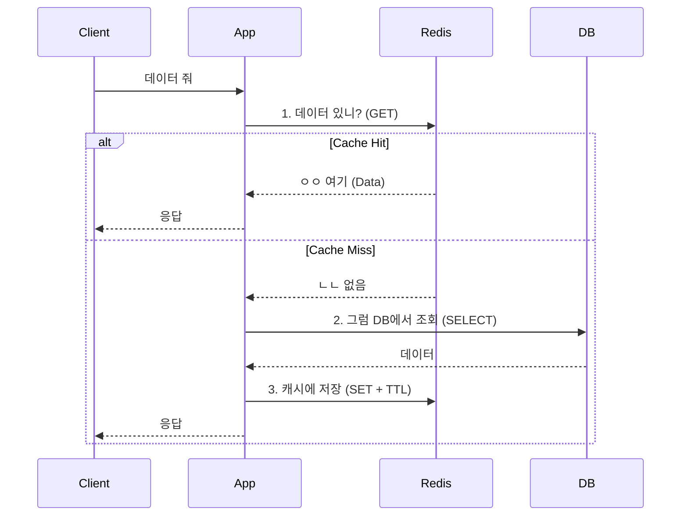
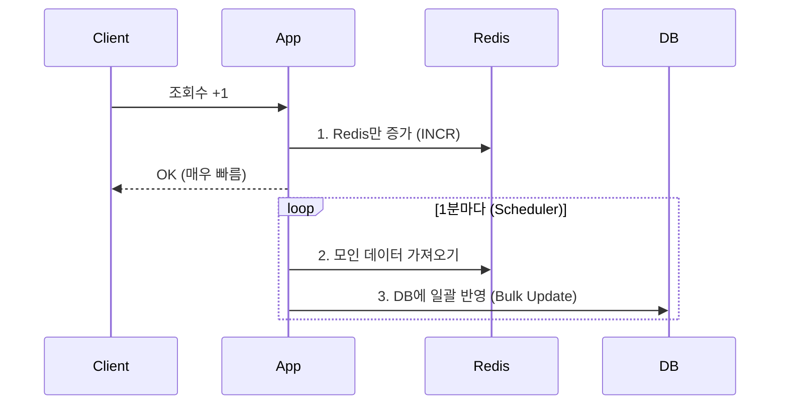

## 🚀 1. 캐싱 패턴의 세계

"그냥 Redis에 넣으면 되는 거 아니야?" 라고 생각하면 오산입니다.
데이터를 언제, 어떻게 넣고 뺄지에 따라 시스템의 운명이 결정됩니다.

### 1-1. Cache-Aside (Lazy Loading) - *국룰*

가장 많이 쓰는 패턴입니다. "없으면 가져오고, 있으면 쓴다."

- **장점**: 필요한 것만 캐싱됨. Redis 죽어도 DB로 서비스 가능(물론 DB가 터질 수도 있음).
- **단점**: 첫 요청은 느림(Cache Warming 필요).

### 1-2. Write-Back (Write-Behind)

"일단 적어두고 나중에 한방에." (예: 좋아요 수, 조회수)

- **장점**: 쓰기 성능 극대화. DB 부하 최소화.
- **단점**: Redis 죽으면 데이터 날아감(내구성을 포기하고 속도를 얻음).

---

## 💣 2. 캐시 운영의 3대장 (함정)

캐시를 도입하면 반드시 마주치게 되는 문제들입니다.

### 2-1. Thundering Herd (Cache Stampede)
인기 있는 아이돌 콘서트 예매 생각하시면 됩니다.
캐시가 만료되는 순간(`TTL Expire`), 수천 개의 요청이 동시에 DB를 때립니다. **DB 사망 원인 1위.**

- **해결책**:
  1. **Probabilistic Early Expiration**: "만료 10초 전부터는 10% 확률로 미리 갱신하자."
  2. **Mutex Lock**: "한 놈만 DB에 갔다 와. 나머지는 기다려."

### 2-2. Hot Key
특정 키(`BTS:Profile`) 하나에만 요청이 99% 몰린다면?
Sharding(Cluster)을 해도 소용없습니다. 그 키가 있는 노드만 죽어나니까요.

- **해결책**: **Local Cache** (EHCache, Caffeine)를 앞에 둡니다. Redis까지 안 오게 막는 거죠.

### 2-3. Cache Penetration (관통)
"없는 데이터"를 계속 요청하는 공격.
DB에 없으니 캐시에도 안 쌓이고, 계속 DB만 때리게 됩니다.

- **해결책**:
  1. **Null Object Pattern**: "없음"이라는 값도 캐싱한다. (TTL 짧게)
  2. **Bloom Filter**: "없는 게 확실해"라고 거름망을 둔다.

---

## 🧹 3. 캐시 무효화 (Invalidation)는 어렵다

"컴퓨터 과학에서 가장 어려운 두 가지: 이름 짓기와 캐시 무효화." - Phil Karlton

데이터가 변경되었을 때, 캐시를 지워야 하는데...
1. **TTL(시간)**: "10분 지나면 알아서 지워져." (가장 쉬움, 정합성 포기)
2. **이벤트 기반**: "상품 수정되면 메시지 큐 쏴서 캐시 지워." (복잡함, 정합성 높음)

**실무 팁**: 
완벽한 정합성이 필요하면 캐시를 쓰지 마세요. 캐시는 **Eventually Consistent**를 전제로 써야 정신 건강에 이롭습니다.

## 요약

1. **Read**: 기본은 **Cache-Aside**.
2. **Write**: 중요하면 **Write-Through**, 성능 중요하면 **Write-Back**.
3. **Stampede**: 인기 데이터 TTL 만료를 조심해라.
4. **Invalidation**: TTL이 짱이다. 안 되면 복잡해진다.
