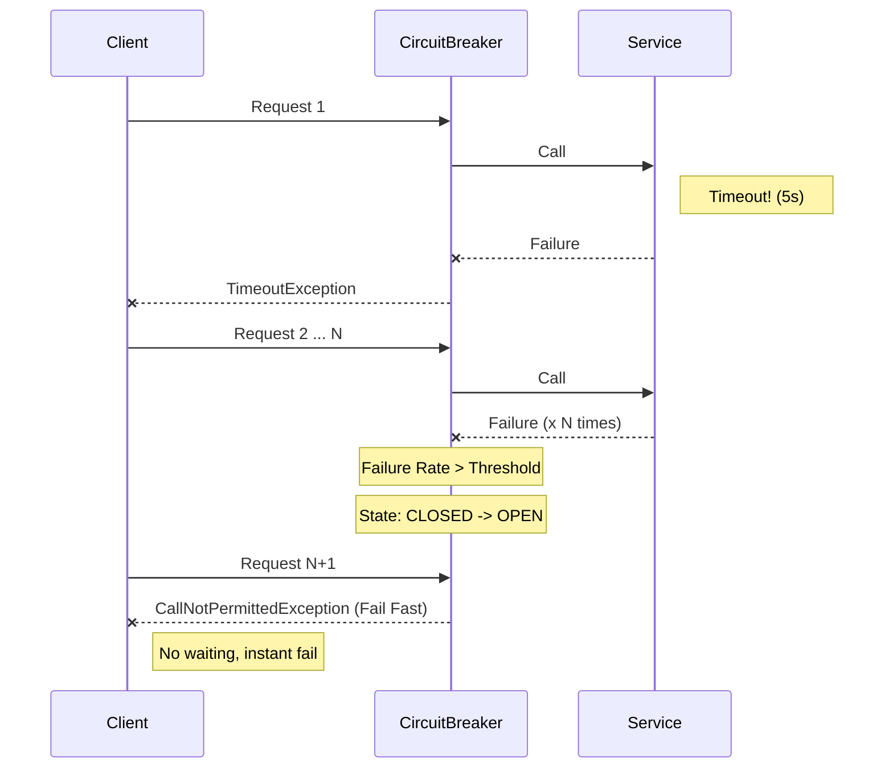
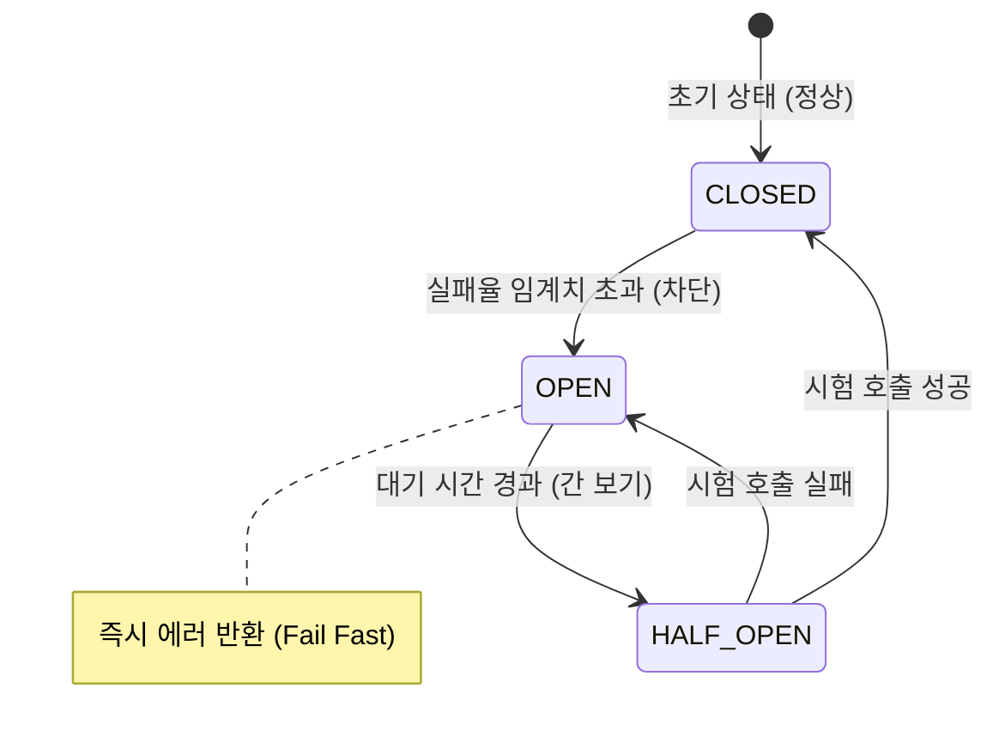
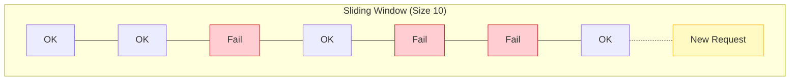

## 🔌 1. 왜 "두꺼비집"이라고 부를까?

집에 누전이 되면 전체 정전을 막기 위해 두꺼비집(배선 차단기)이 내려갑니다.
MSA에서도 마찬가지입니다. **B 서비스가 죽었을 때, 이를 호출하는 A 서비스까지 같이 느려지다 죽는 것(Cascade Failure)** 을 막기 위해 회로를 끊어버립니다.

### 1-1. 장애 전파 시나리오



---

## 🚦 2. 상태 기계 (State Machine)

서킷 브레이커는 3가지 상태를 오가며 시스템을 보호합니다.



1. **CLOSED (닫힘)**: 정상. 전기가 잘 통함. (트래픽 통과)
2. **OPEN (열림)**: 차단됨. 전기가 안 통함. (호출 즉시 차단 예외 발생)
3. **HALF_OPEN (반 열림)**: "이제 좀 괜찮나?" 하고 몇 개만 살짝 보내봄. 성공하면 닫고, 실패하면 다시 엽니다.

---

## 🛡️ 3. Resilience4j 실전 설정

"실패가 몇 번 나면 끊을래?"를 결정하는 것이 핵심입니다.

```yaml
resilience4j:
  circuitbreaker:
    instances:
      myService:
        failureRateThreshold: 50        # 50% 실패하면 Open
        slidingWindowSize: 100          # 최근 100개 요청 기준
        minimumNumberOfCalls: 10        # 최소 10개는 표본이 쌓여야 함
        waitDurationInOpenState: 10s    # 10초 동안 차단 유지 후 Half-Open
        waitDurationInOpenState: 10s    # 10초 동안 차단 유지 후 Half-Open
        permittedNumberOfCallsInHalfOpenState: 3 # Half-Open 때 3개만 보내봄
```

### 3-2. Sliding Window (집계 방식)

최근 N개의 요청을 저장하고, 그 중 실패 비율을 계산합니다.



### Fallback (대안)

차단되었을 때 클라이언트에게 "에러"만 던지면 안 되겠죠?
**Fallback** 메소드를 통해 "기본값"이라도 줘야 합니다.

```java
@CircuitBreaker(name = "myService", fallbackMethod = "fallbackHello")
public String callExternalServer() {
    return restTemplate.getForObject("/api/hello", String.class);
}

// 🚧 장애 시 실행될 메소드
public String fallbackHello(Throwable t) {
    log.error("외부 서버 죽음: {}", t.getMessage());
    return "잠시 점검 중입니다. (기본 응답)";
}
```

---

## ⚠️ 4. 주의사항: "Thread Pool Hell"

서킷 브레이커 없이 `Timeout`만 걸면 어떻게 될까요?
응답이 30초 걸리는 장애 서버에 요청이 몰리면, 내 서버의 스레드 풀(Thread Pool)이 대기하느라 꽉 차버립니다. (Bulkhead 패턴이 필요한 이유)

서킷 브레이커는 **"아예 요청을 안 보내고(Fail Fast)"** 스레드를 즉시 반환하게 하여 내 서버를 살립니다.

## 요약

1. **목적**: 장애 전파 방지 (나라도 살자).
2. **상태**: Normal(Closed) -> Error(Open) -> Test(Half-Open).
3. **Fallback**: 안 될 때 줄 수 있는 '차선책'을 준비해라.
4. **설정**: 너무 빨리 열리면 민감하고, 너무 늦게 열리면 장애가 전파된다.
