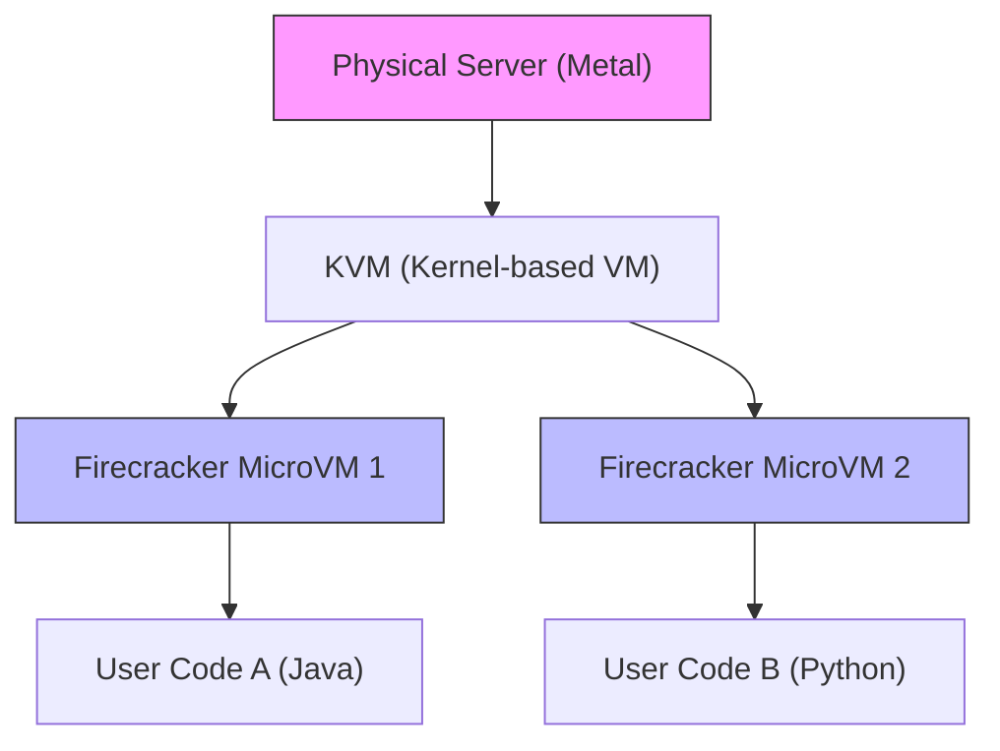
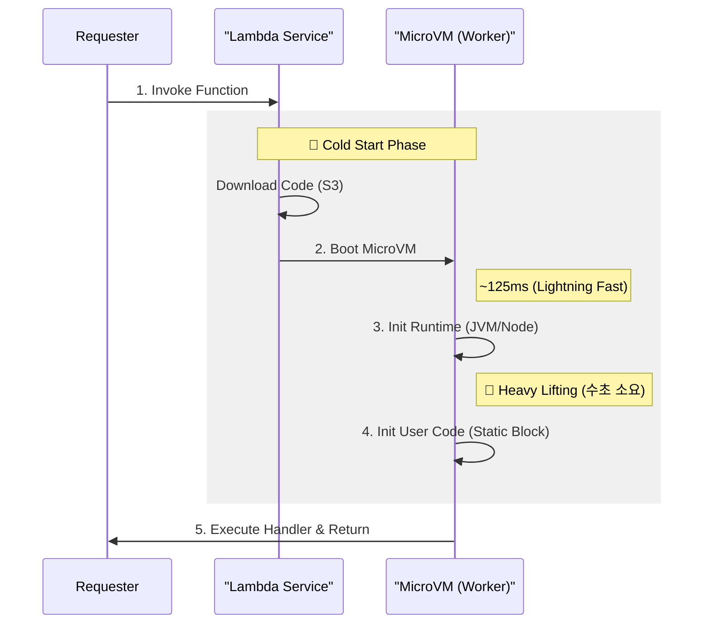

## ⚡ 1. 서버리스의 딜레마

"서버리스(Serverless)"라는 이름은 거짓말입니다. 서버는 반드시 존재합니다. 다만, **우리가 관리하지 않을 뿐**입니다.

AWS 입장에서 생각해보세요. 전 세계 수만 명의 개발자가 짠 코드를 실행해줘야 합니다. 그런데 물리 서버 하나에 내 코드와 옆집 개발자의 코드가 같이 돌아간다면 어떨까요?

> ⚠️ **보안 문제**: 옆집 코드가 내 메모리를 훔쳐보거나, CPU를 독점한다면?

이 문제를 해결하기 위해 두 가지 방식이 있었습니다:

| 기술 | 보안(격리) | 부팅 속도 | 오버헤드 |
| :--- | :--- | :--- | :--- |
| **VM (가상 머신)** | 🔒 **강함** (하드웨어 격리) | 🐢 **느림** (분 단위) | 높음 (OS 전체) |
| **Container (Docker)** | 🔓 **약함** (커널 공유) | 🐇 **빠름** (초 단위) | 낮음 |
| **Firecracker (AWS)** | 🔒 **강함** (MicroVM) | ⚡ **매우 빠름** (125ms) | **최소화** (5MB) |

그래서 AWS는 **"VM의 보안 + 컨테이너의 속도"**를 모두 잡은 괴물을 만들었습니다. 바로 **Firecracker**입니다.

---

## 🔥 2. Firecracker MicroVM

Firecracker는 **MicroVM**입니다. 불필요한 기능(USB 드라이버, 스피커 등)을 다 쳐내고, 딱 **네트워크와 디스크**만 남긴 초경량 리눅스 커널입니다.



- **부팅 속도**: 약 **125ms** (눈 깜짝할 새)
- **메모리**: **5MB** 오버헤드 (수천 개 띄워도 거뜬)
- **격리**: 하드웨어 가상화 기술을 사용해 완벽히 남남처럼 동작

---

## ❄️ 3. Cold Start의 해부

아무리 빨라도, "맨 처음" 실행할 때는 준비 과정이 필요합니다. 이를 **Cold Start**라고 합니다.

### 부팅 과정 타임라인 (The Anatomy of Cold Start)



가장 오래 걸리는 구간은 어디일까요?
놀랍게도 2번(MicroVM)이 아니라, **3번(런타임 초기화)**입니다. 특히 Java는 JVM을 띄우고 클래스를 로딩하는 데 꽤 시간이 걸립니다.

### 해결책: SnapStart (Java)

AWS는 무거운 JVM을 매번 띄우는 게 비효율적이라 판단하고, **CRaC (Coordinated Restore at Checkpoint)** 기술을 도입했습니다.

1. **미리 띄우기**: 배포 시점에 VM을 시작하고 초기화까지 마칩니다.
2. **얼리기 (Snapshot)**: 메모리 상태 전체를 디스크에 저장합니다.
3. **복원하기 (Restore)**: 요청이 오면 부팅 과정을 스킵하고 메모리만 로드합니다.

> [!TIP]
> **SnapStart의 마법**: 
> AWS는 Java의 느린 초기화(3번 단계)를 해결하기 위해 **"게임을 세이브하고 로드하는"** 방식을 씁니다.
> 초기화가 끝난 메모리 상태(Snapshot)를 저장해두고, 요청이 오면 그 상태를 그대로 복원(Restore)합니다. **(10초 → 0.5초 단축)**

---

## 🛠️ 4. 백엔드 개발자의 최적화 팁

엔지니어라면 플랫폼의 특성을 이해하고 코드를 짜야 합니다.

### 1) 전역 변수를 활용하라 (Connection Reuse)

서버리스는 함수가 끝나도 컨테이너가 바로 삭제되지 않고 잠시 대기(Warm State)합니다.

```java
public class Handler {
    // ❌ 나쁜 예: 요청마다 DB 연결
    public void handleRequest() {
        Connection conn = DriverManager.getConnection(...);
    }
}

public class Handler {
    // ✅ 좋은 예: 전역 변수는 재사용됨 (Warm Start)
    private static Connection conn = DriverManager.getConnection(...);
    
    public void handleRequest() {
        if (conn.isClosed()) conn = reconnect();
        // ...
    }
}
```

### 2) 가볍게 짜라
Spring Boot 전체를 올리면 무겁습니다. 필요한 라이브러리만 쓰거나, GraalVM Native Image를 고려하세요.

## 요약

- **Firecracker**: VM의 보안과 컨테이너의 속도를 합친 기술. (125ms 부팅)
- **Cold Start**: "코드 다운로드 + 런타임 초기화" 비용.
- **SnapStart**: 초기화된 메모리를 찍어두고 복원하는 "치트키".

**다음 글**: [Vector DB 내부 원리](/learning/deep-dive/deep-dive-vector-db-internals/) - AI 시대의 필수 지식.
