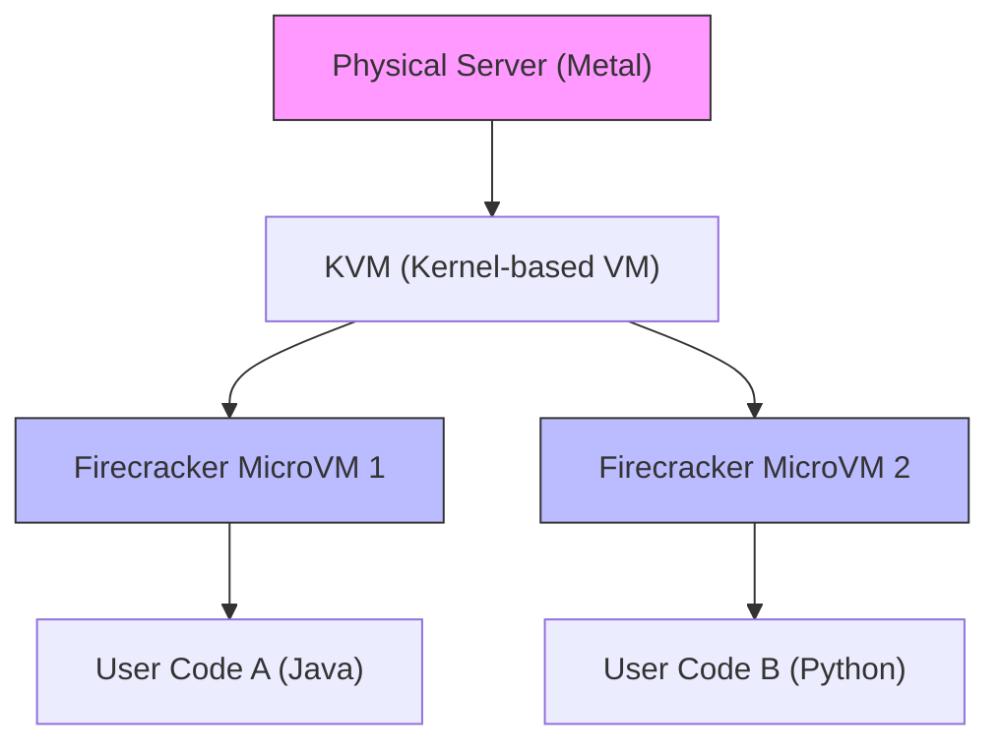
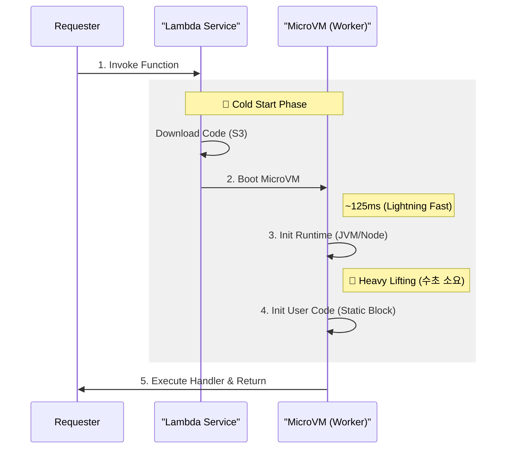

## ⚡ 1. 서버리스의 딜레마

"서버리스(Serverless)"라는 이름은 거짓말입니다. 서버는 반드시 존재합니다. 다만, **우리가 관리하지 않을 뿐**입니다.

AWS 입장에서 생각해보세요. 전 세계 수만 명의 개발자가 짠 코드를 실행해줘야 합니다. 그런데 물리 서버 하나에 내 코드와 옆집 개발자의 코드가 같이 돌아간다면 어떨까요?

> ⚠️ **보안 문제**: 옆집 코드가 내 메모리를 훔쳐보거나, CPU를 독점한다면?

이 문제를 해결하기 위해 두 가지 방식이 있었습니다:

| 기술 | 보안(격리) | 부팅 속도 | 오버헤드 |
| :--- | :--- | :--- | :--- |
| **VM (가상 머신)** | 🔒 **강함** (하드웨어 격리) | 🐢 **느림** (분 단위) | 높음 (OS 전체) |
| **Container (Docker)** | 🔓 **약함** (커널 공유) | 🐇 **빠름** (초 단위) | 낮음 |
| **Firecracker (AWS)** | 🔒 **강함** (MicroVM) | ⚡ **매우 빠름** (125ms) | **최소화** (5MB) |

그래서 AWS는 **"VM의 보안 + 컨테이너의 속도"**를 모두 잡은 괴물을 만들었습니다. 바로 **Firecracker**입니다.

---

## 🔥 2. Firecracker MicroVM 아키텍처

Firecracker는 **MicroVM**입니다. 불필요한 기능(USB 드라이버, 스피커 등)을 다 쳐내고, 딱 **네트워크와 디스크**만 남긴 초경량 리눅스 커널입니다.


```mermaid
graph TD
    A["Physical Server (Metal)"] --> B["KVM (Kernel-based VM)"]
    B --> C["Firecracker MicroVM 1"]
    B --> D["Firecracker MicroVM 2"]
    C --> E["User Code A (Java)"]
    D --> F["User Code B (Python)"]
    
    style A fill:#f9f,stroke:#333
    style C fill:#bbf,stroke:#333
    style D fill:#bbf,stroke:#333
```

- **부팅 속도**: 약 **125ms** (눈 깜짝할 새)
- **메모리**: **5MB** 오버헤드 (수천 개 띄워도 거뜬)
- **격리**: 하드웨어 가상화 기술을 사용해 완벽히 남남처럼 동작

### 전통 VM vs Firecracker 내부 비교

기존 QEMU/KVM VM이 왜 느린지, Firecracker가 어떻게 해결했는지 비교합니다.

| 구성 요소 | QEMU/KVM | Firecracker | 효과 |
| :--- | :--- | :--- | :--- |
| **가상 디바이스** | USB, 사운드, GPU 등 수십 개 | 네트워크(virtio-net) + 블록(virtio-blk)만 | 부팅 시간 단축 |
| **BIOS/UEFI** | 전체 BIOS 에뮬레이션 | 직접 리눅스 커널 로드 | 수초 → 125ms |
| **메모리 관리** | 수백 MB 오버헤드 | 5MB 오버헤드 | 호스트 1대에 수천 VM |
| **프로세스 모델** | 하나의 큰 프로세스 | MicroVM당 1프로세스 | seccomp/cgroups 격리 |
| **API** | libvirt/qmp (무겁다) | REST API (경량) | 자동화 친화적 |

### Firecracker 보안 격리 레이어

```
┌──────────────────────────────────┐
│     Lambda 함수 (사용자 코드)       │  ← 신뢰할 수 없는 코드
├──────────────────────────────────┤
│   Guest Kernel (최소 리눅스)       │  ← 커스텀 최소 커널
├──────────────────────────────────┤
│   Firecracker VMM (Rust)          │  ← 메모리 안전 언어
├──────────────────────────────────┤
│   KVM (하드웨어 가상화)            │  ← CPU 레벨 격리
├──────────────────────────────────┤
│   Jailer (seccomp + cgroups)      │  ← syscall 필터링 + 리소스 제한
├──────────────────────────────────┤
│   Host Linux Kernel               │
└──────────────────────────────────┘
```

핵심 설계 원칙:

1. **Rust로 작성**: 메모리 안전 보장. C/C++ 기반 QEMU의 메모리 취약점 문제 원천 차단.
2. **Jailer**: Firecracker 프로세스를 `seccomp`(허용 syscall 약 25개만)와 `cgroups`(CPU/메모리 제한)로 한번 더 격리.
3. **최소 공격 표면**: 가상 디바이스 2개(net + block)만 구현 → 취약점이 숨을 코드가 적음.

---

## ❄️ 3. Cold Start의 해부

아무리 빨라도, "맨 처음" 실행할 때는 준비 과정이 필요합니다. 이를 **Cold Start**라고 합니다.

### 부팅 과정 타임라인 (The Anatomy of Cold Start)


```mermaid
sequenceDiagram
    participant Requester
    participant AWS_Lambda as "Lambda Service"
    participant Firecracker as "MicroVM (Worker)"
    
    Requester->>AWS_Lambda: 1. Invoke Function
    
    rect rgb(240, 240, 240)
    Note over AWS_Lambda, Firecracker: 🥶 Cold Start Phase
    AWS_Lambda->>AWS_Lambda: Download Code (S3)
    AWS_Lambda->>Firecracker: 2. Boot MicroVM
    Note right of Firecracker: ~125ms (Lightning Fast)
    
    Firecracker->>Firecracker: 3. Init Runtime (JVM/Node)
    Note right of Firecracker: 🐢 Heavy Lifting (수초 소요)
    Firecracker->>Firecracker: 4. Init User Code (Static Block)
    end
    
    Firecracker->>Requester: 5. Execute Handler & Return
```

가장 오래 걸리는 구간은 어디일까요?
놀랍게도 2번(MicroVM)이 아니라, **3번(런타임 초기화)**입니다. 특히 Java는 JVM을 띄우고 클래스를 로딩하는 데 꽤 시간이 걸립니다.

### 런타임별 Cold Start 시간 비교

실측 기반 대략적인 수치입니다 (128MB 메모리, 단순 핸들러 기준).

| 런타임 | Cold Start (P50) | Cold Start (P99) | 비고 |
| :--- | :--- | :--- | :--- |
| **Python 3.12** | 150~300ms | 500ms | 가장 빠른 축 |
| **Node.js 20** | 200~400ms | 600ms | 번들 크기에 민감 |
| **Go** | 80~150ms | 300ms | 네이티브 바이너리, 최소 |
| **Java 21** | 3~8초 | 10초+ | JVM + 클래스 로딩 |
| **Java 21 + SnapStart** | 200~500ms | 800ms | 10~20배 개선 |
| **.NET 8 (AOT)** | 200~400ms | 600ms | AOT 컴파일 시 |

> 💡 **핵심 인사이트**: Cold Start의 주범은 "런타임 초기화"입니다. Firecracker 자체(125ms)가 아닙니다. 따라서 최적화 포인트도 런타임 레벨입니다.

---

## 🧊 4. Cold Start 해결 전략

### 전략 1: SnapStart (Java)

AWS는 무거운 JVM을 매번 띄우는 게 비효율적이라 판단하고, **CRaC (Coordinated Restore at Checkpoint)** 기술을 도입했습니다.

1. **미리 띄우기**: 배포 시점에 VM을 시작하고 초기화까지 마칩니다.
2. **얼리기 (Snapshot)**: 메모리 상태 전체를 디스크에 저장합니다.
3. **복원하기 (Restore)**: 요청이 오면 부팅 과정을 스킵하고 메모리만 로드합니다.

> **SnapStart의 마법**: 
> AWS는 Java의 느린 초기화(3번 단계)를 해결하기 위해 **"게임을 세이브하고 로드하는"** 방식을 씁니다.
> 초기화가 끝난 메모리 상태(Snapshot)를 저장해두고, 요청이 오면 그 상태를 그대로 복원(Restore)합니다.

```yaml
# SAM template 예시
MyFunction:
  Type: AWS::Serverless::Function
  Properties:
    Runtime: java21
    SnapStart:
      ApplyOn: PublishedVersions  # SnapStart 활성화
```

**SnapStart 사용 시 주의사항:**

```java
// SnapStart에서는 스냅샷 시점의 상태가 복원됩니다.
// 따라서 아래 항목들은 복원 후 재초기화가 필요합니다:

public class MyHandler implements RequestHandler<String, String> {
    
    // ❌ 위험: 스냅샷 시점의 커넥션이 복원됨 → 이미 끊어진 커넥션
    private static Connection dbConn = DriverManager.getConnection(...);
    
    // ✅ 안전: CRaC 훅으로 복원 시 재연결
    @Override
    public void afterRestore(Context<? extends Resource> context) {
        dbConn = DriverManager.getConnection(...);  // 복원 후 재연결
        // 난수 시드도 재초기화 (보안!)
        SecureRandom.getInstanceStrong();
    }
}
```

| 재초기화 필수 항목 | 이유 |
| :--- | :--- |
| DB 커넥션 | 타임아웃으로 끊어져 있음 |
| 임시 토큰/JWT | 만료됐을 수 있음 |
| `SecureRandom` 시드 | 같은 난수 시퀀스 반복 위험 (보안 취약점) |
| 파일 핸들/소켓 | 스냅샷 후 무효화 |

### 전략 2: GraalVM Native Image

JVM 자체를 없애는 접근입니다. AOT(Ahead-of-Time) 컴파일로 네이티브 바이너리를 만듭니다.

```
일반 Java:  .java → .class → JVM이 해석하며 실행 (느린 시작)
GraalVM:    .java → 네이티브 바이너리 → 직접 실행 (빠른 시작)
```

| 항목 | JVM | GraalVM Native |
| :--- | :--- | :--- |
| **Cold Start** | 3~8초 | 100~300ms |
| **메모리** | 200~500MB | 30~80MB |
| **피크 성능** | 높음 (JIT 최적화) | 보통 (AOT 한계) |
| **빌드 시간** | 빠름 (초) | 느림 (수 분) |
| **리플렉션** | 자유 | 별도 설정 필요 |

```bash
# Spring Boot + GraalVM Native Image 빌드
./mvnw -Pnative native:compile

# 또는 Docker 이미지로
./mvnw spring-boot:build-image -Pnative
```

**GraalVM 선택 기준:**

```
GraalVM이 적합한 경우:
✅ Cold Start가 사업적으로 중요 (API Gateway 뒤의 동기 호출)
✅ 메모리 비용 절감이 필요
✅ 리플렉션 사용이 적거나 미리 파악 가능
✅ 서버리스 또는 CLI 도구

JVM이 나은 경우:
✅ 장시간 실행되는 서비스 (JIT가 빛남)
✅ 리플렉션 의존이 큰 프레임워크 사용
✅ 빠른 개발 루프(빌드→테스트) 필요
✅ Warm Start가 주류 (트래픽이 일정)
```

### 전략 3: Provisioned Concurrency

미리 MicroVM을 띄워놓는 방법입니다. Cold Start를 "없애는" 게 아니라 "미리 치르는" 것입니다.

```yaml
# 프로비저닝된 동시성 설정
MyFunction:
  Type: AWS::Serverless::Function
  Properties:
    ProvisionedConcurrencyConfig:
      ProvisionedConcurrentExecutions: 10  # 항상 10개 Warm 유지
```

| 전략 | Cold Start 제거 | 비용 영향 | 적합한 상황 |
| :--- | :--- | :--- | :--- |
| **SnapStart** | 대부분 해소 (200ms 이하) | 추가 비용 없음 | Java 람다 대부분 |
| **GraalVM Native** | 근본 해결 (100ms) | 빌드 시간 증가 | 신규 프로젝트 |
| **Provisioned Concurrency** | 완전 제거 (0ms) | 비용 증가 (Warm 유지) | SLA 엄격한 API |
| **코드 최적화** | 부분 해소 | 비용 없음 | 모든 경우 |

---

## 🛠️ 5. 백엔드 개발자의 최적화 팁

### 1) 전역 변수를 활용하라 (Connection Reuse)

서버리스는 함수가 끝나도 컨테이너가 바로 삭제되지 않고 잠시 대기(Warm State)합니다.

```java
public class Handler {
    // ❌ 나쁜 예: 요청마다 DB 연결 (Cold + Warm 모두 느림)
    public void handleRequest() {
        Connection conn = DriverManager.getConnection(...);
        try {
            // 쿼리 실행
        } finally {
            conn.close();
        }
    }
}

public class Handler {
    // ✅ 좋은 예: 전역 변수는 재사용됨 (Warm Start에서 0ms)
    private static final AmazonDynamoDB dynamoDB = 
        AmazonDynamoDBClientBuilder.standard().build();
    
    // HTTP 클라이언트도 재사용 (커넥션 풀 유지)
    private static final OkHttpClient httpClient = new OkHttpClient.Builder()
        .connectionPool(new ConnectionPool(5, 5, TimeUnit.MINUTES))
        .build();
    
    public void handleRequest() {
        // dynamoDB, httpClient는 Warm Start에서 재사용
    }
}
```

### 2) 패키지를 가볍게 (의존성 다이어트)

```
번들 크기가 Cold Start에 직접 영향:
- S3에서 코드 다운로드 시간 ∝ 패키지 크기
- 클래스 로딩 시간 ∝ 클래스 수

✅ 실무 가이드:
  - spring-boot-starter 대신 필요한 모듈만 (spring-web, spring-jdbc)
  - 사용 안 하는 의존성 제거 (mvn dependency:analyze)
  - Layer로 공통 의존성 분리 (Lambda Layers)
  - Uber-jar 대신 proguard/shade로 불필요 클래스 제거
```

**Lambda Layer를 활용한 의존성 분리:**

```
┌──────────────────────────┐
│     함수 코드 (500KB)      │  ← 자주 변경, 빠른 배포
├──────────────────────────┤
│  Layer 1: 공통 SDK (10MB)  │  ← 드물게 변경, 캐시됨
├──────────────────────────┤
│  Layer 2: 유틸 (2MB)       │  ← 드물게 변경, 캐시됨
└──────────────────────────┘

장점:
- 함수 코드만 500KB → 배포 속도 20배↑
- Layer는 한 번 다운로드 후 캐시됨
- 여러 함수가 같은 Layer 공유 가능
```

### 3) 메모리 설정은 CPU와 연동된다

Lambda에서 메모리를 올리면 비례해서 CPU도 올라갑니다. 이것이 비용 최적화의 열쇠입니다.

```
메모리  CPU 할당        비용/ms         Cold Start
128MB   ~0.08 vCPU     $0.0000000021   느림 (CPU 부족)
512MB   ~0.33 vCPU     $0.0000000083   보통
1024MB  ~0.58 vCPU     $0.0000000167   빠름
1769MB  1.0 vCPU       $0.0000000289   빠름 (CPU 전체)
3008MB  2.0 vCPU       $0.0000000491   가장 빠름

⚠️ 역설: 메모리를 올리면 비용이 내려갈 수 있습니다!
  128MB × 10초 = $0.0000000021 × 10,000ms = $0.000021
  512MB × 1초  = $0.0000000083 × 1,000ms  = $0.0000083 ← 더 저렴!
```

**AWS Lambda Power Tuning 도구:**

```bash
# SAR에서 배포 후 실행
# 다양한 메모리 설정으로 자동 테스트 → 최적점 찾기
aws lambda invoke --function-name powerTuner \
  --payload '{"function":"arn:aws:lambda:...:myFunc","num":20,"powerValues":[128,256,512,1024,1769]}'
```

---

## 📊 6. 서버리스 관측성

서버리스는 서버를 직접 관리하지 않기 때문에, 관측성 전략이 전통적인 서버와 다릅니다.

### 6-1) 모니터링 핵심 지표

| 지표 | 의미 | CloudWatch 메트릭 | 알림 기준 |
| :--- | :--- | :--- | :--- |
| **Duration** | 실행 시간 | `Duration` | p99 > SLO의 80% |
| **Cold Start Rate** | 콜드 스타트 비율 | `Init Duration` 존재 여부 | > 10% |
| **Throttles** | 동시성 한도 초과 | `Throttles` | > 0 |
| **Errors** | 함수 에러 | `Errors` | > 1% |
| **Concurrent Executions** | 동시 실행 수 | `ConcurrentExecutions` | > 리전 한도의 80% |
| **Iterator Age** | 스트림 소비 지연 | `IteratorAge` | > 60초 |

### 6-2) 구조 로깅 패턴

```java
// Lambda에서의 구조 로깅 (JSON)
public class OrderHandler implements RequestHandler<APIGatewayProxyRequestEvent, ...> {
    
    private static final Logger log = LoggerFactory.getLogger(OrderHandler.class);
    
    public APIGatewayProxyResponseEvent handleRequest(
            APIGatewayProxyRequestEvent event, Context context) {
        
        // 요청 컨텍스트를 MDC에 추가
        MDC.put("requestId", context.getAwsRequestId());
        MDC.put("functionName", context.getFunctionName());
        MDC.put("remainingTimeMs", 
            String.valueOf(context.getRemainingTimeInMillis()));
        
        log.info("주문 처리 시작", 
            kv("orderId", orderId),
            kv("userId", userId),
            kv("amount", amount));
        
        try {
            Order order = processOrder(event);
            
            log.info("주문 처리 완료",
                kv("orderId", order.getId()),
                kv("processingTimeMs", elapsed));
                
            return response(200, order);
            
        } catch (Exception e) {
            log.error("주문 처리 실패",
                kv("orderId", orderId),
                kv("errorType", e.getClass().getSimpleName()),
                kv("errorMessage", e.getMessage()));
                
            return response(500, "Internal Server Error");
        } finally {
            MDC.clear();
        }
    }
}
```

### 6-3) X-Ray 트레이싱 연동

```java
// AWS X-Ray로 분산 트레이싱
@Tracing  // Powertools for Lambda
public Order processOrder(OrderRequest request) {
    
    // 서브세그먼트: DB 호출 추적
    return TracingUtils.withSubsegment("DynamoDB.putItem", subsegment -> {
        subsegment.putAnnotation("orderId", request.getOrderId());
        return dynamoDB.putItem(request.toDynamoItem());
    });
}
```

---

## 🏗️ 7. 서버리스 아키텍처 패턴

### 7-1) 동기 vs 비동기 호출

```
동기 (API Gateway → Lambda):
  Client → API GW → Lambda → DB → Response
  ✅ 간단, 즉시 응답
  ❌ Cold Start가 사용자 체감에 직결

비동기 (이벤트 → Lambda):
  Client → API GW → SQS → Lambda → DB
  ✅ Cold Start가 사용자에게 안 보임
  ✅ 자동 재시도, DLQ
  ❌ 즉시 응답 불가 (비동기이므로)

💡 실무 원칙:
  - 사용자 응답이 필요한 GET/조회 → 동기
  - 결제/주문 처리 → 비동기 (SQS 버퍼)
  - 파일 처리/이메일 → 비동기 (S3 이벤트)
```

### 7-2) Fan-out 패턴

```
하나의 이벤트 → 여러 Lambda 동시 실행

       ┌→ Lambda A (이메일 발송)
SNS →  ├→ Lambda B (재고 차감)
       └→ Lambda C (분석 이벤트 기록)

장점: 각 함수가 독립적으로 실패/재시도
주의: 순서 보장 없음, 멱등성 필수
```

### 7-3) 서버리스 vs 컨테이너 선택 기준

| 기준 | Serverless (Lambda) | Container (ECS/K8s) |
| :--- | :--- | :--- |
| **트래픽 패턴** | 간헐적, 버스트 | 지속적, 예측 가능 |
| **실행 시간** | < 15분 | 제한 없음 |
| **Cold Start 민감** | 민감 (API) | 무관 |
| **상태 유지** | 불가 (Stateless) | 가능 |
| **비용 (유휴)** | $0 (실행한 만큼) | 항상 인스턴스 비용 |
| **비용 (고부하)** | 비쌈 | 저렴 |
| **운영 부담** | 최소 | 중간~높음 |

```
의사결정 흐름도:

트래픽이 하루 대부분 0인가?
  → Yes → Lambda (비용 0)
  → No → 평균 동시 요청이 10개 이상인가?
           → Yes → ECS/Fargate (비용 효율)
           → No → Lambda (운영 편의)

실행 시간이 15분을 넘는가?
  → Yes → ECS/Step Functions
  → No → Lambda 가능
```

---

## 🔧 8. 실무 최적화 체크리스트

### Cold Start 최소화

- [ ] Lambda Power Tuning으로 최적 메모리 찾기
- [ ] Java → SnapStart 활성화 (또는 GraalVM Native 검토)
- [ ] 패키지 크기 50MB 이하 유지 (Layer 분리)
- [ ] 불필요한 의존성 제거 (`mvn dependency:analyze`)
- [ ] 전역 변수로 SDK 클라이언트/커넥션 초기화

### 비용 최적화

- [ ] 메모리 vs 실행시간 최적점 찾기 (Power Tuning)
- [ ] 비동기 패턴(SQS)으로 동시성 제어
- [ ] Provisioned Concurrency는 ROI 확인 후만 사용
- [ ] 예약 동시성(Reserved Concurrency)으로 비용 캡 설정

### 관측성

- [ ] 구조 로깅(JSON) 적용 + requestId 포함
- [ ] X-Ray 또는 OpenTelemetry 트레이싱 활성화
- [ ] CloudWatch 알림: Throttles > 0, Error Rate > 1%
- [ ] Cold Start 비율 모니터링 (10% 초과 시 조치)

### 보안

- [ ] 함수별 IAM 역할 최소 권한 (Function-level policy)
- [ ] VPC 배치 시 NAT Gateway 비용 고려
- [ ] 환경변수 대신 Secrets Manager/Parameter Store 사용
- [ ] 의존성 취약점 스캔 (Dependabot/Snyk)

---

## 요약

| 개념 | 핵심 |
| :--- | :--- |
| **Firecracker** | VM의 보안 + 컨테이너의 속도 (125ms, 5MB) |
| **Cold Start** | 런타임 초기화가 주범 (MicroVM이 아님) |
| **SnapStart** | 초기화 메모리 스냅샷 → 복원 (Java 10초 → 200ms) |
| **GraalVM** | JVM 없이 네이티브 실행 (100ms Cold Start) |
| **최적화 핵심** | 전역변수 재사용, 패키지 경량화, 메모리 = CPU |

---

## 관련 글

- [Docker 기초](/learning/deep-dive/deep-dive-docker-basics/) — 컨테이너 격리 원리, 서버리스와의 비교 기반
- [Kubernetes 기초](/learning/deep-dive/deep-dive-kubernetes-basics/) — 컨테이너 오케스트레이션, 서버리스 대안
- [APM 기본](/learning/deep-dive/deep-dive-apm-basics/) — 관측성 3대 신호, 모니터링 전략
- [GC 튜닝 실전](/learning/deep-dive/deep-dive-gc-tuning-practical/) — JVM Cold Start의 근본 원인 이해
- [부하 테스트 전략](/learning/deep-dive/deep-dive-load-testing-strategy/) — 서버리스 부하 특성과 테스트 설계
- [비용 최적화](/learning/deep-dive/deep-dive-cost-optimization/) — 클라우드 비용 관리 전략
- [Vector DB 내부 원리](/learning/deep-dive/deep-dive-vector-db-internals/) — AI 시대의 서버리스 활용
