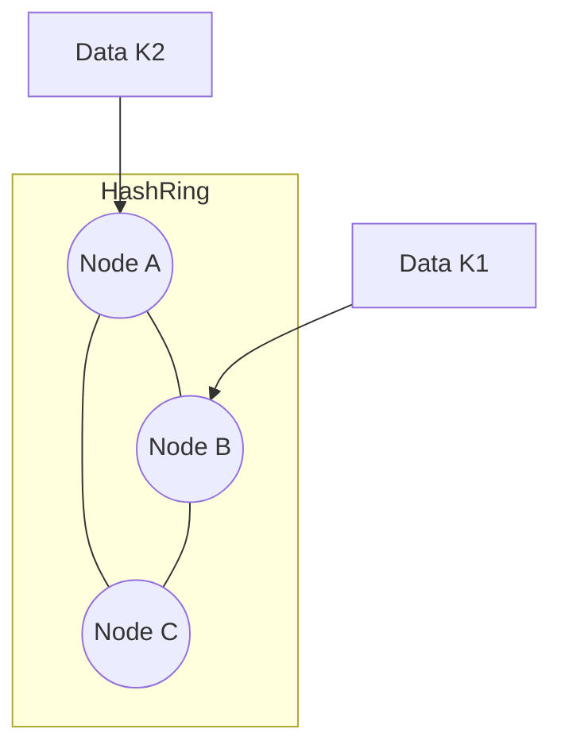
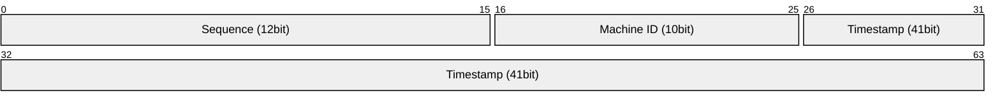

## 🍕 1. 샤딩(Sharding): 데이터를 조각내자

서비스가 대박이 나서 사용자가 1억 명이 되었습니다. 단일 DB로는 감당이 안 됩니다.
이제 데이터를 여러 서버에 나눠 담아야 하는데, 이를 **샤딩(Sharding)**이라 합니다.

문제는 **"어떤 기준으로 나눌 것인가?"**입니다.

### 전략 1: Range Sharding (범위)
- `식별자 1 ~ 100만` -> **DB 1**
- `식별자 100만 ~ 200만` -> **DB 2**
- **문제점**: 최근 가입한 유저만 활동한다면? **DB 2만 불타오르고(Hotspot)** DB 1은 놉니다.

### 전략 2: Modular Sharding (해시)
- `ID % 서버수`로 배정합니다. 데이터가 아주 고르게 퍼집니다.
- **치명적 문제**: 서버를 3대에서 4대로 늘리면?

```
User ID = 3
Before (Mod 3): 3 % 3 = 0번 서버
After  (Mod 4): 3 % 4 = 3번 서버
```

> ⚠️ **재앙(Rebalancing)**: 서버 대수가 바뀌면 **거의 모든 데이터가 이동**해야 합니다. 서비스 중단 없이는 불가능합니다.

---

## 🍩 2. Consistent Hashing (일관된 해싱)

이 재앙을 막기 위해 **"서버가 추가/삭제되어도 데이터 이동을 최소화"**하는 알고리즘이 나왔습니다.
핵심은 **원형 링(Ring)**입니다.

### 동작 원리



1. 커다란 원(해시 링)을 상상하세요. (0 ~ 2^32)
2. **서버(Node)**를 해시값에 따라 링 위에 배치합니다.
3. **데이터(Key)**도 해시값에 따라 링 위에 배치합니다.
4. 데이터는 **시계 방향으로 돌면서 만나는 첫 번째 서버**에 저장됩니다.

### 서버가 추가된다면?

서버 C와 A 사이에 **서버 D**를 추가했습니다.

- **기존 Modular**: 전체 데이터의 100%가 뒤섞임.
- **Consistent Hashing**: **C와 D 사이의 데이터만** A에서 D로 이동. 나머지(A->B, B->C)는 그대로!

> **결과**: 데이터 이동량이 `1/N`로 획기적으로 줄어듭니다.

---

## 🆔 3. 분산 ID 생성기 (Snowflake)

샤딩을 하면 DB의 `AUTO_INCREMENT`를 못 씁니다. (1번 DB와 2번 DB에서 같은 ID 100번이 생기면 충돌)
전역적으로 유일한 ID가 필요합니다.

### Twitter Snowflake 구조 (64bit)



1. **Timestamp**: 시간순 정렬을 보장합니다. (Index 성능에 중요)
2. **Machine ID**: 어느 서버에서 생성했는지 구분합니다.
3. **Sequence**: 같은 밀리초에 생성된 ID를 구분합니다.

## 요약

- **Range Sharding**: 쉽지만 핫스팟 위험.
- **Modular Sharding**: 균등하지만 확장 시 대이동(Rebalancing) 발생.
- **Consistent Hashing**: 확장이 유연함. (현대 분산 시스템 표준)
- **Snowflake**: 타임스탬프 기반의 유니크 ID 생성 전략.
