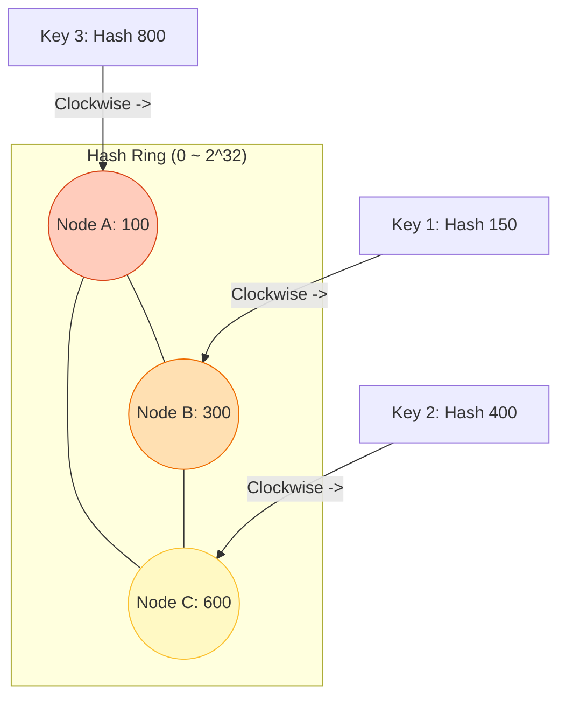
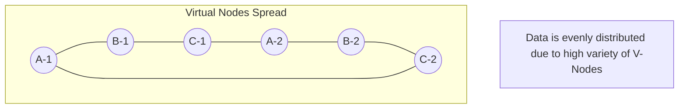
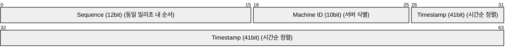

## 🍕 1. 샤딩(Sharding): 데이터를 조각내자

서비스가 대박이 나서 사용자가 1억 명이 되었습니다. 단일 DB로는 감당이 안 됩니다.
이제 데이터를 여러 서버에 나눠 담아야 하는데, 이를 **샤딩(Sharding)**이라 합니다.

문제는 **"어떤 기준으로 나눌 것인가?"**입니다.

### 전략 1: Range Sharding (범위)
- `식별자 1 ~ 100만` -> **DB 1**
- `식별자 100만 ~ 200만` -> **DB 2**
- **문제점**: 최근 가입한 유저만 활동한다면? **DB 2만 불타오르고(Hotspot)** DB 1은 놉니다.

### 전략 2: Modular Sharding (해시)
- `ID % 서버수`로 배정합니다. 데이터가 아주 고르게 퍼집니다.
- **치명적 문제**: 서버를 3대에서 4대로 늘리면?

```
User ID = 3
Before (Mod 3): 3 % 3 = 0번 서버
After  (Mod 4): 3 % 4 = 3번 서버
```

> ⚠️ **재앙(Rebalancing)**: 서버 대수가 바뀌면 **거의 모든 데이터가 이동**해야 합니다. 서비스 중단 없이는 불가능합니다.

### 전략 3: Directory-Based Sharding (조회 테이블)
- **Lookup 테이블**이 `Key → Shard 번호` 매핑을 저장합니다.
- 유연하지만 lookup 자체가 **단일 장애점(SPOF)**이 되고, 모든 읽기/쓰기에 lookup 오버헤드가 붙습니다.
- 작은 규모에서는 유용하지만, 수억 건 이상에서는 lookup 테이블 자체를 샤딩해야 하는 재귀적 문제가 생깁니다.

### 전략 비교표

| 특징 | Range | Modular (Hash) | Directory | Consistent Hashing |
| :--- | :--- | :--- | :--- | :--- |
| **규칙** | 키 범위로 분할 | `Key % N` | Lookup 테이블 | Hash Ring 위치 |
| **데이터 분포** | 불균등 (핫스팟) | 균등 | 자유 설정 | 균등 (VNode) |
| **서버 추가 시** | 범위 재조정 | **100%** 이동 | 테이블 갱신 | **1/N** 이동 |
| **범위 쿼리** | ✅ 우수 | ❌ 불가 | ❌ 불가 | ❌ 불가 |
| **복잡도** | 낮음 | 낮음 | 중간 | 중간~높음 |
| **대표 사례** | HBase, MongoDB | 단순 캐시 | 소규모 서비스 | Redis Cluster, Cassandra |

---

## 🍩 2. Consistent Hashing (일관된 해싱)

이 재앙을 막기 위해 **"서버가 추가/삭제되어도 데이터 이동을 최소화"**하는 알고리즘이 나왔습니다.
핵심은 **원형 링(Ring)**입니다.

### 2.1 동작 원리


```mermaid
graph TD
    subgraph Ring ["Hash Ring (0 ~ 2^32)"]
        N1((Node A: 100))
        N2((Node B: 300))
        N3((Node C: 600))
        
        N1 --- N2
        N2 --- N3
        N3 --- N1
    end
    
    Data1[Key 1: Hash 150] -->|Clockwise ->| N2
    Data2[Key 2: Hash 400] -->|Clockwise ->| N3
    Data3[Key 3: Hash 800] -->|Clockwise ->| N1
    
    style N1 fill:#ffccbc,stroke:#d84315
    style N2 fill:#ffe0b2,stroke:#ef6c00
    style N3 fill:#fff9c4,stroke:#fbc02d
```

1. 커다란 원(해시 링)을 상상하세요. (0 ~ 2^32)
2. **서버(Node)**를 해시값에 따라 링 위에 배치합니다.
3. **데이터(Key)**도 해시값에 따라 링 위에 배치합니다.
4. 데이터는 **시계 방향으로 돌면서 만나는 첫 번째 서버**에 저장됩니다.

### 서버가 추가된다면?

서버 C와 A 사이에 **서버 D**를 추가했습니다.

- **기존 Modular**: 전체 데이터의 100%가 뒤섞임.
- **Consistent Hashing**: **C와 D 사이의 데이터만** A에서 D로 이동. 나머지(A→B, B→C)는 그대로!

> **결과**: 데이터 이동량이 `1/N`로 획기적으로 줄어듭니다.

### 2.2 가상 노드 (Virtual Nodes) — 데이터 편향 해결

"운 나쁘게 Node A, B, C가 한쪽에 쏠려 있으면 어떡하죠?" (Data Skew)
→ **가짜 노드**를 수백 개 만들어서 링 전체에 뿌립니다.


```mermaid
graph TD
    subgraph VirtualRing ["Virtual Nodes Spread"]
        A1((A-1)) --- B1((B-1))
        B1 --- C1((C-1))
        C1 --- A2((A-2))
        A2 --- B2((B-2))
        B2 --- C2((C-2))
        C2 --- A1
    end
    
    Note[Data is evenly distributed due to high variety of V-Nodes]
```

**가상 노드의 실무 포인트:**

| 항목 | 설명 |
| :--- | :--- |
| **VNode 수** | 일반적으로 물리 노드당 100~256개. Cassandra 기본값은 `num_tokens=256` |
| **이기종 서버** | 고사양 서버에 VNode를 더 많이 할당하면 자연스럽게 가중치 부여 가능 |
| **메모리 비용** | VNode가 너무 많으면 라우팅 테이블 크기 증가. 1000개 이상은 신중히 |
| **분포 검증** | 표준편차를 측정해서 편차가 10% 이상이면 VNode 수 조정 검토 |

**VNode 가중치 예시:**

```
# 물리 서버 스펙에 따른 VNode 할당
Server A (32GB RAM): 256 VNodes
Server B (16GB RAM): 128 VNodes
Server C (64GB RAM): 512 VNodes
→ 용량 비례로 자연스러운 분산
```

### 2.3 Jump Consistent Hash — 더 단순한 대안

Google이 2014년에 발표한 알고리즘입니다. 링 대신 **수학 공식 하나**로 버킷을 결정합니다.

```java
// Google Jump Consistent Hash (논문 원본 수준)
public static int jumpConsistentHash(long key, int numBuckets) {
    long b = -1, j = 0;
    while (j < numBuckets) {
        b = j;
        key = key * 2862933555777941757L + 1;
        j = (long) ((b + 1) * (Long.MAX_VALUE / ((key >>> 33) + 1.0)));
    }
    return (int) b;
}
```

**Consistent Hashing vs Jump Consistent Hash:**

| 특징 | Ring + VNode | Jump Consistent Hash |
| :--- | :--- | :--- |
| **메모리** | O(N × VNode 수) | O(1) |
| **속도** | O(log N) (TreeMap) | O(ln N) |
| **서버 제거** | ✅ 유연 | ❌ 중간 버킷 제거 불가 |
| **가중치** | VNode 수로 조절 | 불가 (별도 로직 필요) |
| **적합 케이스** | Redis Cluster, Cassandra | 캐시 샤딩, 로드 밸런서 |

> Jump Consistent Hash는 **노드를 끝에서만 추가/제거**하는 경우(확장 전용)에 매우 효율적입니다. 중간 노드 제거가 빈번하면 Ring 방식이 낫습니다.

### 2.4 Rendezvous Hashing (Highest Random Weight)

또 다른 대안으로, 각 Key에 대해 모든 노드의 가중치를 계산하고 **가장 높은 노드**에 배정하는 방식입니다.

```java
public String selectNode(String key, List<String> nodes) {
    String bestNode = null;
    long bestWeight = Long.MIN_VALUE;
    for (String node : nodes) {
        long weight = hash(key + ":" + node);
        if (weight > bestWeight) {
            bestWeight = weight;
            bestNode = node;
        }
    }
    return bestNode;
}
```

- **장점**: 구현이 단순, 노드 제거 시 해당 노드의 키만 재배치
- **단점**: 모든 노드를 순회하므로 O(N). 노드 수가 수천 이상이면 비실용적
- **적합 케이스**: CDN, DNS 라우팅 (노드 수가 수십~수백)

---

## 🔑 3. Shard Key 선택 — 샤딩의 성패가 여기서 갈린다

Shard Key를 잘못 고르면 핫스팟, 크로스 샤드 쿼리, 데이터 불균형이 동시에 발생합니다.

### 3.1 좋은 Shard Key의 조건

| 조건 | 설명 | 예시 |
| :--- | :--- | :--- |
| **높은 카디널리티** | 키 값의 종류가 충분히 많아야 함 | ✅ `user_id` (수백만), ❌ `country` (200개) |
| **균등 분포** | 특정 값에 데이터가 몰리면 안 됨 | ✅ UUID, ❌ `created_date` (최근에 집중) |
| **쿼리 친화성** | 자주 조회하는 패턴의 WHERE 절에 Shard Key가 포함 | `WHERE user_id = ?` 가 주 쿼리면 `user_id`가 적합 |
| **조인 최소화** | 같이 조회되는 데이터가 같은 샤드에 있어야 함 | 주문+주문상세를 `order_id`로 같은 샤드에 |

### 3.2 복합 Shard Key

단일 키로 부족할 때, 두 개 이상을 조합합니다.

```sql
-- MongoDB 복합 샤드 키 예시
sh.shardCollection("ecommerce.orders", { "tenant_id": 1, "order_date": 1 })

-- tenant_id로 1차 분산 + order_date로 범위 쿼리 지원
-- 특정 테넌트의 날짜 범위 조회가 단일 샤드에서 처리됨
```

### 3.3 Shard Key 선택 체크리스트

- [ ] 주요 쿼리 패턴 5개를 나열하고, 각각 Shard Key가 WHERE 절에 포함되는지 확인
- [ ] 키 값 분포를 히스토그램으로 확인 (`SELECT shard_key, COUNT(*) GROUP BY shard_key`)
- [ ] 시간이 지남에 따라 편향이 심해지지 않는지 검증 (예: 날짜 기반 키)
- [ ] Cross-shard JOIN이 필요한 쿼리가 전체의 10% 미만인지 확인
- [ ] 키 변경 시 데이터 마이그레이션 비용 추산

---

## 🔀 4. Cross-Shard 쿼리와 글로벌 연산

샤딩의 가장 큰 약점은 **여러 샤드에 걸치는 쿼리**입니다.

### 4.1 Scatter-Gather 패턴

```
Client → Coordinator → Shard1: SELECT ... WHERE condition
                     → Shard2: SELECT ... WHERE condition
                     → Shard3: SELECT ... WHERE condition
         ← 결과 취합 (merge sort / union)
```

- 모든 샤드에 쿼리를 뿌리고(Scatter) 결과를 모음(Gather)
- **문제**: 샤드 수에 비례하여 지연 증가, 가장 느린 샤드가 전체 응답 시간을 결정 (Tail Latency)

### 4.2 Cross-Shard 문제별 대응 전략

| 문제 | 대응 전략 |
| :--- | :--- |
| **JOIN** | 애플리케이션 레벨에서 두 번 조회 + 메모리 조인, 또는 비정규화 |
| **COUNT/SUM** | 각 샤드에서 부분 집계 → Coordinator에서 합산 |
| **ORDER BY + LIMIT** | 각 샤드에서 Top-N → Coordinator에서 재정렬 후 Top-N |
| **Unique 제약** | 글로벌 유니크 서비스 별도 운영 (Redis SET, Snowflake ID) |
| **트랜잭션** | 2PC(Two-Phase Commit) 또는 Saga 패턴으로 분산 트랜잭션 처리 |

### 4.3 비정규화로 Cross-Shard 줄이기

```
# Before: 주문 테이블(user_id 샤딩) + 상품 테이블(product_id 샤딩)
# → 주문 조회 시 상품 정보를 위해 다른 샤드 접근 필요

# After: 주문 테이블에 상품명/가격 스냅샷을 비정규화로 포함
orders {
  order_id, user_id, product_id,
  product_name,     -- 비정규화
  product_price,    -- 비정규화
  quantity, total
}
# → 단일 샤드에서 주문+상품 정보 조회 가능
# Trade-off: 상품 정보 변경 시 동기화 필요 (CDC / 이벤트)
```

---

## 🆔 5. 분산 ID 생성기 (Snowflake)

샤딩을 하면 DB의 `AUTO_INCREMENT`를 못 씁니다. (1번 DB와 2번 DB에서 같은 ID 100번이 생기면 충돌)
전역적으로 유일한 ID가 필요합니다.

### Twitter Snowflake 구조 (64bit)


```mermaid
packet-beta
0-15: "Sequence (12bit)\n(동일 밀리초 내 순서)"
16-25: "Machine ID (10bit)\n(서버 식별)"
26-63: "Timestamp (41bit)\n(시간순 정렬)"
```

| 필드 | 비트 수 | 설명 |
| :--- | :--- | :--- |
| **Sign Bit** | 1 bit | 양수 보장 (항상 0) |
| **Timestamp** | 41 bit | 밀리초 단위 시간 (약 69년 사용 가능) |
| **Machine ID** | 10 bit | 1024개의 노드 식별 가능 |
| **Sequence** | 12 bit | 밀리초당 4096개 ID 생성 가능 |

1. **Timestamp**: 시간순 정렬을 보장합니다. (Index 성능에 중요)
2. **Machine ID**: 어느 서버에서 생성했는지 구분합니다.
3. **Sequence**: 같은 밀리초에 생성된 ID를 구분합니다.

### 분산 ID 생성 방식 비교

| 방식 | 순서 보장 | 성능 | 의존성 | 주의점 |
| :--- | :--- | :--- | :--- | :--- |
| **UUID v4** | ❌ | 매우 높음 | 없음 | 인덱스 비효율 (랜덤), 128bit |
| **UUID v7** | ✅ (시간순) | 높음 | 없음 | 2024 RFC 9562 표준, 128bit |
| **Snowflake** | ✅ | 높음 | Machine ID 관리 | 시계 역행 시 중복 위험 |
| **DB Sequence** | ✅ | 중간 | DB 의존 | SPOF, 샤딩 시 범위 분할 필요 |
| **Leaf (Meituan)** | ✅ | 높음 | ZooKeeper | Snowflake 변형, Worker ID 자동 할당 |
| **TSID** | ✅ | 높음 | 없음 | Snowflake + 랜덤 조합, 64bit |

### Snowflake 시계 역행(Clock Skew) 방어

```java
public synchronized long nextId() {
    long currentTimestamp = System.currentTimeMillis();
    
    if (currentTimestamp < lastTimestamp) {
        // 시계가 뒤로 갔다! NTP 보정 등으로 발생 가능
        long offset = lastTimestamp - currentTimestamp;
        if (offset <= 5) {
            // 5ms 이하면 대기
            Thread.sleep(offset);
            currentTimestamp = System.currentTimeMillis();
        } else {
            // 큰 역행은 예외 발생 → 알람 → 수동 개입
            throw new ClockMovedBackException(offset);
        }
    }
    // ... 이후 ID 생성 로직
}
```

---

## 📊 6. 실무 시스템별 샤딩 구현

### 6.1 Redis Cluster

```
# Redis Cluster: 16384개 해시 슬롯으로 분할
# CRC16(key) % 16384 → 슬롯 번호 → 해당 슬롯을 소유한 노드로 라우팅

# 클러스터 생성 (6노드: 3 Master + 3 Replica)
redis-cli --cluster create \
  192.168.1.1:6379 192.168.1.2:6379 192.168.1.3:6379 \
  192.168.1.4:6379 192.168.1.5:6379 192.168.1.6:6379 \
  --cluster-replicas 1

# 슬롯 분포 확인
redis-cli --cluster check 192.168.1.1:6379
```

**Redis Cluster 핵심 포인트:**
- 해시 태그 `{user:1000}` 으로 같은 슬롯 강제 → 관련 키를 같은 노드에
- MGET/파이프라인은 같은 슬롯의 키만 원자적 처리 가능
- 리샤딩: `redis-cli --cluster reshard`로 슬롯 이동 (라이브 마이그레이션)

### 6.2 MongoDB Sharding

```javascript
// Shard Key 설정
sh.enableSharding("ecommerce")
sh.shardCollection("ecommerce.orders", { "user_id": "hashed" })

// 청크 분할 상태 확인
db.orders.getShardDistribution()

// Balancer 상태 (자동 청크 이동)
sh.getBalancerState()
sh.isBalancerRunning()
```

### 6.3 Vitess (MySQL 샤딩 미들웨어)

```yaml
# VSchema 예시 - user_id 기반 샤딩
{
  "sharded": true,
  "vindexes": {
    "hash": { "type": "hash" }
  },
  "tables": {
    "orders": {
      "column_vindexes": [
        { "column": "user_id", "name": "hash" }
      ]
    }
  }
}
# Vitess가 쿼리를 분석 → 적절한 샤드로 라우팅
# Cross-shard 쿼리도 자동 scatter-gather
```

---

## 🔄 7. 리샤딩(Resharding) 전략

서비스 성장으로 샤드 수를 늘려야 할 때, 서비스 중단 없이 마이그레이션하는 방법입니다.

### 7.1 Double-Write 방식

```
Phase 1: 기존 샤드에 쓰기 + 새 샤드에도 복제 (Shadow Write)
Phase 2: 기존 데이터를 새 샤드 구조로 백필(Backfill)
Phase 3: 새 샤드에서 읽기 시작 (Read Cutover)
Phase 4: 기존 샤드 쓰기 중단 → 새 샤드만 운영
```

### 7.2 리샤딩 체크리스트

- [ ] 리샤딩 전 현재 샤드별 데이터 분포·QPS 측정
- [ ] 마이그레이션 중 서비스 영향 추정 (추가 지연, 디스크 I/O)
- [ ] 롤백 시나리오와 판단 기준 사전 정의 (에러율 N% 초과 시)
- [ ] 배치 크기 조절로 마이그레이션 속도 vs 서비스 부하 균형
- [ ] 마이그레이션 완료 후 데이터 정합성 검증 (COUNT, CHECKSUM)
- [ ] 모니터링: 샤드별 레이턴시/에러율/디스크 사용량 대시보드

---

## ⚠️ 8. 샤딩 도입 전 확인할 것

샤딩은 복잡도를 크게 올리므로, 먼저 아래를 시도해보세요:

1. **수직 확장(Scale Up)**: CPU/RAM/SSD 업그레이드. 의외로 먼 길을 갑니다.
2. **읽기 분산(Read Replica)**: 읽기 80%인 워크로드면 레플리카만으로 충분할 수 있습니다.
3. **캐싱**: Redis/Memcached로 DB 부하 대폭 감소.
4. **쿼리 최적화**: 인덱스 튜닝, 느린 쿼리 제거.
5. **아카이빙**: 오래된 데이터를 별도 저장소로 이동.

> 이 모든 걸 해도 부족할 때 샤딩을 도입합니다. **단일 DB가 버틸 수 있는 한 샤딩하지 마세요.**

---

## 요약

- **Range Sharding**: 쉽지만 핫스팟 위험.
- **Modular Sharding**: 균등하지만 확장 시 대이동(Rebalancing) 발생.
- **Consistent Hashing**: 확장이 유연함. 가상 노드로 편향 해결. (현대 분산 시스템 표준)
- **Jump Consistent Hash**: 메모리 O(1), 확장 전용 시나리오에 적합.
- **Shard Key 선택**이 핵심 — 카디널리티, 분포, 쿼리 패턴을 모두 고려.
- **Cross-shard 쿼리** 최소화가 샤딩 설계의 핵심 원칙.
- **Snowflake**: 타임스탬프 기반의 유니크 ID 생성 전략. UUID v7도 좋은 대안.

## 연습 문제

1. 이커머스 서비스에서 `user_id`, `order_id`, `product_id` 중 어떤 것을 주문 테이블의 Shard Key로 선택할지, 주요 쿼리 패턴과 함께 근거를 적어보세요.
2. 현재 3대인 Redis Cluster를 5대로 확장할 때, Consistent Hashing에서 이동되는 데이터 비율을 계산해보세요.
3. Snowflake ID에서 `Machine ID`를 어떻게 자동 할당할지 설계해보세요 (ZooKeeper? 환경변수? DB Sequence?).

---

## 관련 심화 학습

- [CAP 이론과 PACELC](/learning/deep-dive/deep-dive-cap-theorem/) — 분산 시스템 트레이드오프 이해
- [합의 알고리즘 (Raft, Paxos)](/learning/deep-dive/deep-dive-consensus-algorithms/) — 리더 선출과 로그 복제
- [DB 복제 & 읽기/쓰기 분리](/learning/deep-dive/deep-dive-db-replication-read-write-splitting/) — 레플리카 전략
- [분산 락](/learning/deep-dive/deep-dive-distributed-lock/) — 분산 환경에서의 동시성 제어
- [MySQL 샤딩 전략](/learning/deep-dive/deep-dive-mysql-sharding/) — RDBMS 샤딩 실무
- [분산 트랜잭션](/learning/deep-dive/deep-dive-distributed-transactions/) — 2PC와 Saga 패턴
