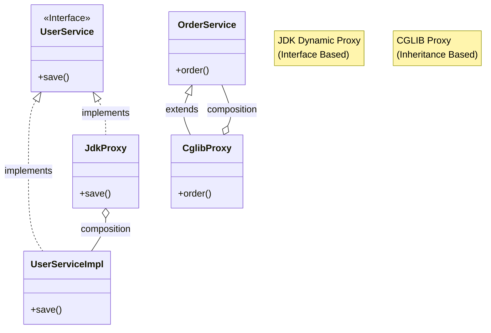
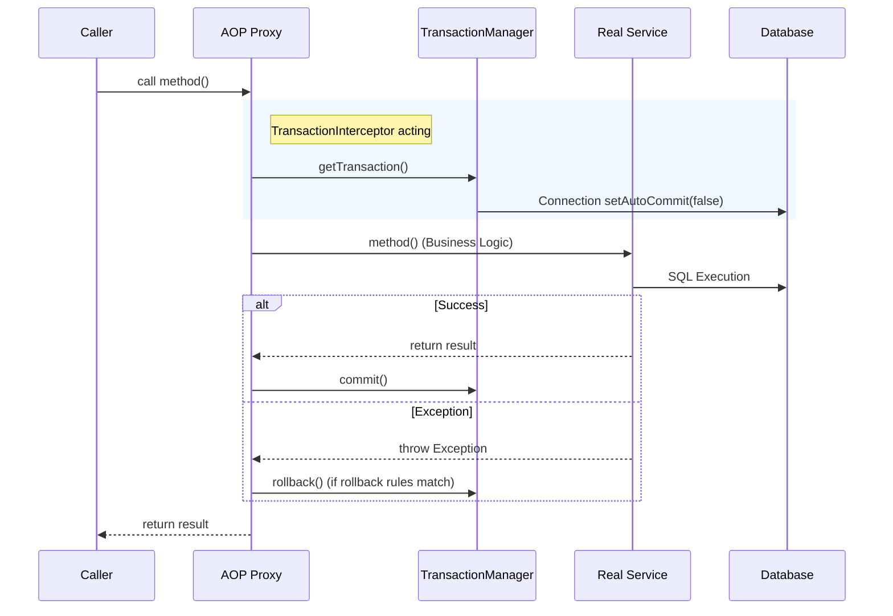
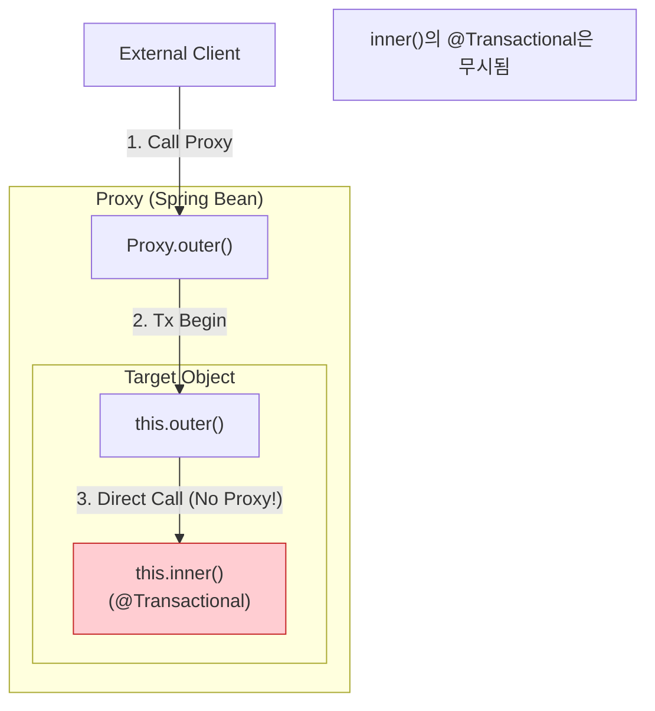
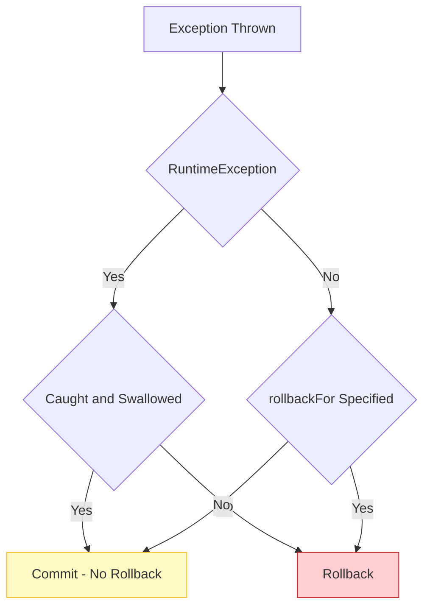

## 이 글에서 얻는 것

- Spring AOP가 “어떻게 프록시로 동작을 끼워 넣는지” 이해하고, 프록시 때문에 생기는 문제를 디버깅할 수 있습니다.
- `@Transactional`이 실제로는 어떤 컴포넌트(Interceptor/TransactionManager)로 동작하는지 큰 흐름을 설명할 수 있습니다.
- self-invocation, 메서드 가시성, 프록시 종류(JDK/CGLIB) 같은 “실수 패턴”을 피할 수 있습니다.

## 1) AOP를 한 문장으로

AOP(Aspect-Oriented Programming)는 “비즈니스 로직과 직접 관련 없지만 여러 곳에 반복되는 관심사(로깅, 트랜잭션, 보안 등)”를
한 곳에서 정의하고, 특정 지점에 끼워 넣는 방식입니다.

스프링은 보통 **런타임 프록시**로 AOP를 구현합니다.

## 2) 스프링 AOP의 기본 구조(포인트컷/어드바이스/프록시)

- **Pointcut**: 어디에 적용할지(메서드/패키지/어노테이션 조건)
- **Advice**: 무엇을 할지(전/후/예외/around)
- **Proxy**: 실제 빈을 감싸서(랩핑) “호출 경계”에서 advice를 실행

즉, AOP가 적용되는 순간부터 “내가 호출하는 객체”는 실제 객체가 아니라 **프록시**일 수 있습니다.

## 3) 프록시 종류: JDK vs CGLIB

### JDK Dynamic Proxy vs CGLIB Proxy

스프링은 상황에 따라 두 가지 프록시 방식을 사용합니다. 구조적 차이를 이해해야 주입 에러를 피할 수 있습니다.



| Feature | JDK Dynamic Proxy | CGLIB Proxy |
| :--- | :--- | :--- |
| **기반 기술** | Java Reflection (표준) | Bytecode Generation |
| **생성 조건** | **인터페이스**가 반드시 있어야 함 | 클래스만 있어도 가능 |
| **프록시 타입** | 인터페이스 구현체 | 타겟 클래스의 **자식 클래스** |
| **제약 사항** | 인터페이스에 정의된 메서드만 AOP 적용 | `final` 메서드/클래스 AOP 불가 |
| **Spring Boot** | 2.0 이전 기본값(인터페이스 O) | **2.0부터 기본값** (`proxyTargetClass=true`) |

> [!TIP]
> **실무 권장**: Spring Boot 2.0+에서는 기본적으로 **CGLIB**를 사용하여 인터페이스 유무와 상관없이 일관되게 동작합니다. 굳이 설정을 바꿀 필요는 거의 없습니다.


## 4) `@Transactional`이 동작하는 흐름 (Under the Hood)

`@Transactional`은 마법이 아니라 **Interceptor가 앞뒤를 감싸는 구조**입니다.



1. **프록시 진입**: 외부에서 메서드를 호출하면 프록시가 먼저 받습니다.
2. **트랜잭션 시작**: `TransactionInterceptor`가 `PlatformTransactionManager`에게 트랜잭션 시작을 요청합니다 (DB 커넥션 획득 등).
3. **비즈니스 로직**: 실제 타겟 메서드를 실행합니다.
4. **커밋/롤백**: 메서드가 정상 종료되면 커밋, 예외가 발생하면(규칙에 따라) 롤백합니다.
  

```java
@Service
@Transactional
public class OrderService {
    public void placeOrder(...) { ... }
}
```

중요한 사실 2가지:

- 트랜잭션은 보통 **스레드 로컬(ThreadLocal)** 에 바인딩됩니다(같은 스레드에서 “같은 트랜잭션”을 공유).
- 따라서 비동기/다른 스레드로 넘어가면 기본적으로 같은 트랜잭션이 이어지지 않습니다.

## 5) Self-Invocation: “왜 트랜잭션이 안 먹지?”

AOP의 가장 흔한 함정입니다. **같은 클래스 내부의 메서드끼리 호출(`this.xxx`)** 할 때는 프록시를 거치지 않습니다.



### 해결 방법

1.  **빈 분리 (가장 권장)**: 내부 호출되는 메서드를 **다른 서비스(Bean)** 로 뺍니다.
2.  **Self Injection**: 자기 자신을 주입받아 호출합니다. (`@Autowired OrderService self; self.inner()`)
3.  **TransactionTemplate**: 어노테이션 대신 코드로 트랜잭션 범위를 명시합니다.
  

## 6) 롤백 규칙: RuntimeException vs Checked Exception

"예외가 났는데 롤백이 안 돼요"의 90%는 이 규칙 때문입니다.



- **Unchecked Exception (RuntimeException)**: 기본적으로 **롤백**됩니다.
- **Checked Exception**: 기본적으로 **커밋**됩니다. (변복구 가능한 예외로 간주)
- **try-catch**: 예외를 잡아서 처리해버리면(`CompletableFuture` 등), AOP는 예외를 모르므로 **롤백되지 않습니다**.

> [!WARNING]
> Checked Exception에서도 롤백하고 싶다면 반드시 `rollbackFor = Exception.class`를 지정하세요.


## 7) 어드바이스 순서(Order): 캐시/트랜잭션/보안이 섞일 때

현업 코드에는 `@Transactional`, `@Cacheable`, `@PreAuthorize`, 커스텀 로깅 AOP가 동시에 걸리는 경우가 많습니다.
이때 “어느 것이 먼저 실행되는지”에 따라 동작이 달라질 수 있습니다.

- 순서가 중요한 AOP는 `@Order`/`Ordered`로 의도를 명확히 하거나,
- 트랜잭션 경계를 더 바깥으로 둘지/안으로 둘지 설계 기준을 정해두는 편이 좋습니다.

## 연습(추천)

- `@Transactional`이 안 먹는 self-invocation 케이스를 일부러 만들고, “빈 분리”로 해결해보기
- 프록시 타입(JDK/CGLIB)을 바꿔보고(`spring.aop.proxy-target-class`) 빈 클래스가 어떻게 달라지는지 출력해보기
- 커스텀 `@LogExecutionTime` AOP를 만들어서 트랜잭션/캐시와 섞였을 때 실행 순서를 확인해보기
