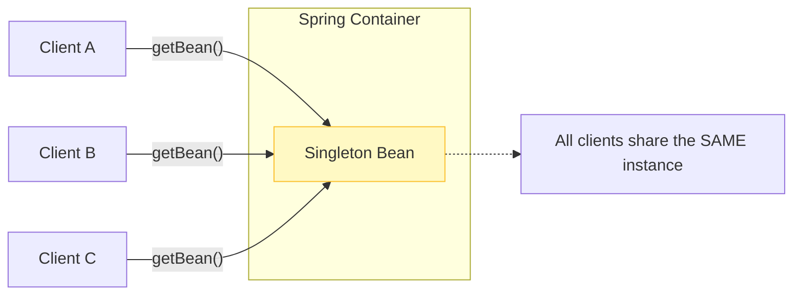
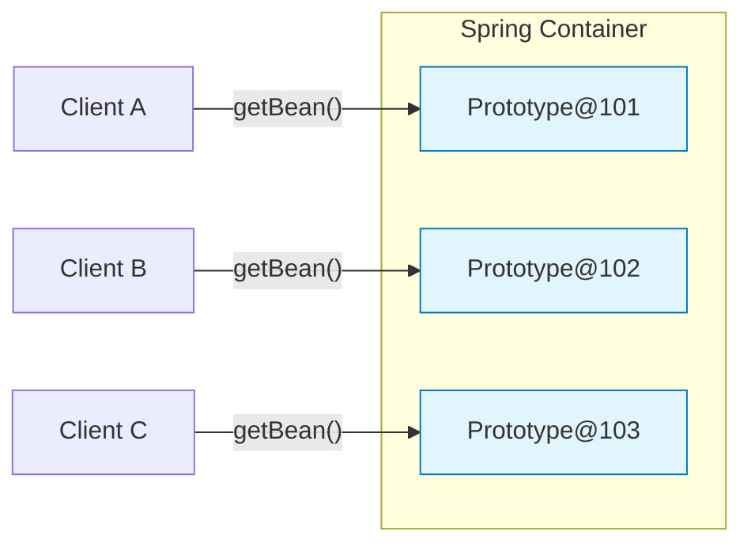
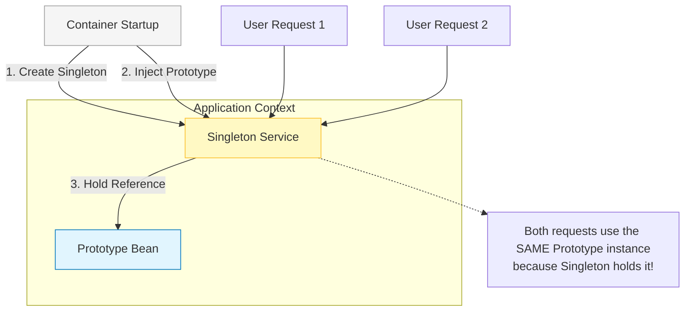
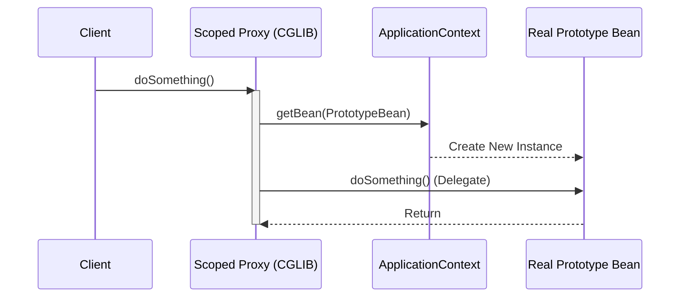

## 이 글에서 얻는 것

- **빈 스코프**(Singleton/Prototype/Request/Session)의 차이와 사용 시점을 이해합니다.
- **Singleton 빈에서 Prototype 빈 주입 시 발생하는 문제**와 해결법을 알 수 있습니다.
- **@Scope의 proxyMode**를 이해하고, 프록시가 필요한 상황을 판단합니다.
- 스레드 안전성과 상태 관리를 빈 스코프 관점에서 설계할 수 있습니다.

## 0) 빈 스코프는 "빈의 생명주기 범위"를 결정한다

Spring 빈의 스코프는 빈이 언제 생성되고 언제 소멸되는지를 정의합니다.

## 1) Singleton 스코프 (기본값)

**"애플리케이션 전체에서 하나의 인스턴스만 존재"**



```java
@Component  // 기본 스코프는 Singleton
public class UserService {
    private int callCount = 0;  // ⚠️ 상태를 가지면 위험!

    public void doSomething() {
        callCount++;  // 모든 요청에서 공유됨
        System.out.println("Call count: " + callCount);
    }
}

// 사용
ApplicationContext context = ...;
UserService service1 = context.getBean(UserService.class);
UserService service2 = context.getBean(UserService.class);

System.out.println(service1 == service2);  // true (같은 객체)

service1.doSomething();  // Call count: 1
service2.doSomething();  // Call count: 2 (같은 객체라 상태 공유)
```

**특징:**
- 애플리케이션 시작 시 생성 (eager initialization)
- 애플리케이션 종료 시 소멸
- 메모리 효율적
- **상태를 가지면 안 됨** (stateless 유지)

**언제 사용:**
- 대부분의 경우 (기본값)
- Service, Repository 같은 비즈니스 로직

## 2) Prototype 스코프

**"요청할 때마다 새로운 인스턴스 생성"**



```java
@Component
@Scope("prototype")  // 또는 @Scope(ConfigurableBeanFactory.SCOPE_PROTOTYPE)
public class PrototypeBean {
    private int count = 0;

    public void increment() {
        count++;
    }

    public int getCount() {
        return count;
    }
}

// 사용
ApplicationContext context = ...;
PrototypeBean bean1 = context.getBean(PrototypeBean.class);
PrototypeBean bean2 = context.getBean(PrototypeBean.class);

System.out.println(bean1 == bean2);  // false (다른 객체)

bean1.increment();
bean2.increment();
System.out.println(bean1.getCount());  // 1
System.out.println(bean2.getCount());  // 1 (독립적)
```

**특징:**
- 요청 시마다 생성
- Spring 컨테이너는 생성만 관리, **소멸은 관리 안 함**
  - `@PreDestroy` 콜백 호출 안 됨!
- 메모리 사용량 증가 가능

**언제 사용:**
- 상태를 가져야 하는 빈 (요청별 독립적인 상태)
- 임시 객체
- 멀티스레드 환경에서 스레드별 독립 인스턴스

## 3) Singleton + Prototype 문제

### 문제 상황

```java
@Component  // Singleton
public class SingletonService {
    private final PrototypeBean prototypeBean;

    public SingletonService(PrototypeBean prototypeBean) {
        this.prototypeBean = prototypeBean;  // 생성 시 한 번만 주입!
    }

    public void doSomething() {
        prototypeBean.increment();
        System.out.println("Count: " + prototypeBean.getCount());
    }
}

// 사용
SingletonService service = context.getBean(SingletonService.class);
service.doSomething();  // Count: 1
service.doSomething();  // Count: 2 (Prototype이 재사용됨!)
```

### 문제 상황 시각화 (Injection Time Trap)



**문제 원인:**
- Singleton 빈은 **생성 시점(Injection Time)**에만 의존성을 주입받습니다.
- 이때 주입된 Prototype 빈은 영원히 Singleton 내부에 박제됩니다.
- 결과적으로 Prototype의 "매번 새로운 객체"라는 특성이 무시됩니다.

### 해결 방법 1: ObjectProvider

```java
@Component
public class SingletonService {
    private final ObjectProvider<PrototypeBean> prototypeBeanProvider;

    public SingletonService(ObjectProvider<PrototypeBean> prototypeBeanProvider) {
        this.prototypeBeanProvider = prototypeBeanProvider;
    }

    public void doSomething() {
        PrototypeBean prototypeBean = prototypeBeanProvider.getObject();  // 매번 새로 생성
        prototypeBean.increment();
        System.out.println("Count: " + prototypeBean.getCount());
    }
}

// 실행
service.doSomething();  // Count: 1 (새 객체)
service.doSomething();  // Count: 1 (새 객체)
```

### 해결 방법 2: @Scope(proxyMode)

```java
@Component
@Scope(value = "prototype", proxyMode = ScopedProxyMode.TARGET_CLASS)
public class PrototypeBean {
    private int count = 0;

    public void increment() {
        count++;
    }

    public int getCount() {
        return count;
    }
}

@Component
public class SingletonService {
    private final PrototypeBean prototypeBean;  // 프록시가 주입됨

    public SingletonService(PrototypeBean prototypeBean) {
        this.prototypeBean = prototypeBean;  // 실제로는 프록시 객체
    }

    public void doSomething() {
        prototypeBean.increment();  // 프록시가 실제 빈을 새로 가져옴
        System.out.println("Count: " + prototypeBean.getCount());
    }
}

// 실행
service.doSomething();  // Count: 1 (프록시가 새 객체 생성)
service.doSomething();  // Count: 1 (프록시가 새 객체 생성)
```

**동작 원리 (CGLIB Proxy Delegation):**



- **Client**는 `SingletonService`를 호출한다고 생각하지만, 실제로는 **프록시**를 호출합니다.
- 프록시는 메서드가 호출될 때마다(`doSomething()`) 진짜 컨테이너에게 새로운 빈을 요청합니다.
- 이를 통해 Singleton 내부에서도 Prototype의 생명주기를 지킬 수 있습니다.

## 4) Web 스코프 (Request/Session)

### 4-1) Request 스코프

**"HTTP 요청마다 새로운 인스턴스 생성"**

```java
@Component
@Scope(value = "request", proxyMode = ScopedProxyMode.TARGET_CLASS)
public class RequestScopedBean {
    private String requestId;

    public void setRequestId(String requestId) {
        this.requestId = requestId;
    }

    public String getRequestId() {
        return requestId;
    }
}

@RestController
public class MyController {
    private final RequestScopedBean requestBean;

    public MyController(RequestScopedBean requestBean) {
        this.requestBean = requestBean;  // 프록시 주입
    }

    @GetMapping("/test")
    public String test() {
        requestBean.setRequestId(UUID.randomUUID().toString());
        return requestBean.getRequestId();
    }
}
```

**특징:**
- HTTP 요청마다 새로운 빈 생성
- 요청 종료 시 소멸
- **proxyMode 필수** (Singleton 컨트롤러에 주입하기 위해)

### 4-2) Session 스코프

**"HTTP 세션마다 새로운 인스턴스 생성"**

```java
@Component
@Scope(value = "session", proxyMode = ScopedProxyMode.TARGET_CLASS)
public class SessionScopedBean {
    private String userId;

    public void setUserId(String userId) {
        this.userId = userId;
    }

    public String getUserId() {
        return userId;
    }
}

@RestController
public class SessionController {
    private final SessionScopedBean sessionBean;

    public SessionController(SessionScopedBean sessionBean) {
        this.sessionBean = sessionBean;
    }

    @GetMapping("/login")
    public String login(@RequestParam String userId) {
        sessionBean.setUserId(userId);
        return "Logged in: " + userId;
    }

    @GetMapping("/profile")
    public String profile() {
        return "User: " + sessionBean.getUserId();
    }
}
```

**특징:**
- 세션마다 독립적인 빈
- 세션 종료 시 소멸
- 로그인 상태 같은 세션 데이터 저장

## 5) proxyMode 이해하기

### 5-1) proxyMode가 필요한 이유

```java
// ❌ proxyMode 없이 Request 빈을 Singleton에 주입 (에러!)
@Component
@Scope("request")  // proxyMode 없음
public class RequestBean { }

@Component  // Singleton
public class SingletonService {
    private final RequestBean requestBean;

    public SingletonService(RequestBean requestBean) {
        // 에러: Request 빈은 HTTP 요청 시점에 생성되는데,
        // Singleton은 애플리케이션 시작 시 생성되어 주입 불가!
        this.requestBean = requestBean;
    }
}
```

### 5-2) proxyMode 적용

```java
// ✅ proxyMode로 프록시 주입
@Component
@Scope(value = "request", proxyMode = ScopedProxyMode.TARGET_CLASS)
public class RequestBean {
    private String data;

    public void setData(String data) {
        this.data = data;
    }

    public String getData() {
        return data;
    }
}

@Component
public class SingletonService {
    private final RequestBean requestBean;  // 실제로는 프록시

    public SingletonService(RequestBean requestBean) {
        this.requestBean = requestBean;  // 프록시 주입 (가능!)
    }

    public void process() {
        // 프록시가 실제 Request 빈을 가져옴
        requestBean.setData("Hello");
        System.out.println(requestBean.getData());
    }
}
```

**proxyMode 옵션:**
- `ScopedProxyMode.TARGET_CLASS`: CGLIB 프록시 (클래스 기반)
- `ScopedProxyMode.INTERFACES`: JDK 동적 프록시 (인터페이스 기반)
- `ScopedProxyMode.NO`: 프록시 없음 (기본값)

## 6) 스레드 안전성

### 6-1) Singleton 빈의 위험

```java
// ❌ 상태를 가진 Singleton (위험!)
@Service
public class UnsafeService {
    private int count = 0;  // 여러 스레드가 동시 접근

    public void increment() {
        count++;  // Race Condition!
    }

    public int getCount() {
        return count;
    }
}
```

### 6-2) 해결 방법

```java
// ✅ 방법 1: Stateless 유지
@Service
public class SafeService {
    // 상태 없음 (필드 변수 사용 안 함)

    public int calculate(int a, int b) {
        return a + b;  // 파라미터만 사용
    }
}

// ✅ 방법 2: ThreadLocal 사용
@Service
public class ThreadLocalService {
    private ThreadLocal<Integer> count = ThreadLocal.withInitial(() -> 0);

    public void increment() {
        count.set(count.get() + 1);  // 스레드별 독립적
    }

    public int getCount() {
        return count.get();
    }
}

// ✅ 방법 3: Prototype 스코프
@Service
@Scope("prototype")
public class PrototypeService {
    private int count = 0;  // 요청마다 새 객체라 안전

    public void increment() {
        count++;
    }
}
```

## 7) 실전 패턴

### 7-1) Request 스코프로 요청 추적

```java
@Component
@Scope(value = "request", proxyMode = ScopedProxyMode.TARGET_CLASS)
public class RequestContext {
    private String requestId;
    private String userId;
    private LocalDateTime requestTime;

    @PostConstruct
    public void init() {
        this.requestId = UUID.randomUUID().toString();
        this.requestTime = LocalDateTime.now();
    }

    // Getters/Setters
}

@Component
public class LoggingFilter implements Filter {
    private final RequestContext requestContext;

    public LoggingFilter(RequestContext requestContext) {
        this.requestContext = requestContext;
    }

    @Override
    public void doFilter(ServletRequest request, ServletResponse response, FilterChain chain) {
        log.info("Request ID: {}", requestContext.getRequestId());
        chain.doFilter(request, response);
    }
}
```

### 7-2) Session 스코프로 장바구니 구현

```java
@Component
@Scope(value = "session", proxyMode = ScopedProxyMode.TARGET_CLASS)
public class ShoppingCart {
    private List<CartItem> items = new ArrayList<>();

    public void addItem(CartItem item) {
        items.add(item);
    }

    public List<CartItem> getItems() {
        return items;
    }

    public void clear() {
        items.clear();
    }
}

@RestController
public class CartController {
    private final ShoppingCart cart;

    public CartController(ShoppingCart cart) {
        this.cart = cart;  // 세션별로 다른 인스턴스
    }

    @PostMapping("/cart/add")
    public ResponseEntity<Void> addItem(@RequestBody CartItem item) {
        cart.addItem(item);
        return ResponseEntity.ok().build();
    }

    @GetMapping("/cart")
    public List<CartItem> getCart() {
        return cart.getItems();
    }
}
```

## 요약: 빈 스코프 비교

| Feature | Singleton | Prototype | Request | Session |
| :--- | :--- | :--- | :--- | :--- |
| **생성 시점** | 앱 시작 (Eager) | 요청 시 (Lazy) | HTTP 요청 시작 | HTTP 세션 시작 |
| **소멸 시점** | 앱 종료 | 관리 안 함 (GC됨) | HTTP 요청 끝 | HTTP 세션 끝 |
| **인스턴스 수** | 1개 (공유) | N개 (독립) | 요청당 1개 | 세션당 1개 |
| **상태 관리** | **Stateless 필수** | Stateful 가능 | 요청 내 공유 | 세션 내 공유 |
| **주의사항** | Thread Safety | 메모리 누수 | Proxy Mode 필수 | Proxy Mode 필수 |

## 다음 단계

- Spring AOP: `/learning/deep-dive/deep-dive-spring-aop/`
- Spring 트랜잭션: `/learning/deep-dive/deep-dive-spring-transaction/`
- JPA 기초: `/learning/deep-dive/deep-dive-jpa-basics/`
