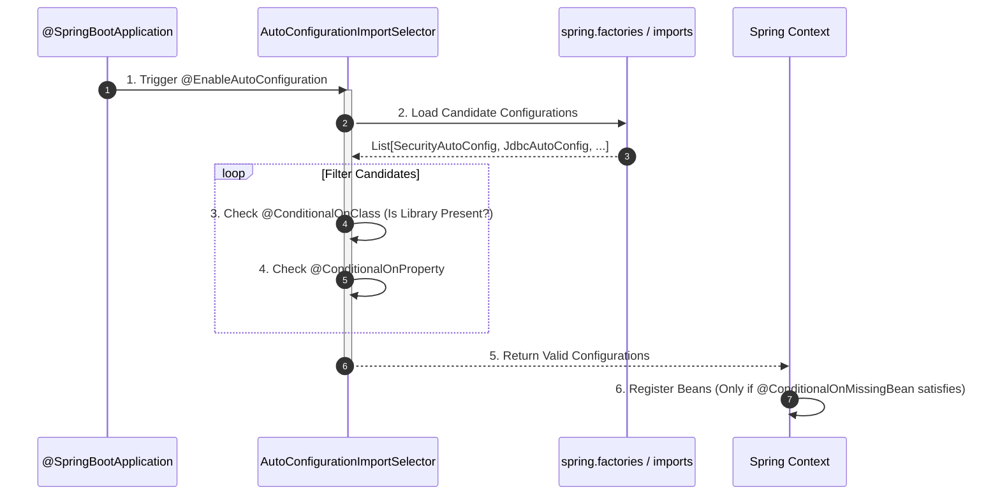
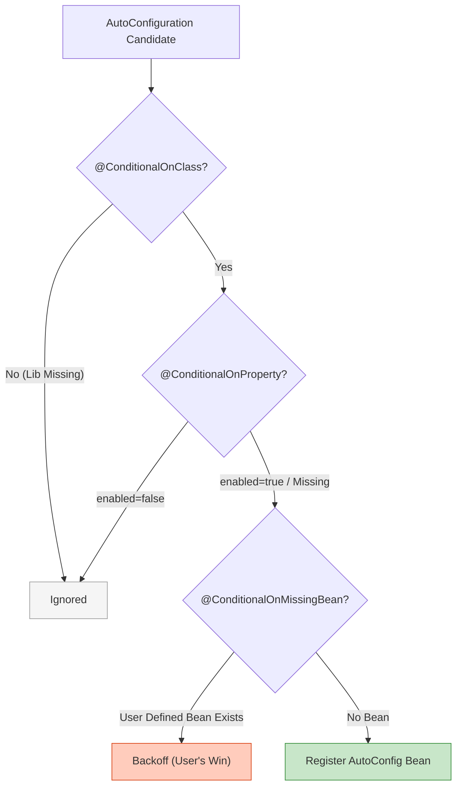
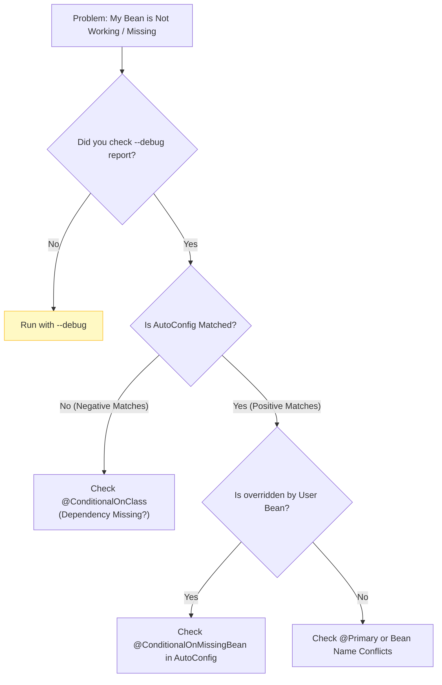

## 이 글에서 얻는 것

- Spring Boot “자동 설정”이 정확히 무엇인지(어디서/어떤 조건으로/왜 등록되는지) 설명할 수 있습니다.
- “내가 만든 빈이 왜 안 먹지?”, “왜 갑자기 Security가 켜졌지?” 같은 문제를 **조건 리포트로 디버깅**할 수 있습니다.
- 자동 설정을 끄기(exclude)보다 **확장/오버라이드**로 안전하게 커스터마이징하는 방법을 익힙니다.

## 0) 자동 설정(Auto-Configuration)은 한 문장으로

Spring Boot는 클래스패스(의존성)와 설정 프로퍼티를 보고,
필요한 `@Configuration`들을 자동으로 import 해서 “기본 동작”을 만들어줍니다.

중요한 포인트는 “자동 설정은 마법”이 아니라 **그냥 조건부로 등록되는 설정 클래스 집합**이라는 점입니다.

## 1) 동작 흐름(큰 그림) - The Magic Revealed

`@SpringBootApplication`은 단순한 어노테이션이 아닙니다. 거대한 자동화 시스템의 트리거입니다.



### 1-1) AutoConfigurationImportSelector의 역할
이 클래스가 바로 "마법사"입니다.
1.  **Candidates Loading**: `spring.factories` (Boot 2.x) 또는 `.imports` (Boot 3.x) 파일에서 후보군을 싹 긁어옵니다.
2.  **Filtering**: 현재 클래스패스에 없는 라이브러리 설정은 칼같이 제외합니다. (예: `H2` 라이브러리가 없으면 `H2ConsoleAutoConfiguration` 탈락)

## 2) 조건부 등록의 핵심: `@Conditional*`

자동 설정은 무턱대고 켜지지 않습니다. 엄격한 심사를 거칩니다.



- **@ConditionalOnClass**: "라이브러리(Jar) 넣었니?" (가장 먼저 체크)
- **@ConditionalOnProperty**: "`application.yml`에서 껐니?"
- **@ConditionalOnMissingBean**: "사용자가 직접 같은 빈을 만들었니?" (가장 나중에 체크 - **오버라이딩의 핵심**)

## 3) “내가 만든 설정이 왜 안 먹지?” 디버깅 루틴

추측(Guess)하지 말고 증거(Report)를 보세요.



### 3-1) ConditionEvaluationReport 읽는 법 (`--debug`)

실행 옵션에 `--debug`를 주면 어떤 자동 설정이 “왜 켜졌고/왜 꺼졌는지”가 출력됩니다. **"Positive Matches"**와 **"Negative Matches"**만 찾으세요.

### 3-2) Actuator의 conditions/beans 활용

운영/로컬에서 원인 추적이 필요하면:

- `/actuator/conditions`: 조건 평가 결과
- `/actuator/beans`: 빈 목록과 의존성

(노출은 반드시 인증/내부망 등으로 제한해야 합니다.)

## 4) 커스터마이징의 우선순위: exclude는 마지막 카드

### 4-1) 1순위: 프로퍼티로 동작을 조정

자동 설정은 보통 “기본값”을 제공하고, 프로퍼티로 동작을 바꿀 수 있게 설계되어 있습니다.

예:

- DataSource, Jackson, Logging, Management(Actuator) 등은 프로퍼티로 조정 가능한 범위가 큽니다.

### 4-2) 2순위: 빈 오버라이드(같은 타입 빈 등록)

자동 설정이 `@ConditionalOnMissingBean`으로 기본 빈을 제공하는 경우,
같은 타입 빈을 직접 등록하면 “내 빈이 우선”이 됩니다.

```java
@Configuration
public class MyConfig {
    @Bean
    public ObjectMapper objectMapper() {
        return new ObjectMapper().findAndRegisterModules();
    }
}
```

### 4-3) 3순위: 확장 포인트를 사용(커스터마이저/빌더)

부트는 아예 확장용 타입을 제공하는 경우가 많습니다.

- `WebMvcConfigurer`, `Jackson2ObjectMapperBuilderCustomizer` 같은 커스터마이저
- Converter/Formatter 등록 등

### 4-4) 마지막: exclude

자동 설정 제외는 빠르지만 부작용이 큽니다. 다른 자동 설정이 연쇄적으로 기대하는 빈이 사라질 수 있습니다.

정말 필요할 때만 사용합니다.

```properties
spring.autoconfigure.exclude=org.springframework.boot.autoconfigure.security.servlet.SecurityAutoConfiguration
```

또는:

```java
@SpringBootApplication(exclude = SecurityAutoConfiguration.class)
public class App {}
```

## 5) 실무에서 자주 겪는 함정

- 의존성(starter)을 추가했더니 기능이 “자동으로 켜짐” → `@ConditionalOnClass`가 원인인 경우가 많음
- 같은 타입 빈이 여러 개라서 주입이 모호함 → `@Primary`/`@Qualifier`로 의도를 명확히
- exclude로 급하게 껐는데 다른 설정이 깨짐 → 우선 프로퍼티/오버라이드/확장으로 해결 가능한지 확인

## 연습(추천)

- `spring-boot-starter-security`를 추가했을 때 어떤 자동 설정이 켜지는지 `--debug`로 확인해보기
- ObjectMapper를 커스터마이징하고, 자동 설정 기본값과 무엇이 달라졌는지 비교해보기
- “의도치 않은 빈 생성”을 일부러 만들어보고(`/actuator/beans`, `/actuator/conditions`), 원인을 추적해보기
