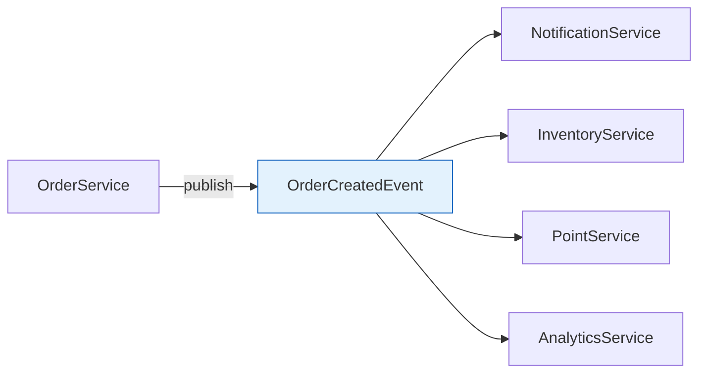
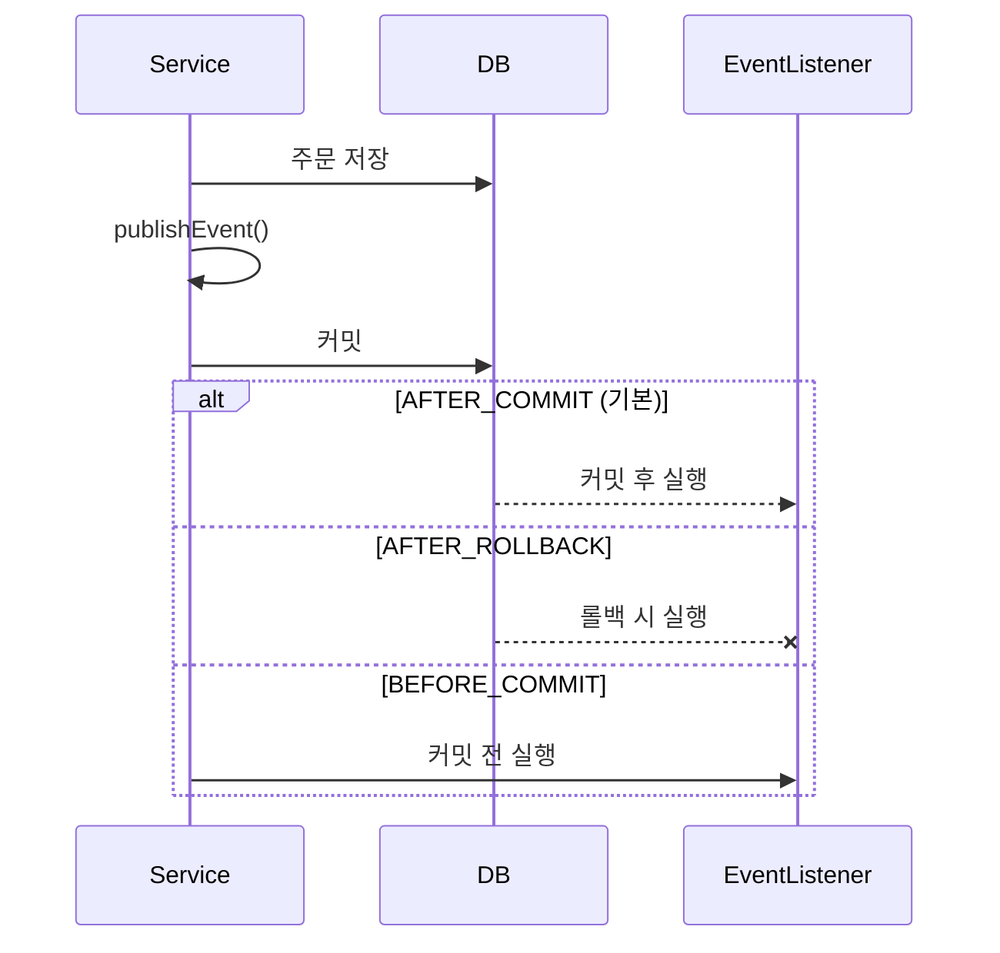

## 이 글에서 얻는 것

- **Spring Events**로 컴포넌트 간 느슨한 결합을 달성합니다
- **@TransactionalEventListener**로 트랜잭션과 이벤트를 연동합니다
- **비동기 이벤트**와 에러 처리 패턴을 알아봅니다

---

## 왜 이벤트 기반인가?

### 문제: 강한 결합

```java
// ❌ 강한 결합
@Service
public class OrderService {
    
    @Autowired
    private NotificationService notificationService;
    @Autowired
    private InventoryService inventoryService;
    @Autowired
    private PointService pointService;
    @Autowired
    private AnalyticsService analyticsService;
    
    @Transactional
    public Order createOrder(OrderRequest request) {
        Order order = orderRepository.save(new Order(request));
        
        // 주문 외 로직이 OrderService에 누적
        notificationService.sendOrderConfirmation(order);
        inventoryService.decreaseStock(order);
        pointService.addPoints(order);
        analyticsService.trackOrder(order);
        
        return order;
    }
}
```

**문제점**:
- OrderService가 모든 서비스에 의존
- 새 기능 추가 시 OrderService 수정 필요
- 테스트 어려움

### 해결: 이벤트 발행



```java
// ✅ 느슨한 결합
@Service
public class OrderService {
    
    @Autowired
    private ApplicationEventPublisher eventPublisher;
    
    @Transactional
    public Order createOrder(OrderRequest request) {
        Order order = orderRepository.save(new Order(request));
        
        // 이벤트만 발행 → 다른 서비스는 모름
        eventPublisher.publishEvent(new OrderCreatedEvent(order));
        
        return order;
    }
}
```

---

## 기본 이벤트 구현

### 이벤트 클래스

```java
// 간단한 이벤트 (Spring 4.2+, ApplicationEvent 상속 불필요)
public class OrderCreatedEvent {
    private final Order order;
    private final LocalDateTime occurredAt;
    
    public OrderCreatedEvent(Order order) {
        this.order = order;
        this.occurredAt = LocalDateTime.now();
    }
    
    public Order getOrder() { return order; }
    public LocalDateTime getOccurredAt() { return occurredAt; }
}
```

### 이벤트 리스너

```java
@Component
public class OrderEventListener {
    
    // 기본 동기 리스너
    @EventListener
    public void handleOrderCreated(OrderCreatedEvent event) {
        Order order = event.getOrder();
        log.info("Order created: {}", order.getId());
        
        // 알림 전송
        notificationService.sendOrderConfirmation(order);
    }
    
    // 조건부 리스너
    @EventListener(condition = "#event.order.totalAmount > 100000")
    public void handleHighValueOrder(OrderCreatedEvent event) {
        // 고액 주문만 처리
        vipService.notifyVipTeam(event.getOrder());
    }
}
```

---

## @TransactionalEventListener

### 트랜잭션 바인딩



### 사용 예시

```java
@Component
public class OrderTransactionalListener {
    
    // 트랜잭션 커밋 후 실행 (기본)
    @TransactionalEventListener(phase = TransactionPhase.AFTER_COMMIT)
    public void onOrderCreatedAfterCommit(OrderCreatedEvent event) {
        // DB 커밋 확정 후에만 실행
        // 외부 API 호출, 이메일 발송 등
        notificationService.sendEmail(event.getOrder());
    }
    
    // 트랜잭션 롤백 시 실행
    @TransactionalEventListener(phase = TransactionPhase.AFTER_ROLLBACK)
    public void onOrderFailedRollback(OrderCreatedEvent event) {
        // 보상 로직 실행
        log.error("Order failed, cleaning up: {}", event.getOrder().getId());
    }
    
    // 커밋 전 실행 (같은 트랜잭션)
    @TransactionalEventListener(phase = TransactionPhase.BEFORE_COMMIT)
    public void onOrderCreatedBeforeCommit(OrderCreatedEvent event) {
        // 추가 검증 또는 같은 트랜잭션에서 처리할 로직
        auditService.logOrderCreation(event.getOrder());
    }
}
```

### 주의: 트랜잭션이 없는 경우

```java
// ⚠️ 트랜잭션 없으면 리스너 실행 안됨
@TransactionalEventListener
public void handle(OrderCreatedEvent event) { ... }

// 해결: fallbackExecution = true
@TransactionalEventListener(fallbackExecution = true)
public void handle(OrderCreatedEvent event) {
    // 트랜잭션 없어도 실행
}
```

---

## 비동기 이벤트

### 설정

```java
@Configuration
@EnableAsync
public class AsyncConfig {
    
    @Bean
    public Executor taskExecutor() {
        ThreadPoolTaskExecutor executor = new ThreadPoolTaskExecutor();
        executor.setCorePoolSize(5);
        executor.setMaxPoolSize(10);
        executor.setQueueCapacity(100);
        executor.setThreadNamePrefix("event-async-");
        executor.setRejectedExecutionHandler(new CallerRunsPolicy());
        executor.initialize();
        return executor;
    }
}
```

### 비동기 리스너

```java
@Component
public class AsyncOrderListener {
    
    @Async
    @EventListener
    public void handleOrderCreatedAsync(OrderCreatedEvent event) {
        // 별도 스레드에서 실행
        // 발행자는 기다리지 않음
        log.info("Processing in thread: {}", Thread.currentThread().getName());
        
        analyticsService.trackOrder(event.getOrder());
    }
    
    // 비동기 + 트랜잭션 바인딩
    @Async
    @TransactionalEventListener
    public void handleAfterCommitAsync(OrderCreatedEvent event) {
        // 커밋 후 별도 스레드에서 실행
        emailService.sendOrderConfirmation(event.getOrder());
    }
}
```

### 에러 처리

```java
@Configuration
public class AsyncExceptionConfig implements AsyncConfigurer {
    
    @Override
    public AsyncUncaughtExceptionHandler getAsyncUncaughtExceptionHandler() {
        return (throwable, method, params) -> {
            log.error("Async error in {}: {}", method.getName(), throwable.getMessage());
            
            // 알림 또는 재시도 로직
            alertService.notifyError(throwable);
        };
    }
}
```

---

## 이벤트 체이닝

### 이벤트가 이벤트를 발행

```java
@Component
public class OrderWorkflow {
    
    @Autowired
    private ApplicationEventPublisher publisher;
    
    @EventListener
    public void onOrderCreated(OrderCreatedEvent event) {
        // 재고 감소 후 새 이벤트 발행
        inventoryService.decrease(event.getOrder());
        publisher.publishEvent(new InventoryDecreasedEvent(event.getOrder()));
    }
    
    @EventListener
    public void onInventoryDecreased(InventoryDecreasedEvent event) {
        // 포인트 적립 후 새 이벤트 발행
        pointService.addPoints(event.getOrder());
        publisher.publishEvent(new PointsAddedEvent(event.getOrder()));
    }
}
```

### 순서 제어

```java
@Component
public class OrderedEventListener {
    
    @EventListener
    @Order(1)  // 먼저 실행
    public void firstHandler(OrderCreatedEvent event) {
        log.info("First handler");
    }
    
    @EventListener
    @Order(2)  // 나중에 실행
    public void secondHandler(OrderCreatedEvent event) {
        log.info("Second handler");
    }
}
```

---

## 외부 메시지 시스템과 연동

### Spring Events → Kafka

```java
@Component
public class KafkaEventBridge {
    
    @Autowired
    private KafkaTemplate<String, Object> kafkaTemplate;
    
    @TransactionalEventListener(phase = TransactionPhase.AFTER_COMMIT)
    public void bridgeToKafka(OrderCreatedEvent event) {
        // 로컬 이벤트 → Kafka 메시지
        kafkaTemplate.send("orders", event.getOrder().getId(), 
            new OrderMessage(event.getOrder()));
    }
}
```

### Transactional Outbox 패턴

```java
@Entity
@Table(name = "outbox_events")
public class OutboxEvent {
    @Id
    private String id;
    private String aggregateType;
    private String aggregateId;
    private String eventType;
    private String payload;
    private LocalDateTime createdAt;
    private Boolean published;
}

@Component
public class OutboxEventListener {
    
    @Autowired
    private OutboxRepository outboxRepository;
    
    @TransactionalEventListener(phase = TransactionPhase.BEFORE_COMMIT)
    public void saveToOutbox(OrderCreatedEvent event) {
        // 같은 트랜잭션에 Outbox 저장
        OutboxEvent outbox = new OutboxEvent();
        outbox.setAggregateType("Order");
        outbox.setEventType("OrderCreated");
        outbox.setPayload(objectMapper.writeValueAsString(event));
        outboxRepository.save(outbox);
    }
}

// 별도 스케줄러가 Outbox 폴링 → Kafka 발행
```

---

## 요약

### 이벤트 유형 선택

| 요구사항 | 방법 |
|---------|------|
| 동기 처리 | @EventListener |
| 커밋 후 처리 | @TransactionalEventListener |
| 비동기 처리 | @Async + @EventListener |
| 순서 제어 | @Order |
| 조건부 처리 | condition 속성 |

### 핵심 원칙

1. **느슨한 결합**: 발행자는 구독자를 모름
2. **단일 책임**: 각 리스너는 하나의 역할
3. **트랜잭션 인지**: 커밋/롤백에 따른 처리
4. **에러 격리**: 비동기로 실패 전파 방지

---

## 🔗 Related Deep Dive

- **[Kafka 기본](/learning/deep-dive/deep-dive-kafka-foundations/)**: 분산 이벤트 스트리밍.
- **[SAGA 패턴](/learning/deep-dive/deep-dive-distributed-transactions/)**: 이벤트 기반 분산 트랜잭션.
