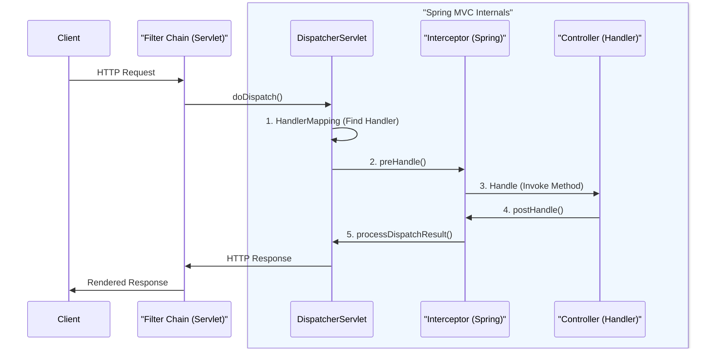
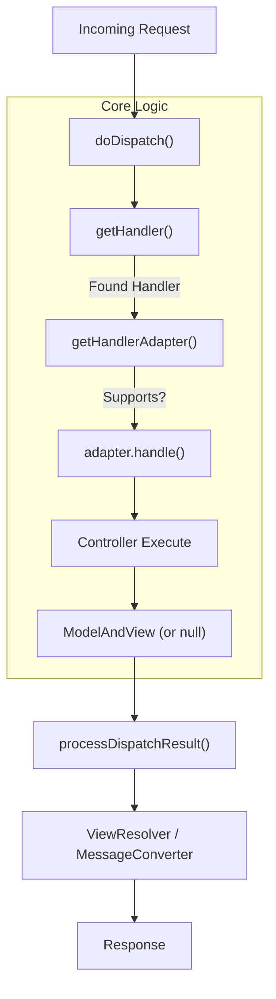
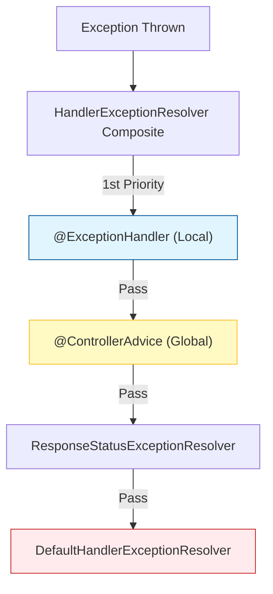
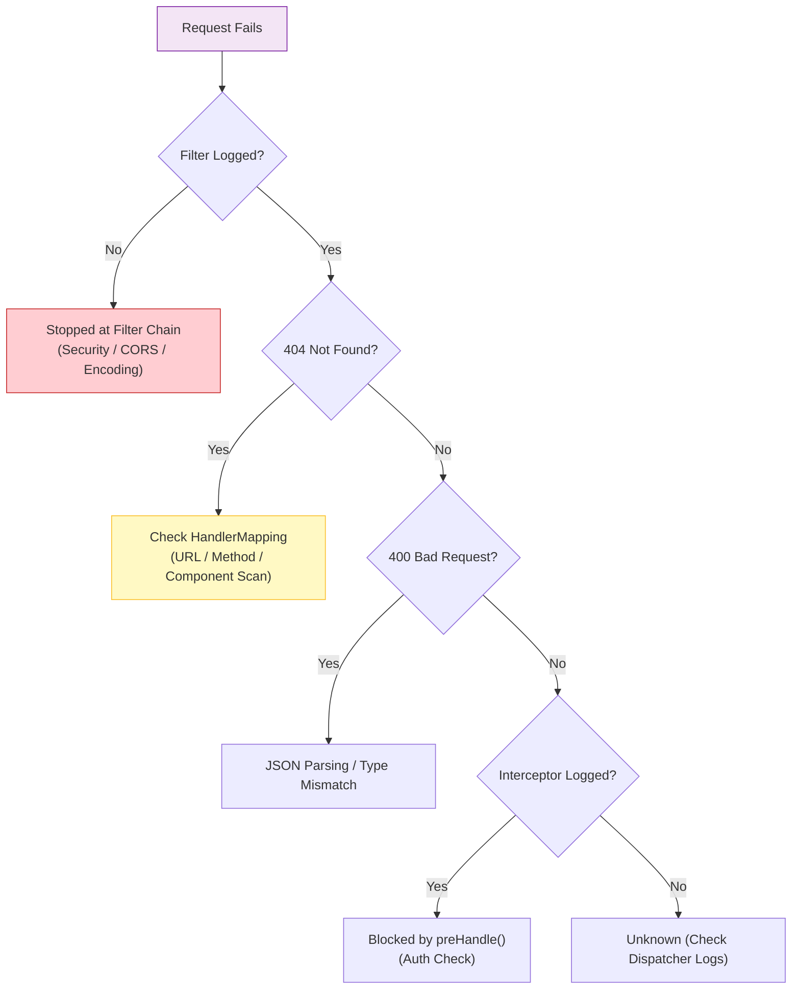

## 이 글에서 얻는 것

- Spring MVC에서 요청이 **어떤 순서**로 흘러가는지(필터 → 디스패처 → 컨트롤러 → 예외 처리)를 큰 그림으로 설명할 수 있습니다.
- Filter와 Interceptor의 차이를 “대충 비슷한 훅”이 아니라 **실행 위치/책임/사용 기준**으로 구분할 수 있습니다.
- 404/405/검증 실패/인증 실패 같은 문제를 만났을 때, “어느 계층에서 끊겼는지”를 빠르게 좁히는 방법을 얻습니다.
- 로그/트레이싱/인증 같은 횡단 관심사를 어디에 두면 좋은지(필터 vs 인터셉터 vs AOP) 감각이 생깁니다.

## 0) 전체 흐름 (Big Picture)

요청이 들어오면 대략 아래 순서로 흘러갑니다. "보이지 않는 구간"을 시각화하면 다음과 같습니다.

1. **서블릿 컨테이너(Tomcat)** 가 커넥션을 받아 요청을 만듭니다.
2. **Filter 체인**을 순서대로 통과합니다 (서블릿 레벨).
3. `DispatcherServlet`이 요청을 받아 **핸들러(Controller)** 를 찾고 실행합니다.
4. **Interceptor**가 컨트롤러 전후에 훅을 걸고, 예외/완료 시점에 정리합니다.
5. 응답이 만들어지고, 다시 **Filter 체인**을 거쳐 클라이언트로 나갑니다.

> [!NOTE]
> 핵심은 **"컨트롤러만 실행되는 게 아니라"**, 앞뒤에 여러 레이어가 양파 껍질처럼 감싸고 있다는 점입니다.

### Filter(서블릿 레벨) vs Interceptor(스프링 MVC 레벨)

비슷해 보이지만 **실행 시점**과 **관심사**가 다릅니다.

| Feature | Filter (Servlet) | Interceptor (Spring MVC) |
| :--- | :--- | :--- |
| **소속** | Web Container (Tomcat) | Spring Context |
| **실행 시점** | DispatcherServlet **진입 전** | DispatcherServlet **내부** (Controller 앞뒤) |
| **접근 가능 범위** | `ServletRequest`, `ServletResponse` | `HandlerMethod` (어떤 컨트롤러가 실행될지 앎) |
| **예외 처리** | Spring 예외 처리(`@ControllerAdvice`) 밖임 | `@ControllerAdvice`로 처리 가능 |
| **주 사용처** | 인코딩, 보안(Spring Security), CORS, 로깅(Body) | 권한 체크(Handler별), API 로깅, 파라미터 검증 |

> [!TIP]
> **실무 선택 기준**:
> - "컨트롤러가 뭔지 몰라도 되는" 공통 기능(인코딩, 보안 헤더) → **Filter**
> - "어떤 핸들러(메서드)가 실행되는지" 알아야 하는 기능(권한 체크, 실행 시간 측정) → **Interceptor**
  

## 2) DispatcherServlet 안쪽에서 무슨 일이 일어나는가

`DispatcherServlet`은 사실상 **"프론트 컨트롤러"** 입니다. 모든 요청의 교통 정리를 담당합니다.

1. **HandlerMapping**: URL(`@RequestMapping`)을 보고 어떤 컨트롤러(Handler)가 처리할지 찾습니다.
2. **HandlerAdapter**: 찾은 핸들러를 실행할 수 있는 어댑터를 꺼냅니다. (이 덕분에 Controller 인터페이스뿐 아니라 다양한 방식의 핸들러 지원 가능)
3. **Handle**: 실제 비즈니스 로직(Controller)을 실행하고 결과를 받습니다.
4. **View/Converter**: `@ResponseBody`면 JSON으로 쓰고, 아니면 HTML 뷰를 렌더링합니다.

여기서 흔히 만나는 실패는 다음과 같습니다.

- `404`: 매핑되는 핸들러를 못 찾음(경로/메서드/컨트롤러 스캔 문제)
- `405`: 경로는 맞는데 메서드(GET/POST 등)가 안 맞음
- `400`: 바디 파싱 실패(`HttpMessageNotReadableException`), 타입 변환 실패 등
- `422/400`: 검증 실패(Bean Validation)

## 3) Interceptor 훅(언제 무엇을 하게 되나)

스프링 MVC 인터셉터는 보통 다음 3개를 제공합니다.

- `preHandle`: 컨트롤러 호출 “전” (권한/요청 검증, 시작 시간 저장)
- `postHandle`: 컨트롤러 호출 “후”, 뷰 렌더링 “전” (모델 조작 등)
- `afterCompletion`: 렌더링/예외 포함 “완료” 시점 (리소스 정리, MDC 정리)

주의: `afterCompletion`은 예외가 나도 호출됩니다. “무조건 정리해야 하는 것”을 여기에 둡니다.

## 4) 예외 처리는 어디에서 결정되는가

예외는 **"누가 잡아서 어떤 HTTP 응답으로 바꾸느냐"** 가 핵심입니다. 스프링의 예외 해결사(Resolver)들은 우선순위가 있습니다.

1. **`@ExceptionHandler` (Local)**: 해당 컨트롤러 내부의 예외만 잡습니다.
2. **`@ControllerAdvice` (Global)**: 전역적으로 예외를 잡아 공통 포맷(`ErrorResponse`)으로 변환합니다. **(가장 권장됨)**
3. **`ResponseStatusExceptionResolver`**: `@ResponseStatus(code = 404)` 등이 붙은 예외를 처리합니다.
4. **`DefaultHandlerExceptionResolver`**: 스프링 내부 예외(TypeMismatch 등)를 400, 405 등으로 변환합니다.

> [!IMPORTANT]
> **Best Practice**:
> 비즈니스 로직(Service)은 **구체적인 예외(Custom Exception)** 를 던지고,
> 컨트롤러 바깥의 **Global Advisor**가 이를 잡아서 표준 API 스펙(JSON)으로 변환하는 구조가 가장 깔끔합니다.

## 5) 디버깅 포인트: 내 요청은 어디서 죽었나?

요청이 컨트롤러에 도달하지 못할 때, 원인을 빠르게 좁히는 의사결정 트리입니다.

- **404/405가 뜰 때**: URL 오타, 메서드(GET/POST) 불일치, 컴포넌트 스캔 누락.
- **필터는 도는데 컨트롤러가 안 탈 때**: Interceptor `preHandle`에서 `false`를 반환했거나, Security 필터에서 인증 실패로 튕겨낸 경우.
- **응답이 너무 느릴 때**: DB/외부 API가 범인일 확률 90%. 하지만 가끔은 `OpenInView` 때문에 뷰 렌더링 중에 DB 커넥션을 붙들고 있는 경우도 있습니다.

## 연습(추천)

- Filter 1개 + Interceptor 1개를 만들어서, 요청 1번에 로그가 어떤 순서로 찍히는지 확인해보기
- `@RestControllerAdvice`로 예외를 `{code, message, traceId}` 형태로 매핑해보고, 400/404/500이 각각 어떻게 처리되는지 비교해보기

## 연결해서 읽기

- 검증/에러 응답 규약: `/learning/deep-dive/deep-dive-spring-validation-response/`
- Spring Security 필터 체인 감각: `/learning/deep-dive/deep-dive-spring-security/`
- MVC vs WebFlux(실행 모델 연결): `/learning/deep-dive/deep-dive-spring-webflux-vs-mvc/`
