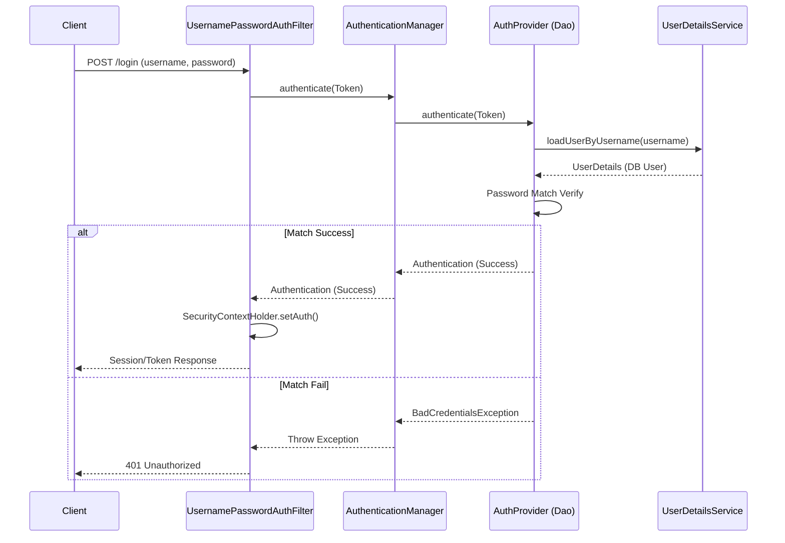

## 이 글에서 얻는 것

- **Servlet Filter**와 **Spring Security Filter Chain**의 관계를 이해합니다.
- `DelegatingFilterProxy`와 `FilterChainProxy`의 역할을 명확히 구분합니다.
- **Authentication**(인증)과 **Authorization**(인가) 처리 흐름을 도식화할 수 있습니다.

## 0) Spring Security 거대한 숲

Spring Security는 수많은 필터들이 **체인(Chain)** 처럼 연결되어 요청을 검사하는 거대한 **방화벽**입니다.
가장 먼저 이해해야 할 것은 "어떻게 Servlet Container(Tomcat)와 Spring Container가 연결되는가?"입니다.

## 1) DelegatingFilterProxy & FilterChainProxy

서블릿 컨테이너(Tomcat)는 스프링 빈(Bean)을 모릅니다. 단지 서블릿 필터(Filter)만 알 뿐입니다.
스프링 시큐리티는 이 틈을 `DelegatingFilterProxy`라는 **다리(Bridge)** 로 연결합니다.

```mermaid
flowchart TB
    Client[Client Request] --> Tomcat[Servlet Container]
    
    subgraph TomcatEnv [Tomcat Filters]
        Filter1[EncodingFilter]
        Filter2[MyLogFilter]
        Delegating[DelegatingFilterProxy<br/>(Standard Servlet Filter)]
    end
    
    Tomcat --> Filter1 --> Filter2 --> Delegating
    
    subgraph SpringContext [Spring ApplicationContext]
        FilterChainProxy[FilterChainProxy<br/>(Spring Bean)]
        
        subgraph SecurityChains [SecurityFilterChain]
            SecFilter1[SecurityContextPersistenceFilter]
            SecFilter2[UsernamePasswordAuthFilter]
            SecFilter3[AuthorizationFilter]
        end
        
        Delegating -->|Delegate| FilterChainProxy
        FilterChainProxy --> SecFilter1 --> SecFilter2 --> SecFilter3
    end

    style Delegating fill:#ffe0b2,stroke:#f57c00
    style FilterChainProxy fill:#e1f5fe,stroke:#0277bd
    style SecurityChains fill:#f3e5f5,stroke:#7b1fa2
```

1.  **DelegatingFilterProxy**: 서블릿 필터 표준을 따르며, 실제 처리는 스프링 빈(`FilterChainProxy`)에게 위임합니다.
2.  **FilterChainProxy**: 보안 필터 체인의 **사령관**입니다. 요청 URL에 따라 적절한 `SecurityFilterChain`을 선택합니다.
3.  **SecurityFilterChain**: 실제 보안 로직을 수행하는 필터들의 묶음입니다. (예: `/api/**`용 체인, `/login`용 체인 등)

## 2) 핵심 필터 순서와 역할

기본적으로 15개 이상의 필터가 동작하지만, 핵심 필터 5가지를 기억하면 됩니다.

| 순서 | 필터 이름 | 역할 |
|:---:|:---|:---|
| 1 | **SecurityContextPersistenceFilter** | 이전 요청의 인증 정보(Context)를 복구합니다. (JSESSIONID 등) |
| 2 | **LogoutFilter** | 로그아웃 요청을 가로채서 세션을 무효화합니다. |
| 3 | **UsernamePasswordAuthenticationFilter** | 아이디/암호 기반 로그인 요청을 처리합니다. |
| 4 | **ExceptionTranslationFilter** | 인증/인가 실패 예외(401, 403)를 핸들링합니다. |
| 5 | **FilterSecurityInterceptor** (AuthorizationFilter) | 인가(권한) 판정을 수행합니다. (가장 마지막) |

## 3) Authentication (인증) 아키텍처

"로그인" 버튼을 눌렀을 때, 내부에서는 어떤 일이 벌어질까요?



- **AuthenticationManager**: 인증을 총괄하는 인터페이스 (구현체: `ProviderManager`).
- **AuthenticationProvider**: 실제 인증 로직을 수행 (예: DB 조회, LDAP, Oauth 등).
- **UserDetails**: 사용자의 정보를 담는 VO.
- **UserDetailsService**: 유저 정보를 DB에서 가져오는 서비스.

## 4) 실전 커스텀 필터 예제

JWT 토큰 인증을 추가하려면, `UsernamePasswordAuthenticationFilter` **앞에** 커스텀 필터를 넣어야 합니다.

```java
@Component
public class JwtRequestFilter extends OncePerRequestFilter {

    @Override
    protected void doFilterInternal(HttpServletRequest request, 
                                    HttpServletResponse response, 
                                    FilterChain chain)
            throws ServletException, IOException {
        
        String authHeader = request.getHeader("Authorization");
        
        if (authHeader != null && authHeader.startsWith("Bearer ")) {
            String jwt = authHeader.substring(7);
            // ... JWT 검증 로직 ...
            // SecurityContextHolder에 인증 정보 저장
        }
        
        chain.doFilter(request, response);
    }
}
```

```java
@Bean
public SecurityFilterChain filterChain(HttpSecurity http) throws Exception {
    http
        // ...
        .addFilterBefore(jwtRequestFilter, UsernamePasswordAuthenticationFilter.class);
    return http.build();
}
```

## 요약

- **Spring Security**는 서블릿 필터 체인 위에서 동작하는 스프링 빈들의 집합입니다.
- **DelegatingFilterProxy**가 서블릿 컨테이너와 스프링 컨텍스트를 연결합니다.
- **인증(Authentication)**은 `AuthenticationManager` -> `Provider` -> `UserDetailsService` 흐름을 따릅니다.
- **커스텀 필터**의 순서 배치가 핵심입니다.

## 다음 단계

- **OAuth 2.0 심화**: `/learning/deep-dive/deep-dive-oauth2-oidc/`
- **JWT vs Session**: `/learning/deep-dive/deep-dive-jwt-session/`
