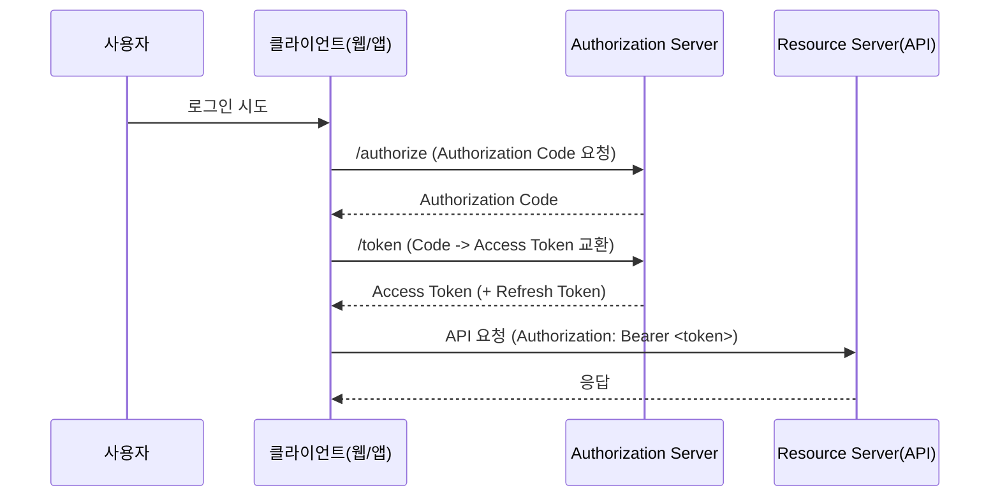

## 이 글에서 얻는 것

- OAuth2 **Authorization Code 흐름**을 실제 Spring Security 설정으로 연결할 수 있습니다.
- **JWT 발급/검증**을 Resource Server 설정으로 구현할 수 있습니다.
- 실무에서 자주 터지는 **토큰 저장/만료/리프레시 정책**의 함정을 예방할 수 있습니다.

## 1) 전체 구조 한 장으로 이해하기



핵심은 **Authorization Server(AS)에서 발급한 JWT를 Resource Server(RS)에서 검증**하는 구조입니다.

## 2) Authorization Server 구성 (Spring Authorization Server)

> 실제 운영에서는 AS와 RS를 **분리**하는 것이 일반적입니다.

```java
@Bean
public RegisteredClientRepository registeredClientRepository(PasswordEncoder encoder) {
    RegisteredClient client = RegisteredClient.withId(UUID.randomUUID().toString())
        .clientId("web-client")
        .clientSecret(encoder.encode("secret"))
        .authorizationGrantType(AuthorizationGrantType.AUTHORIZATION_CODE)
        .authorizationGrantType(AuthorizationGrantType.REFRESH_TOKEN)
        .redirectUri("https://app.example.com/login/oauth2/code")
        .scope("read")
        .scope("write")
        .clientSettings(ClientSettings.builder().requireProofKey(true).build()) // PKCE
        .build();

    return new InMemoryRegisteredClientRepository(client);
}
```

- `requireProofKey(true)`로 **PKCE** 활성화
- Access Token에 사용할 **JWT 서명 키(JWK)** 를 반드시 관리

## 3) Resource Server에서 JWT 검증

```java
@Bean
public SecurityFilterChain apiFilterChain(HttpSecurity http) throws Exception {
    http
        .csrf(AbstractHttpConfigurer::disable)
        .sessionManagement(s -> s.sessionCreationPolicy(SessionCreationPolicy.STATELESS))
        .authorizeHttpRequests(auth -> auth
            .requestMatchers("/public/**").permitAll()
            .anyRequest().authenticated()
        )
        .oauth2ResourceServer(oauth2 -> oauth2
            .jwt(jwt -> jwt
                .jwkSetUri("https://auth.example.com/.well-known/jwks.json")
            )
        );

    return http.build();
}
```

- Resource Server는 **JWK URL**만 알면 서명 검증 가능
- DB 세션이 필요 없으므로 **완전 무상태**

## 4) JWT 클레임 설계 포인트

```json
{
  "sub": "user-123",
  "roles": ["ROLE_USER"],
  "scope": "read write",
  "iat": 1710000000,
  "exp": 1710003600
}
```

- `sub` = 사용자 식별자
- `roles`/`scope` = 인가 기준
- `exp` = 만료 시간을 반드시 짧게

> 실무 팁: **짧은 Access Token + Refresh Token** 조합이 안정적입니다.

## 5) Refresh Token 전략 (실무 함정)

### 5-1. 저장 위치

- 웹: **HttpOnly Secure Cookie** 권장
- 모바일: **Keychain/Keystore** 저장

### 5-2. Rotation

Refresh Token을 매번 재발급하는 **Rotation** 방식을 쓰면 탈취 대응이 유리합니다.

```java
public TokenPair rotate(String refreshToken) {
    validate(refreshToken); // 블랙리스트/만료 확인
    revoke(refreshToken);   // 기존 토큰 폐기
    return issueNewTokens();
}
```

### 5-3. 로그아웃

- Access Token은 만료가 짧아 **즉시 무효화가 어렵습니다**.
- **Refresh Token 블랙리스트** + Access Token 만료 단축으로 대응합니다.

## 6) 흔한 장애 시나리오와 대응

1. **JWT 검증 실패**: JWK 캐시 갱신 실패 → JWK URL health check
2. **만료 오류 급증**: 서버/클라이언트 시간 불일치 → NTP 동기화
3. **로그아웃 후 접근 가능**: Access Token 만료가 너무 길다 → 5~15분 권장

## 요약

- OAuth2의 핵심은 **Authorization Server 발급 + Resource Server 검증** 분리
- JWT는 **짧은 만료 + Refresh Token Rotation**이 기본 전략
- Spring Security의 Resource Server 설정으로 **JWT 검증을 간결하게 구현** 가능

## 연습(추천)

- 로컬에서 Authorization Server/Resource Server를 분리해 띄워보고 JWK 검증 로그 확인
- Access Token 만료 시간을 1분으로 설정하고 Refresh 흐름을 실제로 테스트해보기
- JWT 클레임에 `roles`를 넣고 `@PreAuthorize`로 인가 규칙을 만들어보기
