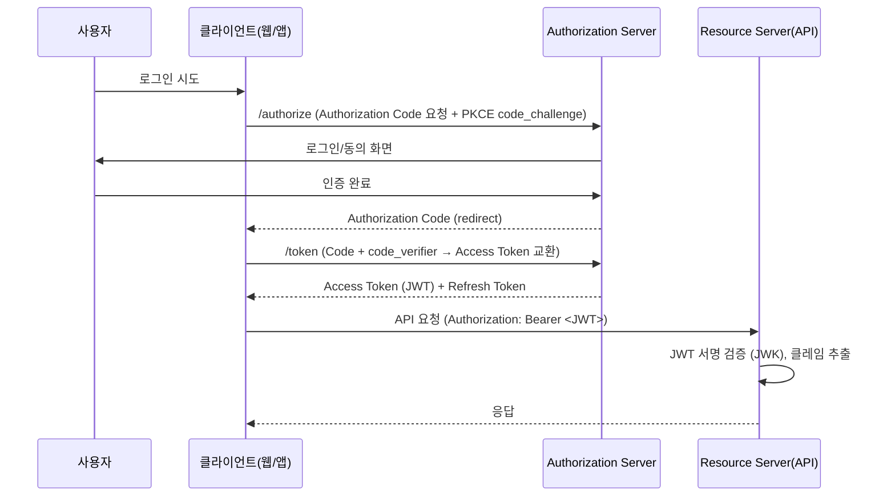

## 이 글에서 얻는 것

- OAuth2 **Authorization Code 흐름**을 실제 Spring Security 설정으로 연결할 수 있습니다.
- **JWT 발급/검증**을 Resource Server 설정으로 구현할 수 있습니다.
- 실무에서 자주 터지는 **토큰 저장/만료/리프레시 정책**의 함정을 예방할 수 있습니다.
- **Multi-tenant JWT 검증**, 커스텀 클레임 매핑, 테스트 전략까지 실전 구현을 다룹니다.

---

## 1) 전체 구조 한 장으로 이해하기


```mermaid
sequenceDiagram
    participant User as 사용자
    participant Client as 클라이언트(웹/앱)
    participant AS as Authorization Server
    participant RS as Resource Server(API)

    User->>Client: 로그인 시도
    Client->>AS: /authorize (Authorization Code 요청 + PKCE code_challenge)
    AS->>User: 로그인/동의 화면
    User->>AS: 인증 완료
    AS-->>Client: Authorization Code (redirect)
    Client->>AS: /token (Code + code_verifier → Access Token 교환)
    AS-->>Client: Access Token (JWT) + Refresh Token
    Client->>RS: API 요청 (Authorization: Bearer <JWT>)
    RS->>RS: JWT 서명 검증 (JWK), 클레임 추출
    RS-->>Client: 응답
```

핵심은 **Authorization Server(AS)에서 발급한 JWT를 Resource Server(RS)에서 검증**하는 구조입니다.

---

## 2) Authorization Server 구성 (Spring Authorization Server)

> 실제 운영에서는 AS와 RS를 **분리**하는 것이 일반적입니다.

### 2-1. 기본 클라이언트 등록

```java
@Configuration
public class AuthorizationServerConfig {

    @Bean
    public RegisteredClientRepository registeredClientRepository(PasswordEncoder encoder) {
        RegisteredClient webClient = RegisteredClient.withId(UUID.randomUUID().toString())
            .clientId("web-client")
            .clientSecret(encoder.encode("secret"))
            .authorizationGrantType(AuthorizationGrantType.AUTHORIZATION_CODE)
            .authorizationGrantType(AuthorizationGrantType.REFRESH_TOKEN)
            .authorizationGrantType(AuthorizationGrantType.CLIENT_CREDENTIALS)
            .redirectUri("https://app.example.com/login/oauth2/code")
            .redirectUri("http://localhost:3000/login/oauth2/code")  // 개발용
            .scope("read")
            .scope("write")
            .scope("admin")
            .clientSettings(ClientSettings.builder()
                .requireProofKey(true)                    // PKCE 강제
                .requireAuthorizationConsent(true)        // 동의 화면 표시
                .build())
            .tokenSettings(TokenSettings.builder()
                .accessTokenTimeToLive(Duration.ofMinutes(15))    // Access Token 15분
                .refreshTokenTimeToLive(Duration.ofDays(7))       // Refresh Token 7일
                .reuseRefreshTokens(false)                        // Rotation 활성화
                .idTokenSignatureAlgorithm(SignatureAlgorithm.RS256)
                .build())
            .build();

        return new InMemoryRegisteredClientRepository(webClient);
    }
}
```

### 2-2. JWT 커스텀 클레임 추가

토큰에 사용자 역할, 테넌트 정보 등 비즈니스 클레임을 추가하는 것은 실무에서 거의 필수입니다.

```java
@Component
public class CustomTokenCustomizer implements OAuth2TokenCustomizer<JwtEncodingContext> {

    private final UserRepository userRepository;

    public CustomTokenCustomizer(UserRepository userRepository) {
        this.userRepository = userRepository;
    }

    @Override
    public void customize(JwtEncodingContext context) {
        if (context.getTokenType().equals(OAuth2TokenType.ACCESS_TOKEN)) {
            Authentication principal = context.getPrincipal();
            String username = principal.getName();

            // DB에서 사용자 정보 조회
            User user = userRepository.findByUsername(username)
                .orElseThrow();

            context.getClaims().claims(claims -> {
                claims.put("user_id", user.getId());
                claims.put("roles", user.getRoles().stream()
                    .map(Role::getName)
                    .collect(Collectors.toList()));
                claims.put("tenant_id", user.getTenantId());

                // 민감 정보는 절대 넣지 않음
                // ❌ claims.put("email", user.getEmail());
                // ❌ claims.put("phone", user.getPhone());
            });
        }
    }
}
```

### 2-3. JWK 키 관리

```java
@Bean
public JWKSource<SecurityContext> jwkSource() {
    // 운영 환경: 키 저장소에서 로드 (Vault, KMS, HSM)
    // 개발 환경: 자동 생성
    KeyPair keyPair = generateRsaKey();
    RSAPublicKey publicKey = (RSAPublicKey) keyPair.getPublic();
    RSAPrivateKey privateKey = (RSAPrivateKey) keyPair.getPrivate();

    RSAKey rsaKey = new RSAKey.Builder(publicKey)
        .privateKey(privateKey)
        .keyID(UUID.randomUUID().toString())    // kid: 키 로테이션 시 구분용
        .build();

    JWKSet jwkSet = new JWKSet(rsaKey);
    return new ImmutableJWKSet<>(jwkSet);
}
```

> **키 로테이션 전략**: kid(Key ID)를 사용하여 새 키 발급 → 이전 키로 서명된 토큰도 검증 가능 → 이전 키 만료 후 제거. JWK 엔드포인트에 신/구 키를 동시에 노출합니다.

---

## 3) Resource Server에서 JWT 검증

### 3-1. 기본 설정

```java
@Configuration
@EnableMethodSecurity
public class ResourceServerConfig {

    @Bean
    public SecurityFilterChain apiFilterChain(HttpSecurity http) throws Exception {
        http
            .csrf(AbstractHttpConfigurer::disable)
            .sessionManagement(session ->
                session.sessionCreationPolicy(SessionCreationPolicy.STATELESS))
            .authorizeHttpRequests(auth -> auth
                .requestMatchers("/public/**", "/actuator/health/**").permitAll()
                .requestMatchers("/admin/**").hasRole("ADMIN")
                .requestMatchers("/api/**").authenticated()
                .anyRequest().denyAll()     // 명시되지 않은 경로는 차단
            )
            .oauth2ResourceServer(oauth2 -> oauth2
                .jwt(jwt -> jwt
                    .jwkSetUri("https://auth.example.com/.well-known/jwks.json")
                    .jwtAuthenticationConverter(jwtAuthenticationConverter())
                )
            );

        return http.build();
    }
}
```

### 3-2. JWT → Spring Security 권한 매핑

기본적으로 Spring Security는 `scope` 클레임만 `SCOPE_xxx` 권한으로 변환합니다. 커스텀 `roles` 클레임을 사용하려면 변환기가 필요합니다.

```java
@Bean
public JwtAuthenticationConverter jwtAuthenticationConverter() {
    JwtGrantedAuthoritiesConverter grantedAuthoritiesConverter =
        new JwtGrantedAuthoritiesConverter();
    grantedAuthoritiesConverter.setAuthoritiesClaimName("roles");
    grantedAuthoritiesConverter.setAuthorityPrefix("ROLE_");

    JwtAuthenticationConverter converter = new JwtAuthenticationConverter();
    converter.setJwtGrantedAuthoritiesConverter(jwt -> {
        // 1. roles 클레임 → ROLE_xxx
        Collection<GrantedAuthority> roleAuthorities =
            grantedAuthoritiesConverter.convert(jwt);

        // 2. scope 클레임 → SCOPE_xxx (기본 변환 유지)
        JwtGrantedAuthoritiesConverter scopeConverter =
            new JwtGrantedAuthoritiesConverter();
        Collection<GrantedAuthority> scopeAuthorities =
            scopeConverter.convert(jwt);

        // 3. 합치기
        List<GrantedAuthority> combined = new ArrayList<>();
        combined.addAll(roleAuthorities);
        combined.addAll(scopeAuthorities);

        return combined;
    });

    return converter;
}
```

### 3-3. 컨트롤러에서 JWT 정보 사용

```java
@RestController
@RequestMapping("/api/orders")
public class OrderController {

    @GetMapping
    @PreAuthorize("hasRole('USER') and #jwt.claims['tenant_id'] == #tenantId")
    public List<Order> getOrders(
            @AuthenticationPrincipal Jwt jwt,
            @RequestHeader("X-Tenant-Id") String tenantId) {

        String userId = jwt.getClaimAsString("user_id");
        String tokenTenantId = jwt.getClaimAsString("tenant_id");

        // 테넌트 검증 (Defense in Depth)
        if (!tokenTenantId.equals(tenantId)) {
            throw new AccessDeniedException("Tenant mismatch");
        }

        return orderService.findByTenantAndUser(tokenTenantId, userId);
    }

    @PostMapping
    @PreAuthorize("hasRole('USER') and hasAuthority('SCOPE_write')")
    public Order createOrder(@RequestBody CreateOrderRequest request,
                              @AuthenticationPrincipal Jwt jwt) {
        return orderService.create(request, jwt.getClaimAsString("user_id"));
    }
}
```

---

## 4) Multi-Tenant JWT 검증

여러 Authorization Server(또는 테넌트)에서 발급한 JWT를 하나의 Resource Server에서 검증해야 하는 상황.

### 4-1. Issuer 기반 동적 검증

```java
@Bean
public JwtDecoder jwtDecoder() {
    // 허용된 issuer 목록
    Map<String, String> issuerJwkUris = Map.of(
        "https://auth.tenant-a.com", "https://auth.tenant-a.com/.well-known/jwks.json",
        "https://auth.tenant-b.com", "https://auth.tenant-b.com/.well-known/jwks.json",
        "https://accounts.google.com", "https://www.googleapis.com/oauth2/v3/certs"
    );

    return new DelegatingJwtDecoder(issuerJwkUris);
}

/**
 * issuer별로 적절한 JwtDecoder를 선택하는 커스텀 디코더
 */
public class DelegatingJwtDecoder implements JwtDecoder {

    private final Map<String, JwtDecoder> decoders = new ConcurrentHashMap<>();
    private final Map<String, String> issuerJwkUris;

    public DelegatingJwtDecoder(Map<String, String> issuerJwkUris) {
        this.issuerJwkUris = issuerJwkUris;
    }

    @Override
    public Jwt decode(String token) throws JwtException {
        // 1. 서명 검증 없이 issuer만 추출 (헤더 + 페이로드는 Base64)
        String issuer = extractIssuer(token);

        // 2. 허용된 issuer인지 확인
        String jwkUri = issuerJwkUris.get(issuer);
        if (jwkUri == null) {
            throw new JwtException("Unknown issuer: " + issuer);
        }

        // 3. issuer별 JwtDecoder 캐싱 후 검증
        JwtDecoder decoder = decoders.computeIfAbsent(issuer,
            iss -> NimbusJwtDecoder.withJwkSetUri(jwkUri)
                .jwsAlgorithm(SignatureAlgorithm.RS256)
                .build());

        return decoder.decode(token);
    }

    private String extractIssuer(String token) {
        // JWT의 payload 부분만 Base64 디코딩하여 iss 추출
        String[] parts = token.split("\\.");
        if (parts.length != 3) throw new JwtException("Invalid JWT format");

        String payload = new String(Base64.getUrlDecoder().decode(parts[1]));
        // JSON 파싱하여 "iss" 필드 추출
        return JsonPath.read(payload, "$.iss");
    }
}
```

### 4-2. Spring Security 5.x+ 내장 멀티 이슈어 지원

```yaml
# application.yml — 더 간단한 방법 (Spring Boot 3.x)
spring:
  security:
    oauth2:
      resourceserver:
        jwt:
          issuer-uri: https://auth.example.com
          # 단일 issuer만 지원. 멀티 issuer는 위 DelegatingJwtDecoder 방식 권장.
```

---

## 5) Refresh Token 전략 심화

### 5-1. 저장 위치별 보안 비교

| 저장 위치 | XSS 방어 | CSRF 방어 | 탈취 난이도 | 권장 환경 |
|----------|---------|---------|-----------|----------|
| **HttpOnly Secure Cookie** | ✅ | ⚠️ SameSite 필요 | 높음 | 웹 (SPA, SSR) |
| **localStorage** | ❌ | ✅ | 낮음 (XSS 시 즉시 탈취) | 비권장 |
| **sessionStorage** | ❌ | ✅ | 중간 (탭 닫으면 삭제) | 비권장 |
| **Keychain/Keystore** | ✅ | ✅ | 매우 높음 | 네이티브 모바일 |
| **BFF(Backend For Frontend)** | ✅ | ✅ | 매우 높음 | 최선 (서버 측 토큰 관리) |

### 5-2. Refresh Token Rotation 구현

```java
@Service
@Transactional
public class TokenRotationService {

    private final RefreshTokenRepository tokenRepository;
    private final TokenBlacklistService blacklistService;

    /**
     * Refresh Token 사용 시:
     * 1. 기존 토큰 검증
     * 2. 기존 토큰 무효화
     * 3. 새 Access Token + 새 Refresh Token 발급
     */
    public TokenPair rotate(String refreshToken) {
        RefreshTokenEntity entity = tokenRepository
            .findByToken(refreshToken)
            .orElseThrow(() -> new InvalidTokenException("Token not found"));

        // 이미 사용된 토큰이 다시 들어옴 → 탈취 의심
        if (entity.isUsed()) {
            // 해당 사용자의 모든 Refresh Token 무효화 (Replay Attack 대응)
            tokenRepository.revokeAllByUserId(entity.getUserId());
            blacklistService.addToBlacklist(entity.getUserId());
            throw new SecurityException("Token reuse detected — all sessions revoked");
        }

        // 만료 확인
        if (entity.isExpired()) {
            throw new InvalidTokenException("Refresh token expired");
        }

        // 기존 토큰 사용 처리
        entity.markAsUsed();
        tokenRepository.save(entity);

        // 새 토큰 쌍 발급
        return issueNewTokens(entity.getUserId(), entity.getScopes());
    }
}
```

### 5-3. BFF(Backend For Frontend) 패턴 — 최선의 토큰 관리

```text
┌─────────────┐     ┌─────────────┐     ┌──────────────────┐
│   Browser   │────>│  BFF Server │────>│ Resource Server   │
│ (쿠키만 전송) │     │ (토큰 보관)  │     │ (JWT 검증)        │
└─────────────┘     └─────────────┘     └──────────────────┘

장점:
- 브라우저에 토큰이 노출되지 않음 (XSS 무력화)
- Refresh Token이 서버에만 존재
- CSRF는 SameSite + CSRF Token으로 방어

단점:
- BFF 서버 운영 비용
- 세션 관리 복잡도 증가
```

---

## 6) JWT 보안 강화 체크리스트

### 6-1. 클레임 설계 원칙

```json
{
  "iss": "https://auth.example.com",
  "sub": "user-abc-123",
  "aud": "https://api.example.com",
  "exp": 1710003600,
  "iat": 1710000000,
  "nbf": 1710000000,
  "jti": "unique-token-id-for-replay-detection",
  "roles": ["ROLE_USER"],
  "scope": "read write",
  "tenant_id": "tenant-xyz",
  "user_id": "user-abc-123"
}
```

**절대 넣지 말아야 할 것**:
- 이메일, 전화번호, 주소 (개인정보)
- 비밀번호 해시
- 내부 DB ID (외부 노출 가능한 식별자 사용)
- 과도한 권한 목록 (토큰 크기 증가 → 매 요청 헤더 비용)

### 6-2. 토큰 크기 관리

```text
JWT 크기 = Header(~36B) + Payload + Signature(~342B for RS256)

문제: 클레임이 많아지면 토큰이 커짐
     → 매 API 요청 헤더에 포함 → 대역폭 낭비
     → Nginx/ALB의 max_header_size 초과 가능 (기본 8KB)

권장:
- Access Token: 1KB 이하 유지
- 상세 정보는 /userinfo 엔드포인트로 분리
- 권한이 복잡하면 role → permission 매핑을 서버 측에서 수행
```

---

## 7) 테스트 전략

### 7-1. 단위 테스트 — JWT 모킹

```java
@WebMvcTest(OrderController.class)
class OrderControllerTest {

    @Autowired
    private MockMvc mockMvc;

    @MockBean
    private OrderService orderService;

    @Test
    @DisplayName("인증된 사용자가 주문 목록을 조회할 수 있다")
    void getOrders_authenticated_success() throws Exception {
        mockMvc.perform(get("/api/orders")
                .header("X-Tenant-Id", "tenant-xyz")
                .with(jwt()                                   // Spring Security Test
                    .jwt(builder -> builder
                        .claim("user_id", "user-123")
                        .claim("tenant_id", "tenant-xyz")
                        .claim("roles", List.of("ROLE_USER"))
                    )
                    .authorities(new SimpleGrantedAuthority("ROLE_USER"))
                ))
            .andExpect(status().isOk());
    }

    @Test
    @DisplayName("테넌트 불일치 시 403을 반환한다")
    void getOrders_tenantMismatch_forbidden() throws Exception {
        mockMvc.perform(get("/api/orders")
                .header("X-Tenant-Id", "tenant-other")
                .with(jwt()
                    .jwt(builder -> builder
                        .claim("user_id", "user-123")
                        .claim("tenant_id", "tenant-xyz")    // 토큰의 테넌트
                        .claim("roles", List.of("ROLE_USER"))
                    )
                    .authorities(new SimpleGrantedAuthority("ROLE_USER"))
                ))
            .andExpect(status().isForbidden());
    }

    @Test
    @DisplayName("인증 없이 요청하면 401을 반환한다")
    void getOrders_unauthenticated_401() throws Exception {
        mockMvc.perform(get("/api/orders")
                .header("X-Tenant-Id", "tenant-xyz"))
            .andExpect(status().isUnauthorized());
    }
}
```

### 7-2. 통합 테스트 — 실제 JWT 발급/검증 흐름

```java
@SpringBootTest(webEnvironment = SpringBootTest.WebEnvironment.RANDOM_PORT)
class OAuth2IntegrationTest {

    @Autowired
    private TestRestTemplate restTemplate;

    @Autowired
    private JwtEncoder jwtEncoder;

    @Test
    @DisplayName("실제 JWT로 API 호출이 성공한다")
    void fullFlow_withRealJwt() {
        // 1. 테스트용 JWT 생성
        JwtClaimsSet claims = JwtClaimsSet.builder()
            .issuer("https://auth.example.com")
            .subject("test-user")
            .audience(List.of("https://api.example.com"))
            .issuedAt(Instant.now())
            .expiresAt(Instant.now().plusSeconds(300))
            .claim("user_id", "user-123")
            .claim("roles", List.of("ROLE_USER"))
            .claim("tenant_id", "tenant-xyz")
            .build();

        String jwt = jwtEncoder.encode(
            JwtEncoderParameters.from(claims)).getTokenValue();

        // 2. API 호출
        HttpHeaders headers = new HttpHeaders();
        headers.setBearerAuth(jwt);
        headers.set("X-Tenant-Id", "tenant-xyz");

        ResponseEntity<String> response = restTemplate.exchange(
            "/api/orders", HttpMethod.GET,
            new HttpEntity<>(headers), String.class);

        assertThat(response.getStatusCode()).isEqualTo(HttpStatus.OK);
    }

    @Test
    @DisplayName("만료된 JWT로 요청하면 401이 반환된다")
    void expiredJwt_returns401() {
        JwtClaimsSet claims = JwtClaimsSet.builder()
            .issuer("https://auth.example.com")
            .subject("test-user")
            .issuedAt(Instant.now().minusSeconds(3600))
            .expiresAt(Instant.now().minusSeconds(1800))    // 이미 만료
            .build();

        String jwt = jwtEncoder.encode(
            JwtEncoderParameters.from(claims)).getTokenValue();

        HttpHeaders headers = new HttpHeaders();
        headers.setBearerAuth(jwt);

        ResponseEntity<String> response = restTemplate.exchange(
            "/api/orders", HttpMethod.GET,
            new HttpEntity<>(headers), String.class);

        assertThat(response.getStatusCode()).isEqualTo(HttpStatus.UNAUTHORIZED);
    }
}
```

### 7-3. 보안 테스트 체크리스트

```text
[ ] 만료된 토큰 → 401
[ ] 서명이 변조된 토큰 → 401
[ ] alg: "none" 공격 → 401 (Spring Security 기본 차단)
[ ] 다른 issuer의 토큰 → 401
[ ] scope 부족한 요청 → 403
[ ] 테넌트 불일치 → 403
[ ] ADMIN 전용 API에 USER 토큰 → 403
[ ] Refresh Token Replay → 전체 세션 무효화
[ ] 과도하게 큰 토큰 (> 8KB) → 413 또는 적절한 에러
```

---

## 8) 운영 모니터링과 장애 대응

### 8-1. JWT 관련 메트릭

```text
# 필수 모니터링 지표

jwt_validation_total{result="success"}     # JWT 검증 성공 수
jwt_validation_total{result="expired"}     # 만료 토큰 수
jwt_validation_total{result="invalid"}     # 서명 불일치/형식 오류
jwt_validation_total{result="unknown_issuer"}  # 알 수 없는 issuer

jwt_validation_duration_seconds{quantile="0.99"}  # 검증 소요 시간

refresh_token_rotation_total{result="success"}
refresh_token_rotation_total{result="replay_detected"}  # 탈취 의심
```

### 8-2. 흔한 장애 시나리오와 대응

| 장애 | 증상 | 원인 | 대응 |
|------|------|------|------|
| JWT 검증 실패 급증 | 401 폭발 | JWK 캐시 만료 + AS 다운 | JWK 캐시 TTL 연장, 로컬 fallback 키 |
| 만료 오류 급증 | 401 증가 (exp 관련) | 서버/클라이언트 NTP 불일치 | NTP 동기화, `clockSkew` 허용 설정 |
| 로그아웃 후 접근 가능 | 보안 이슈 | Access Token 만료가 김 | 만료 5~15분으로 단축 |
| 토큰 너무 큼 | Nginx 502 | 클레임 과다 | 클레임 정리, /userinfo 분리 |
| 키 로테이션 장애 | 모든 JWT 검증 실패 | 새 키만 JWK에 노출, 구 키 제거 | 신구 키 동시 노출 후 점진 제거 |

### 8-3. JWK 캐시 설정

```java
@Bean
public JwtDecoder jwtDecoder() {
    NimbusJwtDecoder decoder = NimbusJwtDecoder
        .withJwkSetUri("https://auth.example.com/.well-known/jwks.json")
        .jwsAlgorithm(SignatureAlgorithm.RS256)
        .build();

    // 시계 오차 허용 (NTP 미세 차이 대응)
    OAuth2TokenValidator<Jwt> withClockSkew = new DelegatingOAuth2TokenValidator<>(
        new JwtTimestampValidator(Duration.ofSeconds(30)),    // 30초 허용
        new JwtIssuerValidator("https://auth.example.com")
    );
    decoder.setJwtValidator(withClockSkew);

    return decoder;
}
```

---

## 9) 보안 강화: 추가 방어 계층

### 9-1. Token Binding (DPoP — Demonstrating Proof-of-Possession)

```text
일반 Bearer Token:
  - 탈취 시 누구나 사용 가능 (Bearer = 소지자)

DPoP Token:
  - 토큰 + 클라이언트 키 증명이 함께 필요
  - 탈취해도 키 없이는 사용 불가

DPoP 헤더 예시:
  Authorization: DPoP <access_token>
  DPoP: <proof_jwt_signed_with_client_key>

지원: Spring Authorization Server 1.2+, OAuth 2.0 DPoP (RFC 9449)
```

### 9-2. Audience 검증 강화

```java
// Resource Server별 audience 검증
OAuth2TokenValidator<Jwt> audienceValidator = jwt -> {
    List<String> audiences = jwt.getAudience();
    if (audiences == null || !audiences.contains("https://api.example.com")) {
        return OAuth2TokenValidatorResult.failure(
            new OAuth2Error("invalid_audience", "Token not intended for this API", null));
    }
    return OAuth2TokenValidatorResult.success();
};
```

---

## ✅ 운영 체크리스트

- [ ] Access Token 만료 시간 ≤ 15분
- [ ] Refresh Token Rotation 활성화 (`reuseRefreshTokens(false)`)
- [ ] Refresh Token 재사용 감지 → 전체 세션 무효화 로직 구현
- [ ] JWK 엔드포인트 가용성 모니터링 + 캐시 TTL 설정
- [ ] 키 로테이션 시 신구 키 동시 노출 확인
- [ ] JWT 클레임에 개인정보 미포함 확인
- [ ] 토큰 크기 1KB 이하 유지
- [ ] Clock Skew 허용 설정 (30초 권장)
- [ ] `alg: none` 공격 차단 확인 (Spring Security 기본 차단)
- [ ] Audience(aud) 검증 활성화
- [ ] 웹: HttpOnly Secure SameSite Cookie로 Refresh Token 저장
- [ ] jwt_validation_total 메트릭 대시보드 구성
- [ ] Replay Attack 탐지 알람 설정
- [ ] 보안 테스트(만료/변조/scope부족/issuer불일치) 자동화

---

## 요약

- OAuth2의 핵심은 **Authorization Server 발급 + Resource Server 검증** 분리
- JWT는 **짧은 만료(15분) + Refresh Token Rotation**이 기본 전략
- **커스텀 클레임**은 비즈니스 식별자만 최소로, 민감정보 절대 포함 금지
- **Multi-tenant** 환경에서는 issuer 기반 동적 검증 또는 DelegatingJwtDecoder 사용
- **테스트**: `@WithMockUser` 대신 `jwt()` 모킹으로 실전에 가까운 테스트
- **BFF 패턴**이 브라우저 환경에서 가장 안전한 토큰 관리 방식

---

## 관련 글

- [Spring Security 아키텍처 심층 분석](/learning/deep-dive/deep-dive-spring-security-architecture/)
- [Spring Security 기초](/learning/deep-dive/deep-dive-spring-security/)
- [OAuth2/OIDC 인증 설계](/learning/deep-dive/deep-dive-oauth2-oidc/)
- [OAuth2 소셜 로그인](/learning/deep-dive/deep-dive-oauth2-social-login/)
- [JWT 인증 패턴](/learning/deep-dive/deep-dive-jwt-auth/)
- [OWASP Top 10 체크리스트](/learning/deep-dive/deep-dive-owasp-top10-checklist/)
- [CORS/CSRF/보안 헤더](/learning/deep-dive/deep-dive-security-cors-csrf-headers/)
- [Secret Management](/learning/deep-dive/deep-dive-secret-management/)
