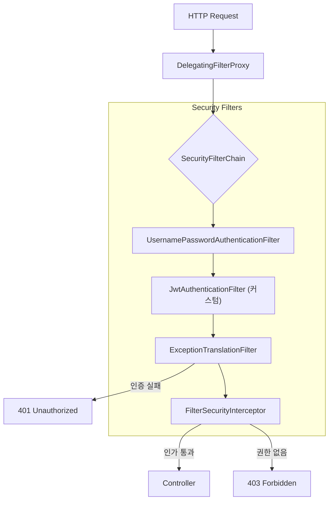

## 🛡️ 1. 문지기들의 줄서기 (Filter Chain)

> [!NOTE]
> **Spring Security의 핵심**: 마치 공항 검색대처럼, 요청이 들어오면 일렬로 늘어선 **필터(검문소)**들을 차례대로 통과해야 합니다. 하나라도 통과 못하면 바로 "입구 컷" 당합니다.

Spring Security는 거대한 **필터들의 체인**입니다.
요청이 Controller에 도착하기 전에 수많은 검문소를 통과해야 합니다.



1. **UsernamePassword...**: 폼 로그인 처리.
2. **FilterSecurityInterceptor**: 맨 마지막에 위치. "이 URL에 접근 권한이 있어?" 검사.
3. **ExceptionTranslation...**: 예외를 잡아서 로그인 페이지로 보내거나 401을 줍니다.

---

## 🎫 2. 인증(Authentication) vs 인가(Authorization)

가장 헷갈리는 두 개념, 표로 정리해 드립니다.

| 구분 | 영어 | 질문 | 예시 | 담당 필터 |
| :--- | :--- | :--- | :--- | :--- |
| **인증** | **Authentication** | "너 누구야?" (신원 확인) | 로그인, ID/PW, OTP | `UsernamePasswordAuthenticationFilter` |
| **인가** | **Authorization** | "너 이거 할 수 있어?" (권한 부여) | 관리자 페이지 접근, 게시글 수정 | `FilterSecurityInterceptor` |

> [!TIP]
> **쉽게 외우는 법**:
> - **인증(Authentication)**: 출입증 찍고 회사 건물 들어오기 (내가 직원임을 증명)
> - **인가(Authorization)**: CEO 집무실 들어가기 (권한이 있어야 가능)

---

## 🔑 3. JWT 커스텀 필터 끼워넣기

JWT를 쓰려면 기본 폼 로그인을 끄고, 우리만의 필터를 끼워넣어야 합니다.

```java
@Bean
public SecurityFilterChain filterChain(HttpSecurity http) {
    http
        .csrf(AbstractHttpConfigurer::disable) // JWT는 CSRF 안전 (보통)
        .sessionManagement(s -> s.sessionCreationPolicy(STATELESS)) // 세션 끄기
        .addFilterBefore(new JwtFilter(tokenProvider), UsernamePasswordAuthenticationFilter.class); 
        // 👆 기본 로그인 필터보다 "앞에" 배치!
        
    return http.build();
}
```

**JwtFilter의 역할 프로세스**:

1. **Header Check**: 요청 헤더에서 `Authorization: Bearer <Token>`을 찾습니다.
2. **Validate**: 토큰이 위변조되지 않았는지, 만료되지 않았는지 검증합니다.
3. **Authentication**: 유효하다면 `Authentication` 객체(신분증)를 만들어 `SecurityContext`(보관함)에 넣습니다.
    - 👉 **비로소 Spring Security가 "이 사람은 로그인 된 사용자"라고 인지하게 됩니다.**

## 요약

1. **필터 기반**: Spring Security는 서블릿 필터 위에서 동작한다.
2. **순서 중요**: 커스텀 필터(JWT 등)를 적절한 위치(`addFilterBefore`)에 넣는 것이 핵심이다.
3. **Context**: 인증된 정보는 스레드 로컬인 `SecurityContext`에 저장되어 전역에서 쓰인다.
