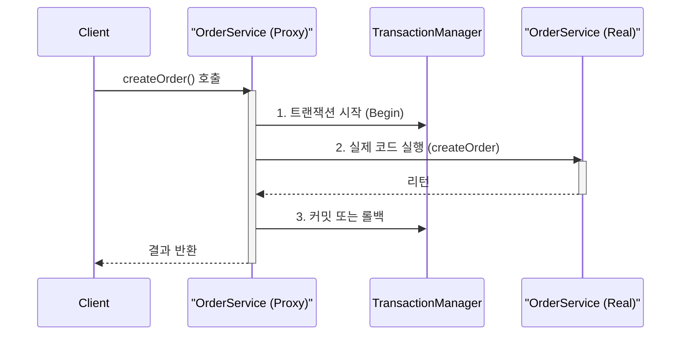
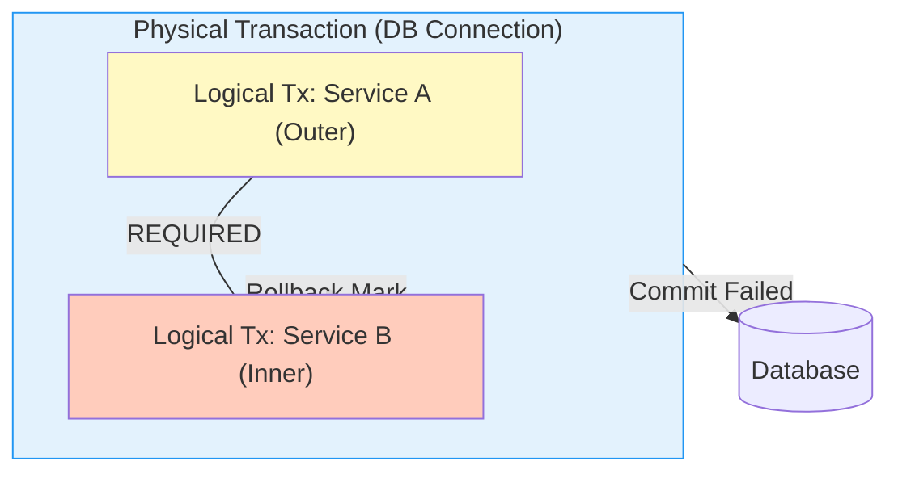

## 🎭 1. 마법의 애노테이션 @Transactional

`@Transactional`만 붙이면 DB 커넥션을 열고, 닫고, 커밋하고, 롤백하는 코드가 사라집니다.
이 마법은 **AOP 프록시(Proxy)** 덕분입니다.

### 프록시의 거짓말

여러분이 만든 `OrderService` 빈(Bean)은 사실 가짜(Proxy)입니다.



> ⚠️ **함정 1 (Self-Invocation)**: 자기 자신의 메소드를 내부 호출(this.method())하면 **프록시를 거치지 않습니다.** 그래서 트랜잭션이 적용되지 않습니다.

---

## 🌊 2. 전파 속성 (Propagation)

트랜잭션이 진행 중인데 또 트랜잭션을 만나면 어떻게 할까요?

### REQUIRED (기본값) vs REQUIRES_NEW

```mermaid
graph TD
    subgraph REQUIRED [Case A: REQUIRED (Default)]
    TX1[트랜잭션 1] ---|참여| TX2((Service B))
    TX2 -.->|예외 발생| Rollback[전체 롤백]
    end
    
    subgraph REQUIRES_NEW [Case B: REQUIRES_NEW]
    TX_A[트랜잭션 A] -.->|일시 정지| TX_B((New Tx))
    TX_B -->|성공| Commit_B[B만 커밋]
    TX_B -.->|실패| Rolback_B[B만 롤백]
    TX_A -->|재개| Commit_A[A는 계속 진행]
    end
```

- **REQUIRED**: "우린 한 배를 탔어." 자식에서 에러 나면 부모도 롤백됩니다.
- **REQUIRES_NEW**: "너는 너, 나는 나." 자식이 죽어도 부모는 살릴 수 있습니다. (예: 감사 로그 저장)

### Physical vs Logical Transaction

스프링은 **논리 트랜잭션**이라는 개념을 사용하여 트랜잭션 전파를 처리합니다.



- **ALL OR NOTHING**: 논리 트랜잭션 중 **하나라도 롤백**되면, 물리 트랜잭션 전체가 롤백됩니다. (자식이 롤백 마크를 찍으면 부모가 커밋하려 해도 `UnexpectedRollbackException` 발생)

---

## 🛡️ 3. 격리 수준 (Isolation Level)

동시에 여러 요청이 들어올 때 데이터 정합성을 어디까지 지킬 것인가?

- **READ COMMITTED**: 커밋된 데이터만 읽는다. (가장 많이 씀)
- **REPEATABLE READ**: 트랜잭션 내내 같은 데이터를 읽는다. (MySQL 기본)
- **SERIALIZABLE**: 한 줄로 세운다. (성능 최악 but 안전 최고)

### Isolation Level Comparison

| Level | Dirty Read | Non-Repeatable Read | Phantom Read | 성능 |
| :--- | :---: | :---: | :---: | :---: |
| **READ UNCOMMITTED** | O | O | O | 최상 (위험) |
| **READ COMMITTED** | X | O | O | 좋음 (표준) |
| **REPEATABLE READ** | X | X | O (InnoDB는 방지) | 보통 |
| **SERIALIZABLE** | X | X | X | 낮음 (Safe) |

> **Dirty Read**: 남이 커밋 안 한 똥(Dirty Data)을 읽음.
> **Phantom Read**: 아까는 없었는데 다시 조회를 하니 귀신(Phantom)처럼 데이터가 생김.

## 🚨 4. 실전 함정 TOP 3

1. **Checked Exception은 롤백 안 됨**: 기본적으로 `RuntimeException`만 롤백합니다.
    - 해결: `@Transactional(rollbackFor = Exception.class)`
2. **Private 메소드**: 프록시는 `public` 메소드만 오버라이딩 가능합니다. `private`에는 걸어도 무시됩니다.
3. **트랜잭션 범위**: 너무 길게 잡지 마세요. DB 커넥션을 오래 물고 있으면 전체 장애로 이어집니다.

## 요약

> [!TIP]
> **@Transactional Checklist**:
> - [ ] **Public Method**: `private`, `protected`에는 걸어도 작동 안 함.
> - [ ] **Self-Invocation**: 내부 호출(`this.method()`)은 프록시를 안 거침 -> 트랜잭션 적용 X.
> - [ ] **Exception**: `Checked Exception`(Ex. `IOException`)은 롤백 안 됨. `rollbackFor` 설정 필수.
> - [ ] **Transaction Scope**: 트랜잭션은 최대한 짧게. (외부 API 호출은 트랜잭션 밖으로 빼라)

1. **Proxy**: `@Transactional`은 AOP 프록시로 동작한다. (Self-invocation 조심)
2. **Propagation**: `REQUIRED`는 한 팀, `REQUIRES_NEW`는 별개 팀.
3. **Rollback**: 언체크 예외(RuntimeException)만 롤백된다. 체크 예외는 옵션 추가 필요.
