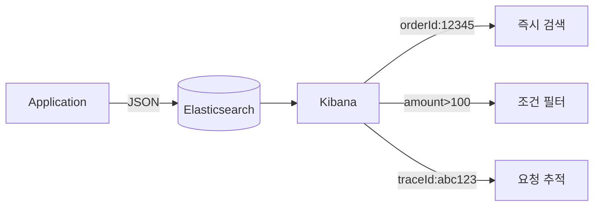
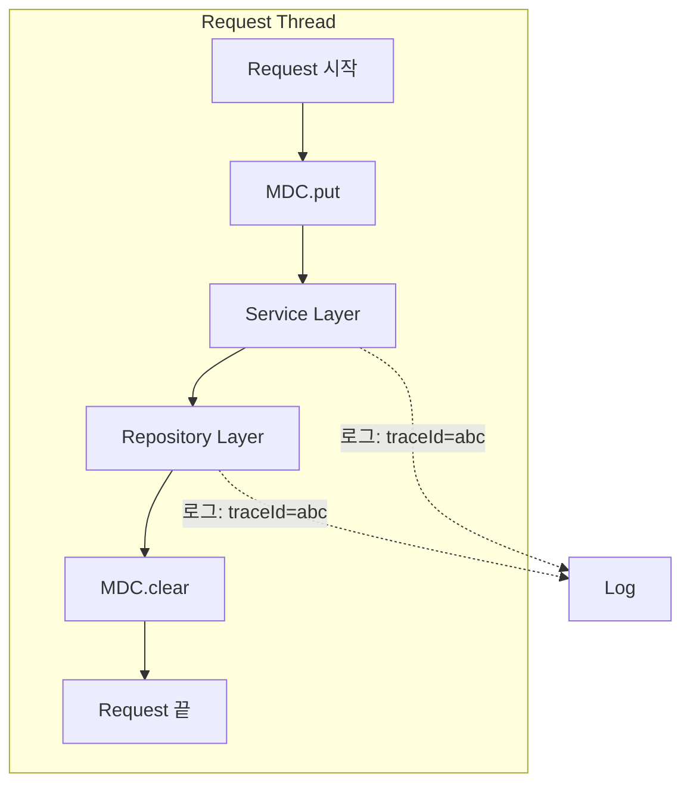
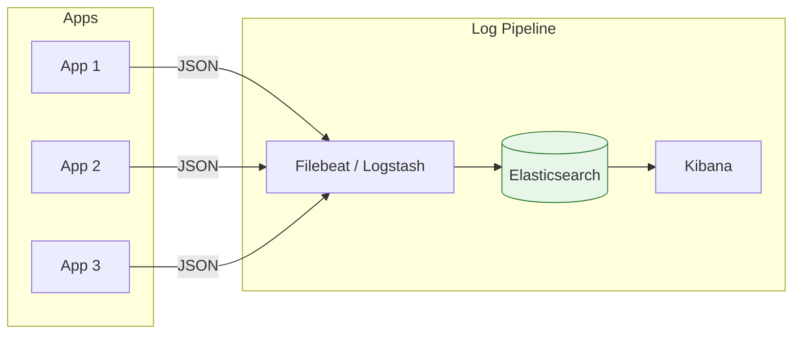

## 이 글에서 얻는 것

- **구조화 로깅**(JSON)이 왜 필요한지 이해합니다
- **MDC**로 요청 컨텍스트를 로그에 포함하는 방법을 알아봅니다
- **로그 레벨 전략**과 실무 베스트 프랙티스를 익힙니다

---

## 왜 구조화 로깅인가?

### 기존 텍스트 로그의 문제

```
// ❌ 파싱 어려움
2024-01-15 10:23:45.123 INFO OrderService - User john@example.com placed order #12345 for $99.99

// 검색하려면?
grep "order #12345" app.log  // 정규식 필요
grep "john@example.com" app.log | grep "placed order"  // 복잡
```

### 구조화 로깅 (JSON)

```json
{
  "timestamp": "2024-01-15T10:23:45.123Z",
  "level": "INFO",
  "logger": "OrderService",
  "message": "Order placed",
  "userId": "user-123",
  "email": "john@example.com",
  "orderId": "12345",
  "amount": 99.99,
  "traceId": "abc123",
  "spanId": "def456"
}
```


```mermaid
flowchart LR
    App[Application] -->|JSON| ES[(Elasticsearch)]
    ES --> Kibana[Kibana]
    
    Kibana -->|"orderId:12345"| R1[즉시 검색]
    Kibana -->|"amount>100"| R2[조건 필터]
    Kibana -->|"traceId:abc123"| R3[요청 추적]
```

---

## Spring Boot + Logback JSON 설정

### 의존성 추가

```xml
<!-- pom.xml -->
<dependency>
    <groupId>net.logstash.logback</groupId>
    <artifactId>logstash-logback-encoder</artifactId>
    <version>7.4</version>
</dependency>
```

### logback-spring.xml

```xml
<?xml version="1.0" encoding="UTF-8"?>
<configuration>
    <appender name="JSON_CONSOLE" class="ch.qos.logback.core.ConsoleAppender">
        <encoder class="net.logstash.logback.encoder.LogstashEncoder">
            <!-- 기본 필드 커스터마이징 -->
            <fieldNames>
                <timestamp>timestamp</timestamp>
                <version>[ignore]</version>
            </fieldNames>
            
            <!-- 커스텀 필드 추가 -->
            <customFields>{"service":"order-service","environment":"production"}</customFields>
            
            <!-- MDC 필드 포함 -->
            <includeMdcKeyName>traceId</includeMdcKeyName>
            <includeMdcKeyName>userId</includeMdcKeyName>
        </encoder>
    </appender>
    
    <root level="INFO">
        <appender-ref ref="JSON_CONSOLE"/>
    </root>
</configuration>
```

### 로그 출력

```java
log.info("Order placed successfully");
```

```json
{
  "timestamp": "2024-01-15T10:23:45.123Z",
  "level": "INFO",
  "logger_name": "com.example.OrderService",
  "message": "Order placed successfully",
  "service": "order-service",
  "environment": "production",
  "traceId": "abc123",
  "userId": "user-456"
}
```

---

## MDC (Mapped Diagnostic Context)

### 개념


```mermaid
flowchart TB
    subgraph "Request Thread"
        R[Request 시작] --> M1[MDC.put]
        M1 --> S1[Service Layer]
        S1 --> S2[Repository Layer]
        S2 --> M2[MDC.clear]
        M2 --> E[Request 끝]
    end
    
    S1 -.->|"로그: traceId=abc"| L[Log]
    S2 -.->|"로그: traceId=abc"| L
```

**MDC**: ThreadLocal 기반으로 스레드 전체에 컨텍스트 전파

### Filter로 MDC 설정

```java
@Component
public class LoggingFilter extends OncePerRequestFilter {
    
    @Override
    protected void doFilterInternal(
            HttpServletRequest request,
            HttpServletResponse response,
            FilterChain filterChain) throws ServletException, IOException {
        
        try {
            // 요청 시작 시 MDC 설정
            String traceId = request.getHeader("X-Trace-Id");
            if (traceId == null) {
                traceId = UUID.randomUUID().toString();
            }
            
            MDC.put("traceId", traceId);
            MDC.put("requestUri", request.getRequestURI());
            MDC.put("method", request.getMethod());
            MDC.put("clientIp", getClientIp(request));
            
            // 응답 헤더에도 traceId 포함
            response.setHeader("X-Trace-Id", traceId);
            
            filterChain.doFilter(request, response);
            
        } finally {
            // 요청 끝나면 MDC 클리어 (메모리 누수 방지)
            MDC.clear();
        }
    }
    
    private String getClientIp(HttpServletRequest request) {
        String xForwardedFor = request.getHeader("X-Forwarded-For");
        if (xForwardedFor != null) {
            return xForwardedFor.split(",")[0].trim();
        }
        return request.getRemoteAddr();
    }
}
```

### 인증 후 사용자 정보 추가

```java
@Component
public class UserContextFilter extends OncePerRequestFilter {
    
    @Override
    protected void doFilterInternal(
            HttpServletRequest request,
            HttpServletResponse response,
            FilterChain filterChain) throws ServletException, IOException {
        
        Authentication auth = SecurityContextHolder.getContext().getAuthentication();
        
        if (auth != null && auth.isAuthenticated()) {
            MDC.put("userId", auth.getName());
            MDC.put("roles", auth.getAuthorities().toString());
        }
        
        try {
            filterChain.doFilter(request, response);
        } finally {
            MDC.remove("userId");
            MDC.remove("roles");
        }
    }
}
```

### 비동기 처리 시 MDC 전파

```java
// ❌ @Async는 새 스레드 → MDC 손실
@Async
public void processAsync() {
    log.info("Processing...");  // traceId 없음!
}

// ✅ MDC 복사해서 전달
@Configuration
public class AsyncConfig implements AsyncConfigurer {
    
    @Override
    public Executor getAsyncExecutor() {
        ThreadPoolTaskExecutor executor = new ThreadPoolTaskExecutor();
        executor.setCorePoolSize(10);
        executor.setMaxPoolSize(100);
        executor.setTaskDecorator(new MdcTaskDecorator());  // MDC 전파
        executor.initialize();
        return executor;
    }
}

public class MdcTaskDecorator implements TaskDecorator {
    
    @Override
    public Runnable decorate(Runnable runnable) {
        Map<String, String> contextMap = MDC.getCopyOfContextMap();
        
        return () -> {
            try {
                if (contextMap != null) {
                    MDC.setContextMap(contextMap);
                }
                runnable.run();
            } finally {
                MDC.clear();
            }
        };
    }
}
```

---

## 로그 레벨 전략

### 레벨별 용도

| 레벨 | 용도 | 예시 |
|------|-----|------|
| **ERROR** | 즉시 대응 필요 | DB 연결 실패, 외부 API 장애 |
| **WARN** | 잠재적 문제 | 재시도 발생, 임계값 근접 |
| **INFO** | 비즈니스 이벤트 | 주문 생성, 결제 완료 |
| **DEBUG** | 개발/디버깅 | 쿼리 파라미터, 중간 결과 |
| **TRACE** | 상세 추적 | 메서드 진입/종료, 루프 내부 |

### 실무 가이드라인

```java
@Service
@Slf4j
public class OrderService {
    
    public Order createOrder(OrderRequest request) {
        // INFO: 비즈니스 이벤트 시작
        log.info("Creating order for user: {}", request.getUserId());
        
        try {
            // DEBUG: 상세 정보
            log.debug("Order details: items={}, totalAmount={}", 
                request.getItems().size(), request.getTotalAmount());
            
            Order order = orderRepository.save(new Order(request));
            
            // INFO: 비즈니스 이벤트 완료
            log.info("Order created successfully: orderId={}", order.getId());
            
            return order;
            
        } catch (InsufficientStockException e) {
            // WARN: 비즈니스 예외 (복구 가능)
            log.warn("Insufficient stock for order: userId={}, items={}", 
                request.getUserId(), request.getItems());
            throw e;
            
        } catch (Exception e) {
            // ERROR: 시스템 예외 (조치 필요)
            log.error("Failed to create order: userId={}, error={}", 
                request.getUserId(), e.getMessage(), e);
            throw new OrderCreationException("Order creation failed", e);
        }
    }
}
```

### ❌ 안티 패턴

```java
// ❌ 민감 정보 로깅
log.info("User login: email={}, password={}", email, password);

// ❌ 무의미한 로그
log.info("Method started");
log.info("Method ended");

// ❌ 문자열 연결 (성능 저하)
log.debug("Processing order: " + order.toString());

// ❌ 조건문 없이 비싼 연산
log.debug("Order details: {}", expensiveToString(order));
```

### ✅ 베스트 프랙티스

```java
// ✅ 민감 정보 마스킹
log.info("User login: email={}", maskEmail(email));

// ✅ 의미 있는 이벤트만
log.info("Order placed: orderId={}, userId={}, amount={}", 
    order.getId(), order.getUserId(), order.getAmount());

// ✅ 파라미터 바인딩 (lazy evaluation)
log.debug("Processing order: {}", order);

// ✅ 레벨 체크 후 비싼 연산
if (log.isDebugEnabled()) {
    log.debug("Order details: {}", expensiveToString(order));
}
```

---

## ELK 연동

### 아키텍처


```mermaid
flowchart LR
    subgraph Apps
        A1[App 1]
        A2[App 2]
        A3[App 3]
    end
    
    subgraph "Log Pipeline"
        FB[Filebeat / Logstash]
        ES[(Elasticsearch)]
        K[Kibana]
    end
    
    A1 -->|JSON| FB
    A2 -->|JSON| FB
    A3 -->|JSON| FB
    
    FB --> ES
    ES --> K
    
    style ES fill:#e8f5e9,stroke:#2e7d32
```

### Filebeat 설정

```yaml
# filebeat.yml
filebeat.inputs:
  - type: container
    paths:
      - /var/log/containers/*.log
    processors:
      - decode_json_fields:
          fields: ["message"]
          target: ""
          overwrite_keys: true

output.elasticsearch:
  hosts: ["elasticsearch:9200"]
  index: "app-logs-%{+yyyy.MM.dd}"
```

### Kibana 검색 예시

```
# 특정 주문 추적
orderId: "12345"

# 에러만 필터
level: "ERROR" AND service: "order-service"

# 특정 사용자의 모든 요청
userId: "user-456" AND level: ("INFO" OR "ERROR")

# 지난 1시간 내 느린 요청
responseTime: >1000 AND @timestamp: [now-1h TO now]
```

---

## 운영 적용 순서

구조화 로깅을 도입할 때는 "라이브러리를 넣고 JSON으로 출력한다"에서 멈추기 쉽습니다. 하지만 운영에서 실제로 차이를 만드는 부분은 **어떤 필드를 항상 남길지, 어떤 값은 절대 남기지 않을지, 장애 때 어떤 순서로 검색할지**를 정하는 일입니다. 아래 순서로 작게 시작하면 로그 저장 비용과 민감정보 리스크를 키우지 않으면서 분석 시간을 줄일 수 있습니다.

### 1) 필수 필드 계약부터 고정하기

서비스마다 필드명이 다르면 로그 저장소에 데이터가 모여도 검색이 어렵습니다. `traceId`, `requestId`, `userId`, `orderId`가 어떤 서비스에서는 `trace_id`, `reqId`, `memberNo`, `order_no`로 섞이면 장애 중에 쿼리를 다시 만들게 됩니다. 그래서 먼저 팀 공통 필드를 정하고, 각 서비스가 그 계약을 지키는지 보는 편이 좋습니다.

권장하는 최소 필드는 이 정도입니다.

| 필드 | 목적 | 주의점 |
|------|------|--------|
| `service` | 어느 서비스의 로그인지 구분 | 배포 단위와 이름을 맞춥니다 |
| `environment` | prod/stage/local 분리 | 운영 알람은 prod만 대상으로 제한합니다 |
| `traceId` | 요청 전체 흐름 연결 | HTTP/gRPC/메시지 경계를 넘을 때 유지합니다 |
| `requestId` | 단일 진입 요청 추적 | 프록시나 API Gateway 값과 충돌하지 않게 정합니다 |
| `errorCode` | 실패 유형 집계 | 예외 클래스명만 쓰면 비즈니스 분류가 약해집니다 |
| `domainId` | 주문/결제/계정 같은 핵심 객체 추적 | 원문 개인정보 대신 내부 ID를 씁니다 |

이 필드는 모든 로그에 억지로 넣기보다, **요청 시작/완료, 외부 호출 실패, 상태 변경, 예외 처리**처럼 분석 가치가 큰 지점에 안정적으로 남기는 것이 중요합니다.

### 2) 금지 필드와 마스킹 규칙을 먼저 정하기

로그는 한 번 수집되면 검색 인덱스, 백업, 외부 모니터링 도구까지 복제될 수 있습니다. 그래서 "문제가 생기면 나중에 지우자"는 방식은 위험합니다. 설계 단계에서 금지 필드를 코드 리뷰 기준으로 두는 것이 안전합니다.

- 비밀번호, 세션 토큰, API key, refresh token
- 주민번호, 카드번호, 계좌번호, 전화번호, 상세 주소
- email 원문, free-text 입력값, 파일 본문
- 전체 SQL 파라미터, Authorization 헤더, Cookie 헤더
- 사용자별로 무한히 늘어나는 값을 메트릭 label처럼 쓰는 패턴

운영에서는 마스킹을 두 겹으로 두는 편이 좋습니다. 애플리케이션에서 한 번 마스킹하고, 로그 수집 파이프라인에서 다시 한 번 정규식 기반 마스킹을 겁니다. 애플리케이션 코드가 누락되어도 수집 단계에서 한 번 더 막을 수 있기 때문입니다.

### 3) 비동기 경계를 테스트 케이스로 만들기

MDC는 ThreadLocal 기반이라 동기 요청 흐름에서는 편하지만, `@Async`, scheduler, message listener, custom executor를 만나면 끊어질 수 있습니다. 특히 장애 분석에서 중요한 작업일수록 비동기 경계를 지나가는 경우가 많습니다. 주문 생성 후 결제 이벤트 발행, 재고 차감, 알림 발송 같은 흐름이 대표적입니다.

테스트는 거창할 필요가 없습니다.

1. HTTP 요청에 `X-Trace-Id`를 넣는다.
2. 컨트롤러, 서비스, 비동기 작업, 메시지 발행 로그를 남긴다.
3. 같은 `traceId`로 네 지점이 모두 검색되는지 확인한다.
4. 요청 종료 후 다음 요청에 이전 MDC 값이 섞이지 않는지 확인한다.

마지막 4번이 중요합니다. 전파만 하고 정리하지 않으면 스레드풀 재사용 때문에 다른 사용자의 컨텍스트가 다음 로그에 섞일 수 있습니다. 이 문제는 재현 빈도가 낮아도 발생하면 분석을 크게 오염시킵니다.

### 4) 로그 검색 쿼리를 런북에 붙이기

구조화 로깅의 목적은 장애 중에 "어디부터 볼지"를 줄이는 것입니다. 그래서 글이나 코드 설정만 남기지 말고, 서비스 런북에 바로 복사해 쓸 검색 쿼리를 넣어두면 좋습니다.

예를 들어 주문 API라면 아래처럼 시작할 수 있습니다.

```text
service:"order-service" AND traceId:"<trace-id>"
service:"order-service" AND errorCode:"PAYMENT_TIMEOUT" AND @timestamp:[now-30m TO now]
service:"order-service" AND orderId:"<order-id>" AND level:("WARN" OR "ERROR")
service:"order-service" AND message:"fallback" AND @timestamp:[now-1h TO now]
```

이 쿼리는 [알람 전략](/learning/deep-dive/deep-dive-observability-alarms/)과도 연결됩니다. 알람이 울렸을 때 바로 열 첫 화면이 없으면 온콜은 대시보드와 로그 저장소 사이를 헤매게 됩니다. 반대로 알람 annotation에 런북 URL과 대표 로그 쿼리가 붙어 있으면 첫 5분의 품질이 좋아집니다.

### 5) 운영 지표로 도입 효과 확인하기

구조화 로깅도 도입 비용이 있습니다. 로그 저장 비용이 늘고, 필드 계약을 유지해야 하며, 민감정보 관리도 필요합니다. 그래서 도입 후에는 "좋아졌을 것"이 아니라 숫자로 확인하는 편이 좋습니다.

- 최근 장애/문의에서 원인 후보를 좁히는 데 걸린 시간
- traceId 또는 requestId 누락률
- ERROR 로그 중 실제 알람/조치로 이어진 비율
- 민감정보 마스킹 테스트 통과 여부
- 로그 저장량과 인덱스 비용 변화

이 숫자를 보면 다음 개선 방향도 자연스럽게 보입니다. 누락률이 높으면 MDC 전파와 gateway 헤더 처리가 우선이고, ERROR 로그가 너무 많으면 레벨 정책을 손봐야 합니다. 저장 비용이 튀면 payload 전체를 남기던 로그나 고카디널리티 필드를 줄여야 합니다.

---

## 요약

### 구조화 로깅 체크리스트

| 항목 | 권장 |
|------|-----|
| 포맷 | JSON (logstash-logback-encoder) |
| 컨텍스트 | MDC로 traceId, userId 포함 |
| 비동기 | TaskDecorator로 MDC 전파 |
| 레벨 | ERROR/WARN/INFO 구분 명확히 |
| 민감정보 | 마스킹 처리 |

### 핵심 필드

| 필드 | 용도 |
|------|-----|
| `traceId` | 요청 추적 |
| `userId` | 사용자별 분석 |
| `orderId` 등 | 비즈니스 키 |
| `responseTime` | 성능 모니터링 |
| `errorCode` | 에러 분류 |

---

## 🔗 Related Deep Dive

- **[분산 트레이싱](/learning/deep-dive/deep-dive-distributed-tracing-advanced/)**: Trace Context 전파.
- **[ELK Stack](/learning/deep-dive/deep-dive-elk-stack/)**: Elasticsearch 쿼리와 시각화.
- **[APM 기본](/learning/deep-dive/deep-dive-apm-basics/)**: 메트릭과 트레이싱 연계.
