```mermaid
flowchart LR
    App[Application] -->|JSON| ES[(Elasticsearch)]
    ES --> Kibana[Kibana]
    
    Kibana -->|"orderId:12345"| R1[즉시 검색]
    Kibana -->|"amount>100"| R2[조건 필터]
    Kibana -->|"traceId:abc123"| R3[요청 추적]
```

## 이 글에서 얻는 것

- **구조화 로깅**(JSON)이 왜 필요한지 이해합니다
- **MDC**로 요청 컨텍스트를 로그에 포함하는 방법을 알아봅니다
- **로그 레벨 전략**과 실무 베스트 프랙티스를 익힙니다

---

## 왜 구조화 로깅인가?

### 기존 텍스트 로그의 문제

```
// ❌ 파싱 어려움
2024-01-15 10:23:45.123 INFO OrderService - User john@example.com placed order #12345 for $99.99

// 검색하려면?
grep "order #12345" app.log  // 정규식 필요
grep "john@example.com" app.log | grep "placed order"  // 복잡
```

### 구조화 로깅 (JSON)

```json
{
  "timestamp": "2024-01-15T10:23:45.123Z",
  "level": "INFO",
  "logger": "OrderService",
  "message": "Order placed",
  "userId": "user-123",
  "email": "john@example.com",
  "orderId": "12345",
  "amount": 99.99,
  "traceId": "abc123",
  "spanId": "def456"
}
```



---

## Spring Boot + Logback JSON 설정

### 의존성 추가

```xml
<!-- pom.xml -->
<dependency>
    <groupId>net.logstash.logback</groupId>
    <artifactId>logstash-logback-encoder</artifactId>
    <version>7.4</version>
</dependency>
```

### logback-spring.xml

```xml
<?xml version="1.0" encoding="UTF-8"?>
<configuration>
    <appender name="JSON_CONSOLE" class="ch.qos.logback.core.ConsoleAppender">
        <encoder class="net.logstash.logback.encoder.LogstashEncoder">
            <!-- 기본 필드 커스터마이징 -->
            <fieldNames>
                <timestamp>timestamp</timestamp>
                <version>[ignore]</version>
            </fieldNames>
            
            <!-- 커스텀 필드 추가 -->
            <customFields>{"service":"order-service","environment":"production"}</customFields>
            
            <!-- MDC 필드 포함 -->
            <includeMdcKeyName>traceId</includeMdcKeyName>
            <includeMdcKeyName>userId</includeMdcKeyName>
        </encoder>
    </appender>
    
    <root level="INFO">
        <appender-ref ref="JSON_CONSOLE"/>
    </root>
</configuration>
```

### 로그 출력

```java
log.info("Order placed successfully");
```

```json
{
  "timestamp": "2024-01-15T10:23:45.123Z",
  "level": "INFO",
  "logger_name": "com.example.OrderService",
  "message": "Order placed successfully",
  "service": "order-service",
  "environment": "production",
  "traceId": "abc123",
  "userId": "user-456"
}
```

---

## MDC (Mapped Diagnostic Context)

### 개념

```mermaid
flowchart TB
    subgraph "Request Thread"
        R[Request 시작] --> M1[MDC.put]
        M1 --> S1[Service Layer]
        S1 --> S2[Repository Layer]
        S2 --> M2[MDC.clear]
        M2 --> E[Request 끝]
    end
    
    S1 -.->|"로그: traceId=abc"| L[Log]
    S2 -.->|"로그: traceId=abc"| L
```



**MDC**: ThreadLocal 기반으로 스레드 전체에 컨텍스트 전파

### Filter로 MDC 설정

```java
@Component
public class LoggingFilter extends OncePerRequestFilter {
    
    @Override
    protected void doFilterInternal(
            HttpServletRequest request,
            HttpServletResponse response,
            FilterChain filterChain) throws ServletException, IOException {
        
        try {
            // 요청 시작 시 MDC 설정
            String traceId = request.getHeader("X-Trace-Id");
            if (traceId == null) {
                traceId = UUID.randomUUID().toString();
            }
            
            MDC.put("traceId", traceId);
            MDC.put("requestUri", request.getRequestURI());
            MDC.put("method", request.getMethod());
            MDC.put("clientIp", getClientIp(request));
            
            // 응답 헤더에도 traceId 포함
            response.setHeader("X-Trace-Id", traceId);
            
            filterChain.doFilter(request, response);
            
        } finally {
            // 요청 끝나면 MDC 클리어 (메모리 누수 방지)
            MDC.clear();
        }
    }
    
    private String getClientIp(HttpServletRequest request) {
        String xForwardedFor = request.getHeader("X-Forwarded-For");
        if (xForwardedFor != null) {
            return xForwardedFor.split(",")[0].trim();
        }
        return request.getRemoteAddr();
    }
}
```

### 인증 후 사용자 정보 추가

```java
@Component
public class UserContextFilter extends OncePerRequestFilter {
    
    @Override
    protected void doFilterInternal(
            HttpServletRequest request,
            HttpServletResponse response,
            FilterChain filterChain) throws ServletException, IOException {
        
        Authentication auth = SecurityContextHolder.getContext().getAuthentication();
        
        if (auth != null && auth.isAuthenticated()) {
            MDC.put("userId", auth.getName());
            MDC.put("roles", auth.getAuthorities().toString());
        }
        
        try {
            filterChain.doFilter(request, response);
        } finally {
            MDC.remove("userId");
            MDC.remove("roles");
        }
    }
}
```

### 비동기 처리 시 MDC 전파

```java
// ❌ @Async는 새 스레드 → MDC 손실
@Async
public void processAsync() {
    log.info("Processing...");  // traceId 없음!
}

// ✅ MDC 복사해서 전달
@Configuration
public class AsyncConfig implements AsyncConfigurer {
    
    @Override
    public Executor getAsyncExecutor() {
        ThreadPoolTaskExecutor executor = new ThreadPoolTaskExecutor();
        executor.setCorePoolSize(10);
        executor.setMaxPoolSize(100);
        executor.setTaskDecorator(new MdcTaskDecorator());  // MDC 전파
        executor.initialize();
        return executor;
    }
}

public class MdcTaskDecorator implements TaskDecorator {
    
    @Override
    public Runnable decorate(Runnable runnable) {
        Map<String, String> contextMap = MDC.getCopyOfContextMap();
        
        return () -> {
            try {
                if (contextMap != null) {
                    MDC.setContextMap(contextMap);
                }
                runnable.run();
            } finally {
                MDC.clear();
            }
        };
    }
}
```

---

## 로그 레벨 전략

### 레벨별 용도

| 레벨 | 용도 | 예시 |
|------|-----|------|
| **ERROR** | 즉시 대응 필요 | DB 연결 실패, 외부 API 장애 |
| **WARN** | 잠재적 문제 | 재시도 발생, 임계값 근접 |
| **INFO** | 비즈니스 이벤트 | 주문 생성, 결제 완료 |
| **DEBUG** | 개발/디버깅 | 쿼리 파라미터, 중간 결과 |
| **TRACE** | 상세 추적 | 메서드 진입/종료, 루프 내부 |

### 실무 가이드라인

```java
@Service
@Slf4j
public class OrderService {
    
    public Order createOrder(OrderRequest request) {
        // INFO: 비즈니스 이벤트 시작
        log.info("Creating order for user: {}", request.getUserId());
        
        try {
            // DEBUG: 상세 정보
            log.debug("Order details: items={}, totalAmount={}", 
                request.getItems().size(), request.getTotalAmount());
            
            Order order = orderRepository.save(new Order(request));
            
            // INFO: 비즈니스 이벤트 완료
            log.info("Order created successfully: orderId={}", order.getId());
            
            return order;
            
        } catch (InsufficientStockException e) {
            // WARN: 비즈니스 예외 (복구 가능)
            log.warn("Insufficient stock for order: userId={}, items={}", 
                request.getUserId(), request.getItems());
            throw e;
            
        } catch (Exception e) {
            // ERROR: 시스템 예외 (조치 필요)
            log.error("Failed to create order: userId={}, error={}", 
                request.getUserId(), e.getMessage(), e);
            throw new OrderCreationException("Order creation failed", e);
        }
    }
}
```

### ❌ 안티 패턴

```java
// ❌ 민감 정보 로깅
log.info("User login: email={}, password={}", email, password);

// ❌ 무의미한 로그
log.info("Method started");
log.info("Method ended");

// ❌ 문자열 연결 (성능 저하)
log.debug("Processing order: " + order.toString());

// ❌ 조건문 없이 비싼 연산
log.debug("Order details: {}", expensiveToString(order));
```

### ✅ 베스트 프랙티스

```java
// ✅ 민감 정보 마스킹
log.info("User login: email={}", maskEmail(email));

// ✅ 의미 있는 이벤트만
log.info("Order placed: orderId={}, userId={}, amount={}", 
    order.getId(), order.getUserId(), order.getAmount());

// ✅ 파라미터 바인딩 (lazy evaluation)
log.debug("Processing order: {}", order);

// ✅ 레벨 체크 후 비싼 연산
if (log.isDebugEnabled()) {
    log.debug("Order details: {}", expensiveToString(order));
}
```

---

## ELK 연동

### 아키텍처


### Filebeat 설정

```yaml
# filebeat.yml
filebeat.inputs:
  - type: container
    paths:
      - /var/log/containers/*.log
    processors:
      - decode_json_fields:
          fields: ["message"]
          target: ""
          overwrite_keys: true

output.elasticsearch:
  hosts: ["elasticsearch:9200"]
  index: "app-logs-%{+yyyy.MM.dd}"
```

### Kibana 검색 예시

```
# 특정 주문 추적
orderId: "12345"

# 에러만 필터
level: "ERROR" AND service: "order-service"

# 특정 사용자의 모든 요청
userId: "user-456" AND level: ("INFO" OR "ERROR")

# 지난 1시간 내 느린 요청
responseTime: >1000 AND @timestamp: [now-1h TO now]
```

---

## 요약

### 구조화 로깅 체크리스트

| 항목 | 권장 |
|------|-----|
| 포맷 | JSON (logstash-logback-encoder) |
| 컨텍스트 | MDC로 traceId, userId 포함 |
| 비동기 | TaskDecorator로 MDC 전파 |
| 레벨 | ERROR/WARN/INFO 구분 명확히 |
| 민감정보 | 마스킹 처리 |

### 핵심 필드

| 필드 | 용도 |
|------|-----|
| `traceId` | 요청 추적 |
| `userId` | 사용자별 분석 |
| `orderId` 등 | 비즈니스 키 |
| `responseTime` | 성능 모니터링 |
| `errorCode` | 에러 분류 |

---

## 🔗 Related Deep Dive

- **[분산 트레이싱](/learning/deep-dive/deep-dive-distributed-tracing-advanced/)**: Trace Context 전파.
- **[ELK Stack](/learning/deep-dive/deep-dive-elk-stack/)**: Elasticsearch 쿼리와 시각화.
- **[APM 기본](/learning/deep-dive/deep-dive-apm-basics/)**: 메트릭과 트레이싱 연계.
