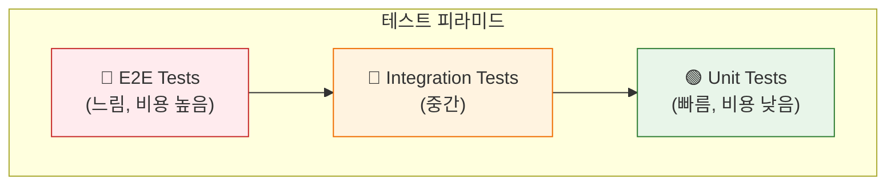
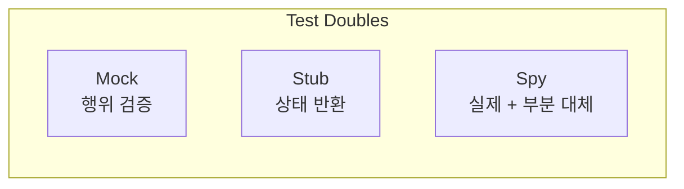
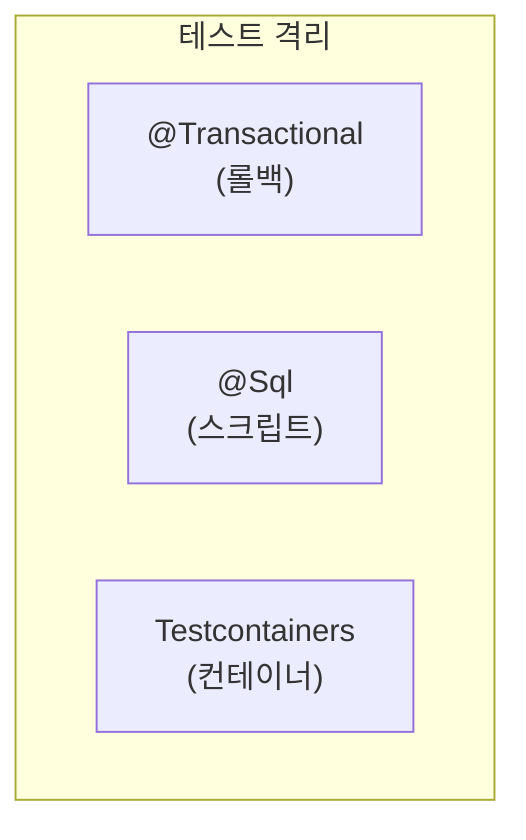

## 이 글에서 얻는 것

- **테스트 피라미드**와 각 레벨의 목적을 이해합니다
- **Mock vs Stub vs Spy** 차이를 알고 적절히 사용합니다
- **통합 테스트 격리** 전략으로 안정적인 테스트를 작성합니다

---

## 테스트 피라미드



| 레벨 | 속도 | 범위 | 비율 | 목적 |
|------|------|------|------|------|
| **Unit** | 매우 빠름 | 단일 클래스/메서드 | 70% | 로직 검증 |
| **Integration** | 중간 | 여러 컴포넌트 | 20% | 연동 검증 |
| **E2E** | 느림 | 전체 시스템 | 10% | 시나리오 검증 |

---

## 단위 테스트

### 기본 구조 (Given-When-Then)

```java
@ExtendWith(MockitoExtension.class)
class OrderServiceTest {
    
    @Mock
    private OrderRepository orderRepository;
    
    @Mock
    private PaymentService paymentService;
    
    @InjectMocks
    private OrderService orderService;
    
    @Test
    @DisplayName("주문 생성 시 재고가 충분하면 주문이 성공한다")
    void createOrder_withSufficientStock_shouldSucceed() {
        // Given
        OrderRequest request = OrderRequest.builder()
            .userId("user-1")
            .productId("product-1")
            .quantity(2)
            .build();
        
        when(orderRepository.save(any(Order.class)))
            .thenAnswer(invocation -> {
                Order order = invocation.getArgument(0);
                order.setId("order-123");
                return order;
            });
        
        // When
        Order result = orderService.createOrder(request);
        
        // Then
        assertThat(result.getId()).isEqualTo("order-123");
        assertThat(result.getStatus()).isEqualTo(OrderStatus.CREATED);
        verify(orderRepository, times(1)).save(any(Order.class));
    }
    
    @Test
    @DisplayName("재고 부족 시 InsufficientStockException이 발생한다")
    void createOrder_withInsufficientStock_shouldThrowException() {
        // Given
        OrderRequest request = OrderRequest.builder()
            .productId("product-1")
            .quantity(100)  // 재고보다 많음
            .build();
        
        when(inventoryService.checkStock(anyString(), anyInt()))
            .thenReturn(false);
        
        // When & Then
        assertThatThrownBy(() -> orderService.createOrder(request))
            .isInstanceOf(InsufficientStockException.class)
            .hasMessageContaining("재고 부족");
    }
}
```

### Mock vs Stub vs Spy



```java
// Stub: 정해진 값 반환 (상태 검증)
@Test
void stub_example() {
    UserRepository stub = mock(UserRepository.class);
    when(stub.findById("user-1")).thenReturn(Optional.of(new User("user-1", "John")));
    
    User user = stub.findById("user-1").orElseThrow();
    assertThat(user.getName()).isEqualTo("John");  // 상태 검증
}

// Mock: 호출 검증 (행위 검증)
@Test
void mock_example() {
    NotificationService mock = mock(NotificationService.class);
    
    orderService.createOrder(request);  // 내부에서 mock 호출
    
    verify(mock, times(1)).sendNotification(any());  // 행위 검증
    verify(mock, never()).sendSms(any());
}

// Spy: 실제 객체 + 일부 메서드만 대체
@Test
void spy_example() {
    List<String> realList = new ArrayList<>();
    List<String> spy = spy(realList);
    
    spy.add("one");  // 실제 동작
    when(spy.size()).thenReturn(100);  // 일부만 대체
    
    assertThat(spy.get(0)).isEqualTo("one");  // 실제 값
    assertThat(spy.size()).isEqualTo(100);     // 대체된 값
}
```

### ArgumentCaptor

```java
@Test
void captureArgument_shouldVerifyDetails() {
    // Given
    ArgumentCaptor<Order> orderCaptor = ArgumentCaptor.forClass(Order.class);
    
    // When
    orderService.createOrder(request);
    
    // Then
    verify(orderRepository).save(orderCaptor.capture());
    Order capturedOrder = orderCaptor.getValue();
    
    assertThat(capturedOrder.getUserId()).isEqualTo("user-1");
    assertThat(capturedOrder.getItems()).hasSize(2);
}
```

---

## 통합 테스트

### @SpringBootTest

```java
@SpringBootTest
@Transactional  // 테스트 후 롤백
@ActiveProfiles("test")
class OrderServiceIntegrationTest {
    
    @Autowired
    private OrderService orderService;
    
    @Autowired
    private OrderRepository orderRepository;
    
    @Test
    void createOrder_shouldPersistToDatabase() {
        // Given
        OrderRequest request = createOrderRequest();
        
        // When
        Order order = orderService.createOrder(request);
        
        // Then
        Order found = orderRepository.findById(order.getId()).orElseThrow();
        assertThat(found.getStatus()).isEqualTo(OrderStatus.CREATED);
    }
}
```

### 테스트 격리 전략



**1. @Transactional 롤백**

```java
@SpringBootTest
@Transactional  // 각 테스트 후 자동 롤백
class OrderRepositoryTest {
    // 테스트 데이터가 다른 테스트에 영향 X
}
```

**2. @Sql 스크립트**

```java
@SpringBootTest
@Sql(scripts = "/test-data.sql", executionPhase = BEFORE_TEST_METHOD)
@Sql(scripts = "/cleanup.sql", executionPhase = AFTER_TEST_METHOD)
class OrderServiceTest {
    // 매번 동일한 데이터로 시작
}
```

**3. Testcontainers (추천)**

```java
@SpringBootTest
@Testcontainers
class OrderServiceContainerTest {
    
    @Container
    static MySQLContainer<?> mysql = new MySQLContainer<>("mysql:8.0")
        .withDatabaseName("testdb")
        .withUsername("test")
        .withPassword("test");
    
    @DynamicPropertySource
    static void configureProperties(DynamicPropertyRegistry registry) {
        registry.add("spring.datasource.url", mysql::getJdbcUrl);
        registry.add("spring.datasource.username", mysql::getUsername);
        registry.add("spring.datasource.password", mysql::getPassword);
    }
    
    @Test
    void testWithRealDatabase() {
        // 실제 MySQL 컨테이너에서 테스트
    }
}
```

### @MockBean vs @SpyBean

```java
@SpringBootTest
class PaymentIntegrationTest {
    
    @MockBean  // 빈 전체를 Mock으로 대체
    private ExternalPaymentGateway paymentGateway;
    
    @SpyBean  // 실제 빈의 일부만 대체
    private NotificationService notificationService;
    
    @Test
    void processPayment_shouldNotifyUser() {
        // 외부 결제 API는 Mock
        when(paymentGateway.charge(any())).thenReturn(new PaymentResult(true));
        
        // 알림 서비스는 실제 동작하지만 검증 가능
        orderService.processPayment(orderId);
        
        verify(notificationService).sendPaymentConfirmation(any());
    }
}
```

---

## E2E 테스트

### REST API 테스트 (MockMvc)

```java
@SpringBootTest
@AutoConfigureMockMvc
class OrderControllerE2ETest {
    
    @Autowired
    private MockMvc mockMvc;
    
    @Autowired
    private ObjectMapper objectMapper;
    
    @Test
    void createOrder_shouldReturn201() throws Exception {
        OrderRequest request = OrderRequest.builder()
            .userId("user-1")
            .items(List.of(new OrderItem("product-1", 2)))
            .build();
        
        mockMvc.perform(post("/api/orders")
                .contentType(MediaType.APPLICATION_JSON)
                .content(objectMapper.writeValueAsString(request)))
            .andExpect(status().isCreated())
            .andExpect(jsonPath("$.orderId").exists())
            .andExpect(jsonPath("$.status").value("CREATED"));
    }
    
    @Test
    void getOrder_notFound_shouldReturn404() throws Exception {
        mockMvc.perform(get("/api/orders/non-existent-id"))
            .andExpect(status().isNotFound())
            .andExpect(jsonPath("$.error").value("Order not found"));
    }
}
```

### WebTestClient (WebFlux)

```java
@SpringBootTest(webEnvironment = SpringBootTest.WebEnvironment.RANDOM_PORT)
class ReactiveOrderControllerTest {
    
    @Autowired
    private WebTestClient webTestClient;
    
    @Test
    void createOrder_shouldStream() {
        webTestClient.post()
            .uri("/api/orders")
            .bodyValue(request)
            .exchange()
            .expectStatus().isCreated()
            .expectBody()
            .jsonPath("$.orderId").isNotEmpty();
    }
}
```

---

## 테스트 모범 사례

### ✅ 좋은 테스트

```java
@Test
@DisplayName("만료된 쿠폰 적용 시 CouponExpiredException이 발생한다")
void applyCoupon_withExpiredCoupon_shouldThrowException() {
    // Given: 명확한 설정
    Coupon expiredCoupon = Coupon.builder()
        .code("EXPIRED")
        .expiryDate(LocalDate.now().minusDays(1))
        .build();
    
    // When & Then: 단일 동작 검증
    assertThatThrownBy(() -> couponService.apply(expiredCoupon, order))
        .isInstanceOf(CouponExpiredException.class);
}
```

### ❌ 피해야 할 패턴

```java
// ❌ 너무 많은 검증
@Test
void badTest() {
    Order order = orderService.create(request);
    assertThat(order.getId()).isNotNull();
    assertThat(order.getStatus()).isEqualTo(OrderStatus.CREATED);
    assertThat(order.getItems()).hasSize(2);
    assertThat(order.getTotalAmount()).isEqualTo(100);
    assertThat(order.getCreatedAt()).isNotNull();
    // ... 10개 더
}

// ❌ 테스트 간 의존성
@Test
@Order(1)
void createOrder() { ... }

@Test
@Order(2)
void updateOrder() { ... }  // createOrder 결과에 의존

// ❌ 모호한 테스트 이름
@Test
void test1() { ... }
```

---

## 요약

### 테스트 전략 체크리스트

| 테스트 유형 | 도구 | 격리 방법 |
|------------|------|----------|
| Unit | JUnit + Mockito | Mock/Stub |
| Integration | @SpringBootTest | @Transactional / Testcontainers |
| E2E | MockMvc / WebTestClient | 테스트 DB |

### 핵심 원칙

1. **F.I.R.S.T**: Fast, Isolated, Repeatable, Self-validating, Timely
2. **Given-When-Then**: 명확한 구조
3. **한 테스트 = 한 개념**: 단일 책임
4. **테스트 이름 = 문서화**: 의도 명확히

---

## 🔗 Related Deep Dive

- **[Spring AOP](/learning/deep-dive/deep-dive-spring-aop-transaction-internals/)**: Mock 대상 프록시 이해.
- **[Spring Boot 자동 설정](/learning/deep-dive/deep-dive-spring-boot-auto-config/)**: @SpringBootTest 동작 원리.
