## 이 글에서 얻는 것

- **ThreadPoolExecutor의 핵심 파라미터**를 이해합니다
- **적정 스레드 수**를 계산하는 방법을 알아봅니다
- **거부 정책**과 **큐 전략**을 선택합니다

---

## ThreadPoolExecutor 파라미터

### 핵심 구성

```java
ThreadPoolExecutor executor = new ThreadPoolExecutor(
    4,                    // corePoolSize
    8,                    // maximumPoolSize  
    60L, TimeUnit.SECONDS, // keepAliveTime
    new LinkedBlockingQueue<>(100),  // workQueue
    new ThreadPoolExecutor.CallerRunsPolicy()  // rejectedHandler
);
```



```mermaid
flowchart TB
    subgraph "Thread Pool 동작"
        Task[작업 도착]
        
        Task --> C1{core 여유?}
        C1 -->|Yes| Core["Core Thread 실행"]
        C1 -->|No| C2{큐 여유?}
        C2 -->|Yes| Queue["Queue 대기"]
        C2 -->|No| C3{max 여유?}
        C3 -->|Yes| Max["추가 Thread 생성"]
        C3 -->|No| Reject["거부 정책 실행"]
    end
```

### 파라미터 설명

| 파라미터 | 설명 | 권장값 |
|---------|------|-------|
| corePoolSize | 기본 스레드 수 | CPU 바운드: CPU 수 |
| maximumPoolSize | 최대 스레드 수 | I/O 바운드: 더 많이 |
| keepAliveTime | 유휴 스레드 생존 시간 | 60초 |
| workQueue | 대기 큐 | 유한 큐 권장 |

---

## 적정 스레드 수 계산

### CPU 바운드 작업

```java
// 순수 계산 작업 (암호화, 압축, 연산)
int threads = Runtime.getRuntime().availableProcessors();

// 또는 좀 더 여유있게
int threads = Runtime.getRuntime().availableProcessors() + 1;
```

### I/O 바운드 작업

```java
// DB 쿼리, 외부 API 호출, 파일 I/O
// 공식: threads = CPU * (1 + 대기시간/계산시간)

// 예: CPU 4개, 대기 200ms, 계산 50ms
// threads = 4 * (1 + 200/50) = 4 * 5 = 20

int cpuCount = Runtime.getRuntime().availableProcessors();
double targetUtilization = 0.8;  // 80% 활용
double waitTime = 200;   // ms
double computeTime = 50; // ms

int threads = (int) (cpuCount * targetUtilization * (1 + waitTime / computeTime));
```

### Spring 비동기 설정

```java
@Configuration
@EnableAsync
public class AsyncConfig {
    
    @Bean
    public Executor taskExecutor() {
        ThreadPoolTaskExecutor executor = new ThreadPoolTaskExecutor();
        
        int cpuCount = Runtime.getRuntime().availableProcessors();
        
        executor.setCorePoolSize(cpuCount * 2);
        executor.setMaxPoolSize(cpuCount * 4);
        executor.setQueueCapacity(500);
        executor.setKeepAliveSeconds(60);
        executor.setThreadNamePrefix("async-");
        executor.setRejectedExecutionHandler(new CallerRunsPolicy());
        executor.initialize();
        
        return executor;
    }
}
```

---

## 큐 전략

### 큐 종류

| 큐 | 특성 | 사용 시점 |
|---|------|---------|
| `SynchronousQueue` | 버퍼 없음 | 즉시 처리 필요 |
| `LinkedBlockingQueue` | 무제한 가능 | 일반적 사용 |
| `ArrayBlockingQueue` | 유한, 공정 옵션 | 메모리 제한 |
| `PriorityBlockingQueue` | 우선순위 | 중요도 기반 |

### 유한 큐 권장

```java
// ❌ 무한 큐 - 메모리 폭발 위험
new LinkedBlockingQueue<>();  // 기본값: Integer.MAX_VALUE

// ✅ 유한 큐
new LinkedBlockingQueue<>(1000);

// ✅ 또는 SynchronousQueue (버퍼 없음)
new SynchronousQueue<>();
```

---

## 거부 정책

### 내장 정책

```java
// 1. AbortPolicy (기본) - 예외 발생
new ThreadPoolExecutor.AbortPolicy();
// RejectedExecutionException 발생

// 2. CallerRunsPolicy - 호출자 스레드에서 실행
new ThreadPoolExecutor.CallerRunsPolicy();
// 백프레셔 효과 (속도 조절)

// 3. DiscardPolicy - 조용히 버림
new ThreadPoolExecutor.DiscardPolicy();

// 4. DiscardOldestPolicy - 가장 오래된 작업 버림
new ThreadPoolExecutor.DiscardOldestPolicy();
```

### 커스텀 정책

```java
public class CustomRejectedHandler implements RejectedExecutionHandler {
    
    private final Counter rejectedCounter;
    
    @Override
    public void rejectedExecution(Runnable r, ThreadPoolExecutor executor) {
        // 메트릭 기록
        rejectedCounter.increment();
        
        // 로깅
        log.warn("Task rejected: {}, queue size: {}", 
            r.getClass().getSimpleName(), 
            executor.getQueue().size());
        
        // 대안 처리 (예: 폴백 큐)
        fallbackQueue.offer(r);
    }
}
```

---

## 모니터링

### 핵심 메트릭

```java
@Scheduled(fixedRate = 10000)
public void monitorThreadPool() {
    ThreadPoolExecutor executor = (ThreadPoolExecutor) taskExecutor;
    
    log.info("=== Thread Pool Status ===");
    log.info("Pool Size: {}", executor.getPoolSize());
    log.info("Active Threads: {}", executor.getActiveCount());
    log.info("Queue Size: {}", executor.getQueue().size());
    log.info("Completed Tasks: {}", executor.getCompletedTaskCount());
    
    // 경고: 큐가 차기 시작하면
    if (executor.getQueue().size() > executor.getQueue().remainingCapacity() * 0.8) {
        log.warn("Queue is 80% full!");
    }
}
```

### Micrometer 연동

```java
@Bean
public ThreadPoolTaskExecutor taskExecutorWithMetrics(MeterRegistry registry) {
    ThreadPoolTaskExecutor executor = new ThreadPoolTaskExecutor();
    // ... 설정
    
    // Metrics 바인딩
    new ExecutorServiceMetrics(
        executor.getThreadPoolExecutor(),
        "async-pool",
        Tags.empty()
    ).bindTo(registry);
    
    return executor;
}
```

---

## Spring Boot 스레드 풀

### Tomcat 스레드 풀

```yaml
server:
  tomcat:
    threads:
      max: 200      # 최대 스레드
      min-spare: 10 # 최소 유휴 스레드
    accept-count: 100  # 큐 크기
    max-connections: 8192
```

### @Async 스레드 풀

```yaml
spring:
  task:
    execution:
      pool:
        core-size: 8
        max-size: 16
        queue-capacity: 100
      thread-name-prefix: async-
```

---

## 요약

### 스레드 풀 설정 가이드

| 작업 유형 | Core | Max | Queue |
|---------|------|-----|-------|
| CPU 바운드 | CPU + 1 | CPU + 1 | 작게 |
| I/O 바운드 | CPU * 2 | CPU * 4 | 적절히 |
| 혼합 | 상황별 | 상황별 | 유한 |

### 핵심 원칙

1. **유한 큐 사용**: 메모리 보호
2. **적절한 거부 정책**: CallerRunsPolicy 권장
3. **모니터링 필수**: 큐 크기, 활성 스레드
4. **부하 테스트**: 실제 환경에서 검증

---

## 🔗 Related Deep Dive

- **[Java 동시성 기초](/learning/deep-dive/deep-dive-java-concurrency-basics/)**: Thread, synchronized.
- **[동시성 컬렉션](/learning/deep-dive/deep-dive-concurrent-collections/)**: BlockingQueue 상세.
