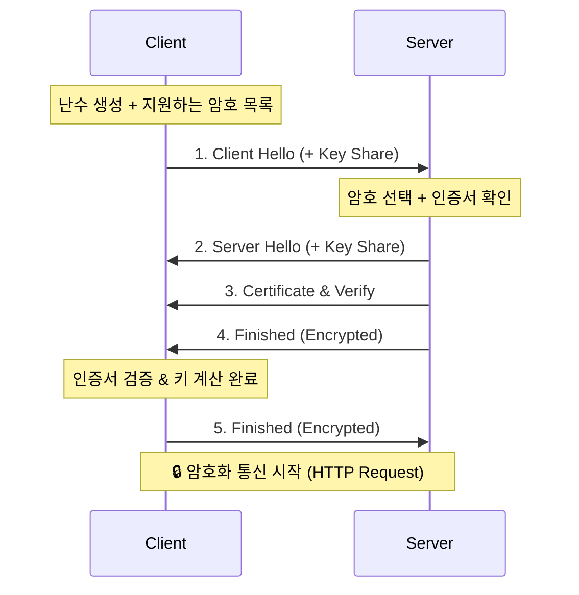

## 🔐 1. HTTPS: 자물쇠의 비밀

우리는 브라우저 주소창의 🔒 자물쇠를 믿습니다. 이 자물쇠가 채워지기 위해 클라이언트와 서버는 복잡한 **"악수(Handshake)"**를 합니다.

목표는 3가지입니다:
1. **암호화**: 남들이 못 보게 한다.
2. **인증**: 가짜 사이트(Phishing)가 아님을 증명한다.
3. **무결성**: 데이터가 조작되지 않았음을 보장한다.

---

## 🤝 2. TLS 1.3 Handshake (1-RTT)

과거 TLS 1.2는 악수를 2번(2-RTT) 했지만, 최신 TLS 1.3은 **한 번(1-RTT)** 만에 끝냅니다.

1. **Client Hello**: "나 이 암호(Cipher Suite) 쓸 수 있어. 그리고 내 키 재료(Key Share) 여기 있어."
2. **Server Hello**: "그래, 이걸로 하자. 내 키 재료랑 인증서도 받아라."
3. **키 교환**: 클라이언트와 서버는 서로의 '재료'를 합쳐서 **공통의 비밀키(Session Key)**를 만듭니다. (Diffie-Hellman 알고리즘)

---

## 🕵️ 3. 인증서는 어떻게 믿나요?

서버가 "나 네이버 맞아"라며 인증서를 줬습니다. 이걸 어떻게 믿을까요?
브라우저에는 이미 **신뢰할 수 있는 기관(Root CA)**들의 목록이 내장되어 있습니다.

1. 서버 인증서를 봅니다. -> "DigiCert가 보증했네?"
2. DigiCert의 서명을 확인합니다. (브라우저 내장 공개키로 복호화)
3. 서명이 맞으면 통과!

---

## 🏎️ 4. 성능 최적화: 0-RTT

TLS 1.3의 진짜 마법은 **Session Resumption**입니다.
이전에 접속했던 사이트라면, handshake 과정을 생략하고 **첫 패킷부터 데이터를 실어 보냅니다.**

> "저 아까 왔던 앤데요!" (데이터 투척) -> 서버: "어 그래 안녕."

## 요약

- **TLS 1.3**: 불필요한 왕복을 줄여서 빠르고 안전합니다.
- **Diffie-Hellman**: 도청자가 패킷을 다 훔쳐봐도 '비밀키'는 절대 계산 못 하게 하는 수학적 마법입니다.
- **Root CA**: 인터넷 신뢰의 기반입니다.
