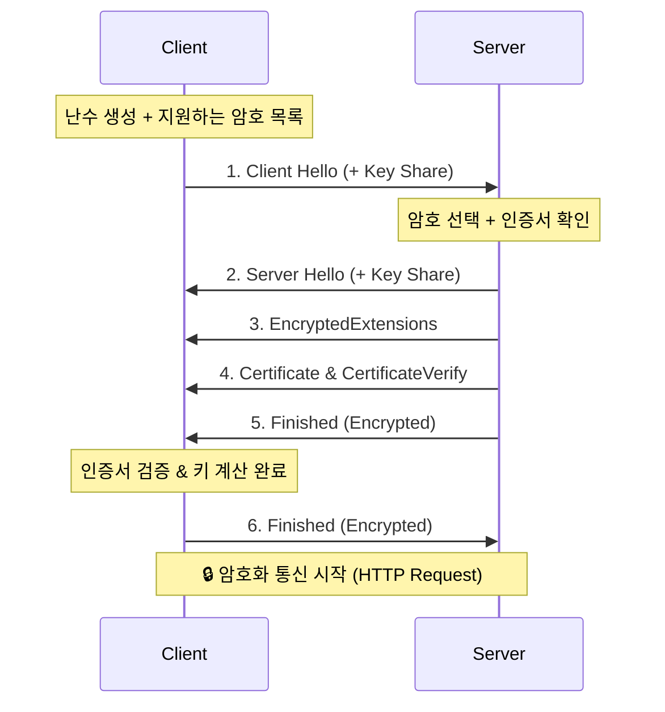
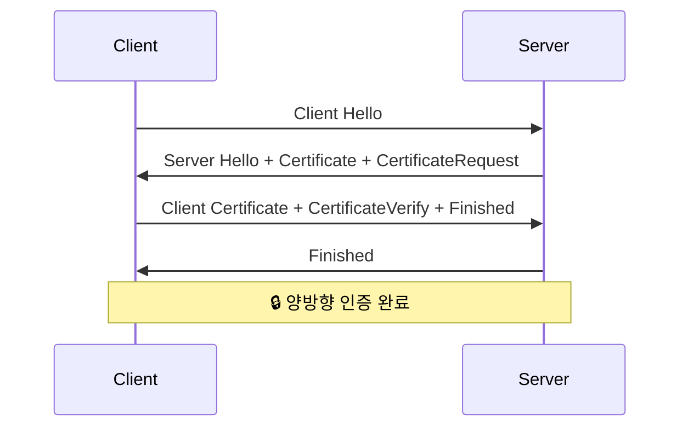

## 🔐 1. HTTPS: 자물쇠의 비밀

우리는 브라우저 주소창의 🔒 자물쇠를 믿습니다. 이 자물쇠가 채워지기 위해 클라이언트와 서버는 복잡한 **"악수(Handshake)"**를 합니다.

목표는 3가지입니다:
1. **기밀성(Confidentiality)**: 통신 내용을 제3자가 볼 수 없게 암호화합니다.
2. **인증(Authentication)**: 접속한 서버가 진짜 그 서버인지 인증서로 증명합니다.
3. **무결성(Integrity)**: 전송 중 데이터가 변조되지 않았음을 MAC(Message Authentication Code)으로 보장합니다.

> **실무 관점**: 이 세 가지 중 하나라도 빠지면 보안이 무너집니다. 예를 들어, 암호화만 하고 인증을 안 하면 **중간자 공격(MITM)**에 취약합니다 — 공격자가 자기 인증서로 대체해도 클라이언트가 알 수 없기 때문입니다.

---

## 🤝 2. TLS 1.3 Handshake (1-RTT)

과거 TLS 1.2는 악수를 2번(2-RTT) 했지만, 최신 TLS 1.3은 **한 번(1-RTT)** 만에 끝냅니다.


```mermaid
sequenceDiagram
    participant Client
    participant Server
    
    Note over Client: 난수 생성 + 지원하는 암호 목록
    Client->>Server: 1. Client Hello (+ Key Share)
    
    Note over Server: 암호 선택 + 인증서 확인
    Server->>Client: 2. Server Hello (+ Key Share)
    Server->>Client: 3. EncryptedExtensions
    Server->>Client: 4. Certificate & CertificateVerify
    Server->>Client: 5. Finished (Encrypted)
    
    Note over Client: 인증서 검증 & 키 계산 완료
    Client->>Server: 6. Finished (Encrypted)
    
    Note over Client, Server: 🔒 암호화 통신 시작 (HTTP Request)
```

### 각 단계 상세

| 단계 | 전송 방향 | 핵심 내용 |
|---|---|---|
| **Client Hello** | C → S | 클라이언트 난수, 지원 Cipher Suite 목록, `key_share` 확장(DH 공개키) |
| **Server Hello** | S → C | 서버 난수, 선택한 Cipher Suite, 서버의 `key_share`(DH 공개키) |
| **EncryptedExtensions** | S → C | 이후 메시지는 모두 암호화. SNI, ALPN 등 확장 정보 |
| **Certificate** | S → C | 서버 인증서 체인 전송 |
| **CertificateVerify** | S → C | 서버의 개인키로 handshake 메시지 해시에 서명 → "이 인증서의 주인이 나다" 증명 |
| **Finished** | 양방향 | handshake 전체의 해시(transcript hash) 검증 → 변조 감지 |

**핵심 변화**: TLS 1.2에서는 Client Hello → Server Hello 후에 별도로 키 교환(Client Key Exchange)을 했습니다. TLS 1.3은 **Client Hello에 키 재료를 동봉**해서 1-RTT로 줄였습니다.

---

## 🔄 3. TLS 1.2 vs 1.3 — 무엇이 달라졌나

### 성능 비교

```
TLS 1.2:  Client Hello → Server Hello → Certificate → Key Exchange → Finished (2-RTT)
TLS 1.3:  Client Hello(+KeyShare) → Server Hello(+KeyShare) → Finished (1-RTT)
```

### 보안 강화 요약

| 항목 | TLS 1.2 | TLS 1.3 |
|---|---|---|
| **RTT** | 2-RTT (풀 핸드셰이크) | 1-RTT (풀), 0-RTT (재연결) |
| **키 교환** | RSA, DHE, ECDHE 모두 허용 | **ECDHE/DHE만** (RSA 키 교환 제거) |
| **정적 RSA** | 지원 → PFS 불가 | **제거** → PFS(Perfect Forward Secrecy) 기본 보장 |
| **Cipher Suite** | 수백 개 조합 가능 | **5개로 정리** |
| **해시** | MD5, SHA-1 허용 | SHA-256 이상만 |
| **AEAD** | CBC 모드 허용 (BEAST, POODLE 취약) | **AEAD만 허용** (GCM, ChaCha20-Poly1305) |
| **Renegotiation** | 지원 (공격 벡터) | **제거** |

### Perfect Forward Secrecy (PFS)란?

서버의 **장기 개인키(long-term private key)**가 유출되더라도, 과거 세션의 트래픽은 복호화할 수 없는 성질입니다.

- **RSA 키 교환 (TLS 1.2)**: 세션키를 서버 공개키로 암호화 → 서버 개인키 유출 시 **과거 모든 세션 복호화 가능** ⚠️
- **ECDHE (TLS 1.3)**: 매 세션마다 새 키 쌍 생성 → 하나가 유출돼도 다른 세션에 영향 없음 ✅

> **실무 포인트**: 아직 TLS 1.2를 지원해야 한다면, 반드시 `ECDHE` 기반 Cipher Suite만 허용하세요. RSA 키 교환은 비활성화합니다.

---

## 🛡️ 4. TLS 1.3의 5가지 Cipher Suite

TLS 1.3은 Cipher Suite를 대폭 정리해서 선택 실수를 줄였습니다:

```
TLS_AES_256_GCM_SHA384         (가장 높은 보안)
TLS_AES_128_GCM_SHA256         (범용, 성능 좋음)  ← 기본 권장
TLS_CHACHA20_POLY1305_SHA256   (모바일/ARM 최적화) ← 모바일 서비스 권장
TLS_AES_128_CCM_SHA256         (IoT 환경)
TLS_AES_128_CCM_8_SHA256       (IoT 환경, 태그 축소)
```

### 선택 기준 체크리스트

- ✅ **일반 웹 서비스**: `TLS_AES_128_GCM_SHA256` — AES-NI 지원 CPU에서 최고 성능
- ✅ **모바일 중심 서비스**: `TLS_CHACHA20_POLY1305_SHA256` — AES-NI 없는 ARM에서 더 빠름
- ✅ **금융/규제 환경**: `TLS_AES_256_GCM_SHA384` — 256비트 요구 사항 충족
- ❌ **CCM 계열**: 일반 백엔드에서는 사용할 일이 거의 없음

---

## 🕵️ 5. 인증서 체인 검증 — "진짜 네이버 맞아?"

서버가 "나 네이버야"라며 인증서를 줬습니다. 이걸 어떻게 믿을까요?

### 체인 구조

```
Root CA (DigiCert) — 브라우저/OS에 내장
  └── Intermediate CA (DigiCert SHA2 Extended Validation)
        └── Leaf Certificate (www.naver.com)
```

### 검증 단계

1. **Leaf 인증서 확인**: Subject/SAN에 접속한 도메인이 포함되어 있는지 확인
2. **유효 기간 검증**: `notBefore` ≤ 현재 시간 ≤ `notAfter`
3. **서명 체인 검증**: Leaf의 서명을 Intermediate CA의 공개키로 복호화 → 해시 일치 여부 확인
4. **Intermediate → Root 반복**: Root CA까지 체인을 따라 올라가며 같은 검증 수행
5. **Root CA 신뢰 확인**: Root CA가 브라우저/OS의 Trust Store에 있는지 최종 확인
6. **인증서 폐기 확인**: OCSP(Online Certificate Status Protocol) 또는 CRL로 폐기 여부 조회

### OCSP Stapling

매번 OCSP 서버에 질의하면 느립니다. **OCSP Stapling**은 서버가 미리 OCSP 응답을 받아서 handshake 때 함께 전달합니다.

```nginx
# Nginx OCSP Stapling 설정
ssl_stapling on;
ssl_stapling_verify on;
ssl_trusted_certificate /etc/ssl/certs/ca-bundle.crt;
resolver 8.8.8.8 valid=300s;
```

> **주의**: OCSP Stapling을 켜지 않으면, 클라이언트가 직접 CA의 OCSP 서버에 질의합니다. CA 서버가 느리면 TLS 핸드셰이크 전체가 지연됩니다.

---

## 🏎️ 6. 0-RTT Resumption — 빠르지만 위험한 양날의 검

TLS 1.3의 **0-RTT(Early Data)**는 이전 세션의 PSK(Pre-Shared Key)를 활용해 첫 패킷부터 암호화된 데이터를 전송합니다.

```
첫 연결:       Client Hello → Server Hello → ... → Finished (1-RTT)
                                                    + PSK 저장

재연결 (0-RTT): Client Hello + Early Data(PSK 암호화된 HTTP 요청) →
                Server Hello + ... + 응답
```

### 0-RTT의 위험: Replay Attack ⚠️

0-RTT 데이터는 **Replay Protection이 없습니다**. 공격자가 0-RTT 패킷을 캡처해서 그대로 재전송하면, 서버는 이를 구분할 수 없습니다.

**위험한 시나리오:**
```
1. 사용자가 "계좌에서 100만원 송금" 요청 (0-RTT)
2. 공격자가 이 패킷을 캡처
3. 공격자가 동일한 패킷을 10번 재전송
4. 서버가 10번의 송금을 모두 처리 → 1,000만원 송금 💸
```

### 0-RTT 안전 사용 가이드

| 허용 (멱등 요청) | 금지 (비멱등 요청) |
|---|---|
| `GET /api/products` | `POST /api/transfer` |
| `GET /api/user/profile` | `POST /api/order` |
| 정적 리소스 요청 | `DELETE /api/account` |

**서버 측 방어:**
```nginx
# Nginx: 0-RTT 비활성화 (가장 안전)
ssl_early_data off;

# 또는 활성화하되, 프록시 헤더로 표시
ssl_early_data on;
proxy_set_header Early-Data $ssl_early_data;
```

```java
// Spring: 0-RTT 요청 감지 후 비멱등 요청 거부
@Component
public class EarlyDataFilter extends OncePerRequestFilter {
    @Override
    protected void doFilterInternal(HttpServletRequest request,
            HttpServletResponse response, FilterChain chain) 
            throws ServletException, IOException {
        String earlyData = request.getHeader("Early-Data");
        if ("1".equals(earlyData) && !isIdempotent(request.getMethod())) {
            response.setStatus(HttpStatus.TOO_EARLY.value()); // 425
            return;
        }
        chain.doFilter(request, response);
    }
    
    private boolean isIdempotent(String method) {
        return Set.of("GET", "HEAD", "OPTIONS").contains(method);
    }
}
```

---

## 🔑 7. Diffie-Hellman 키 교환 — 도청자가 있어도 안전한 이유

TLS의 핵심 마법입니다. 클라이언트와 서버가 **공개 채널에서 비밀키를 합의**합니다.

### ECDHE 동작 원리 (간소화)

```
1. 양측이 타원곡선(Curve)과 기준점 G를 합의 (공개)
2. 클라이언트: 비밀수 a 생성 → A = a × G 전송 (공개)
3. 서버:      비밀수 b 생성 → B = b × G 전송 (공개)
4. 클라이언트: S = a × B = a × b × G (비밀)
5. 서버:      S = b × A = b × a × G (비밀)
→ 양측이 같은 S를 가지게 됨!
```

**왜 안전한가?** 도청자는 `A`(= a×G)와 `B`(= b×G)를 알아도, `a`나 `b`를 역산하는 것은 타원곡선 이산 로그 문제(ECDLP)로 계산적으로 불가능합니다.

### 현재 권장 커브

- **X25519**: 가장 널리 쓰이고 빠름 (TLS 1.3 기본)
- **secp256r1 (P-256)**: NIST 표준, 규제 환경에서 요구
- **secp384r1 (P-384)**: 더 높은 보안 수준 필요 시

---

## 🔒 8. mTLS (Mutual TLS) — 서버도 클라이언트를 검증

일반 TLS는 **서버만 인증**합니다. mTLS는 **클라이언트도 인증서를 제시**합니다.

### 사용 시나리오

- **마이크로서비스 간 통신**: Service Mesh(Istio)에서 Pod 간 자동 mTLS
- **API Gateway ↔ 내부 서비스**: 외부에서 내부 서비스 직접 접근 차단
- **금융/의료 API**: 규제 요건으로 클라이언트 인증서 필수

### mTLS Handshake 추가 단계


```mermaid
sequenceDiagram
    participant Client
    participant Server
    
    Client->>Server: Client Hello
    Server->>Client: Server Hello + Certificate + CertificateRequest
    Client->>Server: Client Certificate + CertificateVerify + Finished
    Server->>Client: Finished
    
    Note over Client, Server: 🔒 양방향 인증 완료
```

```nginx
# Nginx mTLS 설정
server {
    listen 443 ssl;
    
    ssl_certificate     /etc/ssl/server.crt;
    ssl_certificate_key /etc/ssl/server.key;
    
    # 클라이언트 인증서 검증
    ssl_client_certificate /etc/ssl/ca.crt;  # 클라이언트 인증서 서명 CA
    ssl_verify_client on;                     # 필수로 검증
    # ssl_verify_client optional;             # 선택적 검증
    ssl_verify_depth 2;                       # 체인 깊이
}
```

---

## ⚙️ 9. 실무 설정: Nginx & Spring Boot

### Nginx TLS 최적화 설정

```nginx
server {
    listen 443 ssl http2;
    server_name example.com;

    # 인증서
    ssl_certificate     /etc/ssl/certs/fullchain.pem;
    ssl_certificate_key /etc/ssl/private/privkey.pem;

    # 프로토콜: TLS 1.2 + 1.3만 허용
    ssl_protocols TLSv1.2 TLSv1.3;
    
    # Cipher Suite (TLS 1.2용, TLS 1.3은 자동 선택)
    ssl_ciphers 'ECDHE-ECDSA-AES128-GCM-SHA256:ECDHE-RSA-AES128-GCM-SHA256:ECDHE-ECDSA-AES256-GCM-SHA384';
    ssl_prefer_server_ciphers on;
    
    # 세션 캐시 (Session Resumption)
    ssl_session_cache shared:TLS:10m;
    ssl_session_timeout 1d;
    ssl_session_tickets off;  # Ticket 키 관리가 복잡하면 끄는 게 안전
    
    # OCSP Stapling
    ssl_stapling on;
    ssl_stapling_verify on;
    
    # HSTS (Strict Transport Security)
    add_header Strict-Transport-Security "max-age=63072000; includeSubDomains; preload" always;
}
```

### Spring Boot TLS 설정

```yaml
# application.yml
server:
  ssl:
    enabled: true
    key-store: classpath:keystore.p12
    key-store-type: PKCS12
    key-store-password: ${SSL_KEYSTORE_PASSWORD}
    # TLS 1.2 이상만 허용
    enabled-protocols: TLSv1.2,TLSv1.3
    # 안전한 Cipher Suite만
    ciphers:
      - TLS_AES_128_GCM_SHA256
      - TLS_AES_256_GCM_SHA384
      - TLS_CHACHA20_POLY1305_SHA256
      - ECDHE-RSA-AES128-GCM-SHA256
  # HTTP → HTTPS 리다이렉트
  port: 8443
```

---

## 🔍 10. TLS 디버깅 체크리스트

TLS 관련 문제가 발생했을 때 단계별로 확인하세요:

### 연결 자체가 안 될 때

```bash
# 1. 서버가 TLS를 제공하는지 확인
openssl s_client -connect example.com:443 -tls1_3

# 2. 인증서 체인 확인
openssl s_client -connect example.com:443 -showcerts

# 3. 인증서 만료일 확인
echo | openssl s_client -connect example.com:443 2>/dev/null | \
  openssl x509 -noout -dates

# 4. 지원하는 Cipher Suite 확인
nmap --script ssl-enum-ciphers -p 443 example.com
```

### 성능이 느릴 때

```bash
# TLS Handshake 시간 측정
curl -w "TCP: %{time_connect}s, TLS: %{time_appconnect}s, Total: %{time_total}s\n" \
     -o /dev/null -s https://example.com

# 결과 예시:
# TCP: 0.015s, TLS: 0.045s, Total: 0.060s
# → TLS가 30ms 이상이면 Session Resumption/OCSP Stapling 점검
```

### 자주 만나는 문제와 원인

| 증상 | 가능한 원인 | 해결 |
|---|---|---|
| `ERR_CERT_AUTHORITY_INVALID` | Intermediate CA 누락 | fullchain.pem 사용 |
| `ERR_CERT_DATE_INVALID` | 인증서 만료 | certbot renew 또는 갱신 |
| `ERR_SSL_VERSION_OR_CIPHER_MISMATCH` | 클라이언트가 지원하는 프로토콜/Cipher 없음 | TLS 1.2 이상 + 표준 Cipher 허용 |
| Handshake 매우 느림 (>200ms) | OCSP 응답 지연 | OCSP Stapling 활성화 |
| `SSL_ERROR_HANDSHAKE_FAILURE_ALERT` | 서버 인증서 키와 인증서 불일치 | 키-인증서 쌍 재확인 |

---

## 📚 11. 연관 학습

- [HTTP Deep Dive](/learning/deep-dive/deep-dive-http-deep-dive/) — HTTP/1.1 ~ HTTP/3 프로토콜 심화
- [HTTP/3 & QUIC](/learning/deep-dive/deep-dive-http3-quic/) — QUIC 위의 TLS 1.3 통합 방식
- [Security: CORS/CSRF/Headers](/learning/deep-dive/deep-dive-security-cors-csrf-headers/) — 웹 보안 헤더 전략
- [OAuth2 & OIDC](/learning/deep-dive/deep-dive-oauth2-oidc/) — 인증/인가 프로토콜
- [DNS Internals](/learning/deep-dive/deep-dive-dns-internals/) — DNS 해석 후 TLS 연결까지의 흐름

---

## 요약

| 개념 | 핵심 |
|---|---|
| **TLS 1.3** | 불필요한 왕복을 줄여 1-RTT, 안전하지 않은 알고리즘을 과감히 제거 |
| **PFS** | 매 세션 새 키 생성으로 과거 트래픽 보호 |
| **ECDHE** | 도청자가 패킷을 다 훔쳐봐도 비밀키는 계산 불가능 |
| **인증서 체인** | Root CA → Intermediate → Leaf로 신뢰를 위임 |
| **0-RTT** | 빠르지만 Replay Attack 위험 → 멱등 요청에만 사용 |
| **mTLS** | 서비스 간 양방향 인증 → MSA 필수 |
| **OCSP Stapling** | 인증서 폐기 확인을 서버가 대행 → 지연 감소 |
