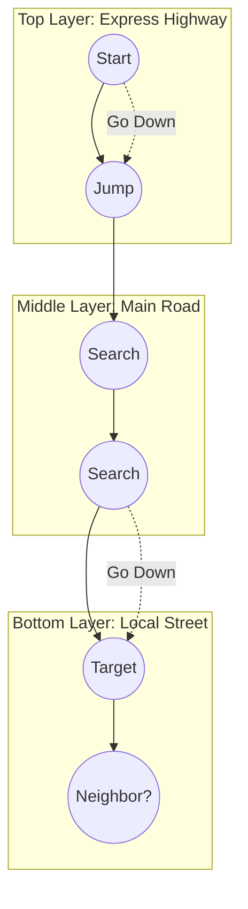
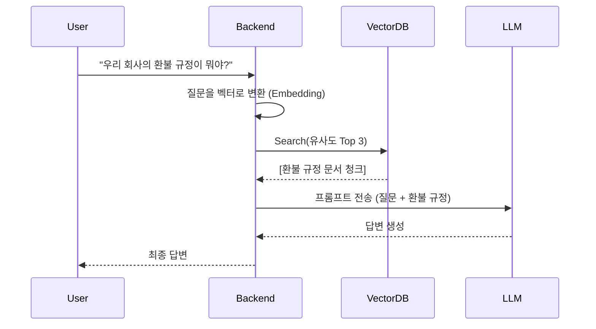

## 🤖 1. DB가 "의미"를 이해하려면?

`WHERE name = '강아지'`는 쉽습니다. 하지만 **"귀여운 동물 사진 찾아줘"**는 어떻게 쿼리할까요?
컴퓨터는 이미지를 모릅니다. 그래서 AI 모델을 통해 **숫자 배열(Vector)**로 바꿉니다.

> "강아지" -> `[0.1, 0.9, 0.3]`
> "고양이" -> `[0.2, 0.8, 0.4]`
> "자동차" -> `[0.9, 0.1, 0.0]`

이 숫자들의 **거리(Distance)**가 가까우면 의미가 비슷한 겁니다. 이를 **Embedding**이라 합니다.

---

## 🕸️ 2. HNSW: 고차원 공간의 내비게이션

수억 개의 벡터 중에서 가장 비슷한 녀석을 10ms 안에 찾아야 합니다. 다 비교(Brute Force)하면 너무 느립니다.
그래서 **HNSW (Hierarchical Navigable Small World)**라는 그래프 인덱스를 씁니다.

### 계층형 그래프 구조 (Layered Graph)

마치 **고속도로 -> 국도 -> 골목길**을 타는 것과 같습니다.

1. **Layer 2 (Top)**: 정거장이 듬성듬성 있습니다. 여기서 대략적인 위치로 **점프**합니다.
2. **Layer 1 (Mid)**: 좀 더 세밀하게 목표 지점으로 이동합니다. (Greedy Search)
3. **Layer 0 (Base)**: 모든 데이터가 연결되어 있습니다. 여기서 최종적으로 가장 가까운 이웃을 찾습니다.

> **핵심**: "좁은 세상(Small World)" 이론을 이용하여, 멀리 떨어진 데이터도 몇 번의 점프만으로 접근합니다.

---

## 🧠 3. RAG 아키텍처와 백엔드

LLM(ChatGPT)은 최신 정보를 모릅니다. 그래서 백엔드가 "컨닝 페이퍼"를 줘야 합니다. 이를 **RAG (Retrieval-Augmented Generation)**라 합니다.

### 백엔드 엔지니어의 역할
- **Chunking**: 문서를 적절한 크기로 자르는 전략이 검색 품질을 좌우합니다.
- **Latency**: Vector Search + LLM Generation 시간을 얼마나 줄이느냐가 관건입니다.

## 요약

- **Embedding**: 의미를 좌표(벡터)로 변환.
- **HNSW**: 고속도로를 타듯이 위층에서 아래층으로 좁혀가는 고속 검색 알고리즘.
- **RAG**: Vector DB에서 찾은 지식을 LLM에게 먹여주는 아키텍처.
