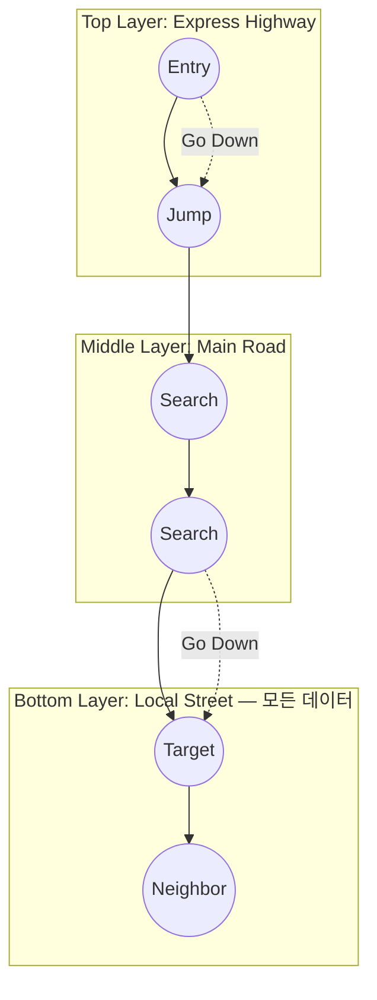
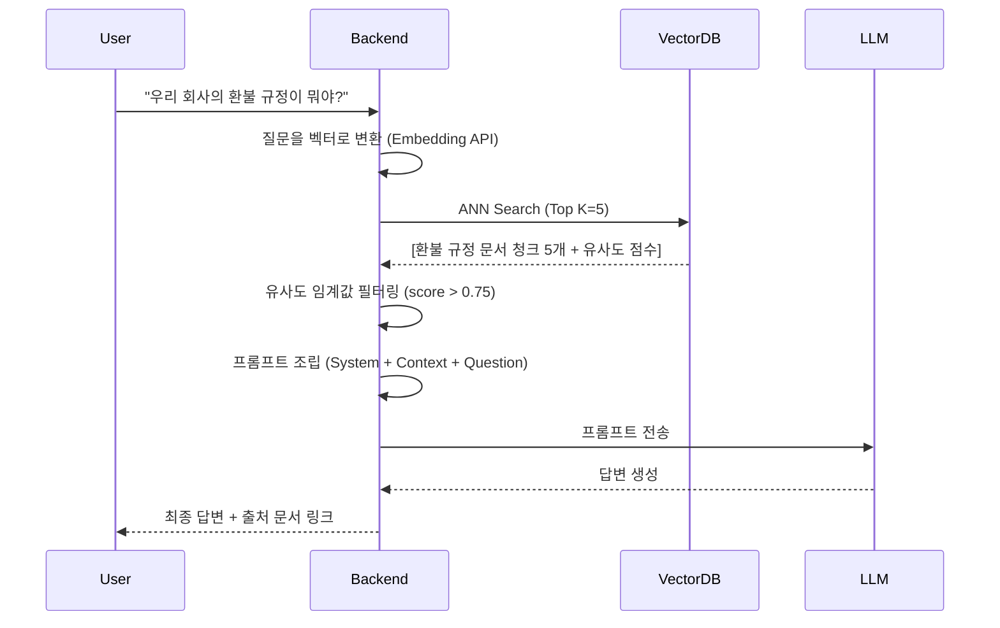

## 🤖 1. DB가 "의미"를 이해하려면?

`WHERE name = '강아지'`는 쉽습니다. 하지만 **"귀여운 동물 사진 찾아줘"**는 어떻게 쿼리할까요?
컴퓨터는 이미지를 모릅니다. 그래서 AI 모델을 통해 **숫자 배열(Vector)**로 바꿉니다.

```
"강아지" → [0.1, 0.9, 0.3, ...]   (1536차원)
"고양이" → [0.2, 0.8, 0.4, ...]
"자동차" → [0.9, 0.1, 0.0, ...]
```

이 숫자들의 **거리(Distance)**가 가까우면 의미가 비슷한 겁니다. 이를 **Embedding**이라 합니다.

### 거리 측정 방식

| 방식 | 수식 | 특징 | 사용 시나리오 |
|---|---|---|---|
| **Cosine Similarity** | 1 - cos(θ) | 방향(의미) 비교, 크기 무시 | 텍스트 유사도, 추천 |
| **Euclidean (L2)** | √Σ(aᵢ-bᵢ)² | 절대 거리 비교 | 이미지 검색, 클러스터링 |
| **Dot Product** | Σ(aᵢ×bᵢ) | 정규화된 벡터에서 Cosine과 동일 | 대규모 검색 (연산 빠름) |

> **실무 팁**: 텍스트 임베딩(OpenAI, Cohere 등)은 이미 정규화되어 있어서 **Cosine과 Dot Product 결과가 동일**합니다. Dot Product가 연산이 더 가벼워 대규모에서 유리합니다.

---

## 🎯 2. KNN vs ANN — 정확도와 속도의 트레이드오프

### KNN (K-Nearest Neighbors) — Brute Force

모든 벡터와 거리를 계산합니다. **100% 정확**하지만, 데이터가 100만 개면 100만 번 계산해야 합니다.

- 시간 복잡도: **O(n × d)** (n: 벡터 수, d: 차원)
- 1억 벡터 × 1536차원 → 수 초~수십 초 소요

### ANN (Approximate Nearest Neighbors) — 근사 검색

"99%만 정확해도 100배 빠르면 낫지 않나?" — ANN의 핵심 철학입니다.
**Recall@k**라는 지표로 정확도를 측정합니다:

```
Recall@10 = (ANN이 찾은 Top 10 ∩ 실제 Top 10) / 10
```

실무에서 Recall@10 ≥ 0.95면 충분하고, 이를 **1ms 이내**에 달성하는 것이 목표입니다.

---

## 🕸️ 3. HNSW: 고차원 공간의 내비게이션

**HNSW (Hierarchical Navigable Small World)**는 가장 널리 쓰이는 ANN 알고리즘입니다.

### 계층형 그래프 구조

마치 **고속도로 → 국도 → 골목길**을 타는 것과 같습니다.


```mermaid
graph TD
    subgraph Layer 2 [Top Layer: Express Highway]
    A1((Entry)) --> B1((Jump))
    end
    
    subgraph Layer 1 [Middle Layer: Main Road]
    B1 --> C1((Search)) --> D1((Search))
    end
    
    subgraph Layer 0 [Bottom Layer: Local Street — 모든 데이터]
    D1 --> E1((Target)) --> F1((Neighbor))
    end
    
    A1 -.->|Go Down| B1
    D1 -.->|Go Down| E1
```

1. **Layer 2 (Top)**: 극소수 노드만 존재. 대략적인 위치로 **점프**합니다.
2. **Layer 1 (Mid)**: 더 많은 노드. Greedy Search로 목표에 접근합니다.
3. **Layer 0 (Base)**: **모든 데이터**가 연결. 최종적으로 가장 가까운 이웃을 정밀 탐색합니다.

### HNSW 핵심 파라미터

| 파라미터 | 의미 | 기본값 | 올리면 | 내리면 |
|---|---|---|---|---|
| **M** | 각 노드의 최대 이웃 수 | 16 | Recall↑, 메모리↑, 빌드↑ | 메모리↓, Recall↓ |
| **efConstruction** | 인덱스 빌드 시 탐색 범위 | 200 | 인덱스 품질↑, 빌드 시간↑ | 빌드 빠름, 품질↓ |
| **efSearch** | 검색 시 탐색 범위 | 50~200 | Recall↑, 지연↑ | 빠름, Recall↓ |

### 튜닝 가이드

```python
# Milvus 예시: 파라미터 조합별 벤치마크
index_params = {
    "index_type": "HNSW",
    "metric_type": "IP",  # Inner Product (= Dot Product)
    "params": {
        "M": 32,              # 높은 Recall 필요 시
        "efConstruction": 256  # 빌드 시간 여유 있을 때
    }
}

search_params = {
    "metric_type": "IP",
    "params": {
        "ef": 128  # Recall@10 > 0.98 목표
    }
}
```

**튜닝 순서**: `efSearch`를 먼저 조정(런타임 변경 가능) → 부족하면 `M`과 `efConstruction` 올려서 리빌드

---

## 📊 4. 다른 ANN 알고리즘들

HNSW만 있는 게 아닙니다. 데이터 규모와 제약 조건에 따라 다른 선택지가 있습니다.

### IVF (Inverted File Index)

벡터 공간을 **K개 클러스터(Voronoi Cell)**로 나누고, 검색 시 가장 가까운 `nprobe`개 클러스터만 탐색합니다.

```
전체 100만 벡터 → 1,000개 클러스터
검색 시 nprobe=10 → 10개 클러스터의 1만 벡터만 비교
→ 100배 빨라짐
```

- **장점**: 메모리 효율이 좋음 (인덱스가 작음)
- **단점**: 클러스터 경계에 걸친 벡터를 놓칠 수 있음

### PQ (Product Quantization) — 벡터 압축

1536차원 벡터를 **192개 서브벡터(8차원씩)**로 쪼갠 뒤, 각 서브벡터를 256개 코드북 중 하나로 대체합니다.

```
원본: 1536차원 × 4byte(float32) = 6,144 byte/벡터
PQ:   192개 서브코드 × 1byte    =   192 byte/벡터  → 32배 압축!
```

- **장점**: 메모리를 극적으로 줄임 → 10억 벡터도 RAM에 적재 가능
- **단점**: 압축 손실로 Recall 약간 감소

### IVF-PQ 조합

실무에서 대규모(1억+) 데이터셋은 IVF로 후보를 줄이고, PQ로 메모리를 절약하는 **IVF-PQ** 조합을 많이 씁니다.

### 알고리즘 선택 가이드

| 데이터 규모 | 메모리 여유 | 권장 인덱스 |
|---|---|---|
| < 100만 | 충분 | **HNSW** (최고 Recall, 가장 단순) |
| 100만 ~ 1억 | 보통 | **HNSW** 또는 **IVF-HNSW** |
| > 1억 | 부족 | **IVF-PQ** 또는 **ScaNN** |
| 실시간 업데이트 중요 | — | **HNSW** (삽입/삭제 유연) |
| 배치 빌드 후 읽기 전용 | — | **IVF-PQ** (빌드 후 고정) |

---

## 🧠 5. RAG 아키텍처 심화 — 백엔드 엔지니어의 역할

LLM(ChatGPT)은 최신 정보를 모릅니다. 그래서 백엔드가 "컨닝 페이퍼"를 줘야 합니다. 이를 **RAG (Retrieval-Augmented Generation)**라 합니다.


```mermaid
sequenceDiagram
    participant User
    participant Backend
    participant VectorDB
    participant LLM
    
    User->>Backend: "우리 회사의 환불 규정이 뭐야?"
    Backend->>Backend: 질문을 벡터로 변환 (Embedding API)
    Backend->>VectorDB: ANN Search (Top K=5)
    VectorDB-->>Backend: [환불 규정 문서 청크 5개 + 유사도 점수]
    
    Backend->>Backend: 유사도 임계값 필터링 (score > 0.75)
    Backend->>Backend: 프롬프트 조립 (System + Context + Question)
    Backend->>LLM: 프롬프트 전송
    LLM-->>Backend: 답변 생성
    Backend-->>User: 최종 답변 + 출처 문서 링크
```

### Chunking 전략 — 검색 품질의 80%를 결정

문서를 잘게 쪼개는 방식이 검색 정확도를 좌우합니다.

| 전략 | 방식 | 장점 | 단점 |
|---|---|---|---|
| **Fixed Size** | 512토큰씩 고정 분할 | 구현 단순 | 문맥 단절 |
| **Overlap** | 512토큰 + 50토큰 오버랩 | 경계 정보 보존 | 저장 공간 증가 |
| **Semantic** | 문단/섹션 단위 | 의미 단위 유지 | 크기 불균일 |
| **Recursive** | 큰 단위 → 작은 단위 순 시도 | 유연성 | 구현 복잡 |
| **Parent-Child** | 작은 청크로 검색, 큰 청크를 LLM에 전달 | 정밀 검색 + 풍부한 컨텍스트 | 2단계 조회 필요 |

```python
# LangChain: Recursive Character Splitter (실무 권장)
from langchain.text_splitter import RecursiveCharacterTextSplitter

splitter = RecursiveCharacterTextSplitter(
    chunk_size=500,
    chunk_overlap=50,
    separators=["\n\n", "\n", ". ", " ", ""],  # 우선순위 순
    length_function=len
)
chunks = splitter.split_text(document_text)
```

### 검색 품질 개선 테크닉

**1. Hybrid Search (키워드 + 벡터)**
```
최종 점수 = α × BM25_score + (1-α) × vector_similarity
```
- "RFC 7231" 같은 고유명사는 키워드 검색이 더 정확
- "에러 처리 패턴" 같은 의미 검색은 벡터가 우수
- α = 0.3~0.5 권장

**2. Reranking — 2단계 정밀 검증**
```
1단계: Vector DB에서 Top 20 후보 추출 (빠르지만 거칠음)
2단계: Cross-Encoder로 (질문, 청크) 쌍을 정밀 점수화 → Top 5 선택
```
- Cross-Encoder는 느리지만 정확도가 높음
- Cohere Rerank, BGE-reranker 등 사용

**3. Query Expansion / HyDE**
```
원본 질문: "환불 규정"
→ LLM이 가상 답변 생성: "고객은 구매일로부터 14일 이내에..."
→ 가상 답변을 임베딩해서 검색 (실제 답변과 더 유사한 벡터)
```

---

## 🏗️ 6. Vector DB 비교 — 어떤 걸 쓸까?

| DB | 타입 | HNSW | IVF-PQ | Hybrid Search | 특징 |
|---|---|---|---|---|---|
| **Pinecone** | Managed SaaS | ✅ | ✅ | ✅ | 운영 부담 0, 비용 높음 |
| **Milvus** | Self-hosted / Zilliz Cloud | ✅ | ✅ | ✅ | 고성능, 풍부한 인덱스, 학습곡선 |
| **Weaviate** | Self-hosted / Cloud | ✅ | ❌ | ✅ | GraphQL API, 모듈화 |
| **Qdrant** | Self-hosted / Cloud | ✅ | ❌ | ✅ | Rust 기반, 필터링 성능 우수 |
| **pgvector** | PostgreSQL 확장 | ✅ | ✅ | SQL 통합 | 기존 PG 인프라 활용, 소규모에 적합 |
| **ChromaDB** | 임베디드 | ✅ | ❌ | ❌ | 프로토타이핑/로컬 개발용 |

### 선택 체크리스트

- ✅ **10만 이하 + 이미 PostgreSQL 사용 중** → `pgvector`
- ✅ **100만 이하 + 빠른 프로토타입** → Pinecone 또는 Qdrant Cloud
- ✅ **1억 이상 + 자체 인프라** → Milvus
- ✅ **필터 조건이 복잡** → Qdrant (payload 필터 성능 우수)

---

## 🔧 7. 운영 체크리스트

### 인덱스 빌드

- [ ] 데이터 규모에 맞는 인덱스 타입 선택 (HNSW vs IVF-PQ)
- [ ] 빌드 후 Recall@10 벤치마크 수행 (목표: ≥ 0.95)
- [ ] 인덱스 빌드 시간이 SLA를 초과하지 않는지 확인

### 검색 성능

- [ ] P99 지연 시간 모니터링 (목표: < 50ms)
- [ ] `efSearch` / `nprobe` 튜닝으로 Recall-Latency 균형 조정
- [ ] 동시 검색 부하 테스트 수행

### 데이터 관리

- [ ] 임베딩 모델 변경 시 **전체 리인덱싱** 필요 (모델 버전 관리)
- [ ] 문서 업데이트/삭제 시 벡터도 함께 갱신
- [ ] 메타데이터 필터 인덱스 설정 (날짜, 카테고리 등)

### 비용

- [ ] 벡터 차원 수 × 데이터 수 × float32(4B) = 최소 메모리 산정
- [ ] 예: 100만 × 1536차원 × 4B = **5.7GB** (인덱스 오버헤드 별도)

---

## 📚 8. 연관 학습

- [Data Structure & Complexity](/learning/deep-dive/deep-dive-data-structure-complexity/) — 기본 자료구조와 시간 복잡도
- [NoSQL Concepts](/learning/deep-dive/deep-dive-nosql-concepts/) — 비관계형 DB 개념과 선택 기준
- [Elasticsearch Basics](/learning/deep-dive/deep-dive-elasticsearch-basics/) — 역인덱스 기반 텍스트 검색과의 비교
- [Database Indexing](/learning/deep-dive/deep-dive-database-indexing/) — B-Tree/LSM 인덱스와의 차이
- [Redis Advanced](/learning/deep-dive/deep-dive-redis-advanced/) — 캐시 레이어와 벡터 검색 조합

---

## 요약

| 개념 | 핵심 |
|---|---|
| **Embedding** | 의미를 고차원 좌표(벡터)로 변환 |
| **ANN** | 정확도를 약간 희생하고 속도를 수십~수백 배 향상 |
| **HNSW** | 계층형 그래프로 위→아래 좁혀가는 고속 검색. 가장 범용적 |
| **IVF-PQ** | 클러스터링 + 압축으로 대규모 데이터셋 처리 |
| **RAG** | Vector DB + LLM을 연결하는 아키텍처 |
| **Chunking** | 문서 분할 전략이 검색 품질의 80%를 결정 |
| **Hybrid Search** | BM25 + 벡터 결합으로 고유명사/의미 검색 모두 커버 |
