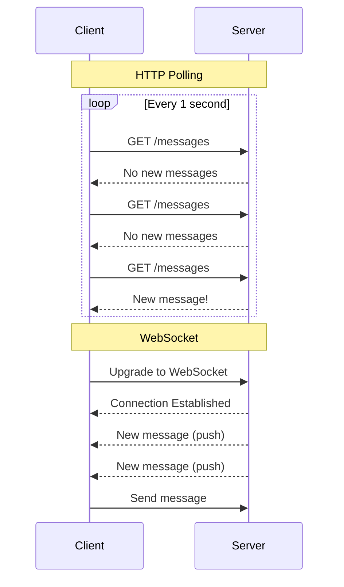
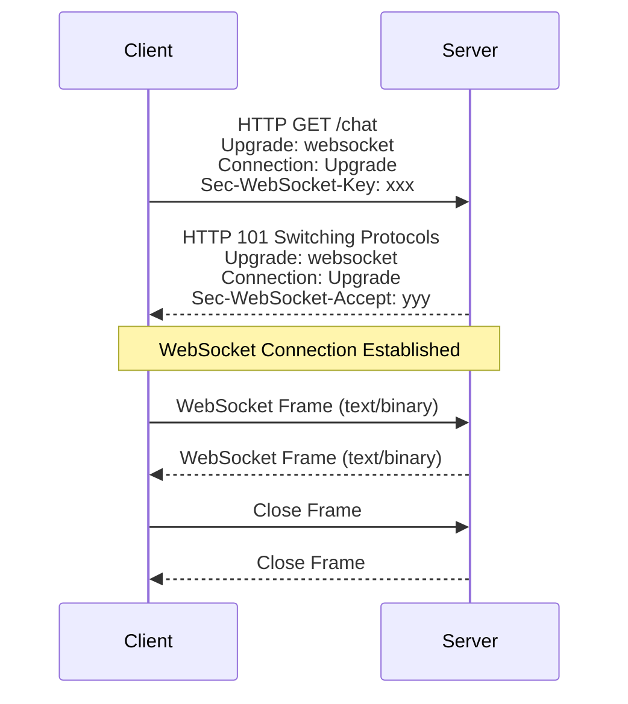
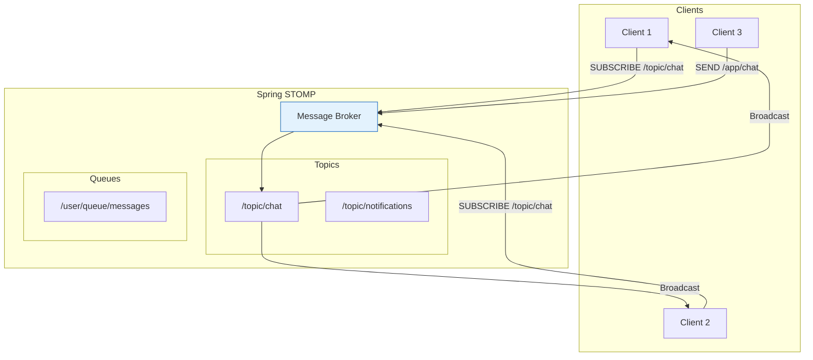
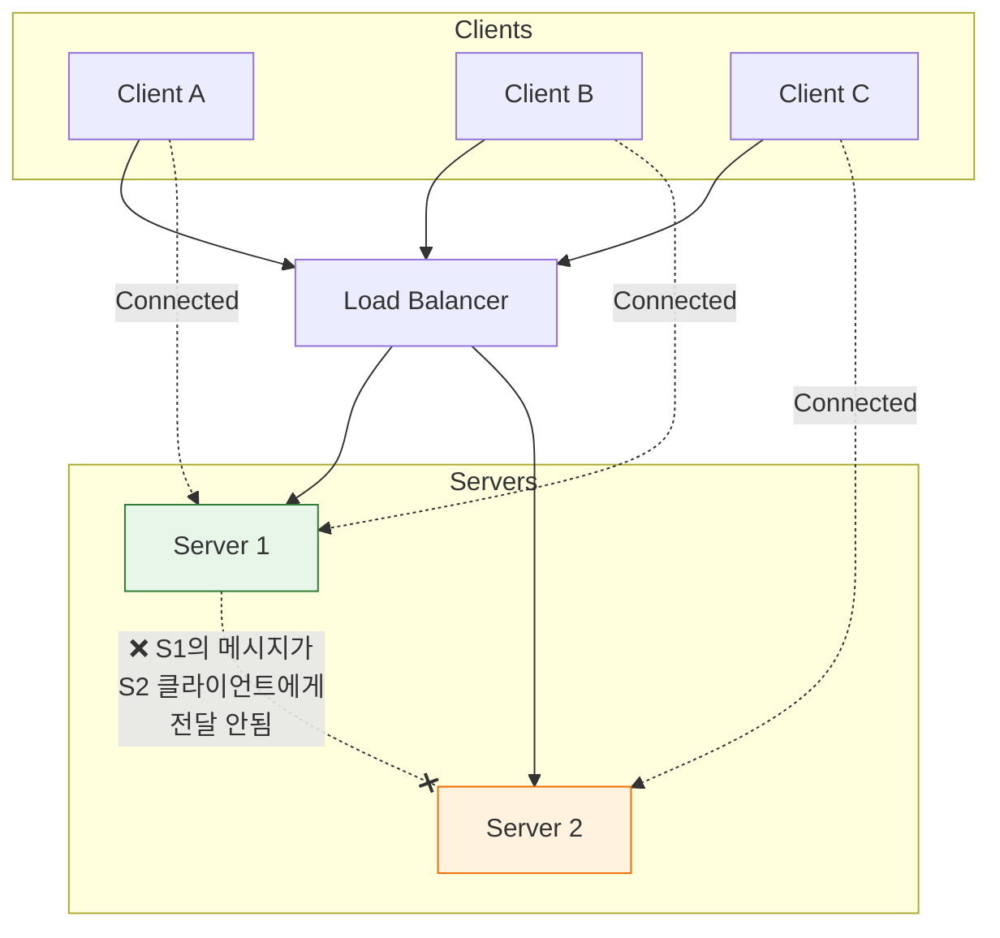
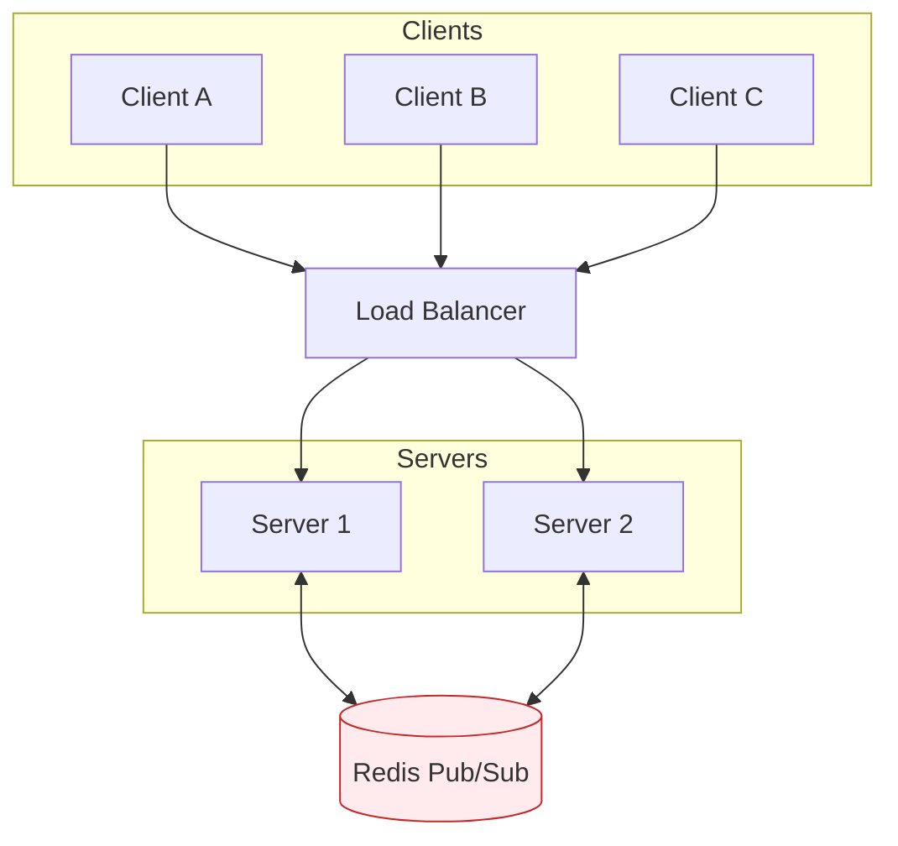

## 이 글에서 얻는 것

- **HTTP Polling vs WebSocket**의 본질적 차이를 이해합니다
- **STOMP 프로토콜**로 메시지 기반 통신을 구현합니다
- **스케일 아웃** 환경에서의 WebSocket 처리 전략을 알아봅니다

---

## HTTP Polling vs WebSocket

### 통신 방식 비교



| 방식 | 연결 | 지연시간 | 서버 부하 | 적합한 경우 |
|------|------|---------|----------|------------|
| Short Polling | 매번 새 연결 | 높음 (1~30초) | 높음 | 간헐적 업데이트 |
| Long Polling | 대기 후 응답 | 중간 | 중간 | 실시간 대안 |
| SSE | 단방향 스트림 | 낮음 | 낮음 | 서버→클라이언트 |
| **WebSocket** | 양방향 상시 연결 | 매우 낮음 | 연결당 리소스 | 채팅, 게임, 거래 |

### WebSocket Handshake



---

## Spring WebSocket 구현

### 기본 WebSocket 핸들러

```java
@Configuration
@EnableWebSocket
public class WebSocketConfig implements WebSocketConfigurer {
    
    @Override
    public void registerWebSocketHandlers(WebSocketHandlerRegistry registry) {
        registry.addHandler(chatHandler(), "/chat")
                .setAllowedOrigins("*");
    }
    
    @Bean
    public WebSocketHandler chatHandler() {
        return new ChatWebSocketHandler();
    }
}

@Component
public class ChatWebSocketHandler extends TextWebSocketHandler {
    
    private final Set<WebSocketSession> sessions = ConcurrentHashMap.newKeySet();
    
    @Override
    public void afterConnectionEstablished(WebSocketSession session) {
        sessions.add(session);
        log.info("Connected: {}", session.getId());
    }
    
    @Override
    protected void handleTextMessage(WebSocketSession session, TextMessage message) {
        // 모든 클라이언트에게 브로드캐스트
        for (WebSocketSession s : sessions) {
            if (s.isOpen()) {
                s.sendMessage(new TextMessage(
                    "User " + session.getId() + ": " + message.getPayload()
                ));
            }
        }
    }
    
    @Override
    public void afterConnectionClosed(WebSocketSession session, CloseStatus status) {
        sessions.remove(session);
        log.info("Disconnected: {}", session.getId());
    }
}
```

---

## STOMP 프로토콜

### STOMP (Simple Text Oriented Messaging Protocol)



### Spring STOMP 설정

```java
@Configuration
@EnableWebSocketMessageBroker
public class WebSocketStompConfig implements WebSocketMessageBrokerConfigurer {
    
    @Override
    public void configureMessageBroker(MessageBrokerRegistry config) {
        // 클라이언트가 구독할 prefix
        config.enableSimpleBroker("/topic", "/queue");
        
        // 서버로 메시지 보낼 때 prefix
        config.setApplicationDestinationPrefixes("/app");
        
        // 특정 사용자에게 메시지 보낼 때 prefix
        config.setUserDestinationPrefix("/user");
    }
    
    @Override
    public void registerStompEndpoints(StompEndpointRegistry registry) {
        registry.addEndpoint("/ws")
                .setAllowedOrigins("*")
                .withSockJS();  // SockJS fallback
    }
}
```

### 메시지 컨트롤러

```java
@Controller
public class ChatController {
    
    @Autowired
    private SimpMessagingTemplate messagingTemplate;
    
    // 클라이언트 → 서버 → 모든 구독자
    @MessageMapping("/chat.send")
    @SendTo("/topic/chat")
    public ChatMessage sendMessage(ChatMessage message) {
        message.setTimestamp(LocalDateTime.now());
        return message;
    }
    
    // 특정 사용자에게만 전송
    @MessageMapping("/chat.private")
    public void sendPrivateMessage(PrivateMessage message) {
        messagingTemplate.convertAndSendToUser(
            message.getRecipient(),
            "/queue/messages",
            message
        );
    }
    
    // 서버에서 직접 브로드캐스트
    public void broadcastNotification(String notification) {
        messagingTemplate.convertAndSend("/topic/notifications", notification);
    }
}

@Getter @Setter
public class ChatMessage {
    private String sender;
    private String content;
    private LocalDateTime timestamp;
}
```

### 클라이언트 (JavaScript)

```javascript
// STOMP.js 사용
const socket = new SockJS('/ws');
const stompClient = Stomp.over(socket);

stompClient.connect({}, function(frame) {
    console.log('Connected: ' + frame);
    
    // 채팅방 구독
    stompClient.subscribe('/topic/chat', function(message) {
        const chatMessage = JSON.parse(message.body);
        showMessage(chatMessage);
    });
    
    // 개인 메시지 구독
    stompClient.subscribe('/user/queue/messages', function(message) {
        showPrivateMessage(JSON.parse(message.body));
    });
});

// 메시지 전송
function sendMessage(content) {
    stompClient.send('/app/chat.send', {}, JSON.stringify({
        sender: username,
        content: content
    }));
}
```

---

## 스케일 아웃 전략

### 문제: 다중 서버 환경



### 해결: External Message Broker



### Redis Pub/Sub 설정

```java
@Configuration
@EnableWebSocketMessageBroker
public class WebSocketConfig implements WebSocketMessageBrokerConfigurer {
    
    @Override
    public void configureMessageBroker(MessageBrokerRegistry config) {
        // Redis를 외부 브로커로 사용
        config.enableStompBrokerRelay("/topic", "/queue")
              .setRelayHost("redis-host")
              .setRelayPort(6379);
        
        config.setApplicationDestinationPrefixes("/app");
    }
}
```

### RabbitMQ STOMP 설정

```java
@Configuration
public class WebSocketConfig implements WebSocketMessageBrokerConfigurer {
    
    @Override
    public void configureMessageBroker(MessageBrokerRegistry config) {
        // RabbitMQ STOMP 플러그인 사용
        config.enableStompBrokerRelay("/topic", "/queue")
              .setRelayHost("rabbitmq-host")
              .setRelayPort(61613)  // STOMP port
              .setClientLogin("guest")
              .setClientPasscode("guest");
    }
}
```

---

## 인증 및 보안

### WebSocket 인증

```java
@Configuration
public class WebSocketSecurityConfig {
    
    @Bean
    public ChannelInterceptor authInterceptor() {
        return new ChannelInterceptor() {
            @Override
            public Message<?> preSend(Message<?> message, MessageChannel channel) {
                StompHeaderAccessor accessor = 
                    StompHeaderAccessor.wrap(message);
                
                if (StompCommand.CONNECT.equals(accessor.getCommand())) {
                    String token = accessor.getFirstNativeHeader("Authorization");
                    
                    if (token != null && token.startsWith("Bearer ")) {
                        String jwt = token.substring(7);
                        Authentication auth = jwtTokenProvider.getAuthentication(jwt);
                        accessor.setUser(auth);
                    }
                }
                return message;
            }
        };
    }
}
```

### 메시지 레벨 보안

```java
@Configuration
@EnableWebSocketSecurity
public class WebSocketSecurityConfig {
    
    @Bean
    AuthorizationManager<Message<?>> messageAuthorizationManager() {
        return messages -> {
            // /topic/admin/* 은 ADMIN 역할만
            // /user/** 는 인증된 사용자만
            // 나머지는 모두 허용
        };
    }
}
```

---

## 요약

### WebSocket 사용 시점

| 적합 | 부적합 |
|-----|-------|
| 실시간 채팅 | 단순 정보 조회 |
| 실시간 알림 | 간헐적 업데이트 |
| 온라인 게임 | RESTful API 대체 |
| 주식/거래 앱 | 파일 전송 |
| 협업 도구 | SEO 필요 |

### 핵심 포인트

- **STOMP**: 메시지 기반 프로토콜로 구독/발행 모델 지원
- **SockJS**: WebSocket 미지원 브라우저 폴백
- **스케일 아웃**: Redis/RabbitMQ로 서버 간 메시지 동기화
- **인증**: CONNECT 시점 토큰 검증

---

## 🔗 Related Deep Dive

- **[Spring WebFlux](/learning/deep-dive/deep-dive-spring-webflux/)**: Reactive 스트림과 논블로킹 I/O.
- **[Kafka 기본](/learning/deep-dive/deep-dive-kafka-foundations/)**: 대용량 메시지 스트리밍.
