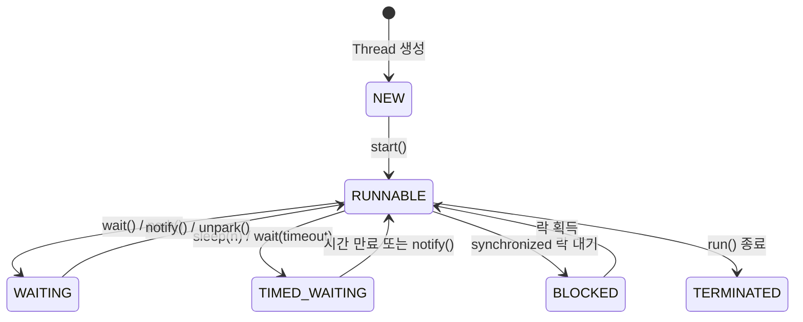

# API 성능 문제 해결 정리

## Q1. Thread Dump는 어떻게 분석하나요?

### 답변

**Thread Dump**는 **특정 시점의 모든 스레드 상태 스냅샷**으로, 성능 문제 진단에 핵심적입니다.

### Thread Dump 수집 방법

```bash
# 1. jstack 사용 (권장)
jstack <PID> > thread_dump.txt

# 2. kill 명령어 사용 (Unix/Linux)
kill -3 <PID>
# → catalina.out 또는 application.log에 출력됨

# 3. jcmd 사용 (JDK 7+)
jcmd <PID> Thread.print > thread_dump.txt

# 4. JVisualVM (GUI)
# Tools → Thread Dump
```

### Thread Dump 읽는 법

**Thread Dump 예시**:

```
"http-nio-8080-exec-10" #25 daemon prio=5 os_prio=0 tid=0x00007f8c4c001000 nid=0x1a2b waiting on condition [0x00007f8c2d5fe000]
   java.lang.Thread.State: WAITING (parking)
        at sun.misc.Unsafe.park(Native Method)
        - parking to wait for  <0x00000000e1234560> (a java.util.concurrent.locks.AbstractQueuedSynchronizer$ConditionObject)
        at java.util.concurrent.locks.LockSupport.park(LockSupport.java:175)
        at java.util.concurrent.locks.AbstractQueuedSynchronizer$ConditionObject.await(AbstractQueuedSynchronizer.java:2039)
        at org.apache.tomcat.util.threads.TaskQueue.take(TaskQueue.java:107)
        at org.apache.tomcat.util.threads.TaskQueue.take(TaskQueue.java:33)
```

**주요 정보**:
1. **스레드 이름**: `http-nio-8080-exec-10`
2. **스레드 ID**: `tid=0x00007f8c4c001000`
3. **스레드 상태**: `WAITING (parking)`
4. **Stack Trace**: 메서드 호출 순서

### Thread 상태 종류

| 상태 | 설명 | 원인 |
|------|------|------|
| RUNNABLE | 실행 중 또는 실행 가능 | 정상 |
| WAITING | 무한 대기 | wait(), park() |
| TIMED_WAITING | 시간 제한 대기 | sleep(), wait(timeout) |
| BLOCKED | 모니터 락 대기 | synchronized |
| TERMINATED | 종료됨 | 정상 |



### 문제 패턴 분석

**패턴 1: Deadlock (교착 상태)**:

```
Found one Java-level deadlock:
=============================
"Thread-1":
  waiting to lock monitor 0x00007f8c4c002340 (object 0x00000000e1234560, a java.lang.Object),
  which is held by "Thread-2"
"Thread-2":
  waiting to lock monitor 0x00007f8c4c002450 (object 0x00000000e1234670, a java.lang.Object),
  which is held by "Thread-1"

Java stack information for the threads listed above:
===================================================
"Thread-1":
        at com.example.Service.methodA(Service.java:10)
        - waiting to lock <0x00000000e1234560> (a java.lang.Object)
        - locked <0x00000000e1234670> (a java.lang.Object)

"Thread-2":
        at com.example.Service.methodB(Service.java:20)
        - waiting to lock <0x00000000e1234670> (a java.lang.Object)
        - locked <0x00000000e1234560> (a java.lang.Object)
```

**원인 코드**:

```java
// ❌ Deadlock 발생 코드
public class DeadlockExample {
    private final Object lock1 = new Object();
    private final Object lock2 = new Object();

    public void methodA() {
        synchronized (lock1) {          // Thread-1: lock1 획득
            Thread.sleep(100);
            synchronized (lock2) {      // Thread-1: lock2 대기 (Thread-2가 보유)
                // 작업
            }
        }
    }

    public void methodB() {
        synchronized (lock2) {          // Thread-2: lock2 획득
            Thread.sleep(100);
            synchronized (lock1) {      // Thread-2: lock1 대기 (Thread-1이 보유)
                // 작업
            }
        }
    }
}

// ✅ 해결: 락 순서 통일
public void methodA() {
    synchronized (lock1) {
        synchronized (lock2) {
            // 작업
        }
    }
}

public void methodB() {
    synchronized (lock1) {      // lock1 먼저 획득
        synchronized (lock2) {  // lock2 나중에 획득
            // 작업
        }
    }
}
```

**패턴 2: Thread Pool Exhaustion (스레드 고갈)**:

```
"http-nio-8080-exec-1" WAITING
"http-nio-8080-exec-2" WAITING
"http-nio-8080-exec-3" WAITING
...
"http-nio-8080-exec-200" WAITING  (모든 스레드가 WAITING!)

at java.net.SocketInputStream.socketRead0(Native Method)
at java.net.SocketInputStream.socketRead(SocketInputStream.java:116)
at java.net.SocketInputStream.read(SocketInputStream.java:171)
```

**원인**: 모든 스레드가 외부 API 응답 대기 중 → 새 요청 처리 불가

**해결**:

```java
// ❌ 동기 호출 (스레드 블로킹)
@GetMapping("/users/{id}")
public User getUser(@PathVariable Long id) {
    // 외부 API 호출 (5초 소요)
    // → 스레드가 5초간 블로킹됨
    return restTemplate.getForObject("https://api.example.com/users/" + id, User.class);
}

// ✅ 비동기 호출 (스레드 해제)
@GetMapping("/users/{id}")
public CompletableFuture<User> getUser(@PathVariable Long id) {
    return CompletableFuture.supplyAsync(() ->
        restTemplate.getForObject("https://api.example.com/users/" + id, User.class),
        asyncExecutor
    );
}

// ✅ Timeout 설정
@Bean
public RestTemplate restTemplate() {
    SimpleClientHttpRequestFactory factory = new SimpleClientHttpRequestFactory();
    factory.setConnectTimeout(3000);  // 연결 타임아웃: 3초
    factory.setReadTimeout(5000);     // 읽기 타임아웃: 5초
    return new RestTemplate(factory);
}
```

**패턴 3: CPU 스파이크 (무한 루프)**:

```
"worker-thread-1" RUNNABLE
at com.example.Service.process(Service.java:50)  (반복)
at com.example.Service.process(Service.java:50)
at com.example.Service.process(Service.java:50)
```

**원인**: 특정 메서드가 무한 루프

```java
// ❌ 무한 루프
public void process(List<Item> items) {
    int i = 0;
    while (i < items.size()) {
        process(items.get(i));
        // i++; 누락! → 무한 루프
    }
}

// ✅ 수정
public void process(List<Item> items) {
    for (Item item : items) {
        process(item);
    }
}
```

### 꼬리 질문: Thread Dump를 여러 번 수집하는 이유는?

**1번만 수집**: 특정 시점의 스냅샷 → 패턴 파악 어려움

**3~5번 수집 (10초 간격)**: 시간에 따른 변화 추적 → 패턴 명확

```bash
# 10초 간격으로 3번 수집
jstack <PID> > thread_dump_1.txt
sleep 10
jstack <PID> > thread_dump_2.txt
sleep 10
jstack <PID> > thread_dump_3.txt

# 분석:
# Dump 1: Thread A는 methodA() 실행 중
# Dump 2: Thread A는 여전히 methodA() 실행 중 (동일한 줄)
# Dump 3: Thread A는 여전히 methodA() 실행 중 (동일한 줄)
# → Thread A가 methodA()에서 멈춰 있음! (무한 루프 또는 Deadlock)
```

---


---

👉 **[다음 편: API 성능 (Part 2: Slow Query 최적화, 심화)](/learning/qna/api-performance-qna-part2/)**
