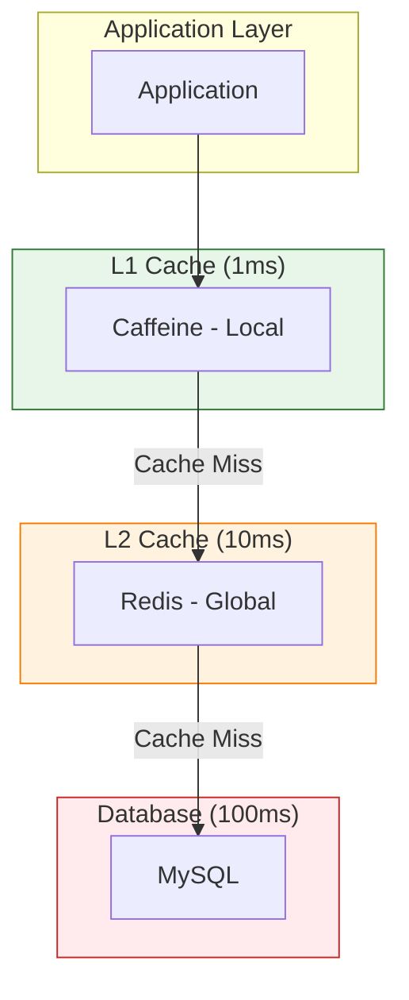

## Q1. 캐싱의 기본 개념과 Cache-Aside, Write-Through, Write-Behind 전략을 설명해주세요.

### 답변

**캐싱(Caching)**은 자주 사용되는 데이터를 빠른 저장소(메모리)에 임시 저장하여 응답 속도를 향상시키는 기법입니다.

#### 캐시 계층 구조



#### 1. Cache-Aside (Lazy Loading)

**가장 일반적인 패턴 - 필요할 때만 캐싱**

```java
@Service
@RequiredArgsConstructor
@Slf4j
public class UserService {

    private final UserRepository userRepository;
    private final RedisTemplate<String, User> redisTemplate;

    public User getUser(Long userId) {
        String cacheKey = "user:" + userId;

        // 1. 캐시 조회
        User cachedUser = redisTemplate.opsForValue().get(cacheKey);

        if (cachedUser != null) {
            log.info("Cache hit: {}", userId);
            return cachedUser;  // ✅ 캐시 히트
        }

        // 2. 캐시 미스 → DB 조회
        log.info("Cache miss: {}", userId);
        User user = userRepository.findById(userId)
            .orElseThrow(() -> new UserNotFoundException(userId));

        // 3. 캐시에 저장 (TTL 1시간)
        redisTemplate.opsForValue().set(cacheKey, user, Duration.ofHours(1));

        return user;
    }

    public void updateUser(Long userId, UserUpdateRequest request) {
        // 1. DB 업데이트
        User user = userRepository.findById(userId).orElseThrow();
        user.update(request);
        userRepository.save(user);

        // 2. 캐시 무효화
        String cacheKey = "user:" + userId;
        redisTemplate.delete(cacheKey);

        log.info("Cache invalidated: {}", userId);
    }
}
```

**장점:**
- 필요한 데이터만 캐싱 (메모리 효율적)
- 구현 간단
- 캐시 장애 시에도 서비스 가능 (DB fallback)

**단점:**
- 첫 요청은 느림 (Cache miss)
- DB와 캐시 불일치 가능성

**적합한 경우:**
- 읽기가 많고 쓰기가 적을 때
- 모든 데이터를 캐싱할 필요 없을 때

#### 2. Write-Through

**쓰기 시 DB + 캐시 동시 업데이트**

```java
@Service
@RequiredArgsConstructor
public class ProductService {

    private final ProductRepository productRepository;
    private final RedisTemplate<String, Product> redisTemplate;

    @Transactional
    public Product updateProduct(Long productId, ProductUpdateRequest request) {
        String cacheKey = "product:" + productId;

        // 1. DB 업데이트
        Product product = productRepository.findById(productId).orElseThrow();
        product.update(request);
        Product savedProduct = productRepository.save(product);

        // 2. 캐시에도 동시에 업데이트
        redisTemplate.opsForValue().set(cacheKey, savedProduct, Duration.ofHours(1));

        log.info("Write-through: DB and cache updated for product {}", productId);

        return savedProduct;
    }

    public Product getProduct(Long productId) {
        String cacheKey = "product:" + productId;

        // 캐시 조회
        Product cachedProduct = redisTemplate.opsForValue().get(cacheKey);

        if (cachedProduct != null) {
            return cachedProduct;  // 항상 최신 데이터 보장
        }

        // 캐시 미스 → DB 조회 후 캐싱
        Product product = productRepository.findById(productId).orElseThrow();
        redisTemplate.opsForValue().set(cacheKey, product, Duration.ofHours(1));

        return product;
    }
}
```

**장점:**
- DB와 캐시 일관성 보장
- 캐시 히트 시 항상 최신 데이터

**단점:**
- 쓰기 성능 저하 (2번 쓰기)
- 사용되지 않는 데이터도 캐싱 (메모리 낭비)

**적합한 경우:**
- 읽기와 쓰기가 모두 빈번할 때
- 데이터 일관성이 매우 중요할 때

#### 3. Write-Behind (Write-Back)

**쓰기 시 캐시만 업데이트, DB는 비동기로 업데이트**

```java
@Service
@RequiredArgsConstructor
@Slf4j
public class ViewCountService {

    private final RedisTemplate<String, String> redisTemplate;
    private final PostRepository postRepository;

    // 조회수 증가 (캐시만 업데이트)
    public void incrementViewCount(Long postId) {
        String cacheKey = "post:viewCount:" + postId;

        // ✅ Redis에만 증가 (매우 빠름)
        redisTemplate.opsForValue().increment(cacheKey, 1);

        log.info("View count incremented in cache: {}", postId);
    }

    // 정기적으로 DB에 반영 (배치)
    @Scheduled(fixedDelay = 60000)  // 1분마다
    @Transactional
    public void syncViewCountsToDatabase() {
        Set<String> keys = redisTemplate.keys("post:viewCount:*");

        if (keys == null || keys.isEmpty()) {
            return;
        }

        log.info("Syncing {} view counts to database", keys.size());

        for (String key : keys) {
            try {
                Long postId = Long.parseLong(key.split(":")[2]);
                String viewCountStr = redisTemplate.opsForValue().get(key);

                if (viewCountStr != null) {
                    int viewCount = Integer.parseInt(viewCountStr);

                    // DB 업데이트
                    postRepository.updateViewCount(postId, viewCount);

                    // 캐시에서 제거
                    redisTemplate.delete(key);

                    log.debug("Synced view count for post {}: {}", postId, viewCount);
                }

            } catch (Exception e) {
                log.error("Failed to sync view count for key: {}", key, e);
            }
        }
    }
}

// Repository
public interface PostRepository extends JpaRepository<Post, Long> {

    @Modifying
    @Query("UPDATE Post p SET p.viewCount = :viewCount WHERE p.id = :postId")
    void updateViewCount(@Param("postId") Long postId, @Param("viewCount") int viewCount);
}
```

**장점:**
- 쓰기 성능 극대화 (캐시만 업데이트)
- DB 부하 감소 (배치 처리)

**단점:**
- 캐시 장애 시 데이터 손실 위험
- DB와 캐시 일시적 불일치

**적합한 경우:**
- 쓰기가 매우 빈번할 때 (조회수, 좋아요)
- 일시적 데이터 손실 허용 가능할 때

#### 캐싱 전략 비교표

| 전략 | 읽기 성능 | 쓰기 성능 | 일관성 | 메모리 효율 | 적합한 사례 |
|------|----------|----------|--------|-----------|-----------|
| **Cache-Aside** | ⭐⭐⭐ | ⭐⭐⭐ | ⭐⭐ | ⭐⭐⭐ | 읽기 많음 (사용자 정보) |
| **Write-Through** | ⭐⭐⭐ | ⭐⭐ | ⭐⭐⭐ | ⭐⭐ | 일관성 중요 (재고) |
| **Write-Behind** | ⭐⭐⭐ | ⭐⭐⭐⭐⭐ | ⭐ | ⭐⭐ | 쓰기 많음 (조회수) |

### 꼬리 질문 1: Spring Cache Abstraction은 어떤 전략을 사용하나요?

**Cache-Aside 패턴**을 사용합니다.

```java
@Configuration
@EnableCaching
public class CacheConfig {

    @Bean
    public CacheManager cacheManager(RedisConnectionFactory connectionFactory) {
        RedisCacheConfiguration config = RedisCacheConfiguration.defaultCacheConfig()
            .entryTtl(Duration.ofHours(1))  // TTL 1시간
            .serializeKeysWith(
                RedisSerializationContext.SerializationPair.fromSerializer(
                    new StringRedisSerializer()
                )
            )
            .serializeValuesWith(
                RedisSerializationContext.SerializationPair.fromSerializer(
                    new GenericJackson2JsonRedisSerializer()
                )
            );

        return RedisCacheManager.builder(connectionFactory)
            .cacheDefaults(config)
            .build();
    }
}

@Service
public class UserService {

    @Cacheable(value = "users", key = "#userId")  // Cache-Aside
    public User getUser(Long userId) {
        // 1. 캐시 확인
        // 2. 캐시 미스 → 메서드 실행
        // 3. 결과를 캐시에 저장
        return userRepository.findById(userId).orElseThrow();
    }

    @CachePut(value = "users", key = "#userId")  // Write-Through
    public User updateUser(Long userId, UserUpdateRequest request) {
        User user = userRepository.findById(userId).orElseThrow();
        user.update(request);
        return userRepository.save(user);
        // DB 저장 후 캐시 업데이트
    }

    @CacheEvict(value = "users", key = "#userId")  // 캐시 삭제
    public void deleteUser(Long userId) {
        userRepository.deleteById(userId);
        // 캐시에서 제거
    }
}
```

### 꼬리 질문 2: Cache Stampede (Thunder Herd) 문제는 무엇이고 어떻게 해결하나요?

**문제 상황:**
```
┌────────┐  ┌────────┐  ┌────────┐
│Client 1│  │Client 2│  │Client 3│
└───┬────┘  └───┬────┘  └───┬────┘
    │           │           │
    │  Cache Miss (TTL 만료)
    ├───────────┼───────────┤
    │           │           │
    ▼           ▼           ▼
┌──────────────────────────────┐
│        Database              │  ⚠️ 동시에 100개 쿼리!
└──────────────────────────────┘
```

**해결 방법 1: Lock (Single Flight)**

```java
@Service
@RequiredArgsConstructor
public class UserService {

    private final LoadingCache<Long, User> userCache;
    private final UserRepository userRepository;

    @PostConstruct
    public void init() {
        // Caffeine Cache (로컬 캐시)
        this.userCache = Caffeine.newBuilder()
            .expireAfterWrite(Duration.ofMinutes(10))
            .maximumSize(10000)
            .build(userId -> {
                // 동일 키에 대해 동시에 1번만 실행
                log.info("Loading user from DB: {}", userId);
                return userRepository.findById(userId)
                    .orElseThrow(() -> new UserNotFoundException(userId));
            });
    }

    public User getUser(Long userId) {
        return userCache.get(userId);
        // 첫 요청만 DB 조회, 나머지는 대기 후 결과 공유
    }
}
```

**해결 방법 2: Early Expiration (확률적 조기 갱신)**

```java
@Service
public class ProductService {

    public Product getProduct(Long productId) {
        String cacheKey = "product:" + productId;

        ValueWrapper wrapper = redisTemplate.opsForValue().get(cacheKey);

        if (wrapper != null) {
            Product product = (Product) wrapper.getValue();
            long ttl = redisTemplate.getExpire(cacheKey, TimeUnit.SECONDS);

            // TTL이 10% 미만 남았을 때 확률적 갱신
            double probability = 1.0 - (ttl / 3600.0);  // 1시간 기준

            if (Math.random() < probability * 0.1) {
                // 백그라운드에서 갱신
                CompletableFuture.runAsync(() -> refreshCache(productId));
            }

            return product;
        }

        // 캐시 미스 → DB 조회
        return loadAndCache(productId);
    }

    private void refreshCache(Long productId) {
        Product product = productRepository.findById(productId).orElse(null);
        if (product != null) {
            String cacheKey = "product:" + productId;
            redisTemplate.opsForValue().set(cacheKey, product, Duration.ofHours(1));
        }
    }
}
```

---

## Q2. Local Cache (Caffeine)와 Global Cache (Redis)를 함께 사용하는 2-Level Cache를 설명해주세요.

### 답변

**2-Level Cache**: L1 (로컬 캐시) + L2 (글로벌 캐시)로 성능과 일관성 균형

```
┌─────────────────────────────────────┐
│          Application                │
│  ┌────────────────────────────┐     │
│  │  L1: Caffeine (Local)      │ 1ms │
│  │  - 각 서버마다 독립적       │     │
│  │  - 메모리 내 초고속         │     │
│  └────────────┬───────────────┘     │
└───────────────┼─────────────────────┘
                │ Cache Miss
                ▼
┌─────────────────────────────────────┐
│  L2: Redis (Global)                 │ 10ms
│  - 모든 서버가 공유                  │
│  - 네트워크 지연 있지만 빠름          │
└────────────┬────────────────────────┘
             │ Cache Miss
             ▼
┌─────────────────────────────────────┐
│  Database                           │ 100ms
└─────────────────────────────────────┘
```

#### 구현

```java
@Configuration
public class CacheConfig {

    @Bean
    public CacheManager cacheManager(RedisConnectionFactory connectionFactory) {
        // L1: Caffeine 설정
        CaffeineCache caffeineCache = new CaffeineCache(
            "users",
            Caffeine.newBuilder()
                .expireAfterWrite(5, TimeUnit.MINUTES)  // 5분
                .maximumSize(1000)
                .recordStats()  // 통계 수집
                .build()
        );

        // L2: Redis 설정
        RedisCacheConfiguration redisConfig = RedisCacheConfiguration.defaultCacheConfig()
            .entryTtl(Duration.ofHours(1))  // 1시간
            .serializeValuesWith(
                RedisSerializationContext.SerializationPair.fromSerializer(
                    new GenericJackson2JsonRedisSerializer()
                )
            );

        RedisCacheManager redisCacheManager = RedisCacheManager.builder(connectionFactory)
            .cacheDefaults(redisConfig)
            .build();

        // 2-Level Cache Manager
        return new CompositeCacheManager(
            new CaffeineCacheManager("users"),  // L1
            redisCacheManager  // L2
        );
    }
}

// Custom 2-Level Cache
@Component
@RequiredArgsConstructor
@Slf4j
public class TwoLevelCache {

    private final Cache<String, Object> localCache;  // Caffeine
    private final RedisTemplate<String, Object> redisTemplate;  // Redis

    @PostConstruct
    public void init() {
        this.localCache = Caffeine.newBuilder()
            .expireAfterWrite(Duration.ofMinutes(5))
            .maximumSize(1000)
            .build();
    }

    public <T> T get(String key, Class<T> type, Supplier<T> loader) {
        // 1. L1 캐시 조회 (Caffeine)
        Object cached = localCache.getIfPresent(key);
        if (cached != null) {
            log.debug("L1 cache hit: {}", key);
            return type.cast(cached);
        }

        // 2. L2 캐시 조회 (Redis)
        cached = redisTemplate.opsForValue().get(key);
        if (cached != null) {
            log.debug("L2 cache hit: {}", key);

            // L1 캐시에 저장 (write-back)
            localCache.put(key, cached);

            return type.cast(cached);
        }

        // 3. DB 조회 (Cache miss)
        log.debug("Cache miss, loading from DB: {}", key);
        T value = loader.get();

        // 4. L2 캐시에 저장 (Redis)
        redisTemplate.opsForValue().set(key, value, Duration.ofHours(1));

        // 5. L1 캐시에 저장 (Caffeine)
        localCache.put(key, value);

        return value;
    }

    public void evict(String key) {
        // L1, L2 모두 삭제
        localCache.invalidate(key);
        redisTemplate.delete(key);

        // 다른 서버의 L1 캐시 무효화 (Pub/Sub)
        redisTemplate.convertAndSend("cache:invalidate", key);
    }
}

// 사용
@Service
@RequiredArgsConstructor
public class UserService {

    private final TwoLevelCache twoLevelCache;
    private final UserRepository userRepository;

    public User getUser(Long userId) {
        String cacheKey = "user:" + userId;

        return twoLevelCache.get(
            cacheKey,
            User.class,
            () -> userRepository.findById(userId).orElseThrow()
        );
    }

    public void updateUser(Long userId, UserUpdateRequest request) {
        User user = userRepository.findById(userId).orElseThrow();
        user.update(request);
        userRepository.save(user);

        // 캐시 무효화
        twoLevelCache.evict("user:" + userId);
    }
}
```

#### Redis Pub/Sub으로 L1 캐시 동기화

```java
@Configuration
public class RedisPubSubConfig {

    @Bean
    public RedisMessageListenerContainer redisMessageListenerContainer(
            RedisConnectionFactory connectionFactory,
            CacheInvalidationListener listener) {

        RedisMessageListenerContainer container = new RedisMessageListenerContainer();
        container.setConnectionFactory(connectionFactory);

        container.addMessageListener(
            listener,
            new PatternTopic("cache:invalidate")
        );

        return container;
    }
}

@Component
@RequiredArgsConstructor
@Slf4j
public class CacheInvalidationListener implements MessageListener {

    private final Cache<String, Object> localCache;

    @Override
    public void onMessage(Message message, byte[] pattern) {
        String key = new String(message.getBody());

        log.info("Received cache invalidation message: {}", key);

        // 로컬 캐시 무효화
        localCache.invalidate(key);
    }
}
```

#### 2-Level Cache 장점

| 계층 | 속도 | 용량 | 일관성 | 적합한 데이터 |
|------|------|------|--------|-------------|
| **L1 (Caffeine)** | 1ms | 작음 (메모리) | 낮음 | 초고빈도 조회 (현재 사용자 세션) |
| **L2 (Redis)** | 10ms | 중간 | 높음 | 빈번한 조회 (상품 정보) |
| **DB** | 100ms | 큼 | 최고 | 영구 저장 |

### 꼬리 질문 1: Caffeine이 다른 로컬 캐시보다 좋은 이유는?

**Caffeine vs Guava Cache vs EhCache**

| 항목 | Caffeine | Guava Cache | EhCache |
|------|----------|-------------|---------|
| **성능** | 가장 빠름 (Window TinyLFU) | 빠름 | 중간 |
| **메모리 효율** | 우수 | 보통 | 보통 |
| **만료 정책** | 다양 (Write/Access 기반) | 기본적 | 다양 |
| **비동기 로딩** | ✅ | ❌ | ✅ |
| **통계** | 상세 | 기본 | 상세 |
| **Spring 지원** | ✅ | ✅ | ✅ |

**Caffeine의 Window TinyLFU 알고리즘:**
```java
@Configuration
public class CaffeineConfig {

    @Bean
    public Cache<String, Object> caffeineCache() {
        return Caffeine.newBuilder()
            // 크기 기반 제거 (LRU + LFU 결합)
            .maximumSize(10000)

            // 시간 기반 만료
            .expireAfterWrite(Duration.ofMinutes(5))  // 쓰기 후 5분
            .expireAfterAccess(Duration.ofMinutes(3))  // 마지막 접근 후 3분

            // 비동기 로딩
            .buildAsync((key, executor) -> {
                return CompletableFuture.supplyAsync(
                    () -> loadFromDatabase(key),
                    executor
                );
            });
    }
}
```

### 꼬리 질문 2: 캐시 크기를 어떻게 결정하나요?

**메모리 계산:**
```
캐시 크기 = (사용 가능한 메모리 * 0.7) / 평균 객체 크기

예시:
- 사용 가능한 메모리: 4GB
- 평균 User 객체 크기: 2KB
- 캐시 크기 = (4GB * 0.7) / 2KB = 1,400,000개
```

**모니터링으로 최적화:**
```java
@Component
@Slf4j
public class CacheMonitor {

    @Autowired
    private Cache<String, Object> cache;

    @Scheduled(fixedDelay = 60000)  // 1분마다
    public void logCacheStats() {
        CacheStats stats = cache.stats();

        double hitRate = stats.hitRate();
        long evictionCount = stats.evictionCount();
        long loadSuccessCount = stats.loadSuccessCount();
        long loadFailureCount = stats.loadFailureCount();

        log.info("Cache Stats - Hit Rate: {:.2f}%, Evictions: {}, Loads: {} (Success: {}, Failure: {})",
            hitRate * 100,
            evictionCount,
            loadSuccessCount + loadFailureCount,
            loadSuccessCount,
            loadFailureCount
        );

        // Hit Rate < 70% → 캐시 크기 증가 고려
        if (hitRate < 0.7) {
            log.warn("Cache hit rate is low: {:.2f}%", hitRate * 100);
        }
    }
}
```

---

## Q3. 캐시 무효화 (Cache Invalidation) 전략을 설명해주세요.

### 답변

> "There are only two hard things in Computer Science: cache invalidation and naming things." - Phil Karlton

#### 1. TTL (Time-To-Live) 기반 만료

**가장 간단한 방법 - 일정 시간 후 자동 만료**

```java
@Service
public class ProductService {

    @Cacheable(value = "products", key = "#productId")
    public Product getProduct(Long productId) {
        return productRepository.findById(productId).orElseThrow();
    }
}

// CacheConfig
@Bean
public RedisCacheManager cacheManager(RedisConnectionFactory connectionFactory) {
    Map<String, RedisCacheConfiguration> cacheConfigurations = new HashMap<>();

    // 상품 정보: 1시간
    cacheConfigurations.put("products",
        RedisCacheConfiguration.defaultCacheConfig()
            .entryTtl(Duration.ofHours(1))
    );

    // 사용자 정보: 30분
    cacheConfigurations.put("users",
        RedisCacheConfiguration.defaultCacheConfig()
            .entryTtl(Duration.ofMinutes(30))
    );

    return RedisCacheManager.builder(connectionFactory)
        .withInitialCacheConfigurations(cacheConfigurations)
        .build();
}
```

**장점:**
- 구현 간단
- 자동 정리 (메모리 누수 방지)

**단점:**
- TTL 동안 stale 데이터 제공 가능
- TTL 설정이 어려움 (너무 짧으면 성능 저하, 너무 길면 오래된 데이터)

#### 2. Event-Driven 무효화

**데이터 변경 시 즉시 캐시 삭제**

```java
@Service
@RequiredArgsConstructor
public class ProductService {

    private final ProductRepository productRepository;
    private final ApplicationEventPublisher eventPublisher;

    @Cacheable(value = "products", key = "#productId")
    public Product getProduct(Long productId) {
        return productRepository.findById(productId).orElseThrow();
    }

    @Transactional
    public Product updateProduct(Long productId, ProductUpdateRequest request) {
        Product product = productRepository.findById(productId).orElseThrow();
        product.update(request);
        Product savedProduct = productRepository.save(product);

        // ✅ 이벤트 발행
        eventPublisher.publishEvent(new ProductUpdatedEvent(productId));

        return savedProduct;
    }
}

// 이벤트 리스너
@Component
@RequiredArgsConstructor
@Slf4j
public class ProductCacheInvalidationListener {

    private final CacheManager cacheManager;

    @EventListener
    public void handleProductUpdated(ProductUpdatedEvent event) {
        Cache cache = cacheManager.getCache("products");

        if (cache != null) {
            cache.evict(event.getProductId());
            log.info("Cache invalidated for product: {}", event.getProductId());
        }
    }
}

// 이벤트 클래스
public record ProductUpdatedEvent(Long productId) {}
```

#### 3. Dependency-Based 무효화

**연관 캐시 함께 삭제**

```java
@Service
@RequiredArgsConstructor
public class OrderService {

    private final OrderRepository orderRepository;
    private final CacheManager cacheManager;

    @Transactional
    public Order createOrder(OrderRequest request) {
        Order order = orderRepository.save(new Order(request));

        // 주문 생성 시 연관 캐시 삭제
        invalidateRelatedCaches(order);

        return order;
    }

    private void invalidateRelatedCaches(Order order) {
        // 1. 사용자 주문 목록 캐시 삭제
        evictCache("userOrders", "user:" + order.getUserId());

        // 2. 상품 재고 캐시 삭제
        for (OrderItem item : order.getItems()) {
            evictCache("productStock", "product:" + item.getProductId());
        }

        // 3. 주문 통계 캐시 삭제
        evictCache("orderStats", "daily:" + LocalDate.now());

        log.info("Invalidated caches related to order: {}", order.getId());
    }

    private void evictCache(String cacheName, String key) {
        Cache cache = cacheManager.getCache(cacheName);
        if (cache != null) {
            cache.evict(key);
        }
    }
}
```

#### 4. Cache Tagging

**태그 기반 일괄 무효화 (Redis)**

```java
@Service
@RequiredArgsConstructor
public class PostService {

    private final RedisTemplate<String, Object> redisTemplate;
    private final PostRepository postRepository;

    public Post getPost(Long postId) {
        String cacheKey = "post:" + postId;

        Post cached = (Post) redisTemplate.opsForValue().get(cacheKey);
        if (cached != null) {
            return cached;
        }

        Post post = postRepository.findById(postId).orElseThrow();

        // 캐시 저장 + 태그 추가
        redisTemplate.opsForValue().set(cacheKey, post, Duration.ofHours(1));

        // 태그 추가 (카테고리별 묶음)
        String tagKey = "tag:category:" + post.getCategoryId();
        redisTemplate.opsForSet().add(tagKey, cacheKey);

        return post;
    }

    // 카테고리별 캐시 일괄 삭제
    public void invalidateByCategoryId(Long categoryId) {
        String tagKey = "tag:category:" + categoryId;

        // 태그에 속한 모든 캐시 키 조회
        Set<Object> cacheKeys = redisTemplate.opsForSet().members(tagKey);

        if (cacheKeys != null) {
            // 일괄 삭제
            redisTemplate.delete(cacheKeys.stream()
                .map(Object::toString)
                .collect(Collectors.toSet())
            );

            // 태그 제거
            redisTemplate.delete(tagKey);

            log.info("Invalidated {} caches for category: {}", cacheKeys.size(), categoryId);
        }
    }
}
```

#### 5. Write-Invalidate (권장 패턴)

**쓰기 시 캐시 삭제 (다음 읽기 시 재생성)**

```java
@Service
public class UserService {

    @Cacheable(value = "users", key = "#userId")
    public User getUser(Long userId) {
        return userRepository.findById(userId).orElseThrow();
    }

    @CacheEvict(value = "users", key = "#userId")  // ✅ 캐시 삭제
    @Transactional
    public User updateUser(Long userId, UserUpdateRequest request) {
        User user = userRepository.findById(userId).orElseThrow();
        user.update(request);
        return userRepository.save(user);

        // 다음 getUser() 호출 시 캐시 재생성
    }

    // 여러 캐시 삭제
    @Caching(evict = {
        @CacheEvict(value = "users", key = "#userId"),
        @CacheEvict(value = "userProfiles", key = "#userId"),
        @CacheEvict(value = "userStats", key = "#userId")
    })
    @Transactional
    public void deleteUser(Long userId) {
        userRepository.deleteById(userId);
    }
}
```

### 꼬리 질문 1: 캐시 워밍(Cache Warming)은 언제 사용하나요?

**서버 시작 시 미리 캐시 데이터를 적재하여 초기 응답 지연 방지**

```java
@Component
@RequiredArgsConstructor
@Slf4j
public class CacheWarmer implements ApplicationRunner {

    private final ProductService productService;
    private final ProductRepository productRepository;
    private final RedisTemplate<String, Object> redisTemplate;

    @Override
    public void run(ApplicationArguments args) {
        log.info("Starting cache warming...");

        long startTime = System.currentTimeMillis();

        // 1. 인기 상품 캐싱
        List<Product> popularProducts = productRepository.findTop100ByOrderByViewCountDesc();

        for (Product product : popularProducts) {
            String cacheKey = "product:" + product.getId();
            redisTemplate.opsForValue().set(cacheKey, product, Duration.ofHours(1));
        }

        // 2. 카테고리 목록 캐싱
        List<Category> categories = categoryRepository.findAll();
        redisTemplate.opsForValue().set("categories", categories, Duration.ofDays(1));

        long duration = System.currentTimeMillis() - startTime;
        log.info("Cache warming completed in {}ms. {} items cached.", duration, popularProducts.size());
    }
}

// 정기적 워밍 (새벽 트래픽 적을 때)
@Component
@Slf4j
public class ScheduledCacheWarmer {

    @Scheduled(cron = "0 0 3 * * *")  // 매일 새벽 3시
    public void warmCache() {
        log.info("Scheduled cache warming started");
        // 캐시 워밍 로직
    }
}
```

### 꼬리 질문 2: Cache Stampede 재방문 - Probabilistic Early Expiration

```java
@Service
@RequiredArgsConstructor
public class ProductService {

    private final RedisTemplate<String, Object> redisTemplate;
    private final ProductRepository productRepository;

    public Product getProduct(Long productId) {
        String cacheKey = "product:" + productId;

        // 1. 캐시 조회
        Product cached = (Product) redisTemplate.opsForValue().get(cacheKey);

        if (cached != null) {
            // 2. TTL 확인
            Long ttl = redisTemplate.getExpire(cacheKey, TimeUnit.SECONDS);

            if (ttl != null) {
                // 3. 확률적 조기 갱신
                double delta = Math.log(Math.random());  // 음수
                double remainingTime = ttl;
                double totalTtl = 3600;  // 1시간

                // xfetch = delta * beta * log(totalTtl)
                double xfetch = delta * 1.0 * Math.log(totalTtl);

                if (remainingTime <= xfetch) {
                    // 백그라운드 갱신
                    log.info("Probabilistic early refresh triggered for: {}", productId);
                    CompletableFuture.runAsync(() -> refreshCache(productId));
                }
            }

            return cached;
        }

        // 4. 캐시 미스 → DB 조회
        return loadAndCache(productId);
    }

    private void refreshCache(Long productId) {
        Product product = productRepository.findById(productId).orElse(null);
        if (product != null) {
            String cacheKey = "product:" + productId;
            redisTemplate.opsForValue().set(cacheKey, product, Duration.ofHours(1));
            log.info("Cache refreshed for product: {}", productId);
        }
    }
}
```

---

## Q4. 실무에서 경험한 캐싱 관련 장애 사례와 해결 방법을 설명해주세요.

### 답변

#### 사례 1: Redis 메모리 부족 (OOM)

**상황:**
- Redis 메모리 사용률 100% 도달
- 모든 캐시 쓰기 실패
- 서비스 전체 장애

**원인:**
```java
// ❌ TTL 설정 안 함
@Cacheable(value = "products")
public Product getProduct(Long productId) {
    return productRepository.findById(productId).orElseThrow();
}

// Redis에 영구 저장 → 메모리 누적
```

**해결 방법:**

```java
// 1. ✅ 모든 캐시에 TTL 설정
@Bean
public RedisCacheManager cacheManager(RedisConnectionFactory connectionFactory) {
    RedisCacheConfiguration defaultConfig = RedisCacheConfiguration.defaultCacheConfig()
        .entryTtl(Duration.ofHours(1))  // ✅ 기본 TTL 1시간
        .disableCachingNullValues();

    return RedisCacheManager.builder(connectionFactory)
        .cacheDefaults(defaultConfig)
        .build();
}

// 2. ✅ Maxmemory Policy 설정
// redis.conf
maxmemory 4gb
maxmemory-policy allkeys-lru  // LRU 방식으로 자동 제거

// 3. ✅ 모니터링 및 알림
@Component
@Slf4j
public class RedisMemoryMonitor {

    @Autowired
    private RedisTemplate<String, String> redisTemplate;

    @Scheduled(fixedDelay = 60000)  // 1분마다
    public void checkMemoryUsage() {
        RedisConnection connection = redisTemplate.getConnectionFactory().getConnection();

        Properties info = connection.info("memory");
        String usedMemory = info.getProperty("used_memory");
        String maxMemory = info.getProperty("maxmemory");

        long used = Long.parseLong(usedMemory);
        long max = Long.parseLong(maxMemory);

        double usagePercent = (double) used / max * 100;

        log.info("Redis memory usage: {:.2f}% ({}/{})", usagePercent, used, max);

        if (usagePercent > 80) {
            log.warn("Redis memory usage is high: {:.2f}%", usagePercent);
            // 슬랙 알림
            alertService.sendAlert("Redis memory usage: " + usagePercent + "%");
        }
    }
}
```

#### 사례 2: Cache-Aside 패턴의 Race Condition

**상황:**
- 동시에 같은 데이터 요청
- DB에서 중복 조회 후 캐시에 중복 저장

**원인:**
```java
// ❌ 문제 코드
public User getUser(Long userId) {
    String cacheKey = "user:" + userId;

    User cached = redisTemplate.opsForValue().get(cacheKey);
    if (cached != null) {
        return cached;
    }

    // Thread 1: Cache miss → DB 조회
    // Thread 2: Cache miss → DB 조회 (동시에!)
    User user = userRepository.findById(userId).orElseThrow();

    // Thread 1: 캐시 저장
    // Thread 2: 캐시 저장 (중복)
    redisTemplate.opsForValue().set(cacheKey, user, Duration.ofHours(1));

    return user;
}
```

**해결 방법: Redis SETNX (Lock)**

```java
@Service
@RequiredArgsConstructor
public class UserService {

    private final RedisTemplate<String, User> redisTemplate;
    private final UserRepository userRepository;

    public User getUser(Long userId) {
        String cacheKey = "user:" + userId;

        // 1. 캐시 조회
        User cached = redisTemplate.opsForValue().get(cacheKey);
        if (cached != null) {
            return cached;
        }

        // 2. 락 획득 시도
        String lockKey = "lock:" + cacheKey;
        Boolean acquired = redisTemplate.opsForValue()
            .setIfAbsent(lockKey, "locked", Duration.ofSeconds(10));

        if (Boolean.TRUE.equals(acquired)) {
            try {
                // 3. 더블 체크 (다른 스레드가 이미 캐싱했을 수 있음)
                cached = redisTemplate.opsForValue().get(cacheKey);
                if (cached != null) {
                    return cached;
                }

                // 4. DB 조회 (1번만 실행)
                User user = userRepository.findById(userId).orElseThrow();

                // 5. 캐시 저장
                redisTemplate.opsForValue().set(cacheKey, user, Duration.ofHours(1));

                return user;

            } finally {
                // 6. 락 해제
                redisTemplate.delete(lockKey);
            }

        } else {
            // 7. 락 획득 실패 → 잠시 대기 후 재시도
            try {
                Thread.sleep(50);
            } catch (InterruptedException e) {
                Thread.currentThread().interrupt();
            }

            return getUser(userId);  // 재귀 호출
        }
    }
}
```

#### 사례 3: 캐시와 DB 불일치 (Inconsistency)

**상황:**
- 트랜잭션 롤백 후에도 캐시가 업데이트됨
- 잘못된 데이터가 캐시에 저장

**원인:**
```java
// ❌ 문제 코드
@Transactional
@CachePut(value = "users", key = "#userId")
public User updateUser(Long userId, UserUpdateRequest request) {
    User user = userRepository.findById(userId).orElseThrow();
    user.update(request);

    // ✅ 캐시 업데이트 (AOP로 먼저 실행)

    User savedUser = userRepository.save(user);

    if (savedUser.getAge() < 0) {
        throw new InvalidAgeException();  // ❌ 롤백
    }

    return savedUser;
    // 트랜잭션 롤백 but 캐시는 이미 업데이트됨!
}
```

**해결 방법: TransactionSynchronization**

```java
@Service
@RequiredArgsConstructor
public class UserService {

    private final UserRepository userRepository;
    private final CacheManager cacheManager;

    @Transactional
    public User updateUser(Long userId, UserUpdateRequest request) {
        User user = userRepository.findById(userId).orElseThrow();
        user.update(request);

        User savedUser = userRepository.save(user);

        // ✅ 트랜잭션 커밋 후에 캐시 업데이트
        TransactionSynchronizationManager.registerSynchronization(
            new TransactionSynchronization() {
                @Override
                public void afterCommit() {
                    Cache cache = cacheManager.getCache("users");
                    if (cache != null) {
                        cache.put(userId, savedUser);
                        log.info("Cache updated after transaction commit: {}", userId);
                    }
                }

                @Override
                public void afterCompletion(int status) {
                    if (status == STATUS_ROLLED_BACK) {
                        log.info("Transaction rolled back, cache not updated: {}", userId);
                    }
                }
            }
        );

        return savedUser;
    }
}
```

#### 사례 4: Redis 장애 시 DB 과부하

**상황:**
- Redis 서버 다운
- 모든 요청이 DB로 전달
- DB 연결 풀 고갈 → 서비스 장애

**해결 방법: Circuit Breaker + Fallback**

```java
@Service
@RequiredArgsConstructor
@Slf4j
public class ResilientCacheService {

    private final RedisTemplate<String, Object> redisTemplate;
    private final CircuitBreakerRegistry circuitBreakerRegistry;
    private final Cache<String, Object> localCache;  // Caffeine

    public <T> T get(String key, Class<T> type, Supplier<T> dbLoader) {
        CircuitBreaker circuitBreaker = circuitBreakerRegistry.circuitBreaker("redis");

        try {
            // Redis 조회 (Circuit Breaker로 보호)
            return circuitBreaker.executeSupplier(() -> {
                Object cached = redisTemplate.opsForValue().get(key);

                if (cached != null) {
                    return type.cast(cached);
                }

                // Redis miss → DB 조회
                T value = dbLoader.get();

                // Redis에 저장
                redisTemplate.opsForValue().set(key, value, Duration.ofHours(1));

                return value;
            });

        } catch (CallNotPermittedException e) {
            // Circuit Breaker OPEN → Fallback to Local Cache
            log.warn("Redis circuit breaker is OPEN, using local cache for key: {}", key);

            return localCache.get(key, k -> {
                T value = dbLoader.get();
                return value;
            });
        }
    }
}

// application.yml
resilience4j:
  circuitbreaker:
    instances:
      redis:
        failureRateThreshold: 50  # 실패율 50% 이상
        waitDurationInOpenState: 10s  # OPEN 상태 10초 유지
        slidingWindowSize: 10
        minimumNumberOfCalls: 5
```

---

## Q5. 캐시 성능 측정과 모니터링 방법을 설명해주세요.

### 답변

#### 핵심 메트릭

| 메트릭 | 설명 | 목표 |
|--------|------|------|
| **Hit Rate** | 캐시 히트 비율 (Hits / Total Requests) | >80% |
| **Miss Rate** | 캐시 미스 비율 (Misses / Total Requests) | <20% |
| **Eviction Count** | 제거된 항목 수 | 낮을수록 좋음 |
| **Average Load Time** | 캐시 미스 시 로딩 시간 | <100ms |
| **Memory Usage** | 캐시 메모리 사용량 | <80% |

#### 1. Caffeine 통계

```java
@Configuration
public class CacheConfig {

    @Bean
    public Cache<String, Object> caffeineCache() {
        return Caffeine.newBuilder()
            .maximumSize(10000)
            .expireAfterWrite(Duration.ofMinutes(10))
            .recordStats()  // ✅ 통계 수집 활성화
            .build();
    }
}

@Component
@RequiredArgsConstructor
@Slf4j
public class CacheStatsLogger {

    private final Cache<String, Object> caffeineCache;

    @Scheduled(fixedDelay = 60000)  // 1분마다
    public void logCacheStats() {
        CacheStats stats = caffeineCache.stats();

        log.info("""
            Caffeine Cache Stats:
            - Hit Rate: {:.2f}%
            - Miss Rate: {:.2f}%
            - Eviction Count: {}
            - Load Success Count: {}
            - Average Load Penalty: {:.2f}ms
            - Estimated Size: {}
            """,
            stats.hitRate() * 100,
            stats.missRate() * 100,
            stats.evictionCount(),
            stats.loadSuccessCount(),
            stats.averageLoadPenalty() / 1_000_000,  // ns → ms
            caffeineCache.estimatedSize()
        );

        // Prometheus Metrics 전송
        meterRegistry.gauge("cache.hit.rate", stats.hitRate());
        meterRegistry.counter("cache.evictions", stats.evictionCount());
    }
}
```

#### 2. Redis 모니터링

```java
@Component
@RequiredArgsConstructor
@Slf4j
public class RedisMonitor {

    private final RedisTemplate<String, String> redisTemplate;

    @Scheduled(fixedDelay = 60000)
    public void monitorRedis() {
        RedisConnection connection = redisTemplate.getConnectionFactory().getConnection();

        try {
            // 1. 메모리 정보
            Properties memoryInfo = connection.info("memory");
            long usedMemory = Long.parseLong(memoryInfo.getProperty("used_memory"));
            long maxMemory = Long.parseLong(memoryInfo.getProperty("maxmemory"));

            // 2. 통계 정보
            Properties stats = connection.info("stats");
            long totalConnections = Long.parseLong(stats.getProperty("total_connections_received"));
            long totalCommands = Long.parseLong(stats.getProperty("total_commands_processed"));
            long keyspaceHits = Long.parseLong(stats.getProperty("keyspace_hits"));
            long keyspaceMisses = Long.parseLong(stats.getProperty("keyspace_misses"));

            // 3. Hit Rate 계산
            double hitRate = (double) keyspaceHits / (keyspaceHits + keyspaceMisses) * 100;

            log.info("""
                Redis Stats:
                - Memory Usage: {}/{} ({:.2f}%)
                - Total Connections: {}
                - Total Commands: {}
                - Hit Rate: {:.2f}%
                """,
                formatBytes(usedMemory),
                formatBytes(maxMemory),
                (double) usedMemory / maxMemory * 100,
                totalConnections,
                totalCommands,
                hitRate
            );

            // 4. 키 개수
            Long keyCount = connection.dbSize();
            log.info("Redis Key Count: {}", keyCount);

        } finally {
            connection.close();
        }
    }

    private String formatBytes(long bytes) {
        if (bytes < 1024) return bytes + " B";
        if (bytes < 1024 * 1024) return String.format("%.2f KB", bytes / 1024.0);
        if (bytes < 1024 * 1024 * 1024) return String.format("%.2f MB", bytes / (1024.0 * 1024));
        return String.format("%.2f GB", bytes / (1024.0 * 1024 * 1024));
    }
}
```

#### 3. Custom Cache Metrics (Micrometer)

```java
@Component
@RequiredArgsConstructor
public class CacheMetrics {

    private final MeterRegistry meterRegistry;
    private final AtomicLong cacheHits = new AtomicLong(0);
    private final AtomicLong cacheMisses = new AtomicLong(0);

    @PostConstruct
    public void registerMetrics() {
        // Hit Rate Gauge
        meterRegistry.gauge("cache.hit.rate", this, CacheMetrics::calculateHitRate);

        // Hit/Miss Counters
        meterRegistry.more().counter("cache.hits", Tags.empty(), cacheHits);
        meterRegistry.more().counter("cache.misses", Tags.empty(), cacheMisses);
    }

    public void recordHit() {
        cacheHits.incrementAndGet();
    }

    public void recordMiss() {
        cacheMisses.incrementAndGet();
    }

    private double calculateHitRate() {
        long hits = cacheHits.get();
        long misses = cacheMisses.get();
        long total = hits + misses;

        return total == 0 ? 0.0 : (double) hits / total;
    }
}

// AOP로 자동 측정
@Aspect
@Component
@RequiredArgsConstructor
public class CacheMetricsAspect {

    private final CacheMetrics cacheMetrics;

    @Around("@annotation(org.springframework.cache.annotation.Cacheable)")
    public Object measureCacheHit(ProceedingJoinPoint joinPoint) throws Throwable {
        Object result = joinPoint.proceed();

        // Cache hit/miss 판단 (간단한 예시)
        if (result != null) {
            cacheMetrics.recordHit();
        } else {
            cacheMetrics.recordMiss();
        }

        return result;
    }
}
```

#### 4. Grafana 대시보드

```yaml
# Prometheus 설정 (prometheus.yml)
scrape_configs:
  - job_name: 'spring-boot-app'
    metrics_path: '/actuator/prometheus'
    static_configs:
      - targets: ['localhost:8080']

# Spring Boot Actuator
management:
  endpoints:
    web:
      exposure:
        include: prometheus, health, metrics
  metrics:
    export:
      prometheus:
        enabled: true
    tags:
      application: ${spring.application.name}
```

**Grafana 패널 예시:**

1. **Cache Hit Rate**
   ```promql
   rate(cache_hits_total[5m]) / (rate(cache_hits_total[5m]) + rate(cache_misses_total[5m]))
   ```

2. **Redis Memory Usage**
   ```promql
   redis_memory_used_bytes / redis_memory_max_bytes * 100
   ```

3. **Average Cache Load Time**
   ```promql
   rate(cache_load_duration_seconds_sum[5m]) / rate(cache_load_duration_seconds_count[5m])
   ```

---

## 요약

### 캐싱 전략
- Cache-Aside: 필요할 때만 캐싱, 가장 일반적
- Write-Through: DB + 캐시 동시 업데이트, 일관성 보장
- Write-Behind: 캐시만 업데이트, 비동기 DB 반영, 초고속
- Cache Stampede: Lock (Single Flight), Early Expiration

### 2-Level Cache
- L1 (Caffeine): 1ms, 로컬 캐시, 초고빈도 데이터
- L2 (Redis): 10ms, 글로벌 캐시, 빈번한 조회 데이터
- Redis Pub/Sub으로 L1 캐시 동기화
- Caffeine: Window TinyLFU, 비동기 로딩, 통계

### 캐시 무효화
- TTL: 자동 만료, 가장 간단
- Event-Driven: 데이터 변경 시 즉시 삭제
- Dependency-Based: 연관 캐시 함께 삭제
- Cache Tagging: 태그 기반 일괄 삭제
- Write-Invalidate: 쓰기 시 삭제, 다음 읽기 시 재생성

### 실무 주의사항
- 모든 캐시에 TTL 설정 (메모리 누수 방지)
- Redis maxmemory-policy 설정 (allkeys-lru)
- Redis SETNX로 Race Condition 방지
- TransactionSynchronization으로 트랜잭션 후 캐시 업데이트
- Circuit Breaker + Local Cache Fallback

### 모니터링
- Hit Rate >80% 목표
- Memory Usage <80%
- Eviction Count 모니터링
- Prometheus + Grafana 대시보드
- 알림: Memory >80%, Hit Rate <70%

---

## 🔗 Related Deep Dive

더 깊이 있는 학습을 원한다면 심화 과정을 참고하세요:

- **[Redis 캐싱 패턴](/learning/deep-dive/deep-dive-redis-caching/)**: Cache-Aside, Write-Through, Stampede 해결책 시각화.
- **[Redis 고급 기능](/learning/deep-dive/deep-dive-redis-advanced/)**: BitMap, HyperLogLog, Bloom Filter.
