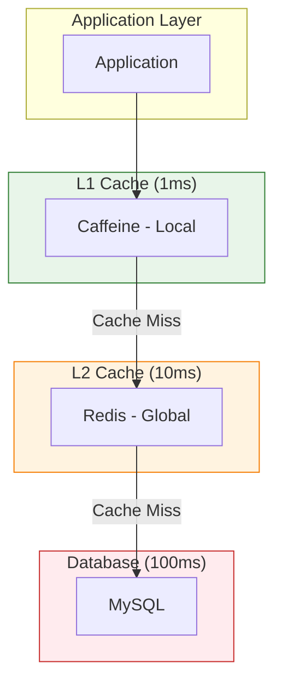

## Q1. 캐싱의 기본 개념과 Cache-Aside, Write-Through, Write-Behind 전략을 설명해주세요.

### 답변

**캐싱(Caching)**은 자주 사용되는 데이터를 빠른 저장소(메모리)에 임시 저장하여 응답 속도를 향상시키는 기법입니다.

#### 캐시 계층 구조


```mermaid
flowchart TB
    subgraph App ["Application Layer"]
        A[Application]
    end
    
    subgraph L1 ["L1 Cache (1ms)"]
        LC[Caffeine - Local]
    end
    
    subgraph L2 ["L2 Cache (10ms)"]
        RC[Redis - Global]
    end
    
    subgraph DB ["Database (100ms)"]
        M[MySQL]
    end
    
    A --> LC
    LC -- Cache Miss --> RC
    RC -- Cache Miss --> M
    
    style L1 fill:#e8f5e9,stroke:#2e7d32
    style L2 fill:#fff3e0,stroke:#f57c00
    style DB fill:#ffebee,stroke:#c62828
```

#### 1. Cache-Aside (Lazy Loading)

**가장 일반적인 패턴 - 필요할 때만 캐싱**

```java
@Service
@RequiredArgsConstructor
@Slf4j
public class UserService {

    private final UserRepository userRepository;
    private final RedisTemplate<String, User> redisTemplate;

    public User getUser(Long userId) {
        String cacheKey = "user:" + userId;

        // 1. 캐시 조회
        User cachedUser = redisTemplate.opsForValue().get(cacheKey);

        if (cachedUser != null) {
            log.info("Cache hit: {}", userId);
            return cachedUser;  // ✅ 캐시 히트
        }

        // 2. 캐시 미스 → DB 조회
        log.info("Cache miss: {}", userId);
        User user = userRepository.findById(userId)
            .orElseThrow(() -> new UserNotFoundException(userId));

        // 3. 캐시에 저장 (TTL 1시간)
        redisTemplate.opsForValue().set(cacheKey, user, Duration.ofHours(1));

        return user;
    }

    public void updateUser(Long userId, UserUpdateRequest request) {
        // 1. DB 업데이트
        User user = userRepository.findById(userId).orElseThrow();
        user.update(request);
        userRepository.save(user);

        // 2. 캐시 무효화
        String cacheKey = "user:" + userId;
        redisTemplate.delete(cacheKey);

        log.info("Cache invalidated: {}", userId);
    }
}
```

**장점:**
- 필요한 데이터만 캐싱 (메모리 효율적)
- 구현 간단
- 캐시 장애 시에도 서비스 가능 (DB fallback)

**단점:**
- 첫 요청은 느림 (Cache miss)
- DB와 캐시 불일치 가능성

**적합한 경우:**
- 읽기가 많고 쓰기가 적을 때
- 모든 데이터를 캐싱할 필요 없을 때

#### 2. Write-Through

**쓰기 시 DB + 캐시 동시 업데이트**

```java
@Service
@RequiredArgsConstructor
public class ProductService {

    private final ProductRepository productRepository;
    private final RedisTemplate<String, Product> redisTemplate;

    @Transactional
    public Product updateProduct(Long productId, ProductUpdateRequest request) {
        String cacheKey = "product:" + productId;

        // 1. DB 업데이트
        Product product = productRepository.findById(productId).orElseThrow();
        product.update(request);
        Product savedProduct = productRepository.save(product);

        // 2. 캐시에도 동시에 업데이트
        redisTemplate.opsForValue().set(cacheKey, savedProduct, Duration.ofHours(1));

        log.info("Write-through: DB and cache updated for product {}", productId);

        return savedProduct;
    }

    public Product getProduct(Long productId) {
        String cacheKey = "product:" + productId;

        // 캐시 조회
        Product cachedProduct = redisTemplate.opsForValue().get(cacheKey);

        if (cachedProduct != null) {
            return cachedProduct;  // 항상 최신 데이터 보장
        }

        // 캐시 미스 → DB 조회 후 캐싱
        Product product = productRepository.findById(productId).orElseThrow();
        redisTemplate.opsForValue().set(cacheKey, product, Duration.ofHours(1));

        return product;
    }
}
```

**장점:**
- DB와 캐시 일관성 보장
- 캐시 히트 시 항상 최신 데이터

**단점:**
- 쓰기 성능 저하 (2번 쓰기)
- 사용되지 않는 데이터도 캐싱 (메모리 낭비)

**적합한 경우:**
- 읽기와 쓰기가 모두 빈번할 때
- 데이터 일관성이 매우 중요할 때

#### 3. Write-Behind (Write-Back)

**쓰기 시 캐시만 업데이트, DB는 비동기로 업데이트**

```java
@Service
@RequiredArgsConstructor
@Slf4j
public class ViewCountService {

    private final RedisTemplate<String, String> redisTemplate;
    private final PostRepository postRepository;

    // 조회수 증가 (캐시만 업데이트)
    public void incrementViewCount(Long postId) {
        String cacheKey = "post:viewCount:" + postId;

        // ✅ Redis에만 증가 (매우 빠름)
        redisTemplate.opsForValue().increment(cacheKey, 1);

        log.info("View count incremented in cache: {}", postId);
    }

    // 정기적으로 DB에 반영 (배치)
    @Scheduled(fixedDelay = 60000)  // 1분마다
    @Transactional
    public void syncViewCountsToDatabase() {
        Set<String> keys = redisTemplate.keys("post:viewCount:*");

        if (keys == null || keys.isEmpty()) {
            return;
        }

        log.info("Syncing {} view counts to database", keys.size());

        for (String key : keys) {
            try {
                Long postId = Long.parseLong(key.split(":")[2]);
                String viewCountStr = redisTemplate.opsForValue().get(key);

                if (viewCountStr != null) {
                    int viewCount = Integer.parseInt(viewCountStr);

                    // DB 업데이트
                    postRepository.updateViewCount(postId, viewCount);

                    // 캐시에서 제거
                    redisTemplate.delete(key);

                    log.debug("Synced view count for post {}: {}", postId, viewCount);
                }

            } catch (Exception e) {
                log.error("Failed to sync view count for key: {}", key, e);
            }
        }
    }
}

// Repository
public interface PostRepository extends JpaRepository<Post, Long> {

    @Modifying
    @Query("UPDATE Post p SET p.viewCount = :viewCount WHERE p.id = :postId")
    void updateViewCount(@Param("postId") Long postId, @Param("viewCount") int viewCount);
}
```

**장점:**
- 쓰기 성능 극대화 (캐시만 업데이트)
- DB 부하 감소 (배치 처리)

**단점:**
- 캐시 장애 시 데이터 손실 위험
- DB와 캐시 일시적 불일치

**적합한 경우:**
- 쓰기가 매우 빈번할 때 (조회수, 좋아요)
- 일시적 데이터 손실 허용 가능할 때

#### 캐싱 전략 비교표

| 전략 | 읽기 성능 | 쓰기 성능 | 일관성 | 메모리 효율 | 적합한 사례 |
|------|----------|----------|--------|-----------|-----------|
| **Cache-Aside** | ⭐⭐⭐ | ⭐⭐⭐ | ⭐⭐ | ⭐⭐⭐ | 읽기 많음 (사용자 정보) |
| **Write-Through** | ⭐⭐⭐ | ⭐⭐ | ⭐⭐⭐ | ⭐⭐ | 일관성 중요 (재고) |
| **Write-Behind** | ⭐⭐⭐ | ⭐⭐⭐⭐⭐ | ⭐ | ⭐⭐ | 쓰기 많음 (조회수) |

### 꼬리 질문 1: Spring Cache Abstraction은 어떤 전략을 사용하나요?

**Cache-Aside 패턴**을 사용합니다.

```java
@Configuration
@EnableCaching
public class CacheConfig {

    @Bean
    public CacheManager cacheManager(RedisConnectionFactory connectionFactory) {
        RedisCacheConfiguration config = RedisCacheConfiguration.defaultCacheConfig()
            .entryTtl(Duration.ofHours(1))  // TTL 1시간
            .serializeKeysWith(
                RedisSerializationContext.SerializationPair.fromSerializer(
                    new StringRedisSerializer()
                )
            )
            .serializeValuesWith(
                RedisSerializationContext.SerializationPair.fromSerializer(
                    new GenericJackson2JsonRedisSerializer()
                )
            );

        return RedisCacheManager.builder(connectionFactory)
            .cacheDefaults(config)
            .build();
    }
}

@Service
public class UserService {

    @Cacheable(value = "users", key = "#userId")  // Cache-Aside
    public User getUser(Long userId) {
        // 1. 캐시 확인
        // 2. 캐시 미스 → 메서드 실행
        // 3. 결과를 캐시에 저장
        return userRepository.findById(userId).orElseThrow();
    }

    @CachePut(value = "users", key = "#userId")  // Write-Through
    public User updateUser(Long userId, UserUpdateRequest request) {
        User user = userRepository.findById(userId).orElseThrow();
        user.update(request);
        return userRepository.save(user);
        // DB 저장 후 캐시 업데이트
    }

    @CacheEvict(value = "users", key = "#userId")  // 캐시 삭제
    public void deleteUser(Long userId) {
        userRepository.deleteById(userId);
        // 캐시에서 제거
    }
}
```

### 꼬리 질문 2: Cache Stampede (Thunder Herd) 문제는 무엇이고 어떻게 해결하나요?

**문제 상황:**
```
┌────────┐  ┌────────┐  ┌────────┐
│Client 1│  │Client 2│  │Client 3│
└───┬────┘  └───┬────┘  └───┬────┘
    │           │           │
    │  Cache Miss (TTL 만료)
    ├───────────┼───────────┤
    │           │           │
    ▼           ▼           ▼
┌──────────────────────────────┐
│        Database              │  ⚠️ 동시에 100개 쿼리!
└──────────────────────────────┘
```

**해결 방법 1: Lock (Single Flight)**

```java
@Service
@RequiredArgsConstructor
public class UserService {

    private final LoadingCache<Long, User> userCache;
    private final UserRepository userRepository;

    @PostConstruct
    public void init() {
        // Caffeine Cache (로컬 캐시)
        this.userCache = Caffeine.newBuilder()
            .expireAfterWrite(Duration.ofMinutes(10))
            .maximumSize(10000)
            .build(userId -> {
                // 동일 키에 대해 동시에 1번만 실행
                log.info("Loading user from DB: {}", userId);
                return userRepository.findById(userId)
                    .orElseThrow(() -> new UserNotFoundException(userId));
            });
    }

    public User getUser(Long userId) {
        return userCache.get(userId);
        // 첫 요청만 DB 조회, 나머지는 대기 후 결과 공유
    }
}
```

**해결 방법 2: Early Expiration (확률적 조기 갱신)**

```java
@Service
public class ProductService {

    public Product getProduct(Long productId) {
        String cacheKey = "product:" + productId;

        ValueWrapper wrapper = redisTemplate.opsForValue().get(cacheKey);

        if (wrapper != null) {
            Product product = (Product) wrapper.getValue();
            long ttl = redisTemplate.getExpire(cacheKey, TimeUnit.SECONDS);

            // TTL이 10% 미만 남았을 때 확률적 갱신
            double probability = 1.0 - (ttl / 3600.0);  // 1시간 기준

            if (Math.random() < probability * 0.1) {
                // 백그라운드에서 갱신
                CompletableFuture.runAsync(() -> refreshCache(productId));
            }

            return product;
        }

        // 캐시 미스 → DB 조회
        return loadAndCache(productId);
    }

    private void refreshCache(Long productId) {
        Product product = productRepository.findById(productId).orElse(null);
        if (product != null) {
            String cacheKey = "product:" + productId;
            redisTemplate.opsForValue().set(cacheKey, product, Duration.ofHours(1));
        }
    }
}
```

---


---

👉 **[다음 편: 캐싱 전략 (Part 2: 2-Level Cache, 실무 운영)](/learning/qna/caching-strategy-qna-part2/)**
