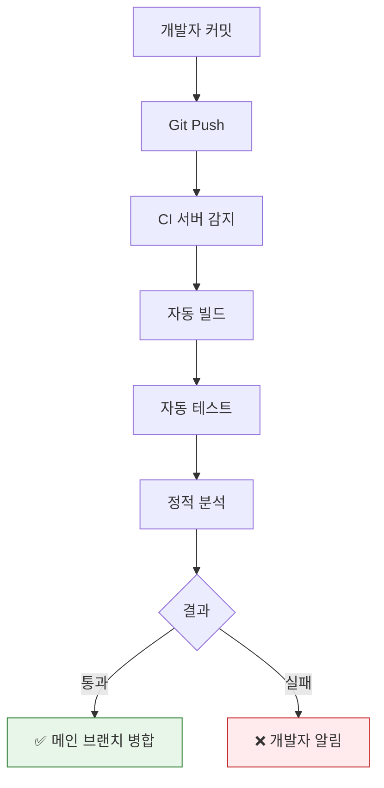

# CI/CD 개념 정리

## Q1. CI/CD란 무엇이고, 왜 필요한가요?

### 답변

**CI/CD**는 **지속적 통합(Continuous Integration)**과 **지속적 배포(Continuous Deployment/Delivery)**의 자동화 프로세스입니다.

### CI (Continuous Integration)

**지속적 통합**: 코드 변경사항을 자동으로 빌드하고 테스트하여 메인 브랜치에 통합

**프로세스**:



**CI 없이 개발하는 경우**:

```
❌ 문제점:
1. 개발자 A: feature-A 개발 (2주)
2. 개발자 B: feature-B 개발 (2주)
3. 2주 후 통합 시도 → 충돌 발생! ⚠️
4. 충돌 해결에 3일 소요
5. 통합 후 버그 발견 → 원인 파악 어려움
```

**CI 도입 후**:

```
✅ 개선:
1. 개발자 A: 커밋 → 자동 테스트 → 통합 (매일)
2. 개발자 B: 커밋 → 자동 테스트 → 통합 (매일)
3. 충돌 즉시 감지 → 즉시 해결 (10분)
4. 버그 발생 시 최근 커밋만 확인
```

### CD (Continuous Deployment/Delivery)

**Continuous Delivery (지속적 전달)**:
- 배포 가능한 상태로 자동 빌드
- **수동 승인 후 배포**

**Continuous Deployment (지속적 배포)**:
- 테스트 통과 시 **자동으로 프로덕션 배포**

**프로세스**:

```
CI 성공
  ↓
Docker 이미지 빌드
  ↓
이미지 레지스트리 푸시
  ↓
--- Continuous Delivery ---
수동 승인 (PM/Tech Lead)
  ↓
--- Continuous Deployment ---
자동 배포
  ↓
Health Check
  ↓
배포 성공 → 모니터링 ✅
배포 실패 → 자동 Rollback ❌
```

**CI/CD 비교**:

| 구분 | CI | Continuous Delivery | Continuous Deployment |
|------|-----|---------------------|----------------------|
| 목적 | 코드 통합 자동화 | 배포 준비 자동화 | 배포까지 자동화 |
| 배포 | 없음 | 수동 승인 필요 | 완전 자동 |
| 위험도 | 낮음 | 중간 | 높음 |
| 적합 | 모든 프로젝트 | 엔터프라이즈 | 스타트업, SaaS |

### 꼬리 질문 1: CI/CD 도입의 장점은?

**5가지 핵심 장점**:

```
1. 빠른 피드백
   - 코드 푸시 후 5분 내 테스트 결과
   - 버그를 조기에 발견하여 수정 비용 감소

2. 배포 주기 단축
   - Before: 월 1회 배포 (수동)
   - After: 일 10회 배포 (자동)

3. 위험 감소
   - 작은 단위로 자주 배포 → 문제 범위 축소
   - 롤백 시간: 1시간 → 5분

4. 생산성 향상
   - 수동 작업 시간: 하루 2시간
   - 자동화 후: 하루 10분

5. 품질 향상
   - 자동 테스트 커버리지: 80%+
   - 코드 리뷰 자동화
```

### 꼬리 질문 2: CI/CD 파이프라인의 구성 요소는?

**표준 파이프라인**:

```yaml
# Jenkinsfile 예시
pipeline {
    agent any

    stages {
        stage('Checkout') {
            steps {
                git 'https://github.com/example/app.git'
            }
        }

        stage('Build') {
            steps {
                sh './gradlew build'
            }
        }

        stage('Test') {
            parallel {
                stage('Unit Test') {
                    steps {
                        sh './gradlew test'
                    }
                }
                stage('Integration Test') {
                    steps {
                        sh './gradlew integrationTest'
                    }
                }
            }
        }

        stage('Code Quality') {
            steps {
                sh 'sonar-scanner'
            }
        }

        stage('Build Docker Image') {
            steps {
                sh 'docker build -t myapp:${BUILD_NUMBER} .'
            }
        }

        stage('Push to Registry') {
            steps {
                sh 'docker push myapp:${BUILD_NUMBER}'
            }
        }

        stage('Deploy to Staging') {
            steps {
                sh 'kubectl apply -f k8s/staging/'
            }
        }

        stage('Smoke Test') {
            steps {
                sh './scripts/smoke-test.sh'
            }
        }

        stage('Deploy to Production') {
            when {
                branch 'main'
            }
            steps {
                input message: 'Deploy to Production?'
                sh 'kubectl apply -f k8s/production/'
            }
        }
    }

    post {
        failure {
            slackSend channel: '#alerts',
                      message: "Build failed: ${env.JOB_NAME} ${env.BUILD_NUMBER}"
        }
        success {
            slackSend channel: '#releases',
                      message: "Deployed: ${env.JOB_NAME} ${env.BUILD_NUMBER}"
        }
    }
}
```

---

## Q2. Jenkins Pipeline의 Stage는 어떻게 구성하나요?

### 답변

**Jenkins Stage**는 **파이프라인의 논리적 단계**로, 각 Stage는 독립적으로 실행되고 결과를 추적할 수 있습니다.

### Stage 구성 전략

**1. 빌드 Stage**:

```groovy
stage('Build') {
    steps {
        script {
            // Gradle 빌드
            sh './gradlew clean build -x test'

            // 빌드 결과물 저장
            archiveArtifacts artifacts: 'build/libs/*.jar',
                           fingerprint: true
        }
    }
    post {
        failure {
            echo 'Build failed!'
        }
    }
}
```

**2. 테스트 Stage (병렬 실행)**:

```groovy
stage('Test') {
    parallel {
        stage('Unit Test') {
            steps {
                sh './gradlew test'
                junit 'build/test-results/test/*.xml'
            }
        }

        stage('Integration Test') {
            steps {
                sh './gradlew integrationTest'
                junit 'build/test-results/integrationTest/*.xml'
            }
        }

        stage('E2E Test') {
            agent {
                label 'e2e-runner'
            }
            steps {
                sh 'npm run test:e2e'
            }
        }
    }
}
```

**3. 품질 검사 Stage**:

```groovy
stage('Code Quality') {
    steps {
        script {
            // SonarQube 분석
            withSonarQubeEnv('SonarQube') {
                sh './gradlew sonarqube'
            }

            // Quality Gate 대기
            timeout(time: 5, unit: 'MINUTES') {
                def qg = waitForQualityGate()
                if (qg.status != 'OK') {
                    error "Quality Gate failed: ${qg.status}"
                }
            }
        }
    }
}
```

**4. 보안 스캔 Stage**:

```groovy
stage('Security Scan') {
    parallel {
        stage('Dependency Check') {
            steps {
                sh './gradlew dependencyCheckAnalyze'
                publishHTML([
                    reportDir: 'build/reports',
                    reportFiles: 'dependency-check-report.html',
                    reportName: 'Dependency Check'
                ])
            }
        }

        stage('Container Scan') {
            steps {
                sh 'trivy image myapp:${BUILD_NUMBER}'
            }
        }
    }
}
```

**5. 배포 Stage**:

```groovy
stage('Deploy') {
    stages {
        stage('Deploy to Dev') {
            steps {
                sh 'kubectl apply -f k8s/dev/ --namespace=dev'
                sh 'kubectl rollout status deployment/myapp -n dev'
            }
        }

        stage('Smoke Test') {
            steps {
                script {
                    def response = sh(
                        script: 'curl -f https://dev.example.com/health',
                        returnStatus: true
                    )
                    if (response != 0) {
                        error 'Smoke test failed!'
                    }
                }
            }
        }

        stage('Deploy to Production') {
            when {
                branch 'main'
            }
            steps {
                input message: 'Deploy to Production?',
                      ok: 'Deploy',
                      submitter: 'tech-lead,devops'

                sh 'kubectl apply -f k8s/prod/ --namespace=production'
                sh 'kubectl rollout status deployment/myapp -n production'
            }
        }
    }
}
```

### Stage 설계 원칙

**1. Fail Fast 원칙**:

```groovy
// ✅ 빠른 단계부터 실행 (빠른 피드백)
stage('Lint') {           // 5초
stage('Build') {          // 1분
stage('Unit Test') {      // 3분
stage('Integration Test') { // 10분
stage('E2E Test') {       // 30분

// ❌ 느린 단계부터 실행 (피드백 느림)
stage('E2E Test') {       // 30분 후 실패
// → 30분 낭비!
```

**2. 병렬 실행**:

```groovy
// ✅ 독립적인 Stage는 병렬 실행
stage('Test') {
    parallel {
        stage('Unit Test')        // 3분
        stage('Integration Test') // 3분
        stage('E2E Test')        // 3분
    }
    // 총 실행 시간: 3분 (병렬)
}

// ❌ 순차 실행
stage('Unit Test')        // 3분
stage('Integration Test') // 3분
stage('E2E Test')        // 3분
// 총 실행 시간: 9분
```

### 꼬리 질문: when 조건은 언제 사용하나요?

**when 조건**으로 **특정 조건에서만 Stage 실행**:

```groovy
// 브랜치 조건
stage('Deploy to Production') {
    when {
        branch 'main'
    }
    steps {
        // main 브랜치에서만 실행
    }
}

// 환경 변수 조건
stage('Security Scan') {
    when {
        environment name: 'SECURITY_SCAN', value: 'true'
    }
    steps {
        // SECURITY_SCAN=true일 때만 실행
    }
}

// 변경 파일 조건
stage('Build Frontend') {
    when {
        changeset "frontend/**"
    }
    steps {
        // frontend/ 디렉토리 변경 시만 실행
    }
}

// 복합 조건
stage('Deploy') {
    when {
        allOf {
            branch 'main'
            environment name: 'DEPLOY_ENABLED', value: 'true'
            not {
                changeset "docs/**"
            }
        }
    }
    steps {
        // main 브랜치 + DEPLOY_ENABLED=true + docs 변경 아님
    }
}
```

---

## Q3. Rollback 전략은 어떻게 구성하나요?

### 답변

**Rollback (롤백)**은 **배포 실패 시 이전 버전으로 되돌리는 프로세스**입니다.

### Rollback 전략 종류

**1. Blue-Green Deployment**:

```
Blue (현재 버전)     Green (새 버전)
      ↓                    ↓
   v1.0 (100%)          v2.0 (대기)

1. Green 환경에 v2.0 배포
2. Health Check 통과 확인
3. 트래픽을 Green으로 전환
      ↓
   v1.0 (대기)          v2.0 (100%)

문제 발생 시 즉시 Blue로 전환 (롤백)
```

**구현** (Kubernetes):

```yaml
# Blue Deployment (현재 버전)
apiVersion: apps/v1
kind: Deployment
metadata:
  name: myapp-blue
  labels:
    version: blue
spec:
  replicas: 3
  selector:
    matchLabels:
      app: myapp
      version: blue
  template:
    metadata:
      labels:
        app: myapp
        version: blue
    spec:
      containers:
      - name: myapp
        image: myapp:v1.0

---
# Green Deployment (새 버전)
apiVersion: apps/v1
kind: Deployment
metadata:
  name: myapp-green
  labels:
    version: green
spec:
  replicas: 3
  selector:
    matchLabels:
      app: myapp
      version: green
  template:
    metadata:
      labels:
        app: myapp
        version: green
    spec:
      containers:
      - name: myapp
        image: myapp:v2.0

---
# Service (트래픽 전환)
apiVersion: v1
kind: Service
metadata:
  name: myapp
spec:
  selector:
    app: myapp
    version: blue  # blue → green으로 변경하여 트래픽 전환
  ports:
  - port: 80
    targetPort: 8080
```

**롤백 명령**:

```bash
# Green으로 전환
kubectl patch service myapp -p '{"spec":{"selector":{"version":"green"}}}'

# 문제 발생 → Blue로 즉시 롤백
kubectl patch service myapp -p '{"spec":{"selector":{"version":"blue"}}}'
# → 트래픽이 즉시 v1.0으로 전환 (5초 이내)
```

**2. Canary Deployment**:

```
v1.0 (90%)    v2.0 (10%)
      ↓             ↓
   안정화      신규 테스트

단계적 전환:
1. v2.0 10% 배포
2. 모니터링 (에러율, 응답시간)
3. 문제 없으면 50% 증가
4. 문제 없으면 100% 전환

문제 발생 시 즉시 v1.0 100%로 롤백
```

**구현** (Kubernetes + Istio):

```yaml
apiVersion: networking.istio.io/v1beta1
kind: VirtualService
metadata:
  name: myapp
spec:
  hosts:
  - myapp
  http:
  - match:
    - headers:
        canary:
          exact: "true"
    route:
    - destination:
        host: myapp
        subset: v2
  - route:
    - destination:
        host: myapp
        subset: v1
      weight: 90
    - destination:
        host: myapp
        subset: v2
      weight: 10  # Canary 10%
```

**단계적 증가**:

```bash
# 1단계: 10%
kubectl patch virtualservice myapp --type merge -p '
  spec:
    http:
    - route:
      - destination:
          subset: v1
        weight: 90
      - destination:
          subset: v2
        weight: 10
'

# 모니터링 후 문제 없으면 2단계: 50%
kubectl patch virtualservice myapp --type merge -p '
  spec:
    http:
    - route:
      - destination:
          subset: v1
        weight: 50
      - destination:
          subset: v2
        weight: 50
'

# 문제 발생 → 즉시 0%로 롤백
kubectl patch virtualservice myapp --type merge -p '
  spec:
    http:
    - route:
      - destination:
          subset: v1
        weight: 100
      - destination:
          subset: v2
        weight: 0
'
```

**3. Rolling Update (기본 전략)**:

```
v1.0 (Pod 3개)
  ↓
v1.0 (2개) + v2.0 (1개)
  ↓
v1.0 (1개) + v2.0 (2개)
  ↓
v2.0 (3개)

문제 발생 시 kubectl rollout undo
```

**구현**:

```yaml
apiVersion: apps/v1
kind: Deployment
metadata:
  name: myapp
spec:
  replicas: 3
  strategy:
    type: RollingUpdate
    rollingUpdate:
      maxUnavailable: 1  # 최대 1개 Pod 중단
      maxSurge: 1        # 최대 1개 추가 Pod
  template:
    spec:
      containers:
      - name: myapp
        image: myapp:v2.0
```

**롤백 명령**:

```bash
# 배포
kubectl apply -f deployment.yaml

# 배포 상태 확인
kubectl rollout status deployment/myapp

# 문제 발생 → 이전 버전으로 롤백
kubectl rollout undo deployment/myapp

# 특정 버전으로 롤백
kubectl rollout undo deployment/myapp --to-revision=3

# 배포 히스토리 확인
kubectl rollout history deployment/myapp
```

### Rollback 전략 비교

| 전략 | 롤백 속도 | 리소스 | 위험도 | 적합 |
|------|-----------|--------|--------|------|
| Blue-Green | 즉시 (5초) | 2배 | 낮음 | 중요 서비스 |
| Canary | 단계적 | 1.1배 | 매우 낮음 | 대규모 서비스 |
| Rolling | 느림 (5분) | 1.1배 | 중간 | 일반 서비스 |

### 꼬리 질문: 자동 Rollback은 어떻게 구현하나요?

**Prometheus + AlertManager**:

```yaml
# Prometheus Alert Rule
groups:
- name: deployment
  rules:
  - alert: HighErrorRate
    expr: |
      rate(http_requests_total{status=~"5.."}[5m]) > 0.05
    for: 1m
    labels:
      severity: critical
    annotations:
      summary: "Error rate > 5%"

# AlertManager → Webhook → Jenkins
# Jenkins Pipeline
pipeline {
    agent any

    stages {
        stage('Auto Rollback') {
            steps {
                script {
                    sh 'kubectl rollout undo deployment/myapp'
                    slackSend channel: '#alerts',
                              message: "Auto rollback triggered: High error rate detected"
                }
            }
        }
    }
}
```

---

## Q4. ArgoCD란 무엇이고, 어떻게 동작하나요?

### 답변

**ArgoCD**는 **GitOps 기반의 Kubernetes 배포 자동화 도구**입니다.

### GitOps 원칙

**Git = Single Source of Truth**:

```
Git Repository (Desired State)
      ↓
ArgoCD (Controller)
      ↓
Kubernetes (Actual State)

ArgoCD가 지속적으로 비교:
Desired State ≠ Actual State → 자동 동기화
```

### ArgoCD 동작 방식

**1. Application 정의**:

```yaml
# argocd-app.yaml
apiVersion: argoproj.io/v1alpha1
kind: Application
metadata:
  name: myapp
  namespace: argocd
spec:
  project: default

  # Git Repository (Desired State)
  source:
    repoURL: https://github.com/example/k8s-manifests
    targetRevision: main
    path: apps/myapp

  # Kubernetes Cluster (Actual State)
  destination:
    server: https://kubernetes.default.svc
    namespace: production

  # 동기화 정책
  syncPolicy:
    automated:
      prune: true      # 삭제된 리소스 자동 제거
      selfHeal: true   # Drift 발생 시 자동 복구
      allowEmpty: false
    syncOptions:
    - CreateNamespace=true
    retry:
      limit: 5
      backoff:
        duration: 5s
        factor: 2
        maxDuration: 3m
```

**2. ArgoCD 동기화 프로세스**:

```
1. Git 변경 감지 (Polling or Webhook)
   └─ main 브랜치에 커밋 푸시

2. Desired State 읽기
   └─ Git의 Kubernetes Manifest 읽기

3. Actual State 확인
   └─ Kubernetes 클러스터 상태 확인

4. Diff 계산
   └─ Desired vs Actual 비교

5. 동기화 실행
   └─ kubectl apply -f manifests/

6. Health Check
   └─ Pod, Service, Ingress 상태 확인

7. 동기화 성공 ✅
   └─ Slack 알림 전송
```

**3. 실제 배포 플로우**:

```bash
# 1. 개발자가 새 이미지 빌드
docker build -t myapp:v2.0 .
docker push myregistry.io/myapp:v2.0

# 2. Git Repository 업데이트
git clone https://github.com/example/k8s-manifests
cd k8s-manifests/apps/myapp
sed -i 's/myapp:v1.0/myapp:v2.0/' deployment.yaml
git add deployment.yaml
git commit -m "Update myapp to v2.0"
git push origin main

# 3. ArgoCD가 자동 감지 및 동기화 (3분 이내)
# 또는 수동 동기화
argocd app sync myapp

# 4. 배포 상태 확인
argocd app get myapp
```

### ArgoCD vs Jenkins 비교

| 항목 | Jenkins | ArgoCD |
|------|---------|---------|
| 방식 | Push (CI 서버 → K8s) | Pull (Git → K8s) |
| 상태 관리 | 없음 (일회성) | Git 기반 |
| Drift 감지 | 불가능 | 자동 감지 및 복구 |
| 롤백 | 복잡 | Git Revert로 간단 |
| 보안 | K8s 자격증명 필요 | Read-only Git 접근 |
| 가시성 | 낮음 | UI로 실시간 확인 |

### ArgoCD 장점

**1. Drift 자동 복구**:

```
시나리오:
1. ArgoCD로 Deployment 배포 (replicas: 3)
2. 운영자가 수동으로 변경 (kubectl scale --replicas=5)
3. ArgoCD가 Drift 감지 (Desired: 3, Actual: 5)
4. 자동 복구 (selfHeal: true)
   └─ kubectl scale --replicas=3
```

**2. 간단한 롤백**:

```bash
# ❌ Jenkins 롤백 (복잡)
# 1. 이전 빌드 번호 찾기
# 2. Jenkins Job 재실행
# 3. 배포 스크립트 수정

# ✅ ArgoCD 롤백 (간단)
git revert HEAD
git push origin main
# → ArgoCD가 자동으로 이전 버전 배포
```

**3. Multi-Cluster 관리**:

```yaml
# 하나의 Git Repository로 여러 클러스터 관리
apiVersion: argoproj.io/v1alpha1
kind: ApplicationSet
metadata:
  name: myapp
spec:
  generators:
  - list:
      elements:
      - cluster: dev
        url: https://dev-cluster
      - cluster: staging
        url: https://staging-cluster
      - cluster: production
        url: https://prod-cluster
  template:
    spec:
      source:
        repoURL: https://github.com/example/k8s-manifests
        path: apps/myapp/{{cluster}}
      destination:
        server: '{{url}}'
```

### 꼬리 질문: Blue-Green Deployment를 ArgoCD로 구현하려면?

**ArgoCD Rollout**:

```yaml
# Argo Rollouts (Progressive Delivery)
apiVersion: argoproj.io/v1alpha1
kind: Rollout
metadata:
  name: myapp
spec:
  replicas: 3
  strategy:
    blueGreen:
      activeService: myapp-active
      previewService: myapp-preview
      autoPromotionEnabled: false  # 수동 승인
      scaleDownDelaySeconds: 300   # 5분 후 이전 버전 제거
  selector:
    matchLabels:
      app: myapp
  template:
    spec:
      containers:
      - name: myapp
        image: myapp:v2.0
```

**배포 프로세스**:

```bash
# 1. 새 버전 배포
git commit -m "Update to v2.0"
git push

# 2. ArgoCD가 Preview 환경에 배포
# myapp-preview Service로 테스트 가능

# 3. 테스트 완료 후 수동 승인
kubectl argo rollouts promote myapp

# 4. Active Service로 트래픽 전환
# myapp-active → v2.0

# 5. 문제 발생 시 롤백
kubectl argo rollouts undo myapp
```

---

## Q5. 실무에서 CI/CD 구축 경험은?

### 답변

**프로젝트: MSA 전환 및 CI/CD 파이프라인 구축**

### 기존 환경 (Before)

```
배포 방식: 수동 배포
1. 개발자가 로컬에서 빌드 (./gradlew build)
2. JAR 파일을 서버에 SCP 전송
3. SSH로 접속하여 서비스 재시작
4. 문제 발생 시 수동 롤백

문제점:
- 배포 시간: 30분
- 배포 빈도: 월 1회
- 롤백 시간: 1시간
- 에러율: 배포 시 5%
```

### 개선 환경 (After)

**1. CI/CD 파이프라인 구축**:

```groovy
// Jenkinsfile
pipeline {
    agent {
        kubernetes {
            yaml '''
apiVersion: v1
kind: Pod
spec:
  containers:
  - name: gradle
    image: gradle:7.6-jdk17
    command: ['sleep']
    args: ['infinity']
  - name: docker
    image: docker:latest
    command: ['sleep']
    args: ['infinity']
    volumeMounts:
    - name: docker-sock
      mountPath: /var/run/docker.sock
  volumes:
  - name: docker-sock
    hostPath:
      path: /var/run/docker.sock
'''
        }
    }

    environment {
        DOCKER_REGISTRY = 'myregistry.io'
        APP_NAME = 'myapp'
    }

    stages {
        stage('Build') {
            steps {
                container('gradle') {
                    sh './gradlew clean build'
                }
            }
        }

        stage('Test') {
            parallel {
                stage('Unit Test') {
                    steps {
                        container('gradle') {
                            sh './gradlew test'
                            junit 'build/test-results/test/*.xml'
                        }
                    }
                }
                stage('Integration Test') {
                    steps {
                        container('gradle') {
                            sh './gradlew integrationTest'
                            junit 'build/test-results/integrationTest/*.xml'
                        }
                    }
                }
            }
        }

        stage('Code Quality') {
            steps {
                container('gradle') {
                    withSonarQubeEnv('SonarQube') {
                        sh './gradlew sonarqube'
                    }
                    timeout(time: 5, unit: 'MINUTES') {
                        waitForQualityGate abortPipeline: true
                    }
                }
            }
        }

        stage('Build Docker Image') {
            steps {
                container('docker') {
                    script {
                        def imageTag = "${DOCKER_REGISTRY}/${APP_NAME}:${BUILD_NUMBER}"
                        sh "docker build -t ${imageTag} ."
                        sh "docker push ${imageTag}"

                        // Git 업데이트 (GitOps)
                        sh """
                            git clone https://github.com/example/k8s-manifests
                            cd k8s-manifests
                            sed -i 's|image:.*|image: ${imageTag}|' apps/${APP_NAME}/deployment.yaml
                            git add apps/${APP_NAME}/deployment.yaml
                            git commit -m "Update ${APP_NAME} to ${BUILD_NUMBER}"
                            git push origin main
                        """
                    }
                }
            }
        }
    }

    post {
        success {
            slackSend channel: '#deployments',
                      color: 'good',
                      message: "✅ Build ${BUILD_NUMBER} succeeded\nImage: ${DOCKER_REGISTRY}/${APP_NAME}:${BUILD_NUMBER}"
        }
        failure {
            slackSend channel: '#alerts',
                      color: 'danger',
                      message: "❌ Build ${BUILD_NUMBER} failed\n${env.BUILD_URL}"
        }
    }
}
```

**2. ArgoCD 배포 자동화**:

```yaml
# ArgoCD Application
apiVersion: argoproj.io/v1alpha1
kind: Application
metadata:
  name: myapp
  namespace: argocd
spec:
  project: default
  source:
    repoURL: https://github.com/example/k8s-manifests
    targetRevision: main
    path: apps/myapp
  destination:
    server: https://kubernetes.default.svc
    namespace: production
  syncPolicy:
    automated:
      prune: true
      selfHeal: true
    retry:
      limit: 5
      backoff:
        duration: 5s
        maxDuration: 3m
```

**3. Canary Deployment (Argo Rollouts)**:

```yaml
apiVersion: argoproj.io/v1alpha1
kind: Rollout
metadata:
  name: myapp
spec:
  replicas: 10
  strategy:
    canary:
      steps:
      - setWeight: 10    # 10% 트래픽
      - pause:
          duration: 5m   # 5분 모니터링
      - setWeight: 50    # 50% 트래픽
      - pause:
          duration: 10m  # 10분 모니터링
      - setWeight: 100   # 100% 전환
      analysis:
        templates:
        - templateName: error-rate
        startingStep: 1

  selector:
    matchLabels:
      app: myapp
  template:
    spec:
      containers:
      - name: myapp
        image: myregistry.io/myapp:latest
```

**4. 자동 롤백 (Prometheus Alert)**:

```yaml
# AnalysisTemplate
apiVersion: argoproj.io/v1alpha1
kind: AnalysisTemplate
metadata:
  name: error-rate
spec:
  metrics:
  - name: error-rate
    interval: 1m
    successCondition: result < 0.05  # 에러율 5% 미만
    failureLimit: 3
    provider:
      prometheus:
        address: http://prometheus:9090
        query: |
          rate(http_requests_total{status=~"5..", app="myapp"}[5m])
          /
          rate(http_requests_total{app="myapp"}[5m])
```

### 개선 결과

| 항목 | Before | After | 개선율 |
|------|--------|-------|--------|
| 배포 시간 | 30분 | 5분 | 83% 감소 |
| 배포 빈도 | 월 1회 | 일 10회 | 300배 증가 |
| 롤백 시간 | 1시간 | 1분 | 98% 감소 |
| 배포 에러율 | 5% | 0.1% | 98% 감소 |
| 테스트 커버리지 | 30% | 85% | 183% 증가 |

---

## 요약

### CI/CD 기본 개념
- **CI**: 코드 통합 자동화 (빌드, 테스트)
- **Continuous Delivery**: 배포 준비 자동화 (수동 승인)
- **Continuous Deployment**: 배포까지 완전 자동화

### Jenkins Pipeline
- **Stage**: 논리적 단계 (Build, Test, Deploy)
- **병렬 실행**: 독립적인 Stage는 parallel로 실행
- **when 조건**: 특정 조건에서만 실행

### Rollback 전략
- **Blue-Green**: 즉시 롤백 (5초), 리소스 2배
- **Canary**: 단계적 배포, 위험도 최소
- **Rolling Update**: 순차 배포, 기본 전략

### ArgoCD (GitOps)
- **GitOps**: Git = Single Source of Truth
- **Drift 감지**: 자동 복구 (selfHeal)
- **간단한 롤백**: Git Revert로 이전 버전 배포

---

## 🔗 Related Deep Dive

더 깊이 있는 학습을 원한다면 심화 과정을 참고하세요:

- **[Docker 기본](/learning/deep-dive/deep-dive-docker-basics/)**: 컨테이너 빌드와 이미지 레이어 구조.
- **[Kubernetes 서비스 디스커버리](/learning/deep-dive/deep-dive-kubernetes-service-discovery/)**: Service, Ingress, DNS 구성.
