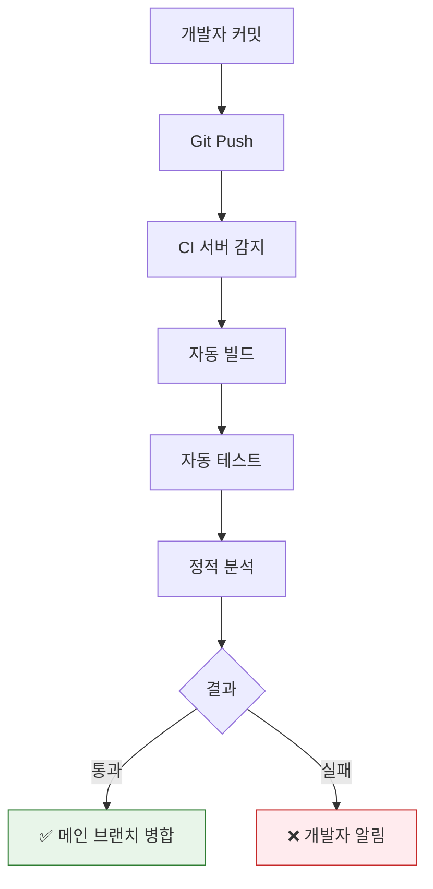

# CI/CD 개념 정리

## Q1. CI/CD란 무엇이고, 왜 필요한가요?

### 답변

**CI/CD**는 **지속적 통합(Continuous Integration)**과 **지속적 배포(Continuous Deployment/Delivery)**의 자동화 프로세스입니다.

### CI (Continuous Integration)

**지속적 통합**: 코드 변경사항을 자동으로 빌드하고 테스트하여 메인 브랜치에 통합

**프로세스**:


```mermaid
flowchart TD
    A[개발자 커밋] --> B[Git Push]
    B --> C[CI 서버 감지]
    C --> D[자동 빌드]
    D --> E[자동 테스트]
    E --> F[정적 분석]
    F --> G{결과}
    G -->|통과| H[✅ 메인 브랜치 병합]
    G -->|실패| I[❌ 개발자 알림]
    
    style H fill:#e8f5e9,stroke:#2e7d32
    style I fill:#ffebee,stroke:#c62828
```

**CI 없이 개발하는 경우**:

```
❌ 문제점:
1. 개발자 A: feature-A 개발 (2주)
2. 개발자 B: feature-B 개발 (2주)
3. 2주 후 통합 시도 → 충돌 발생! ⚠️
4. 충돌 해결에 3일 소요
5. 통합 후 버그 발견 → 원인 파악 어려움
```

**CI 도입 후**:

```
✅ 개선:
1. 개발자 A: 커밋 → 자동 테스트 → 통합 (매일)
2. 개발자 B: 커밋 → 자동 테스트 → 통합 (매일)
3. 충돌 즉시 감지 → 즉시 해결 (10분)
4. 버그 발생 시 최근 커밋만 확인
```

### CD (Continuous Deployment/Delivery)

**Continuous Delivery (지속적 전달)**:
- 배포 가능한 상태로 자동 빌드
- **수동 승인 후 배포**

**Continuous Deployment (지속적 배포)**:
- 테스트 통과 시 **자동으로 프로덕션 배포**

**프로세스**:

```
CI 성공
  ↓
Docker 이미지 빌드
  ↓
이미지 레지스트리 푸시
  ↓
--- Continuous Delivery ---
수동 승인 (PM/Tech Lead)
  ↓
--- Continuous Deployment ---
자동 배포
  ↓
Health Check
  ↓
배포 성공 → 모니터링 ✅
배포 실패 → 자동 Rollback ❌
```

**CI/CD 비교**:

| 구분 | CI | Continuous Delivery | Continuous Deployment |
|------|-----|---------------------|----------------------|
| 목적 | 코드 통합 자동화 | 배포 준비 자동화 | 배포까지 자동화 |
| 배포 | 없음 | 수동 승인 필요 | 완전 자동 |
| 위험도 | 낮음 | 중간 | 높음 |
| 적합 | 모든 프로젝트 | 엔터프라이즈 | 스타트업, SaaS |

### 꼬리 질문 1: CI/CD 도입의 장점은?

**5가지 핵심 장점**:

```
1. 빠른 피드백
   - 코드 푸시 후 5분 내 테스트 결과
   - 버그를 조기에 발견하여 수정 비용 감소

2. 배포 주기 단축
   - Before: 월 1회 배포 (수동)
   - After: 일 10회 배포 (자동)

3. 위험 감소
   - 작은 단위로 자주 배포 → 문제 범위 축소
   - 롤백 시간: 1시간 → 5분

4. 생산성 향상
   - 수동 작업 시간: 하루 2시간
   - 자동화 후: 하루 10분

5. 품질 향상
   - 자동 테스트 커버리지: 80%+
   - 코드 리뷰 자동화
```

### 꼬리 질문 2: CI/CD 파이프라인의 구성 요소는?

**표준 파이프라인**:

```yaml
# Jenkinsfile 예시
pipeline {
    agent any

    stages {
        stage('Checkout') {
            steps {
                git 'https://github.com/example/app.git'
            }
        }

        stage('Build') {
            steps {
                sh './gradlew build'
            }
        }

        stage('Test') {
            parallel {
                stage('Unit Test') {
                    steps {
                        sh './gradlew test'
                    }
                }
                stage('Integration Test') {
                    steps {
                        sh './gradlew integrationTest'
                    }
                }
            }
        }

        stage('Code Quality') {
            steps {
                sh 'sonar-scanner'
            }
        }

        stage('Build Docker Image') {
            steps {
                sh 'docker build -t myapp:${BUILD_NUMBER} .'
            }
        }

        stage('Push to Registry') {
            steps {
                sh 'docker push myapp:${BUILD_NUMBER}'
            }
        }

        stage('Deploy to Staging') {
            steps {
                sh 'kubectl apply -f k8s/staging/'
            }
        }

        stage('Smoke Test') {
            steps {
                sh './scripts/smoke-test.sh'
            }
        }

        stage('Deploy to Production') {
            when {
                branch 'main'
            }
            steps {
                input message: 'Deploy to Production?'
                sh 'kubectl apply -f k8s/production/'
            }
        }
    }

    post {
        failure {
            slackSend channel: '#alerts',
                      message: "Build failed: ${env.JOB_NAME} ${env.BUILD_NUMBER}"
        }
        success {
            slackSend channel: '#releases',
                      message: "Deployed: ${env.JOB_NAME} ${env.BUILD_NUMBER}"
        }
    }
}
```

---


---

👉 **[다음 편: CI/CD (Part 2: Jenkins Pipeline, 배포 전략)](/learning/qna/cicd-qna-part2/)**
