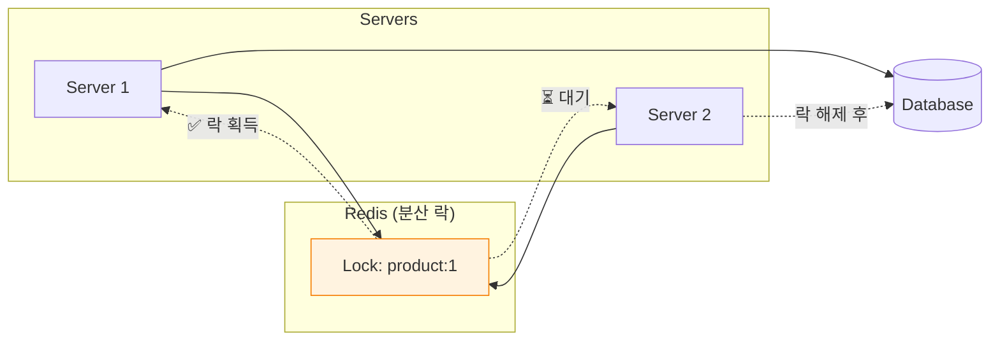
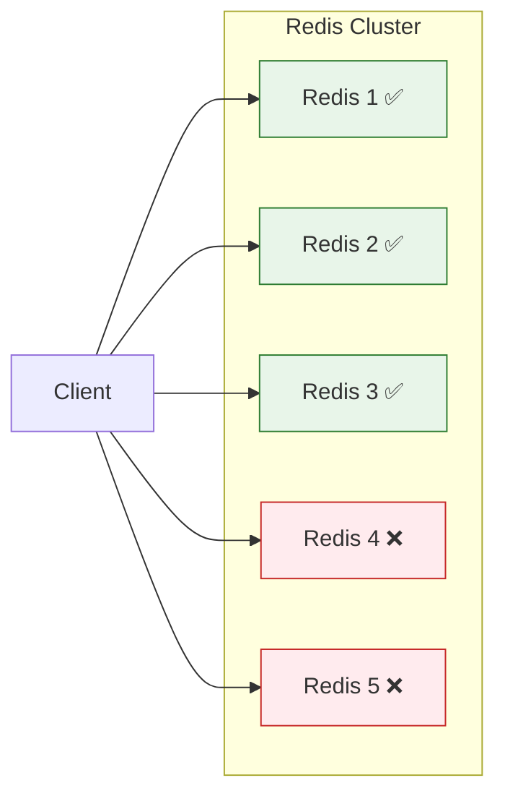

## Q1. 낙관적 락(Optimistic Lock)과 비관적 락(Pessimistic Lock)의 차이점과 사용 사례를 설명해주세요.

### 답변

**동시성 제어**는 여러 트랜잭션이 동시에 같은 데이터에 접근할 때 데이터 일관성을 보장하는 메커니즘입니다.

#### 낙관적 락 (Optimistic Lock)

**핵심 아이디어**: "충돌이 거의 발생하지 않을 것"이라고 가정하고, 충돌 발생 시에만 처리

**동작 방식:**
1. 데이터 읽기 시 버전 정보 함께 읽음
2. 수정 작업 수행
3. 커밋 시 버전 확인 → 변경되었으면 롤백

```java
@Entity
@Getter
@NoArgsConstructor
public class Product {

    @Id
    @GeneratedValue(strategy = GenerationType.IDENTITY)
    private Long id;

    private String name;
    private int stock;

    @Version  // ✅ 낙관적 락 활성화
    private Long version;

    public void decreaseStock(int quantity) {
        if (this.stock < quantity) {
            throw new InsufficientStockException(this.id, quantity, this.stock);
        }
        this.stock -= quantity;
    }
}

@Service
@RequiredArgsConstructor
public class OrderService {

    private final ProductRepository productRepository;
    private final OrderRepository orderRepository;

    @Transactional
    public Order createOrder(Long productId, int quantity) {
        // 1. Product 조회 (version 함께 읽음)
        Product product = productRepository.findById(productId)
            .orElseThrow(() -> new ProductNotFoundException(productId));

        // 2. 재고 차감
        product.decreaseStock(quantity);

        // 3. 주문 생성
        Order order = new Order(product, quantity);
        orderRepository.save(order);

        // 4. 커밋 시 JPA가 자동으로 버전 확인
        // UPDATE product SET stock = ?, version = version + 1
        // WHERE id = ? AND version = ?
        //
        // version이 변경되었으면 OptimisticLockException 발생!

        return order;
    }
}
```

**실제 실행 SQL:**
```sql
-- 1. 조회 (version 포함)
SELECT id, name, stock, version
FROM product
WHERE id = 1;
-- 결과: stock = 100, version = 5

-- 2. 업데이트 (version 조건 추가)
UPDATE product
SET stock = 99, version = 6
WHERE id = 1 AND version = 5;  -- ✅ version 확인

-- version이 변경되었으면 (다른 트랜잭션이 먼저 수정)
-- UPDATE 결과가 0 → OptimisticLockException
```

**예외 처리:**
```java
@RestControllerAdvice
public class GlobalExceptionHandler {

    @ExceptionHandler(OptimisticLockException.class)
    @ResponseStatus(HttpStatus.CONFLICT)
    public ErrorResponse handleOptimisticLock(OptimisticLockException ex) {
        return ErrorResponse.builder()
            .code("OPTIMISTIC_LOCK_FAILED")
            .message("다른 사용자가 먼저 수정했습니다. 다시 시도해주세요.")
            .build();
    }
}

// 재시도 로직
@Service
public class OrderService {

    @Retryable(
        value = OptimisticLockException.class,
        maxAttempts = 3,
        backoff = @Backoff(delay = 100)
    )
    @Transactional
    public Order createOrderWithRetry(Long productId, int quantity) {
        // 낙관적 락 충돌 시 자동 재시도
        return createOrder(productId, quantity);
    }
}
```

#### 비관적 락 (Pessimistic Lock)

**핵심 아이디어**: "충돌이 자주 발생할 것"이라고 가정하고, 미리 락을 획득

**동작 방식:**
1. 데이터 읽기 시 **DB 레벨 락** 획득 (SELECT FOR UPDATE)
2. 다른 트랜잭션은 대기
3. 수정 작업 수행
4. 커밋 시 락 해제

```java
public interface ProductRepository extends JpaRepository<Product, Long> {

    // PESSIMISTIC_WRITE: 배타적 락 (SELECT FOR UPDATE)
    @Lock(LockModeType.PESSIMISTIC_WRITE)
    @Query("SELECT p FROM Product p WHERE p.id = :id")
    Optional<Product> findByIdWithPessimisticLock(@Param("id") Long id);

    // PESSIMISTIC_READ: 공유 락 (SELECT FOR SHARE) - MySQL 8.0+
    @Lock(LockModeType.PESSIMISTIC_READ)
    @Query("SELECT p FROM Product p WHERE p.id = :id")
    Optional<Product> findByIdWithPessimisticReadLock(@Param("id") Long id);
}

@Service
@RequiredArgsConstructor
public class OrderService {

    private final ProductRepository productRepository;

    @Transactional
    public Order createOrderWithPessimisticLock(Long productId, int quantity) {
        // 1. Product 조회 + 락 획득
        Product product = productRepository.findByIdWithPessimisticLock(productId)
            .orElseThrow(() -> new ProductNotFoundException(productId));

        // 2. 재고 차감 (다른 트랜잭션은 대기 중)
        product.decreaseStock(quantity);

        // 3. 주문 생성
        Order order = new Order(product, quantity);

        // 4. 커밋 시 락 해제
        return orderRepository.save(order);
    }
}
```

**실제 실행 SQL:**
```sql
-- 1. 락 획득 (다른 트랜잭션은 대기)
SELECT id, name, stock
FROM product
WHERE id = 1
FOR UPDATE;  -- ✅ 배타적 락 획득

-- 2. 업데이트
UPDATE product
SET stock = 99
WHERE id = 1;

-- 3. COMMIT → 락 해제
```

#### 낙관적 락 vs 비관적 락 비교

| 항목 | 낙관적 락 | 비관적 락 |
|------|----------|----------|
| **락 방식** | Application 레벨 (Version) | DB 레벨 (SELECT FOR UPDATE) |
| **충돌 처리** | 커밋 시점에 확인 | 읽기 시점에 락 획득 |
| **성능** | 충돌 적을 때 유리 | 충돌 많을 때 유리 |
| **데드락** | 발생 안 함 | 발생 가능 |
| **트랜잭션 길이** | 긴 트랜잭션 가능 | 짧은 트랜잭션 권장 |
| **사용자 경험** | 재시도 필요 (409 Conflict) | 대기 후 성공 |
| **적합한 사례** | 조회 많고 수정 적음 (게시글 조회수) | 수정 빈번 (결제, 재고 차감) |

### 꼬리 질문 1: 낙관적 락에서 버전을 사용하지 않고 구현할 수 있나요?

**가능합니다. 비교 대상 필드를 직접 지정할 수 있습니다.**

```java
// @Version 대신 특정 필드 비교
@Entity
public class Account {
    @Id
    private Long id;

    private BigDecimal balance;

    private LocalDateTime lastModified;
}

// Custom 낙관적 락 구현
@Repository
public class AccountRepository {

    @PersistenceContext
    private EntityManager em;

    @Transactional
    public void withdraw(Long accountId, BigDecimal amount, LocalDateTime expectedLastModified) {
        String sql = """
            UPDATE account
            SET balance = balance - :amount,
                last_modified = :now
            WHERE id = :id
              AND last_modified = :expectedLastModified
            """;

        int updated = em.createNativeQuery(sql)
            .setParameter("amount", amount)
            .setParameter("now", LocalDateTime.now())
            .setParameter("id", accountId)
            .setParameter("expectedLastModified", expectedLastModified)
            .executeUpdate();

        if (updated == 0) {
            throw new OptimisticLockException("Account was modified by another transaction");
        }
    }
}
```

### 꼬리 질문 2: 비관적 락 사용 시 데드락을 방지하는 방법은?

**데드락 발생 시나리오:**
```
Transaction 1: Lock(Product A) → Lock(Product B) 대기
Transaction 2: Lock(Product B) → Lock(Product A) 대기
→ 서로 무한 대기 (Deadlock)
```

**방지 방법:**

##### 1. 락 순서 통일 (Lock Ordering)

```java
@Service
public class OrderService {

    @Transactional
    public void createOrderWithMultipleProducts(List<Long> productIds, List<Integer> quantities) {
        // ✅ 항상 같은 순서로 락 획득 (ID 오름차순)
        List<Long> sortedProductIds = productIds.stream()
            .sorted()
            .collect(Collectors.toList());

        List<Product> products = sortedProductIds.stream()
            .map(id -> productRepository.findByIdWithPessimisticLock(id)
                .orElseThrow(() -> new ProductNotFoundException(id)))
            .collect(Collectors.toList());

        // 재고 차감
        for (int i = 0; i < products.size(); i++) {
            products.get(i).decreaseStock(quantities.get(i));
        }
    }
}
```

##### 2. 타임아웃 설정

```java
// JPA 힌트로 타임아웃 설정
@Lock(LockModeType.PESSIMISTIC_WRITE)
@QueryHints({
    @QueryHint(name = "javax.persistence.lock.timeout", value = "3000")  // 3초
})
@Query("SELECT p FROM Product p WHERE p.id = :id")
Optional<Product> findByIdWithLockTimeout(@Param("id") Long id);

// 또는 EntityManager 사용
@Repository
public class ProductRepositoryCustomImpl {

    @PersistenceContext
    private EntityManager em;

    public Product findByIdWithLock(Long id, int timeoutMs) {
        Map<String, Object> properties = new HashMap<>();
        properties.put("javax.persistence.lock.timeout", timeoutMs);

        return em.find(
            Product.class,
            id,
            LockModeType.PESSIMISTIC_WRITE,
            properties
        );
    }
}
```

##### 3. 데드락 감지 및 재시도

```java
@Service
public class OrderService {

    @Retryable(
        value = {PessimisticLockException.class, CannotAcquireLockException.class},
        maxAttempts = 3,
        backoff = @Backoff(delay = 200, multiplier = 2)
    )
    @Transactional
    public Order createOrderWithDeadlockRetry(Long productId, int quantity) {
        try {
            return createOrderWithPessimisticLock(productId, quantity);

        } catch (PessimisticLockException e) {
            log.warn("Pessimistic lock failed, retrying: {}", e.getMessage());
            throw e;  // @Retryable이 재시도
        }
    }
}
```

---

## Q2. 분산 환경에서의 동시성 제어 방법 (Redis 분산 락)을 설명해주세요.

### 답변

**문제 상황**: 서버가 여러 대일 때 JPA 락만으로는 동시성 제어 불가능



**해결: 분산 락 (Distributed Lock)**

#### Redis를 이용한 분산 락 구현

##### 1. Lettuce 기반 구현 (Spin Lock)

```java
@Component
@RequiredArgsConstructor
@Slf4j
public class RedisLockRepository {

    private final RedisTemplate<String, String> redisTemplate;

    public Boolean lock(String key, long timeoutMillis) {
        try {
            return redisTemplate
                .opsForValue()
                .setIfAbsent(key, "locked", Duration.ofMillis(timeoutMillis));

        } catch (Exception e) {
            log.error("Failed to acquire lock: {}", key, e);
            return false;
        }
    }

    public void unlock(String key) {
        redisTemplate.delete(key);
    }
}

@Component
@RequiredArgsConstructor
public class DistributedLockAspect {

    private final RedisLockRepository lockRepository;

    private static final String LOCK_PREFIX = "lock:";
    private static final long LOCK_TIMEOUT = 3000;  // 3초
    private static final long RETRY_DELAY = 50;     // 50ms

    public Object executeWithLock(String lockKey, Supplier<?> task) {
        String fullLockKey = LOCK_PREFIX + lockKey;
        long startTime = System.currentTimeMillis();

        try {
            // Spin Lock: 락 획득까지 재시도
            while (!lockRepository.lock(fullLockKey, LOCK_TIMEOUT)) {
                if (System.currentTimeMillis() - startTime > LOCK_TIMEOUT) {
                    throw new LockAcquisitionException("Failed to acquire lock: " + lockKey);
                }

                Thread.sleep(RETRY_DELAY);  // 50ms 대기 후 재시도
            }

            log.info("Lock acquired: {}", lockKey);

            // 비즈니스 로직 실행
            return task.get();

        } catch (InterruptedException e) {
            Thread.currentThread().interrupt();
            throw new LockAcquisitionException("Lock acquisition interrupted", e);

        } finally {
            lockRepository.unlock(fullLockKey);
            log.info("Lock released: {}", lockKey);
        }
    }
}

// 사용
@Service
@RequiredArgsConstructor
public class OrderService {

    private final DistributedLockAspect lockAspect;
    private final ProductRepository productRepository;

    @Transactional
    public Order createOrderWithDistributedLock(Long productId, int quantity) {
        String lockKey = "product:" + productId;

        return (Order) lockAspect.executeWithLock(lockKey, () -> {
            // 1. Product 조회
            Product product = productRepository.findById(productId)
                .orElseThrow(() -> new ProductNotFoundException(productId));

            // 2. 재고 차감 (분산 락으로 보호)
            product.decreaseStock(quantity);

            // 3. 주문 생성
            return orderRepository.save(new Order(product, quantity));
        });
    }
}
```

##### 2. Redisson 기반 구현 (Pub/Sub)

**Redisson의 장점**: Spin Lock 대신 Pub/Sub으로 효율적인 대기

```java
// build.gradle
implementation 'org.redisson:redisson-spring-boot-starter:3.20.0'

// RedissonConfig.java
@Configuration
public class RedissonConfig {

    @Bean
    public RedissonClient redissonClient() {
        Config config = new Config();
        config.useSingleServer()
            .setAddress("redis://localhost:6379")
            .setConnectionPoolSize(10)
            .setConnectionMinimumIdleSize(5);

        return Redisson.create(config);
    }
}

// DistributedLock 어노테이션
@Target(ElementType.METHOD)
@Retention(RetentionPolicy.RUNTIME)
public @interface DistributedLock {
    String key();  // SpEL 지원
    long waitTime() default 5000;   // 락 획득 대기 시간
    long leaseTime() default 3000;  // 락 유지 시간
}

// AOP
@Aspect
@Component
@RequiredArgsConstructor
@Slf4j
public class DistributedLockAspect {

    private final RedissonClient redissonClient;
    private final AopForTransaction aopForTransaction;

    @Around("@annotation(distributedLock)")
    public Object lock(ProceedingJoinPoint joinPoint, DistributedLock distributedLock)
            throws Throwable {

        MethodSignature signature = (MethodSignature) joinPoint.getSignature();
        Method method = signature.getMethod();

        // SpEL로 동적 키 생성
        String lockKey = createKey(
            distributedLock.key(),
            signature.getParameterNames(),
            joinPoint.getArgs()
        );

        RLock lock = redissonClient.getLock(lockKey);

        try {
            // 락 획득 시도
            boolean available = lock.tryLock(
                distributedLock.waitTime(),
                distributedLock.leaseTime(),
                TimeUnit.MILLISECONDS
            );

            if (!available) {
                throw new LockAcquisitionException("Failed to acquire lock: " + lockKey);
            }

            log.info("Lock acquired: {}", lockKey);

            // ✅ 트랜잭션 분리 (락 획득 후 트랜잭션 시작)
            return aopForTransaction.proceed(joinPoint);

        } finally {
            if (lock.isHeldByCurrentThread()) {
                lock.unlock();
                log.info("Lock released: {}", lockKey);
            }
        }
    }

    private String createKey(String key, String[] parameterNames, Object[] args) {
        ExpressionParser parser = new SpelExpressionParser();
        StandardEvaluationContext context = new StandardEvaluationContext();

        for (int i = 0; i < parameterNames.length; i++) {
            context.setVariable(parameterNames[i], args[i]);
        }

        return parser.parseExpression(key).getValue(context, String.class);
    }
}

// 트랜잭션 분리
@Component
public class AopForTransaction {

    @Transactional
    public Object proceed(ProceedingJoinPoint joinPoint) throws Throwable {
        return joinPoint.proceed();
    }
}

// 사용
@Service
public class OrderService {

    @DistributedLock(key = "'product:' + #productId", waitTime = 5000, leaseTime = 3000)
    public Order createOrder(Long productId, int quantity) {
        // 분산 락이 자동으로 적용
        Product product = productRepository.findById(productId)
            .orElseThrow(() -> new ProductNotFoundException(productId));

        product.decreaseStock(quantity);

        return orderRepository.save(new Order(product, quantity));
    }
}
```

#### Lettuce vs Redisson 비교

| 항목 | Lettuce (Spin Lock) | Redisson (Pub/Sub) |
|------|---------------------|-------------------|
| **대기 방식** | 주기적으로 락 확인 (Polling) | Pub/Sub으로 알림 대기 |
| **성능** | CPU 사용량 높음 | 효율적 |
| **구현 복잡도** | 간단 | 라이브러리 의존 |
| **재시도 간격** | 직접 조정 필요 | 자동 최적화 |
| **권장 사용** | 간단한 락, 대기 시간 짧음 | 복잡한 락, 대기 시간 김 |

### 꼬리 질문 1: 분산 락 사용 시 주의사항은?

##### 1. 트랜잭션과 락의 범위 분리

```java
// ❌ 잘못된 사용
@Transactional
@DistributedLock(key = "'product:' + #productId")
public Order createOrder(Long productId, int quantity) {
    // 문제: 트랜잭션이 락보다 먼저 시작
    // 트랜잭션 시작 → 락 획득 → 비즈니스 로직 → 락 해제 → 트랜잭션 커밋
    // → 락 해제와 커밋 사이에 다른 트랜잭션이 접근 가능!
}

// ✅ 올바른 사용
@DistributedLock(key = "'product:' + #productId")
public Order createOrder(Long productId, int quantity) {
    // 락 획득 → 트랜잭션 시작 → 비즈니스 로직 → 트랜잭션 커밋 → 락 해제
    return aopForTransaction.proceed(() -> {
        Product product = productRepository.findById(productId)
            .orElseThrow();
        product.decreaseStock(quantity);
        return orderRepository.save(new Order(product, quantity));
    });
}
```

##### 2. 락 타임아웃 설정

```java
@DistributedLock(
    key = "'product:' + #productId",
    waitTime = 5000,   // 5초 대기
    leaseTime = 3000   // 3초 후 자동 해제 (데드락 방지)
)
public Order createOrder(Long productId, int quantity) {
    // leaseTime 내에 완료되어야 함!
}
```

##### 3. Redis 장애 시 대응

```java
@Component
public class FallbackLockService {

    @Autowired
    private RedissonClient redissonClient;

    public <T> T executeWithLock(String lockKey, Supplier<T> task) {
        try {
            RLock lock = redissonClient.getLock(lockKey);
            boolean acquired = lock.tryLock(5, 3, TimeUnit.SECONDS);

            if (!acquired) {
                throw new LockAcquisitionException("Failed to acquire lock");
            }

            try {
                return task.get();
            } finally {
                lock.unlock();
            }

        } catch (RedisConnectionException e) {
            log.error("Redis connection failed, fallback to pessimistic lock", e);

            // Fallback: DB 비관적 락 사용
            return executeWithPessimisticLock(task);
        }
    }
}
```

### 꼬리 질문 2: Redlock 알고리즘은 무엇인가요?

**Redlock**: Redis 클러스터 환경에서 안전한 분산 락

**단일 Redis의 문제:**
- Master 장애 시 Slave로 페일오버
- 페일오버 중 락 정보 유실 가능

**Redlock 알고리즘:**


**Redlock 알고리즘:**
1. 5개의 독립적인 Redis 인스턴스에 락 요청
2. 과반수(3개 이상) 획득 시 성공
3. 실패 시 모든 락 해제

```java
// Redisson은 Redlock 지원
@Bean
public RedissonClient redissonClient() {
    Config config = new Config();
    config.useClusterServers()
        .addNodeAddress(
            "redis://redis1:6379",
            "redis://redis2:6379",
            "redis://redis3:6379",
            "redis://redis4:6379",
            "redis://redis5:6379"
        );

    return Redisson.create(config);
}

// MultiLock 사용
RLock lock1 = redissonClient1.getLock("lock");
RLock lock2 = redissonClient2.getLock("lock");
RLock lock3 = redissonClient3.getLock("lock");

RedissonMultiLock multiLock = new RedissonMultiLock(lock1, lock2, lock3);

boolean acquired = multiLock.tryLock(5, 3, TimeUnit.SECONDS);
```

---

## Q3. 재고 차감 시나리오에서 동시성 문제 해결 방법을 비교해주세요.

### 답변

**시나리오**: 100개 재고, 동시에 100명이 1개씩 주문 → 정확히 100개만 판매되어야 함

#### 방법 1: 낙관적 락 (@Version)

```java
@Entity
public class Product {
    @Id
    private Long id;
    private int stock;

    @Version
    private Long version;

    public void decreaseStock(int quantity) {
        if (this.stock < quantity) {
            throw new InsufficientStockException();
        }
        this.stock -= quantity;
    }
}

@Service
public class OrderService {

    @Retryable(value = OptimisticLockException.class, maxAttempts = 100)
    @Transactional
    public Order createOrder(Long productId, int quantity) {
        Product product = productRepository.findById(productId)
            .orElseThrow();

        product.decreaseStock(quantity);

        return orderRepository.save(new Order(product, quantity));
    }
}
```

**장점:**
- 구현 간단 (@Version만 추가)
- 데드락 없음
- 충돌 적을 때 성능 좋음

**단점:**
- 충돌 많을 때 재시도 폭증 → 성능 저하
- 사용자에게 "재시도" 경험 제공 (UX 나쁨)

**적합한 상황:**
- 재고가 충분하고 충돌이 적을 때
- 조회가 많고 수정이 적을 때

#### 방법 2: 비관적 락 (SELECT FOR UPDATE)

```java
public interface ProductRepository extends JpaRepository<Product, Long> {

    @Lock(LockModeType.PESSIMISTIC_WRITE)
    @Query("SELECT p FROM Product p WHERE p.id = :id")
    Optional<Product> findByIdWithLock(@Param("id") Long id);
}

@Service
public class OrderService {

    @Transactional
    public Order createOrder(Long productId, int quantity) {
        Product product = productRepository.findByIdWithLock(productId)
            .orElseThrow();

        product.decreaseStock(quantity);

        return orderRepository.save(new Order(product, quantity));
    }
}
```

**장점:**
- 확실한 동시성 제어
- 재시도 불필요
- 충돌 많을 때 유리

**단점:**
- DB 락 대기 → 응답 시간 증가
- 데드락 가능성
- 단일 DB만 가능 (분산 환경 X)

**적합한 상황:**
- 충돌이 빈번할 때 (인기 상품)
- 단일 DB 환경
- 응답 시간보다 정확성이 중요할 때

#### 방법 3: Redis 분산 락

```java
@Service
public class OrderService {

    @DistributedLock(key = "'product:' + #productId")
    public Order createOrder(Long productId, int quantity) {
        Product product = productRepository.findById(productId)
            .orElseThrow();

        product.decreaseStock(quantity);

        return orderRepository.save(new Order(product, quantity));
    }
}
```

**장점:**
- 분산 환경에서 동작
- DB 부하 없음
- 확실한 동시성 제어

**단점:**
- Redis 의존성
- 구현 복잡도 증가
- Redis 장애 시 대응 필요

**적합한 상황:**
- MSA 분산 환경
- DB 락 부하를 줄이고 싶을 때
- Redis 인프라가 안정적일 때

#### 방법 4: Named Lock (MySQL)

```java
@Repository
public class LockRepository {

    @PersistenceContext
    private EntityManager em;

    public void getLock(String lockName, int timeoutSeconds) {
        em.createNativeQuery("SELECT GET_LOCK(:lockName, :timeout)")
            .setParameter("lockName", lockName)
            .setParameter("timeout", timeoutSeconds)
            .getSingleResult();
    }

    public void releaseLock(String lockName) {
        em.createNativeQuery("SELECT RELEASE_LOCK(:lockName)")
            .setParameter("lockName", lockName)
            .getSingleResult();
    }
}

@Service
public class OrderService {

    @Autowired
    private LockRepository lockRepository;

    @Autowired
    private TransactionTemplate transactionTemplate;

    public Order createOrder(Long productId, int quantity) {
        String lockName = "product_lock_" + productId;

        try {
            // 1. Named Lock 획득
            lockRepository.getLock(lockName, 3);

            // 2. 별도 트랜잭션에서 비즈니스 로직 실행
            return transactionTemplate.execute(status -> {
                Product product = productRepository.findById(productId)
                    .orElseThrow();

                product.decreaseStock(quantity);

                return orderRepository.save(new Order(product, quantity));
            });

        } finally {
            // 3. Named Lock 해제
            lockRepository.releaseLock(lockName);
        }
    }
}
```

**장점:**
- 비관적 락보다 유연 (락 범위 조정 가능)
- 데드락 없음 (타임아웃 설정)
- Redis 없이 사용 가능

**단점:**
- MySQL 전용 (DB 종속)
- 트랜잭션 분리 필요
- Connection Pool 고갈 가능성

**적합한 상황:**
- MySQL 사용 중
- Redis 도입 어려울 때
- 비관적 락의 데드락이 문제일 때

#### 방법 5: Redis Atomic 연산

```java
@Service
@RequiredArgsConstructor
public class OrderService {

    private final RedisTemplate<String, String> redisTemplate;
    private final ProductRepository productRepository;

    public Order createOrder(Long productId, int quantity) {
        String stockKey = "product:stock:" + productId;

        // 1. Redis에서 재고 차감 (Atomic)
        Long remainingStock = redisTemplate.opsForValue().decrement(stockKey, quantity);

        if (remainingStock < 0) {
            // 재고 부족 → 롤백
            redisTemplate.opsForValue().increment(stockKey, quantity);
            throw new InsufficientStockException();
        }

        try {
            // 2. DB에 주문 저장
            Product product = productRepository.findById(productId)
                .orElseThrow();

            Order order = new Order(product, quantity);
            return orderRepository.save(order);

        } catch (Exception e) {
            // 3. 실패 시 Redis 재고 복구
            redisTemplate.opsForValue().increment(stockKey, quantity);
            throw e;
        }
    }

    // 정기적으로 Redis → DB 동기화
    @Scheduled(fixedDelay = 60000)  // 1분마다
    public void syncStockToDatabase() {
        // Redis 재고를 DB에 반영
    }
}
```

**장점:**
- 초고속 처리 (Redis Atomic 연산)
- 동시성 문제 완벽 해결
- DB 부하 최소화

**단점:**
- Redis-DB 불일치 가능성
- 정기 동기화 필요
- Redis 장애 시 복구 복잡

**적합한 상황:**
- 초당 수천 건 이상의 트래픽
- 실시간성이 중요할 때
- Redis 인프라가 매우 안정적일 때

#### 방법별 비교표

| 방법 | 구현 난이도 | 성능 | 정확성 | 분산 지원 | 적합한 TPS |
|------|----------|------|--------|----------|-----------|
| **낙관적 락** | ⭐ | ⭐⭐⭐ | ⭐⭐ | ✅ | ~100 |
| **비관적 락** | ⭐⭐ | ⭐⭐ | ⭐⭐⭐ | ❌ | ~500 |
| **Redis 분산 락** | ⭐⭐⭐ | ⭐⭐⭐ | ⭐⭐⭐ | ✅ | ~1000 |
| **Named Lock** | ⭐⭐ | ⭐⭐ | ⭐⭐⭐ | ❌ | ~300 |
| **Redis Atomic** | ⭐⭐⭐⭐ | ⭐⭐⭐⭐⭐ | ⭐⭐ | ✅ | ~10000+ |

### 꼬리 질문 1: 티켓팅 서비스처럼 극한의 동시성 상황에서는?

**1단계: 대기열 시스템 (Redis Sorted Set)**

```java
@Service
@RequiredArgsConstructor
public class QueueService {

    private final RedisTemplate<String, String> redisTemplate;

    public Long enterQueue(String eventId, String userId) {
        String queueKey = "queue:" + eventId;
        double timestamp = System.currentTimeMillis();

        // Sorted Set에 추가 (타임스탬프 기준 정렬)
        redisTemplate.opsForZSet().add(queueKey, userId, timestamp);

        // 현재 대기 순번 반환
        return redisTemplate.opsForZSet().rank(queueKey, userId);
    }

    public List<String> getNextBatch(String eventId, int batchSize) {
        String queueKey = "queue:" + eventId;

        // 앞에서부터 batchSize만큼 가져오기
        Set<String> users = redisTemplate.opsForZSet().range(queueKey, 0, batchSize - 1);

        // 처리된 사용자 제거
        redisTemplate.opsForZSet().removeRange(queueKey, 0, batchSize - 1);

        return new ArrayList<>(users);
    }
}
```

**2단계: 재고 예약 (Redis Atomic)**

```java
@Service
public class TicketService {

    public boolean reserveTicket(String eventId, String userId) {
        String stockKey = "event:stock:" + eventId;

        // Atomic 감소
        Long remaining = redisTemplate.opsForValue().decrement(stockKey);

        if (remaining < 0) {
            redisTemplate.opsForValue().increment(stockKey);
            return false;  // 매진
        }

        // 예약 정보 저장 (5분 TTL)
        String reservationKey = "reservation:" + eventId + ":" + userId;
        redisTemplate.opsForValue().set(reservationKey, "reserved", Duration.ofMinutes(5));

        return true;
    }
}
```

**3단계: 비동기 결제 처리**

```java
@Service
public class PaymentService {

    @Async
    public void processPayment(String eventId, String userId) {
        try {
            // 결제 처리
            paymentClient.charge(userId);

            // DB에 주문 저장
            ticketRepository.save(new Ticket(eventId, userId));

        } catch (Exception e) {
            // 결제 실패 → 재고 복구
            redisTemplate.opsForValue().increment("event:stock:" + eventId);
            redisTemplate.delete("reservation:" + eventId + ":" + userId);
        }
    }
}
```

### 꼬리 질문 2: 재고 음수 방지는 어떻게 하나요?

```java
// ❌ 잘못된 코드 (Race Condition)
@Transactional
public void decreaseStock(Long productId, int quantity) {
    Product product = productRepository.findById(productId).orElseThrow();

    // Thread 1: stock = 1, quantity = 1 → 조건 통과
    // Thread 2: stock = 1, quantity = 1 → 조건 통과 (동시에 읽음)
    if (product.getStock() < quantity) {
        throw new InsufficientStockException();
    }

    // Thread 1: stock = 0
    // Thread 2: stock = -1  ❌
    product.setStock(product.getStock() - quantity);
}

// ✅ 해결 방법 1: DB Constraint
@Entity
public class Product {
    @Column(nullable = false)
    @Check(constraints = "stock >= 0")  // DB 레벨 체크
    private int stock;
}

// ✅ 해결 방법 2: UPDATE 쿼리에 조건 추가
@Modifying
@Query("UPDATE Product p SET p.stock = p.stock - :quantity " +
       "WHERE p.id = :id AND p.stock >= :quantity")
int decreaseStock(@Param("id") Long id, @Param("quantity") int quantity);

// 사용
int updated = productRepository.decreaseStock(productId, quantity);
if (updated == 0) {
    throw new InsufficientStockException();  // 재고 부족 또는 상품 없음
}

// ✅ 해결 방법 3: 엔티티 메서드에서 검증
@Entity
public class Product {
    public void decreaseStock(int quantity) {
        int newStock = this.stock - quantity;

        if (newStock < 0) {
            throw new InsufficientStockException(
                this.id, quantity, this.stock
            );
        }

        this.stock = newStock;
    }
}
```

---

## Q4. Java에서 멀티스레드 동시성 제어 방법을 설명해주세요.

### 답변

#### 1. synchronized 키워드

```java
public class Counter {
    private int count = 0;

    // 메서드 동기화
    public synchronized void increment() {
        count++;  // Atomic 보장
    }

    // 블록 동기화
    public void incrementBlock() {
        synchronized (this) {
            count++;
        }
    }

    // 정적 메서드 동기화 (클래스 락)
    public static synchronized void staticMethod() {
        // 모든 인스턴스가 공유하는 락
    }
}

// 다른 객체를 락으로 사용
public class BankAccount {
    private final Object lock = new Object();
    private int balance = 0;

    public void withdraw(int amount) {
        synchronized (lock) {  // ✅ 전용 락 객체 사용 (권장)
            if (balance >= amount) {
                balance -= amount;
            }
        }
    }
}
```

**문제점:**
- 성능 저하 (모든 스레드가 대기)
- 데드락 가능성
- 공정성 없음 (먼저 온 스레드가 먼저 실행되는 보장 없음)

#### 2. ReentrantLock (명시적 락)

```java
public class Counter {
    private int count = 0;
    private final ReentrantLock lock = new ReentrantLock(true);  // 공정성 모드

    public void increment() {
        lock.lock();  // 락 획득
        try {
            count++;
        } finally {
            lock.unlock();  // ✅ finally에서 반드시 해제
        }
    }

    // tryLock: 타임아웃 지원
    public boolean incrementWithTimeout() {
        try {
            if (lock.tryLock(1, TimeUnit.SECONDS)) {
                try {
                    count++;
                    return true;
                } finally {
                    lock.unlock();
                }
            }
            return false;  // 락 획득 실패

        } catch (InterruptedException e) {
            Thread.currentThread().interrupt();
            return false;
        }
    }
}
```

**장점:**
- 타임아웃 지원 (`tryLock`)
- 공정성 모드 지원
- 인터럽트 가능
- 조건 변수 (`Condition`) 지원

```java
// Condition 사용 예시 (Producer-Consumer)
public class BoundedBuffer {
    private final Lock lock = new ReentrantLock();
    private final Condition notFull = lock.newCondition();
    private final Condition notEmpty = lock.newCondition();

    private final Object[] items = new Object[100];
    private int putIndex, takeIndex, count;

    public void put(Object x) throws InterruptedException {
        lock.lock();
        try {
            while (count == items.length) {
                notFull.await();  // 버퍼가 가득 차면 대기
            }

            items[putIndex] = x;
            if (++putIndex == items.length) putIndex = 0;
            count++;

            notEmpty.signal();  // Consumer에게 알림

        } finally {
            lock.unlock();
        }
    }

    public Object take() throws InterruptedException {
        lock.lock();
        try {
            while (count == 0) {
                notEmpty.await();  // 버퍼가 비어있으면 대기
            }

            Object x = items[takeIndex];
            if (++takeIndex == items.length) takeIndex = 0;
            count--;

            notFull.signal();  // Producer에게 알림

            return x;

        } finally {
            lock.unlock();
        }
    }
}
```

#### 3. Atomic 클래스 (Lock-Free)

```java
public class Counter {
    private final AtomicInteger count = new AtomicInteger(0);

    public void increment() {
        count.incrementAndGet();  // Atomic 연산 (Lock 없음)
    }

    public int get() {
        return count.get();
    }

    // CAS (Compare-And-Swap)
    public boolean compareAndSet(int expect, int update) {
        return count.compareAndSet(expect, update);
    }
}

// 복잡한 객체의 Atomic 업데이트
public class User {
    private final AtomicReference<UserInfo> userInfo;

    public User(String name, int age) {
        this.userInfo = new AtomicReference<>(new UserInfo(name, age));
    }

    public void updateAge(int newAge) {
        userInfo.updateAndGet(info -> new UserInfo(info.name, newAge));
    }
}

record UserInfo(String name, int age) {}
```

**장점:**
- Lock-Free (성능 우수)
- 데드락 없음
- 간단한 사용법

**단점:**
- 복잡한 로직에는 부적합
- ABA 문제 (AtomicStampedReference로 해결)

#### 4. ConcurrentHashMap

```java
// ❌ HashMap (Thread-Unsafe)
Map<String, Integer> map = new HashMap<>();
map.put("key", 1);  // 멀티스레드 환경에서 데이터 손실 가능

// ✅ ConcurrentHashMap
ConcurrentHashMap<String, Integer> concurrentMap = new ConcurrentHashMap<>();

// Atomic 연산
concurrentMap.put("count", 1);
concurrentMap.compute("count", (k, v) -> v == null ? 1 : v + 1);

// putIfAbsent
Integer prev = concurrentMap.putIfAbsent("count", 1);
if (prev != null) {
    // 이미 존재
}

// computeIfAbsent (캐싱에 유용)
Integer value = concurrentMap.computeIfAbsent("count", k -> {
    // 값이 없을 때만 계산
    return expensiveComputation();
});
```

### 꼬리 질문 1: volatile과 synchronized의 차이는?

```java
public class VolatileExample {
    // ❌ 가시성 문제
    private boolean flag = false;

    public void writer() {
        flag = true;  // Thread 1
    }

    public void reader() {
        while (!flag) {  // Thread 2가 변경을 못 볼 수 있음
            // CPU 캐시에 false가 캐싱됨
        }
    }

    // ✅ volatile: 가시성 보장
    private volatile boolean volatileFlag = false;

    public void volatileWriter() {
        volatileFlag = true;  // 메인 메모리에 즉시 반영
    }

    public void volatileReader() {
        while (!volatileFlag) {  // 메인 메모리에서 읽음 (항상 최신 값)
            // 정상 종료
        }
    }
}
```

| 항목 | volatile | synchronized |
|------|---------|--------------|
| **가시성** | ✅ 보장 | ✅ 보장 |
| **원자성** | ❌ 단일 변수만 | ✅ 블록 전체 |
| **성능** | 빠름 | 느림 (락 획득/해제) |
| **사용 사례** | flag, 단순 상태 | 복잡한 연산 |

**volatile 사용 조건:**
1. 단일 변수만 수정
2. 변수 값이 다른 변수에 의존하지 않음
3. 불변식(invariant)이 없음

```java
// ❌ volatile로 부족한 경우
private volatile int count = 0;

public void increment() {
    count++;  // read-modify-write (3단계 연산)
    // Thread 1: read (0) → modify (1)
    // Thread 2: read (0) → modify (1) (동시 읽기)
    // → count = 1 (잘못됨, 2여야 함)
}

// ✅ synchronized 또는 AtomicInteger 필요
private final AtomicInteger count = new AtomicInteger(0);
public void increment() {
    count.incrementAndGet();  // Atomic
}
```

### 꼬리 질문 2: ThreadLocal은 언제 사용하나요?

**ThreadLocal**: 각 스레드마다 독립적인 변수 복사본 제공

```java
// 사용 예시 1: Spring Security (SecurityContextHolder)
public class SecurityContextHolder {
    private static final ThreadLocal<SecurityContext> contextHolder =
        new ThreadLocal<>();

    public static void setContext(SecurityContext context) {
        contextHolder.set(context);
    }

    public static SecurityContext getContext() {
        return contextHolder.get();
    }

    public static void clearContext() {
        contextHolder.remove();  // ✅ 메모리 누수 방지
    }
}

// 사용 예시 2: Transaction Context
public class TransactionContext {
    private static final ThreadLocal<String> transactionId =
        ThreadLocal.withInitial(() -> UUID.randomUUID().toString());

    public static String getTransactionId() {
        return transactionId.get();
    }

    public static void clear() {
        transactionId.remove();
    }
}

// 사용 예시 3: 날짜 포맷터 (SimpleDateFormat은 Thread-Unsafe)
public class DateFormatHolder {
    private static final ThreadLocal<SimpleDateFormat> dateFormat =
        ThreadLocal.withInitial(() -> new SimpleDateFormat("yyyy-MM-dd"));

    public static String format(Date date) {
        return dateFormat.get().format(date);
    }
}
```

**주의사항: 메모리 누수**

```java
// ❌ ThreadPool 환경에서 메모리 누수
ThreadLocal<List<String>> threadLocalList = new ThreadLocal<>();

executorService.submit(() -> {
    List<String> list = new ArrayList<>();
    list.add("data");
    threadLocalList.set(list);
    // ❌ remove() 호출 안 함 → Thread 재사용 시 메모리 누적
});

// ✅ finally에서 반드시 제거
executorService.submit(() -> {
    try {
        List<String> list = new ArrayList<>();
        threadLocalList.set(list);
        // 작업 수행
    } finally {
        threadLocalList.remove();  // ✅ 필수
    }
});
```

---

## Q5. 실무에서 경험한 동시성 관련 장애 사례와 해결 방법을 설명해주세요.

### 답변

#### 사례 1: 쿠폰 중복 발급 (Race Condition)

**상황:**
- 선착순 100명 쿠폰 이벤트
- 실제로 150명에게 발급됨

**원인:**
```java
// ❌ 문제 코드
@Transactional
public Coupon issueCoupon(Long eventId, Long userId) {
    // 1. 발급 수량 조회
    int issuedCount = couponRepository.countByEventId(eventId);

    // 2. 100명 체크
    if (issuedCount >= 100) {
        throw new CouponSoldOutException();
    }

    // Thread 1: issuedCount = 99 → 조건 통과
    // Thread 2: issuedCount = 99 → 조건 통과 (동시 읽기)
    // Thread 3: issuedCount = 99 → 조건 통과

    // 3. 쿠폰 발급
    return couponRepository.save(new Coupon(eventId, userId));
    // → 101, 102, 103번째 쿠폰 발급 ❌
}
```

**해결 방법: Redis Atomic + 분산 락**

```java
@Service
@RequiredArgsConstructor
public class CouponService {

    private final RedisTemplate<String, String> redisTemplate;
    private final RedissonClient redissonClient;
    private final CouponRepository couponRepository;

    public Coupon issueCoupon(Long eventId, Long userId) {
        String lockKey = "coupon:lock:" + eventId;
        RLock lock = redissonClient.getLock(lockKey);

        try {
            // 1. 락 획득
            boolean acquired = lock.tryLock(5, 3, TimeUnit.SECONDS);
            if (!acquired) {
                throw new LockAcquisitionException();
            }

            // 2. Redis에서 발급 수량 확인 (Atomic)
            String countKey = "coupon:count:" + eventId;
            Long issuedCount = redisTemplate.opsForValue().increment(countKey, 1);

            if (issuedCount > 100) {
                // 100 초과 → 롤백
                redisTemplate.opsForValue().decrement(countKey, 1);
                throw new CouponSoldOutException();
            }

            // 3. DB에 쿠폰 저장 (비동기)
            return couponRepository.save(new Coupon(eventId, userId));

        } catch (InterruptedException e) {
            Thread.currentThread().interrupt();
            throw new RuntimeException(e);

        } finally {
            if (lock.isHeldByCurrentThread()) {
                lock.unlock();
            }
        }
    }
}
```

**결과:**
- 정확히 100명에게만 발급
- 초당 1000건 처리 가능

#### 사례 2: 좋아요 수 불일치 (Lost Update)

**상황:**
- 게시글 좋아요 기능
- 실제 좋아요 수와 DB 수치 불일치

**원인:**
```java
// ❌ 문제 코드
@Transactional
public void like(Long postId, Long userId) {
    Post post = postRepository.findById(postId).orElseThrow();

    // Thread 1: likeCount = 100
    // Thread 2: likeCount = 100 (동시 읽기)

    post.setLikeCount(post.getLikeCount() + 1);

    // Thread 1: likeCount = 101
    // Thread 2: likeCount = 101 (덮어씀)
    // → 실제 101, 기대값 102 ❌

    likeRepository.save(new Like(postId, userId));
}
```

**해결 방법: UPDATE 쿼리 + Redis 캐싱**

```java
@Repository
public interface PostRepository extends JpaRepository<Post, Long> {

    // ✅ UPDATE 쿼리로 Atomic 보장
    @Modifying
    @Query("UPDATE Post p SET p.likeCount = p.likeCount + 1 WHERE p.id = :postId")
    void incrementLikeCount(@Param("postId") Long postId);

    @Modifying
    @Query("UPDATE Post p SET p.likeCount = p.likeCount - 1 WHERE p.id = :postId AND p.likeCount > 0")
    void decrementLikeCount(@Param("postId") Long postId);
}

@Service
@RequiredArgsConstructor
public class LikeService {

    private final PostRepository postRepository;
    private final LikeRepository likeRepository;
    private final RedisTemplate<String, String> redisTemplate;

    @Transactional
    public void like(Long postId, Long userId) {
        // 1. 중복 체크
        if (likeRepository.existsByPostIdAndUserId(postId, userId)) {
            throw new DuplicateLikeException();
        }

        // 2. 좋아요 추가
        likeRepository.save(new Like(postId, userId));

        // 3. 카운트 증가 (UPDATE 쿼리)
        postRepository.incrementLikeCount(postId);

        // 4. Redis 캐시 증가
        String cacheKey = "post:likeCount:" + postId;
        redisTemplate.opsForValue().increment(cacheKey, 1);
    }

    // 정기적으로 Redis → DB 동기화 (Eventual Consistency)
    @Scheduled(fixedDelay = 60000)
    public void syncLikeCounts() {
        Set<String> keys = redisTemplate.keys("post:likeCount:*");

        for (String key : keys) {
            Long postId = Long.parseLong(key.split(":")[2]);
            Integer cachedCount = Integer.parseInt(
                redisTemplate.opsForValue().get(key)
            );

            postRepository.updateLikeCount(postId, cachedCount);
        }
    }
}
```

#### 사례 3: 분산 락 해제 실패 (Lock Leak)

**상황:**
- Redis 분산 락 사용
- 락이 해제되지 않아 다른 요청이 무한 대기

**원인:**
```java
// ❌ 문제 코드
@Service
public class OrderService {

    public Order createOrder(Long productId, int quantity) {
        String lockKey = "product:" + productId;
        RLock lock = redissonClient.getLock(lockKey);

        lock.lock();  // 락 획득

        Product product = productRepository.findById(productId).orElseThrow();
        product.decreaseStock(quantity);

        // ❌ 예외 발생 시 unlock() 실행 안 됨!
        if (product.getStock() < 0) {
            throw new InsufficientStockException();
        }

        Order order = orderRepository.save(new Order(product, quantity));

        lock.unlock();  // ❌ 여기까지 오지 못함 → Lock Leak

        return order;
    }
}
```

**해결 방법: try-finally + Lease Time**

```java
// ✅ 해결 코드
@Service
public class OrderService {

    public Order createOrder(Long productId, int quantity) {
        String lockKey = "product:" + productId;
        RLock lock = redissonClient.getLock(lockKey);

        try {
            // ✅ leaseTime 설정 (자동 해제)
            boolean acquired = lock.tryLock(5, 3, TimeUnit.SECONDS);

            if (!acquired) {
                throw new LockAcquisitionException();
            }

            Product product = productRepository.findById(productId).orElseThrow();
            product.decreaseStock(quantity);

            return orderRepository.save(new Order(product, quantity));

        } catch (InterruptedException e) {
            Thread.currentThread().interrupt();
            throw new RuntimeException(e);

        } finally {
            // ✅ 반드시 락 해제
            if (lock.isHeldByCurrentThread()) {
                lock.unlock();
            }
        }
    }
}

// 추가: Lock Monitoring
@Component
@Slf4j
public class LockMonitor {

    @Scheduled(fixedDelay = 10000)  // 10초마다
    public void checkStaleLocks() {
        Set<String> lockKeys = redisTemplate.keys("lock:*");

        for (String key : lockKeys) {
            Long ttl = redisTemplate.getExpire(key, TimeUnit.SECONDS);

            if (ttl > 60) {  // 60초 이상 유지된 락
                log.warn("Stale lock detected: {}, TTL: {}s", key, ttl);
                // 알림 발송
            }
        }
    }
}
```

---

## 요약

### 낙관적 락 vs 비관적 락
- 낙관적 락: @Version, 충돌 적을 때 유리, OptimisticLockException
- 비관적 락: SELECT FOR UPDATE, 충돌 많을 때 유리, 데드락 가능
- 낙관적 락: Application 레벨, 비관적 락: DB 레벨
- 데드락 방지: Lock Ordering, 타임아웃, 재시도

### 분산 락
- Redis 분산 락: Lettuce (Spin Lock), Redisson (Pub/Sub)
- Redisson 권장: 효율적 대기, tryLock + leaseTime
- 트랜잭션 분리: 락 획득 → 트랜잭션 시작 → 커밋 → 락 해제
- Redlock: 다중 Redis로 안전한 분산 락

### 재고 차감 시나리오
- 낙관적 락: 충돌 적음, 재시도 필요
- 비관적 락: 충돌 많음, 확실한 제어
- Redis 분산 락: MSA 환경
- Redis Atomic: 초고속 처리 (10000+ TPS)

### Java 멀티스레드
- synchronized: 간단, 성능 저하, 데드락 가능
- ReentrantLock: 타임아웃, 공정성, Condition
- Atomic 클래스: Lock-Free, 단순 연산
- volatile: 가시성 보장, 원자성 X
- ThreadLocal: 스레드별 독립 변수, remove() 필수

### 실무 주의사항
- 재고 음수 방지: DB Constraint, UPDATE 조건
- 분산 락: try-finally, leaseTime 설정
- Redis-DB 동기화: 정기 배치, Eventual Consistency
- Lock Monitoring: 오래된 락 감지 및 알림

---

## 🔗 Related Deep Dive

더 깊이 있는 학습을 원한다면 심화 과정을 참고하세요:

- **[MySQL 격리 수준과 락](/learning/deep-dive/deep-dive-mysql-isolation-locks/)**: Row Lock, Gap Lock, Deadlock 시각화.
- **[분산 트랜잭션](/learning/deep-dive/deep-dive-distributed-transactions/)**: 2PC, SAGA 패턴 다이어그램.
- **[Redis 캐싱](/learning/deep-dive/deep-dive-redis-caching/)**: 분산 락, Lua Script 활용.
