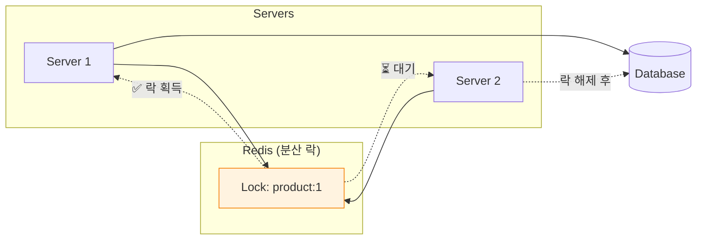
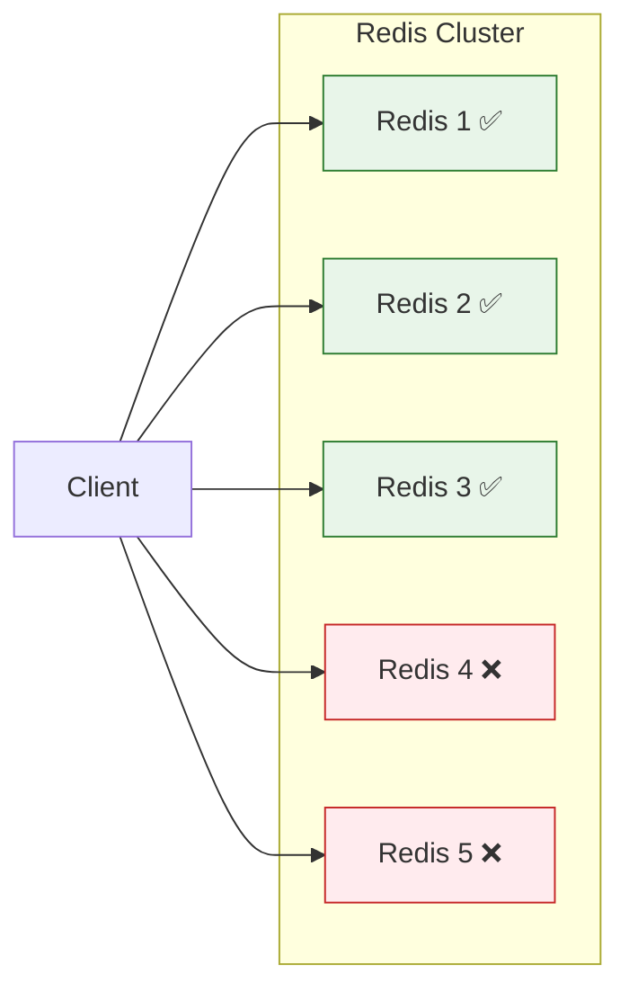

## Q1. 낙관적 락(Optimistic Lock)과 비관적 락(Pessimistic Lock)의 차이점과 사용 사례를 설명해주세요.

### 답변

**동시성 제어**는 여러 트랜잭션이 동시에 같은 데이터에 접근할 때 데이터 일관성을 보장하는 메커니즘입니다.

#### 낙관적 락 (Optimistic Lock)

**핵심 아이디어**: "충돌이 거의 발생하지 않을 것"이라고 가정하고, 충돌 발생 시에만 처리

**동작 방식:**
1. 데이터 읽기 시 버전 정보 함께 읽음
2. 수정 작업 수행
3. 커밋 시 버전 확인 → 변경되었으면 롤백

```java
@Entity
@Getter
@NoArgsConstructor
public class Product {

    @Id
    @GeneratedValue(strategy = GenerationType.IDENTITY)
    private Long id;

    private String name;
    private int stock;

    @Version  // ✅ 낙관적 락 활성화
    private Long version;

    public void decreaseStock(int quantity) {
        if (this.stock < quantity) {
            throw new InsufficientStockException(this.id, quantity, this.stock);
        }
        this.stock -= quantity;
    }
}

@Service
@RequiredArgsConstructor
public class OrderService {

    private final ProductRepository productRepository;
    private final OrderRepository orderRepository;

    @Transactional
    public Order createOrder(Long productId, int quantity) {
        // 1. Product 조회 (version 함께 읽음)
        Product product = productRepository.findById(productId)
            .orElseThrow(() -> new ProductNotFoundException(productId));

        // 2. 재고 차감
        product.decreaseStock(quantity);

        // 3. 주문 생성
        Order order = new Order(product, quantity);
        orderRepository.save(order);

        // 4. 커밋 시 JPA가 자동으로 버전 확인
        // UPDATE product SET stock = ?, version = version + 1
        // WHERE id = ? AND version = ?
        //
        // version이 변경되었으면 OptimisticLockException 발생!

        return order;
    }
}
```

**실제 실행 SQL:**
```sql
-- 1. 조회 (version 포함)
SELECT id, name, stock, version
FROM product
WHERE id = 1;
-- 결과: stock = 100, version = 5

-- 2. 업데이트 (version 조건 추가)
UPDATE product
SET stock = 99, version = 6
WHERE id = 1 AND version = 5;  -- ✅ version 확인

-- version이 변경되었으면 (다른 트랜잭션이 먼저 수정)
-- UPDATE 결과가 0 → OptimisticLockException
```

**예외 처리:**
```java
@RestControllerAdvice
public class GlobalExceptionHandler {

    @ExceptionHandler(OptimisticLockException.class)
    @ResponseStatus(HttpStatus.CONFLICT)
    public ErrorResponse handleOptimisticLock(OptimisticLockException ex) {
        return ErrorResponse.builder()
            .code("OPTIMISTIC_LOCK_FAILED")
            .message("다른 사용자가 먼저 수정했습니다. 다시 시도해주세요.")
            .build();
    }
}

// 재시도 로직
@Service
public class OrderService {

    @Retryable(
        value = OptimisticLockException.class,
        maxAttempts = 3,
        backoff = @Backoff(delay = 100)
    )
    @Transactional
    public Order createOrderWithRetry(Long productId, int quantity) {
        // 낙관적 락 충돌 시 자동 재시도
        return createOrder(productId, quantity);
    }
}
```

#### 비관적 락 (Pessimistic Lock)

**핵심 아이디어**: "충돌이 자주 발생할 것"이라고 가정하고, 미리 락을 획득

**동작 방식:**
1. 데이터 읽기 시 **DB 레벨 락** 획득 (SELECT FOR UPDATE)
2. 다른 트랜잭션은 대기
3. 수정 작업 수행
4. 커밋 시 락 해제

```java
public interface ProductRepository extends JpaRepository<Product, Long> {

    // PESSIMISTIC_WRITE: 배타적 락 (SELECT FOR UPDATE)
    @Lock(LockModeType.PESSIMISTIC_WRITE)
    @Query("SELECT p FROM Product p WHERE p.id = :id")
    Optional<Product> findByIdWithPessimisticLock(@Param("id") Long id);

    // PESSIMISTIC_READ: 공유 락 (SELECT FOR SHARE) - MySQL 8.0+
    @Lock(LockModeType.PESSIMISTIC_READ)
    @Query("SELECT p FROM Product p WHERE p.id = :id")
    Optional<Product> findByIdWithPessimisticReadLock(@Param("id") Long id);
}

@Service
@RequiredArgsConstructor
public class OrderService {

    private final ProductRepository productRepository;

    @Transactional
    public Order createOrderWithPessimisticLock(Long productId, int quantity) {
        // 1. Product 조회 + 락 획득
        Product product = productRepository.findByIdWithPessimisticLock(productId)
            .orElseThrow(() -> new ProductNotFoundException(productId));

        // 2. 재고 차감 (다른 트랜잭션은 대기 중)
        product.decreaseStock(quantity);

        // 3. 주문 생성
        Order order = new Order(product, quantity);

        // 4. 커밋 시 락 해제
        return orderRepository.save(order);
    }
}
```

**실제 실행 SQL:**
```sql
-- 1. 락 획득 (다른 트랜잭션은 대기)
SELECT id, name, stock
FROM product
WHERE id = 1
FOR UPDATE;  -- ✅ 배타적 락 획득

-- 2. 업데이트
UPDATE product
SET stock = 99
WHERE id = 1;

-- 3. COMMIT → 락 해제
```

#### 낙관적 락 vs 비관적 락 비교

| 항목 | 낙관적 락 | 비관적 락 |
|------|----------|----------|
| **락 방식** | Application 레벨 (Version) | DB 레벨 (SELECT FOR UPDATE) |
| **충돌 처리** | 커밋 시점에 확인 | 읽기 시점에 락 획득 |
| **성능** | 충돌 적을 때 유리 | 충돌 많을 때 유리 |
| **데드락** | 발생 안 함 | 발생 가능 |
| **트랜잭션 길이** | 긴 트랜잭션 가능 | 짧은 트랜잭션 권장 |
| **사용자 경험** | 재시도 필요 (409 Conflict) | 대기 후 성공 |
| **적합한 사례** | 조회 많고 수정 적음 (게시글 조회수) | 수정 빈번 (결제, 재고 차감) |

### 꼬리 질문 1: 낙관적 락에서 버전을 사용하지 않고 구현할 수 있나요?

**가능합니다. 비교 대상 필드를 직접 지정할 수 있습니다.**

```java
// @Version 대신 특정 필드 비교
@Entity
public class Account {
    @Id
    private Long id;

    private BigDecimal balance;

    private LocalDateTime lastModified;
}

// Custom 낙관적 락 구현
@Repository
public class AccountRepository {

    @PersistenceContext
    private EntityManager em;

    @Transactional
    public void withdraw(Long accountId, BigDecimal amount, LocalDateTime expectedLastModified) {
        String sql = """
            UPDATE account
            SET balance = balance - :amount,
                last_modified = :now
            WHERE id = :id
              AND last_modified = :expectedLastModified
            """;

        int updated = em.createNativeQuery(sql)
            .setParameter("amount", amount)
            .setParameter("now", LocalDateTime.now())
            .setParameter("id", accountId)
            .setParameter("expectedLastModified", expectedLastModified)
            .executeUpdate();

        if (updated == 0) {
            throw new OptimisticLockException("Account was modified by another transaction");
        }
    }
}
```

### 꼬리 질문 2: 비관적 락 사용 시 데드락을 방지하는 방법은?

**데드락 발생 시나리오:**
```
Transaction 1: Lock(Product A) → Lock(Product B) 대기
Transaction 2: Lock(Product B) → Lock(Product A) 대기
→ 서로 무한 대기 (Deadlock)
```

**방지 방법:**

##### 1. 락 순서 통일 (Lock Ordering)

```java
@Service
public class OrderService {

    @Transactional
    public void createOrderWithMultipleProducts(List<Long> productIds, List<Integer> quantities) {
        // ✅ 항상 같은 순서로 락 획득 (ID 오름차순)
        List<Long> sortedProductIds = productIds.stream()
            .sorted()
            .collect(Collectors.toList());

        List<Product> products = sortedProductIds.stream()
            .map(id -> productRepository.findByIdWithPessimisticLock(id)
                .orElseThrow(() -> new ProductNotFoundException(id)))
            .collect(Collectors.toList());

        // 재고 차감
        for (int i = 0; i < products.size(); i++) {
            products.get(i).decreaseStock(quantities.get(i));
        }
    }
}
```

##### 2. 타임아웃 설정

```java
// JPA 힌트로 타임아웃 설정
@Lock(LockModeType.PESSIMISTIC_WRITE)
@QueryHints({
    @QueryHint(name = "javax.persistence.lock.timeout", value = "3000")  // 3초
})
@Query("SELECT p FROM Product p WHERE p.id = :id")
Optional<Product> findByIdWithLockTimeout(@Param("id") Long id);

// 또는 EntityManager 사용
@Repository
public class ProductRepositoryCustomImpl {

    @PersistenceContext
    private EntityManager em;

    public Product findByIdWithLock(Long id, int timeoutMs) {
        Map<String, Object> properties = new HashMap<>();
        properties.put("javax.persistence.lock.timeout", timeoutMs);

        return em.find(
            Product.class,
            id,
            LockModeType.PESSIMISTIC_WRITE,
            properties
        );
    }
}
```

##### 3. 데드락 감지 및 재시도

```java
@Service
public class OrderService {

    @Retryable(
        value = {PessimisticLockException.class, CannotAcquireLockException.class},
        maxAttempts = 3,
        backoff = @Backoff(delay = 200, multiplier = 2)
    )
    @Transactional
    public Order createOrderWithDeadlockRetry(Long productId, int quantity) {
        try {
            return createOrderWithPessimisticLock(productId, quantity);

        } catch (PessimisticLockException e) {
            log.warn("Pessimistic lock failed, retrying: {}", e.getMessage());
            throw e;  // @Retryable이 재시도
        }
    }
}
```

---

## Q2. 분산 환경에서의 동시성 제어 방법 (Redis 분산 락)을 설명해주세요.

### 답변

**문제 상황**: 서버가 여러 대일 때 JPA 락만으로는 동시성 제어 불가능


```mermaid
flowchart LR
    subgraph Servers
        S1[Server 1]
        S2[Server 2]
    end
    
    subgraph Redis ["Redis (분산 락)"]
        Lock["Lock: product:1"]
    end
    
    DB[(Database)]
    
    S1 --> Lock
    S2 --> Lock
    Lock -.->|✅ 락 획득| S1
    Lock -.->|⏳ 대기| S2
    S1 --> DB
    S2 -.->|락 해제 후| DB
    
    style Lock fill:#fff3e0,stroke:#f57c00
```

**해결: 분산 락 (Distributed Lock)**

#### Redis를 이용한 분산 락 구현

##### 1. Lettuce 기반 구현 (Spin Lock)

```java
@Component
@RequiredArgsConstructor
@Slf4j
public class RedisLockRepository {

    private final RedisTemplate<String, String> redisTemplate;

    public Boolean lock(String key, long timeoutMillis) {
        try {
            return redisTemplate
                .opsForValue()
                .setIfAbsent(key, "locked", Duration.ofMillis(timeoutMillis));

        } catch (Exception e) {
            log.error("Failed to acquire lock: {}", key, e);
            return false;
        }
    }

    public void unlock(String key) {
        redisTemplate.delete(key);
    }
}

@Component
@RequiredArgsConstructor
public class DistributedLockAspect {

    private final RedisLockRepository lockRepository;

    private static final String LOCK_PREFIX = "lock:";
    private static final long LOCK_TIMEOUT = 3000;  // 3초
    private static final long RETRY_DELAY = 50;     // 50ms

    public Object executeWithLock(String lockKey, Supplier<?> task) {
        String fullLockKey = LOCK_PREFIX + lockKey;
        long startTime = System.currentTimeMillis();

        try {
            // Spin Lock: 락 획득까지 재시도
            while (!lockRepository.lock(fullLockKey, LOCK_TIMEOUT)) {
                if (System.currentTimeMillis() - startTime > LOCK_TIMEOUT) {
                    throw new LockAcquisitionException("Failed to acquire lock: " + lockKey);
                }

                Thread.sleep(RETRY_DELAY);  // 50ms 대기 후 재시도
            }

            log.info("Lock acquired: {}", lockKey);

            // 비즈니스 로직 실행
            return task.get();

        } catch (InterruptedException e) {
            Thread.currentThread().interrupt();
            throw new LockAcquisitionException("Lock acquisition interrupted", e);

        } finally {
            lockRepository.unlock(fullLockKey);
            log.info("Lock released: {}", lockKey);
        }
    }
}

// 사용
@Service
@RequiredArgsConstructor
public class OrderService {

    private final DistributedLockAspect lockAspect;
    private final ProductRepository productRepository;

    @Transactional
    public Order createOrderWithDistributedLock(Long productId, int quantity) {
        String lockKey = "product:" + productId;

        return (Order) lockAspect.executeWithLock(lockKey, () -> {
            // 1. Product 조회
            Product product = productRepository.findById(productId)
                .orElseThrow(() -> new ProductNotFoundException(productId));

            // 2. 재고 차감 (분산 락으로 보호)
            product.decreaseStock(quantity);

            // 3. 주문 생성
            return orderRepository.save(new Order(product, quantity));
        });
    }
}
```

##### 2. Redisson 기반 구현 (Pub/Sub)

**Redisson의 장점**: Spin Lock 대신 Pub/Sub으로 효율적인 대기

```java
// build.gradle
implementation 'org.redisson:redisson-spring-boot-starter:3.20.0'

// RedissonConfig.java
@Configuration
public class RedissonConfig {

    @Bean
    public RedissonClient redissonClient() {
        Config config = new Config();
        config.useSingleServer()
            .setAddress("redis://localhost:6379")
            .setConnectionPoolSize(10)
            .setConnectionMinimumIdleSize(5);

        return Redisson.create(config);
    }
}

// DistributedLock 어노테이션
@Target(ElementType.METHOD)
@Retention(RetentionPolicy.RUNTIME)
public @interface DistributedLock {
    String key();  // SpEL 지원
    long waitTime() default 5000;   // 락 획득 대기 시간
    long leaseTime() default 3000;  // 락 유지 시간
}

// AOP
@Aspect
@Component
@RequiredArgsConstructor
@Slf4j
public class DistributedLockAspect {

    private final RedissonClient redissonClient;
    private final AopForTransaction aopForTransaction;

    @Around("@annotation(distributedLock)")
    public Object lock(ProceedingJoinPoint joinPoint, DistributedLock distributedLock)
            throws Throwable {

        MethodSignature signature = (MethodSignature) joinPoint.getSignature();
        Method method = signature.getMethod();

        // SpEL로 동적 키 생성
        String lockKey = createKey(
            distributedLock.key(),
            signature.getParameterNames(),
            joinPoint.getArgs()
        );

        RLock lock = redissonClient.getLock(lockKey);

        try {
            // 락 획득 시도
            boolean available = lock.tryLock(
                distributedLock.waitTime(),
                distributedLock.leaseTime(),
                TimeUnit.MILLISECONDS
            );

            if (!available) {
                throw new LockAcquisitionException("Failed to acquire lock: " + lockKey);
            }

            log.info("Lock acquired: {}", lockKey);

            // ✅ 트랜잭션 분리 (락 획득 후 트랜잭션 시작)
            return aopForTransaction.proceed(joinPoint);

        } finally {
            if (lock.isHeldByCurrentThread()) {
                lock.unlock();
                log.info("Lock released: {}", lockKey);
            }
        }
    }

    private String createKey(String key, String[] parameterNames, Object[] args) {
        ExpressionParser parser = new SpelExpressionParser();
        StandardEvaluationContext context = new StandardEvaluationContext();

        for (int i = 0; i < parameterNames.length; i++) {
            context.setVariable(parameterNames[i], args[i]);
        }

        return parser.parseExpression(key).getValue(context, String.class);
    }
}

// 트랜잭션 분리
@Component
public class AopForTransaction {

    @Transactional
    public Object proceed(ProceedingJoinPoint joinPoint) throws Throwable {
        return joinPoint.proceed();
    }
}

// 사용
@Service
public class OrderService {

    @DistributedLock(key = "'product:' + #productId", waitTime = 5000, leaseTime = 3000)
    public Order createOrder(Long productId, int quantity) {
        // 분산 락이 자동으로 적용
        Product product = productRepository.findById(productId)
            .orElseThrow(() -> new ProductNotFoundException(productId));

        product.decreaseStock(quantity);

        return orderRepository.save(new Order(product, quantity));
    }
}
```

#### Lettuce vs Redisson 비교

| 항목 | Lettuce (Spin Lock) | Redisson (Pub/Sub) |
|------|---------------------|-------------------|
| **대기 방식** | 주기적으로 락 확인 (Polling) | Pub/Sub으로 알림 대기 |
| **성능** | CPU 사용량 높음 | 효율적 |
| **구현 복잡도** | 간단 | 라이브러리 의존 |
| **재시도 간격** | 직접 조정 필요 | 자동 최적화 |
| **권장 사용** | 간단한 락, 대기 시간 짧음 | 복잡한 락, 대기 시간 김 |

### 꼬리 질문 1: 분산 락 사용 시 주의사항은?

##### 1. 트랜잭션과 락의 범위 분리

```java
// ❌ 잘못된 사용
@Transactional
@DistributedLock(key = "'product:' + #productId")
public Order createOrder(Long productId, int quantity) {
    // 문제: 트랜잭션이 락보다 먼저 시작
    // 트랜잭션 시작 → 락 획득 → 비즈니스 로직 → 락 해제 → 트랜잭션 커밋
    // → 락 해제와 커밋 사이에 다른 트랜잭션이 접근 가능!
}

// ✅ 올바른 사용
@DistributedLock(key = "'product:' + #productId")
public Order createOrder(Long productId, int quantity) {
    // 락 획득 → 트랜잭션 시작 → 비즈니스 로직 → 트랜잭션 커밋 → 락 해제
    return aopForTransaction.proceed(() -> {
        Product product = productRepository.findById(productId)
            .orElseThrow();
        product.decreaseStock(quantity);
        return orderRepository.save(new Order(product, quantity));
    });
}
```

##### 2. 락 타임아웃 설정

```java
@DistributedLock(
    key = "'product:' + #productId",
    waitTime = 5000,   // 5초 대기
    leaseTime = 3000   // 3초 후 자동 해제 (데드락 방지)
)
public Order createOrder(Long productId, int quantity) {
    // leaseTime 내에 완료되어야 함!
}
```

##### 3. Redis 장애 시 대응

```java
@Component
public class FallbackLockService {

    @Autowired
    private RedissonClient redissonClient;

    public <T> T executeWithLock(String lockKey, Supplier<T> task) {
        try {
            RLock lock = redissonClient.getLock(lockKey);
            boolean acquired = lock.tryLock(5, 3, TimeUnit.SECONDS);

            if (!acquired) {
                throw new LockAcquisitionException("Failed to acquire lock");
            }

            try {
                return task.get();
            } finally {
                lock.unlock();
            }

        } catch (RedisConnectionException e) {
            log.error("Redis connection failed, fallback to pessimistic lock", e);

            // Fallback: DB 비관적 락 사용
            return executeWithPessimisticLock(task);
        }
    }
}
```

### 꼬리 질문 2: Redlock 알고리즘은 무엇인가요?

**Redlock**: Redis 클러스터 환경에서 안전한 분산 락

**단일 Redis의 문제:**
- Master 장애 시 Slave로 페일오버
- 페일오버 중 락 정보 유실 가능

**Redlock 알고리즘:**

```mermaid
flowchart LR
    Client[Client]
    
    subgraph RedisCluster ["Redis Cluster"]
        R1[Redis 1 ✅]
        R2[Redis 2 ✅]
        R3[Redis 3 ✅]
        R4[Redis 4 ❌]
        R5[Redis 5 ❌]
    end
    
    Client --> R1
    Client --> R2
    Client --> R3
    Client --> R4
    Client --> R5
    
    style R1 fill:#e8f5e9,stroke:#2e7d32
    style R2 fill:#e8f5e9,stroke:#2e7d32
    style R3 fill:#e8f5e9,stroke:#2e7d32
    style R4 fill:#ffebee,stroke:#c62828
    style R5 fill:#ffebee,stroke:#c62828
```

**Redlock 알고리즘:**
1. 5개의 독립적인 Redis 인스턴스에 락 요청
2. 과반수(3개 이상) 획득 시 성공
3. 실패 시 모든 락 해제

```java
// Redisson은 Redlock 지원
@Bean
public RedissonClient redissonClient() {
    Config config = new Config();
    config.useClusterServers()
        .addNodeAddress(
            "redis://redis1:6379",
            "redis://redis2:6379",
            "redis://redis3:6379",
            "redis://redis4:6379",
            "redis://redis5:6379"
        );

    return Redisson.create(config);
}

// MultiLock 사용
RLock lock1 = redissonClient1.getLock("lock");
RLock lock2 = redissonClient2.getLock("lock");
RLock lock3 = redissonClient3.getLock("lock");

RedissonMultiLock multiLock = new RedissonMultiLock(lock1, lock2, lock3);

boolean acquired = multiLock.tryLock(5, 3, TimeUnit.SECONDS);
```

---


---

👉 **[다음 편: 동시성 제어 (Part 2: 재고 차감, Java 멀티스레드, 실무)](/learning/qna/concurrency-control-qna-part2/)**
