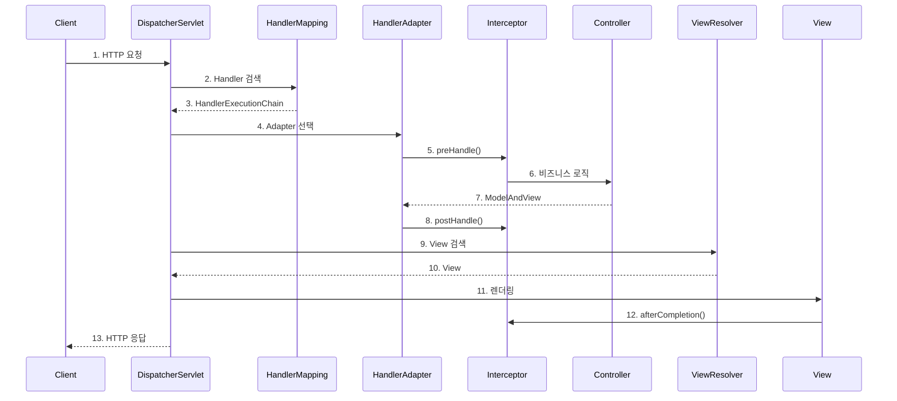

## Q1. DispatcherServlet의 동작 흐름을 설명해주세요.

### 답변

**DispatcherServlet**은 Spring MVC의 **Front Controller**로, 모든 HTTP 요청을 받아 적절한 컨트롤러로 라우팅합니다.

**전체 흐름**:



**상세 코드로 보는 흐름**:

```java
// DispatcherServlet의 핵심 메서드
protected void doDispatch(HttpServletRequest request, HttpServletResponse response) {

    // 1. Handler 검색
    HandlerExecutionChain mappedHandler = getHandler(request);

    // 2. HandlerAdapter 검색
    HandlerAdapter ha = getHandlerAdapter(mappedHandler.getHandler());

    // 3. Interceptor preHandle 실행
    if (!mappedHandler.applyPreHandle(request, response)) {
        return;
    }

    // 4. Controller 실행
    ModelAndView mv = ha.handle(request, response, mappedHandler.getHandler());

    // 5. Interceptor postHandle 실행
    mappedHandler.applyPostHandle(request, response, mv);

    // 6. View 렌더링
    processDispatchResult(request, response, mappedHandler, mv);

    // 7. Interceptor afterCompletion 실행 (finally 블록에서)
}
```

### 꼬리 질문 1: HandlerMapping은 어떻게 요청을 매핑하나요?

**답변**:

**HandlerMapping 종류**:

1. **RequestMappingHandlerMapping** (주로 사용)
   - `@RequestMapping`, `@GetMapping` 등 어노테이션 기반

2. **BeanNameUrlHandlerMapping**
   - Bean 이름으로 URL 매핑

**매핑 과정**:

```java
@RestController
@RequestMapping("/api/users")
public class UserController {

    @GetMapping("/{id}")  // /api/users/123
    public User getUser(@PathVariable Long id) {
        return userService.findById(id);
    }
}

// Spring 초기화 시:
// 1. @Controller/@RestController 빈 스캔
// 2. @RequestMapping 메서드 추출
// 3. URL 패턴과 메서드 매핑 정보를 Map에 저장
//    {"/api/users/{id}": UserController.getUser}
```

**요청 처리**:

```
GET /api/users/123 요청
  ↓
RequestMappingHandlerMapping이 Map에서 검색
  ↓
"/api/users/{id}" 패턴과 매칭
  ↓
UserController.getUser 메서드 반환
```

### 꼬리 질문 2: HandlerAdapter는 왜 필요한가요?

**답변**:

**이유**: 다양한 타입의 핸들러를 **통일된 방식**으로 실행하기 위함 (어댑터 패턴)

**HandlerAdapter 종류**:

1. **RequestMappingHandlerAdapter**: `@RequestMapping` 메서드 처리
2. **HttpRequestHandlerAdapter**: `HttpRequestHandler` 인터페이스 처리
3. **SimpleControllerHandlerAdapter**: `Controller` 인터페이스 처리

**예시**:

```java
// 핸들러 타입이 다양함
public class LegacyController implements Controller {
    public ModelAndView handleRequest(HttpServletRequest req, HttpServletResponse res) {
        // ...
    }
}

@RestController
public class ModernController {
    @GetMapping("/api/data")
    public ResponseEntity<Data> getData() {
        // ...
    }
}

// HandlerAdapter가 없다면 DispatcherServlet이 각 타입마다 다르게 처리해야 함
// HandlerAdapter 덕분에 통일된 인터페이스로 처리 가능
```

---

## Q2. Interceptor의 실행 순서를 설명해주세요.

### 답변

**Interceptor 메서드**:

1. **preHandle()**: 컨트롤러 실행 **전**
2. **postHandle()**: 컨트롤러 실행 **후**, 뷰 렌더링 **전**
3. **afterCompletion()**: 뷰 렌더링 **후**

**실행 흐름**:

```
요청
  ↓
Interceptor1.preHandle()
  ↓
Interceptor2.preHandle()
  ↓
Controller 실행
  ↓
Interceptor2.postHandle()
  ↓
Interceptor1.postHandle()
  ↓
View 렌더링
  ↓
Interceptor2.afterCompletion()
  ↓
Interceptor1.afterCompletion()
  ↓
응답
```

**코드 예시**:

```java
@Component
public class LoggingInterceptor implements HandlerInterceptor {

    @Override
    public boolean preHandle(HttpServletRequest request,
                            HttpServletResponse response,
                            Object handler) {
        System.out.println("1. preHandle - " + request.getRequestURI());
        return true;  // false 반환 시 요청 중단
    }

    @Override
    public void postHandle(HttpServletRequest request,
                          HttpServletResponse response,
                          Object handler,
                          ModelAndView modelAndView) {
        System.out.println("2. postHandle");
    }

    @Override
    public void afterCompletion(HttpServletRequest request,
                               HttpServletResponse response,
                               Object handler,
                               Exception ex) {
        System.out.println("3. afterCompletion");
        if (ex != null) {
            System.out.println("Exception: " + ex.getMessage());
        }
    }
}
```

**등록**:

```java
@Configuration
public class WebConfig implements WebMvcConfigurer {

    @Override
    public void addInterceptors(InterceptorRegistry registry) {
        registry.addInterceptor(new LoggingInterceptor())
                .addPathPatterns("/api/**")
                .excludePathPatterns("/api/public/**")
                .order(1);  // 실행 순서

        registry.addInterceptor(new AuthInterceptor())
                .addPathPatterns("/api/**")
                .order(2);
    }
}
```

### 꼬리 질문 1: Interceptor와 Filter의 차이는?

**답변**:

| 구분 | Filter | Interceptor |
|------|--------|------------|
| 영역 | Servlet 영역 | Spring 영역 |
| 실행 시점 | DispatcherServlet 전/후 | Controller 전/후 |
| 접근 가능 | Request, Response | Handler, ModelAndView |
| 예외 처리 | @ControllerAdvice 불가 | @ControllerAdvice 가능 |
| 빈 주입 | 불가능 (Spring 3.1+부터 가능) | 가능 |

**실행 순서**:

```
Client 요청
  ↓
Filter1.doFilter()
  ↓
Filter2.doFilter()
  ↓
DispatcherServlet
  ↓
Interceptor1.preHandle()
  ↓
Interceptor2.preHandle()
  ↓
Controller
  ↓
Interceptor2.postHandle()
  ↓
Interceptor1.postHandle()
  ↓
View 렌더링
  ↓
Interceptor2.afterCompletion()
  ↓
Interceptor1.afterCompletion()
  ↓
Filter2.doFilter() 후처리
  ↓
Filter1.doFilter() 후처리
  ↓
Client 응답
```

**사용 사례**:

- **Filter**: 인코딩, CORS, 보안 (Spring Security), 로깅
- **Interceptor**: 인증/인가, 로깅, 공통 데이터 처리

### 꼬리 질문 2: preHandle()이 false를 반환하면?

**답변**:

**동작**: 이후 인터셉터와 컨트롤러가 실행되지 않고 요청이 종료됩니다.

**예시**:

```java
@Component
public class AuthInterceptor implements HandlerInterceptor {

    @Override
    public boolean preHandle(HttpServletRequest request,
                            HttpServletResponse response,
                            Object handler) {
        String token = request.getHeader("Authorization");

        if (token == null || !isValidToken(token)) {
            response.setStatus(HttpStatus.UNAUTHORIZED.value());
            return false;  // 요청 중단
        }

        return true;  // 계속 진행
    }
}
```

**실행 흐름 (false 반환 시)**:

```
Interceptor1.preHandle() → true
  ↓
Interceptor2.preHandle() → false (여기서 중단)
  ↓
Interceptor1.afterCompletion() 실행 (이미 실행된 인터셉터만)
  ↓
응답 반환 (컨트롤러 실행 안 됨)
```

---

## Q3. @ControllerAdvice와 @ExceptionHandler의 동작 원리는?

### 답변

**@ControllerAdvice**: 전역 예외 처리를 담당하는 컴포넌트

**동작 위치**: DispatcherServlet의 **HandlerExceptionResolver**에서 처리

**실행 흐름**:

```
Controller에서 예외 발생
  ↓
Interceptor.postHandle() 실행 안 됨 (건너뜀)
  ↓
DispatcherServlet이 예외 캐치
  ↓
HandlerExceptionResolver 실행
  ↓
@ControllerAdvice의 @ExceptionHandler 검색
  ↓
매칭되는 ExceptionHandler 실행
  ↓
ResponseEntity/ModelAndView 반환
  ↓
Interceptor.afterCompletion() 실행 (예외 있음)
  ↓
응답 반환
```

**코드 예시**:

```java
@RestControllerAdvice
public class GlobalExceptionHandler {

    @ExceptionHandler(UserNotFoundException.class)
    public ResponseEntity<ErrorResponse> handleUserNotFound(UserNotFoundException ex) {
        ErrorResponse error = new ErrorResponse(
            "USER_NOT_FOUND",
            ex.getMessage(),
            LocalDateTime.now()
        );
        return ResponseEntity.status(HttpStatus.NOT_FOUND).body(error);
    }

    @ExceptionHandler(Exception.class)
    public ResponseEntity<ErrorResponse> handleGeneral(Exception ex) {
        ErrorResponse error = new ErrorResponse(
            "INTERNAL_ERROR",
            "An unexpected error occurred",
            LocalDateTime.now()
        );
        return ResponseEntity.status(HttpStatus.INTERNAL_SERVER_ERROR).body(error);
    }
}
```

### 꼬리 질문 1: HandlerExceptionResolver의 종류는?

**답변**:

Spring은 여러 HandlerExceptionResolver를 **체인**으로 실행합니다:

1. **ExceptionHandlerExceptionResolver**
   - `@ExceptionHandler` 처리 (우선순위 높음)

2. **ResponseStatusExceptionResolver**
   - `@ResponseStatus` 어노테이션 처리

3. **DefaultHandlerExceptionResolver**
   - Spring 내부 예외 처리 (MethodArgumentNotValidException 등)

**실행 순서**:

```java
try {
    // Controller 실행
} catch (Exception ex) {
    for (HandlerExceptionResolver resolver : resolvers) {
        ModelAndView mav = resolver.resolveException(request, response, handler, ex);
        if (mav != null) {
            return mav;  // 처리 완료
        }
    }
    // 모두 처리 못하면 예외 재발생
    throw ex;
}
```

### 꼬리 질문 2: @ExceptionHandler의 우선순위는?

**답변**:

**우선순위 (높음 → 낮음)**:

1. **Controller 내부** `@ExceptionHandler`
2. **@ControllerAdvice** `@ExceptionHandler`
3. 부모 예외 타입보다 자식 예외 타입 우선

**예시**:

```java
@RestController
public class UserController {

    // 1순위: 컨트롤러 내부
    @ExceptionHandler(UserNotFoundException.class)
    public ResponseEntity<?> handleNotFound(UserNotFoundException ex) {
        return ResponseEntity.status(404).body("User not found in controller");
    }
}

@RestControllerAdvice
public class GlobalExceptionHandler {

    // 2순위: 자식 예외
    @ExceptionHandler(UserNotFoundException.class)
    public ResponseEntity<?> handleUserNotFound(UserNotFoundException ex) {
        return ResponseEntity.status(404).body("User not found");
    }

    // 3순위: 부모 예외
    @ExceptionHandler(RuntimeException.class)
    public ResponseEntity<?> handleRuntime(RuntimeException ex) {
        return ResponseEntity.status(500).body("Runtime error");
    }
}
```

---

## Q4. ArgumentResolver와 ReturnValueHandler는 무엇인가요?

### 답변

**ArgumentResolver**: 컨트롤러 메서드의 **파라미터**를 해석하여 값을 주입

**ReturnValueHandler**: 컨트롤러 메서드의 **반환값**을 처리하여 응답 생성

**실행 위치**:

```
HandlerAdapter.handle()
  ↓
ArgumentResolver: 파라미터 해석 (@RequestBody, @PathVariable 등)
  ↓
Controller 메서드 실행
  ↓
ReturnValueHandler: 반환값 처리 (ResponseEntity, @ResponseBody 등)
  ↓
ModelAndView 반환
```

**ArgumentResolver 예시**:

```java
@GetMapping("/users/{id}")
public User getUser(
    @PathVariable Long id,              // PathVariableMethodArgumentResolver
    @RequestParam String name,          // RequestParamMethodArgumentResolver
    @RequestHeader String auth,         // RequestHeaderMethodArgumentResolver
    @RequestBody UserRequest body,      // RequestResponseBodyMethodProcessor
    HttpServletRequest request,         // ServletRequestMethodArgumentResolver
    @AuthUser User currentUser          // Custom ArgumentResolver
) {
    // ...
}
```

**커스텀 ArgumentResolver**:

```java
// 1. 어노테이션 정의
@Target(ElementType.PARAMETER)
@Retention(RetentionPolicy.RUNTIME)
public @interface AuthUser {
}

// 2. ArgumentResolver 구현
public class AuthUserArgumentResolver implements HandlerMethodArgumentResolver {

    @Override
    public boolean supportsParameter(MethodParameter parameter) {
        return parameter.hasParameterAnnotation(AuthUser.class);
    }

    @Override
    public Object resolveArgument(MethodParameter parameter,
                                 ModelAndViewContainer mavContainer,
                                 NativeWebRequest webRequest,
                                 WebDataBinderFactory binderFactory) {
        HttpServletRequest request = webRequest.getNativeRequest(HttpServletRequest.class);
        String token = request.getHeader("Authorization");

        // 토큰에서 사용자 정보 추출
        return userService.getUserFromToken(token);
    }
}

// 3. 등록
@Configuration
public class WebConfig implements WebMvcConfigurer {

    @Override
    public void addArgumentResolvers(List<HandlerMethodArgumentResolver> resolvers) {
        resolvers.add(new AuthUserArgumentResolver());
    }
}
```

**ReturnValueHandler 예시**:

```java
@RestController
public class UserController {

    @GetMapping("/users/{id}")
    public User getUser(@PathVariable Long id) {
        // RequestResponseBodyMethodProcessor가 처리
        // User 객체 → JSON 변환 → HttpMessageConverter 사용
        return userService.findById(id);
    }

    @GetMapping("/users")
    public ResponseEntity<List<User>> getUsers() {
        // HttpEntityMethodProcessor가 처리
        return ResponseEntity.ok(userService.findAll());
    }

    @GetMapping("/view")
    public ModelAndView getUserView() {
        // ModelAndViewMethodReturnValueHandler가 처리
        return new ModelAndView("userView");
    }
}
```

---

## Q5. MessageConverter는 언제 동작하나요?

### 답변

**HttpMessageConverter**: HTTP 요청 본문을 객체로 변환하거나, 객체를 HTTP 응답 본문으로 변환

**동작 시점**:

1. **요청**: `@RequestBody` 파라미터 처리 시
2. **응답**: `@ResponseBody` 또는 `ResponseEntity` 반환 시

**주요 MessageConverter**:

| Converter | Content-Type | 처리 타입 |
|-----------|-------------|---------|
| StringHttpMessageConverter | text/plain | String |
| MappingJackson2HttpMessageConverter | application/json | Object ↔ JSON |
| MappingJackson2XmlHttpMessageConverter | application/xml | Object ↔ XML |
| ByteArrayHttpMessageConverter | application/octet-stream | byte[] |

**실행 흐름**:

```java
@PostMapping("/users")
public ResponseEntity<User> createUser(@RequestBody UserRequest request) {
    User user = userService.create(request);
    return ResponseEntity.ok(user);
}

// 1. 요청 처리
Content-Type: application/json
Body: {"name": "John", "email": "john@example.com"}
  ↓
MappingJackson2HttpMessageConverter.read()
  ↓
UserRequest 객체 생성

// 2. 응답 처리
User 객체 반환
  ↓
Accept: application/json 헤더 확인
  ↓
MappingJackson2HttpMessageConverter.write()
  ↓
JSON 변환하여 응답
```

**커스텀 MessageConverter**:

```java
public class CustomMessageConverter extends AbstractHttpMessageConverter<CustomData> {

    public CustomMessageConverter() {
        super(MediaType.valueOf("application/custom"));
    }

    @Override
    protected boolean supports(Class<?> clazz) {
        return CustomData.class.equals(clazz);
    }

    @Override
    protected CustomData readInternal(Class<? extends CustomData> clazz,
                                      HttpInputMessage inputMessage) {
        // InputStream → CustomData 변환
    }

    @Override
    protected void writeInternal(CustomData customData,
                                HttpOutputMessage outputMessage) {
        // CustomData → OutputStream 변환
    }
}

// 등록
@Configuration
public class WebConfig implements WebMvcConfigurer {

    @Override
    public void configureMessageConverters(List<HttpMessageConverter<?>> converters) {
        converters.add(new CustomMessageConverter());
    }
}
```

---

## 핵심 요약

### 학습 체크리스트

**DispatcherServlet 흐름**:
- HandlerMapping → HandlerAdapter → Controller → ViewResolver 순서
- 각 컴포넌트의 역할 이해
- HandlerAdapter가 필요한 이유 (어댑터 패턴)

**Interceptor**:
- preHandle, postHandle, afterCompletion 실행 순서
- Filter vs Interceptor 차이
- preHandle false 반환 시 동작

**예외 처리**:
- @ControllerAdvice 동작 위치 (HandlerExceptionResolver)
- @ExceptionHandler 우선순위
- 예외 발생 시 Interceptor 실행 흐름

**확장 포인트**:
- ArgumentResolver: 파라미터 처리
- ReturnValueHandler: 반환값 처리
- MessageConverter: 요청/응답 본문 변환

### 실무 활용

- Interceptor로 인증/로깅 처리
- @ControllerAdvice로 전역 예외 처리
- 커스텀 ArgumentResolver로 공통 파라미터 주입
- MessageConverter로 커스텀 포맷 지원

---

## 🔗 Related Deep Dive

더 깊이 있는 학습을 원한다면 심화 과정을 참고하세요:

- **[Spring MVC 요청 처리 흐름](/learning/deep-dive/deep-dive-spring-mvc-request-lifecycle/)**: Filter → DispatcherServlet → Interceptor → Controller 시퀀스 다이어그램.
- **[Spring Boot 자동 설정](/learning/deep-dive/deep-dive-spring-boot-auto-config/)**:@ConditionalOn 어노테이션과 Bean 등록 흐름.
