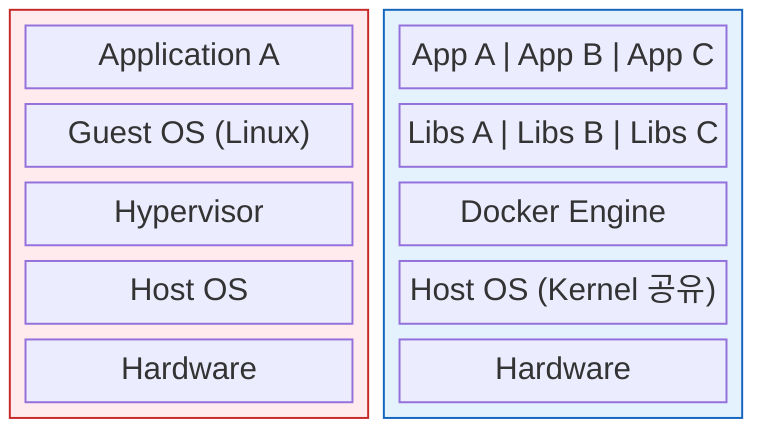

# Docker & Kubernetes 정리

## Q1. Docker와 가상머신(VM)의 차이는 무엇인가요?

### 답변

**Docker (Container)**와 **VM (Virtual Machine)**은 모두 애플리케이션 격리를 제공하지만, **동작 방식이 다릅니다**.

### 아키텍처 비교

**Virtual Machine**:



### 비교표

| 특징 | Docker Container | Virtual Machine |
|------|------------------|-----------------|
| 격리 수준 | 프로세스 레벨 | 하드웨어 레벨 |
| OS | 호스트 OS 커널 공유 | 각 VM마다 독립 OS |
| 시작 시간 | 수 초 | 수 분 |
| 리소스 사용 | 적음 (MB) | 많음 (GB) |
| 성능 | 거의 네이티브 | 오버헤드 있음 |
| 보안 | 낮음 (커널 공유) | 높음 (완전 격리) |

**리소스 사용 예시**:

```bash
# VM 3개 실행
VM 1: OS 2GB + App 500MB = 2.5GB
VM 2: OS 2GB + App 500MB = 2.5GB
VM 3: OS 2GB + App 500MB = 2.5GB
총: 7.5GB

# Container 3개 실행
Container 1: App 500MB
Container 2: App 500MB
Container 3: App 500MB
총: 1.5GB (Host OS 커널 공유)
```

**시작 시간 비교**:

```bash
# VM 시작
$ time vagrant up
real    2m30s  # 2분 30초

# Container 시작
$ time docker run -d nginx
real    0m2s   # 2초
```

### 꼬리 질문 1: Docker 이미지와 컨테이너의 차이는?

**Image (이미지)**: 읽기 전용 템플릿
**Container (컨테이너)**: 실행 중인 이미지 인스턴스

```
Image (Template)           Container (Running Instance)
     ↓                              ↓
   Class                          Object

예시:
ubuntu:22.04 (Image)  →  컨테이너 1, 2, 3 (Containers)
```

**Dockerfile → Image → Container**:

```dockerfile
# Dockerfile
FROM openjdk:17-slim
COPY app.jar /app.jar
CMD ["java", "-jar", "/app.jar"]
```

```bash
# 1. Dockerfile → Image 빌드
docker build -t myapp:1.0 .
# → Image: myapp:1.0 생성

# 2. Image → Container 실행
docker run -d --name app1 myapp:1.0
docker run -d --name app2 myapp:1.0
docker run -d --name app3 myapp:1.0
# → 동일 Image로 3개 Container 실행
```

### 꼬리 질문 2: Docker 레이어(Layer)란?

**Docker Image는 여러 레이어의 조합**입니다.

```dockerfile
FROM ubuntu:22.04          # Layer 1 (80MB)
RUN apt-get update         # Layer 2 (50MB)
RUN apt-get install -y openjdk-17  # Layer 3 (200MB)
COPY app.jar /app.jar      # Layer 4 (10MB)
CMD ["java", "-jar", "/app.jar"]   # Layer 5 (metadata)
```

**레이어 확인**:

```bash
docker history myapp:1.0

# 출력:
# IMAGE          CREATED BY                              SIZE
# abc123         CMD ["java", "-jar", "/app.jar"]        0B
# def456         COPY app.jar /app.jar                   10MB
# ghi789         RUN apt-get install -y openjdk-17       200MB
# jkl012         RUN apt-get update                      50MB
# mno345         FROM ubuntu:22.04                       80MB
```

**레이어 재사용**:

```
Image A                    Image B
└─ Layer 1 (ubuntu:22.04) ← 공유
   └─ Layer 2 (update)    ← 공유
      └─ Layer 3 (JDK)    ← 공유
         └─ Layer 4 (app1.jar)
                           └─ Layer 4 (app2.jar)

→ Layer 1, 2, 3은 재사용되어 디스크 절약
```

---

## Q2. Kubernetes의 Pod와 Deployment의 차이는?

### 답변

**Pod**는 **Kubernetes의 최소 배포 단위**이며, **Deployment는 Pod를 관리하는 상위 리소스**입니다.

### Pod란?

**Pod**: 하나 이상의 컨테이너를 포함하는 그룹

```yaml
apiVersion: v1
kind: Pod
metadata:
  name: myapp-pod
spec:
  containers:
  - name: app
    image: myapp:1.0
    ports:
    - containerPort: 8080
```

**특징**:
- **임시 리소스**: Pod 삭제 시 재생성 안 됨
- **고유 IP**: 각 Pod는 클러스터 내부 IP 보유
- **볼륨 공유**: Pod 내 컨테이너끼리 볼륨 공유 가능

**Multi-Container Pod**:

```yaml
apiVersion: v1
kind: Pod
metadata:
  name: web-pod
spec:
  containers:
  # Main Container
  - name: nginx
    image: nginx:1.21
    ports:
    - containerPort: 80
    volumeMounts:
    - name: shared-logs
      mountPath: /var/log/nginx

  # Sidecar Container (로그 수집)
  - name: log-collector
    image: fluent/fluentd
    volumeMounts:
    - name: shared-logs
      mountPath: /logs

  volumes:
  - name: shared-logs
    emptyDir: {}
```

### Deployment란?

**Deployment**: Pod의 선언적 관리 (복제, 롤링 업데이트, 롤백)

```yaml
apiVersion: apps/v1
kind: Deployment
metadata:
  name: myapp-deployment
spec:
  replicas: 3  # Pod 3개 유지
  selector:
    matchLabels:
      app: myapp
  template:
    metadata:
      labels:
        app: myapp
    spec:
      containers:
      - name: app
        image: myapp:1.0
        ports:
        - containerPort: 8080
```

**Deployment가 제공하는 기능**:

```
1. 복제 관리 (ReplicaSet)
   - 지정된 개수의 Pod 유지
   - Pod 장애 시 자동 재생성

2. 롤링 업데이트
   - 무중단 배포
   - 단계적으로 새 버전 배포

3. 롤백
   - 이전 버전으로 되돌리기
   - 배포 히스토리 관리

4. 스케일링
   - Pod 개수 동적 조정
```

### Pod vs Deployment 비교

| 특징 | Pod | Deployment |
|------|-----|------------|
| 직접 사용 | 테스트용 | 프로덕션 |
| 장애 복구 | 재생성 안 됨 | 자동 재생성 |
| 업데이트 | 수동 삭제/생성 | 롤링 업데이트 |
| 롤백 | 불가능 | 가능 |
| 스케일링 | 수동 | 자동/수동 |

**실무 사용 예시**:

```bash
# ❌ Pod 직접 사용 (비권장)
kubectl run myapp --image=myapp:1.0 --port=8080
# Pod 삭제 시 재생성 안 됨

# ✅ Deployment 사용 (권장)
kubectl create deployment myapp --image=myapp:1.0 --replicas=3
# Pod 삭제 시 자동으로 재생성됨
```

### 꼬리 질문: ReplicaSet이란?

**ReplicaSet**: Deployment가 내부적으로 사용하는 리소스

```
Deployment
  └─ ReplicaSet (v1)
      ├─ Pod 1
      ├─ Pod 2
      └─ Pod 3
```

**롤링 업데이트 시**:

```
Deployment (v2로 업데이트)
  ├─ ReplicaSet (v1) - 점진적 축소
  │   ├─ Pod 1 (종료)
  │   └─ Pod 2 (종료)
  └─ ReplicaSet (v2) - 점진적 확대
      ├─ Pod 1 (새로 생성)
      ├─ Pod 2 (새로 생성)
      └─ Pod 3 (새로 생성)
```

**확인**:

```bash
kubectl get replicasets

# 출력:
# NAME                   DESIRED   CURRENT   READY
# myapp-7d4b9c8f-v1     0         0         0       # Old
# myapp-9f6a5e2d-v2     3         3         3       # Current
```

---

## Q3. Kubernetes Probes (Health Check)의 종류는?

### 답변

**Probes**는 **컨테이너의 상태를 확인**하는 Health Check 메커니즘입니다.

### 3가지 Probe 종류

**1. Liveness Probe (생존 확인)**:

**목적**: 컨테이너가 살아있는지 확인 → 실패 시 **재시작**

```yaml
apiVersion: v1
kind: Pod
metadata:
  name: myapp
spec:
  containers:
  - name: app
    image: myapp:1.0
    livenessProbe:
      httpGet:
        path: /health
        port: 8080
      initialDelaySeconds: 30  # 시작 후 30초 대기
      periodSeconds: 10        # 10초마다 체크
      timeoutSeconds: 5        # 5초 타임아웃
      failureThreshold: 3      # 3번 실패 시 재시작
```

**동작**:

```
1. 컨테이너 시작
2. 30초 대기 (initialDelaySeconds)
3. 10초마다 GET /health 요청
4. 3번 연속 실패 → kubelet이 컨테이너 재시작
5. 재시작 횟수 증가 (RESTARTS 카운트)
```

**실패 시나리오**:

```bash
# 애플리케이션이 데드락 상태
GET /health → 타임아웃 (5초 초과)
GET /health → 타임아웃
GET /health → 타임아웃
→ 컨테이너 재시작 ♻️
```

**2. Readiness Probe (준비 확인)**:

**목적**: 컨테이너가 트래픽을 받을 준비가 되었는지 확인 → 실패 시 **Service에서 제외**

```yaml
apiVersion: v1
kind: Pod
metadata:
  name: myapp
spec:
  containers:
  - name: app
    image: myapp:1.0
    readinessProbe:
      httpGet:
        path: /ready
        port: 8080
      initialDelaySeconds: 10
      periodSeconds: 5
      failureThreshold: 3
```

**동작**:

```
1. 컨테이너 시작
2. Readiness Probe 실패 → Service Endpoint에서 제외
3. 애플리케이션 초기화 완료
4. Readiness Probe 성공 → Service Endpoint에 추가
5. 트래픽 수신 시작 ✅
```

**실패 시나리오**:

```bash
# DB 연결 실패로 준비 안 됨
GET /ready → 503 Service Unavailable
→ Service에서 이 Pod 제외 (트래픽 안 옴)

# DB 연결 복구
GET /ready → 200 OK
→ Service에 다시 추가 (트래픽 재개)
```

**3. Startup Probe (시작 확인)**:

**목적**: 컨테이너가 시작되었는지 확인 → 실패 시 **재시작** (느린 시작 애플리케이션용)

```yaml
apiVersion: v1
kind: Pod
metadata:
  name: legacy-app
spec:
  containers:
  - name: app
    image: legacy-app:1.0
    startupProbe:
      httpGet:
        path: /startup
        port: 8080
      initialDelaySeconds: 0
      periodSeconds: 10
      failureThreshold: 30  # 30번 × 10초 = 최대 300초 대기
    livenessProbe:
      httpGet:
        path: /health
        port: 8080
      periodSeconds: 10
```

**동작**:

```
1. 컨테이너 시작
2. Startup Probe 체크 (최대 300초)
3. Startup Probe 성공 → Liveness/Readiness Probe 시작
4. Startup Probe 실패 (300초 초과) → 컨테이너 재시작
```

### Probe 방법 3가지

**1. HTTP GET**:

```yaml
livenessProbe:
  httpGet:
    path: /health
    port: 8080
    httpHeaders:
    - name: Custom-Header
      value: Awesome
```

**2. TCP Socket**:

```yaml
livenessProbe:
  tcpSocket:
    port: 8080
```

**3. Exec Command**:

```yaml
livenessProbe:
  exec:
    command:
    - cat
    - /tmp/healthy
```

### Probe 비교

| Probe | 실패 시 동작 | 용도 | 예시 |
|-------|-------------|------|------|
| Liveness | 컨테이너 재시작 | 데드락 감지 | 무한 루프, 메모리 누수 |
| Readiness | Service에서 제외 | 초기화 완료 확인 | DB 연결, 캐시 로딩 |
| Startup | 컨테이너 재시작 | 느린 시작 허용 | Legacy 앱, 대용량 초기화 |

### 꼬리 질문: Liveness vs Readiness를 잘못 사용하면?

**Case 1: Readiness를 Liveness로 사용**:

```yaml
# ❌ 잘못된 설정
livenessProbe:
  httpGet:
    path: /ready  # DB 연결 체크
# → DB 일시적 장애 시 컨테이너 재시작 (불필요한 재시작!)

# ✅ 올바른 설정
readinessProbe:
  httpGet:
    path: /ready  # DB 연결 체크
# → DB 장애 시 Service에서만 제외 (재시작 안 함)
```

**Case 2: Liveness를 Readiness로 사용**:

```yaml
# ❌ 잘못된 설정
readinessProbe:
  httpGet:
    path: /health  # 데드락 체크
# → 데드락 발생 시 Service에서만 제외 (계속 데드락 상태 유지!)

# ✅ 올바른 설정
livenessProbe:
  httpGet:
    path: /health  # 데드락 체크
# → 데드락 발생 시 컨테이너 재시작 (복구 시도)
```

---

## Q4. Kubernetes Scaling 방법은?

### 답변

**Kubernetes는 3가지 Scaling 방법**을 제공합니다.

### 1. Horizontal Pod Autoscaler (HPA)

**HPA**: CPU/메모리/커스텀 메트릭 기반으로 **Pod 개수 자동 조정**

```yaml
apiVersion: autoscaling/v2
kind: HorizontalPodAutoscaler
metadata:
  name: myapp-hpa
spec:
  scaleTargetRef:
    apiVersion: apps/v1
    kind: Deployment
    name: myapp
  minReplicas: 2
  maxReplicas: 10
  metrics:
  - type: Resource
    resource:
      name: cpu
      target:
        type: Utilization
        averageUtilization: 70  # CPU 70% 이상 시 스케일 아웃
  - type: Resource
    resource:
      name: memory
      target:
        type: Utilization
        averageUtilization: 80  # 메모리 80% 이상 시 스케일 아웃
```

**동작 과정**:

```
1. 현재 Pod 수: 2개
2. CPU 사용률: 85% (목표: 70%)
3. 계산: 2 × (85 / 70) = 2.4 → 3개로 증가
4. Pod 추가 생성 (2 → 3)
5. CPU 사용률 재확인: 60% (목표 이하)
6. 스케일 아웃 중단
```

**커스텀 메트릭 (RPS 기반)**:

```yaml
apiVersion: autoscaling/v2
kind: HorizontalPodAutoscaler
metadata:
  name: myapp-hpa
spec:
  scaleTargetRef:
    apiVersion: apps/v1
    kind: Deployment
    name: myapp
  minReplicas: 2
  maxReplicas: 20
  metrics:
  - type: Pods
    pods:
      metric:
        name: http_requests_per_second
      target:
        type: AverageValue
        averageValue: "1000"  # Pod당 1000 RPS
```

**동작**:

```
현재 Pod: 5개
현재 RPS: 8000 (Pod당 1600 RPS)
목표 RPS: 1000 (Pod당)

계산: 5 × (1600 / 1000) = 8개
→ 3개 Pod 추가 (5 → 8)
```

### 2. Vertical Pod Autoscaler (VPA)

**VPA**: 리소스 사용량 기반으로 **Pod의 CPU/메모리 요청량 자동 조정**

```yaml
apiVersion: autoscaling.k8s.io/v1
kind: VerticalPodAutoscaler
metadata:
  name: myapp-vpa
spec:
  targetRef:
    apiVersion: apps/v1
    kind: Deployment
    name: myapp
  updatePolicy:
    updateMode: "Auto"  # 자동으로 Pod 재생성
  resourcePolicy:
    containerPolicies:
    - containerName: app
      minAllowed:
        cpu: 100m
        memory: 128Mi
      maxAllowed:
        cpu: 2
        memory: 2Gi
```

**동작**:

```
초기 설정:
  requests:
    cpu: 100m
    memory: 128Mi

3일간 모니터링:
  평균 CPU 사용: 800m
  평균 메모리 사용: 512Mi

VPA 권장:
  requests:
    cpu: 1000m  (여유 20% 포함)
    memory: 600Mi

자동 업데이트:
  Pod 재생성 (새 requests 적용)
```

### 3. Cluster Autoscaler (CA)

**CA**: Pod를 스케줄할 노드가 부족하면 **노드 자동 추가/제거**

```yaml
# Cloud Provider별 설정 (AWS 예시)
apiVersion: v1
kind: ConfigMap
metadata:
  name: cluster-autoscaler
  namespace: kube-system
data:
  min-nodes: "2"
  max-nodes: "10"
  scale-down-enabled: "true"
  scale-down-delay-after-add: "10m"
```

**동작 시나리오**:

```
1. HPA가 Pod를 10개로 증가 시도
2. 노드 리소스 부족 (Pending 상태)
3. Cluster Autoscaler 감지
4. 새 노드 추가 (클라우드 API 호출)
5. Pod 스케줄링 완료
```

**스케일 다운**:

```
1. 노드 사용률 < 50% (10분 지속)
2. Cluster Autoscaler가 노드 제거 후보로 선정
3. Pod를 다른 노드로 이동 (Drain)
4. 노드 제거 (클라우드 API 호출)
```

### Scaling 비교

| 종류 | 대상 | 조정 항목 | 재시작 필요 | 적합 |
|------|------|-----------|------------|------|
| HPA | Deployment | Pod 개수 | ❌ | CPU/메모리 변동 |
| VPA | Pod | requests/limits | ✅ | 리소스 최적화 |
| CA | Cluster | 노드 개수 | ❌ | 노드 부족 |

### 꼬리 질문: HPA와 VPA를 함께 사용하면?

**권장하지 않음** (CPU/메모리 메트릭 충돌 가능):

```yaml
# ❌ HPA + VPA 동시 사용 (CPU/메모리)
HPA: CPU 70% → Pod 증가
VPA: CPU 여유 → requests 감소
→ 충돌! ⚠️

# ✅ HPA (커스텀 메트릭) + VPA
HPA: RPS 기반 스케일링
VPA: CPU/메모리 최적화
→ 충돌 없음 ✅
```

---

## Q5. 실무에서 Kubernetes 트러블슈팅 경험은?

### 답변

**장애 사례 1: CrashLoopBackOff**

**증상**:

```bash
kubectl get pods

# 출력:
# NAME                     READY   STATUS              RESTARTS
# myapp-7d4b9c8f-abc123   0/1     CrashLoopBackOff    5
```

**원인 파악**:

```bash
# 1. Pod 로그 확인
kubectl logs myapp-7d4b9c8f-abc123

# 출력:
# Error: Unable to connect to database
# Connection refused: db:5432

# 2. Pod 상세 정보 확인
kubectl describe pod myapp-7d4b9c8f-abc123

# 출력:
# Events:
#   Warning  BackOff  kubelet  Back-off restarting failed container
```

**원인**: DB 연결 정보 오류 (환경 변수 누락)

**해결**:

```yaml
# ✅ ConfigMap 추가
apiVersion: v1
kind: ConfigMap
metadata:
  name: myapp-config
data:
  DB_HOST: "postgres.default.svc.cluster.local"
  DB_PORT: "5432"

---
# Deployment 수정
apiVersion: apps/v1
kind: Deployment
metadata:
  name: myapp
spec:
  template:
    spec:
      containers:
      - name: app
        envFrom:
        - configMapRef:
            name: myapp-config
```

---

**장애 사례 2: ImagePullBackOff**

**증상**:

```bash
kubectl get pods

# 출력:
# NAME                     READY   STATUS             RESTARTS
# myapp-9f6a5e2d-def456   0/1     ImagePullBackOff   0
```

**원인 파악**:

```bash
kubectl describe pod myapp-9f6a5e2d-def456

# 출력:
# Events:
#   Warning  Failed  kubelet  Failed to pull image "myregistry.io/myapp:2.0": unauthorized
```

**원인**: Private Registry 인증 정보 누락

**해결**:

```bash
# 1. Docker Registry Secret 생성
kubectl create secret docker-registry regcred \
  --docker-server=myregistry.io \
  --docker-username=myuser \
  --docker-password=mypass \
  --docker-email=myemail@example.com

# 2. Deployment에 Secret 추가
kubectl patch deployment myapp -p '
spec:
  template:
    spec:
      imagePullSecrets:
      - name: regcred
'
```

---

**장애 사례 3: Readiness Probe 실패로 Service 장애**

**증상**:
- 배포 후 503 Service Unavailable
- Pod는 정상 Running

**원인 파악**:

```bash
kubectl get pods

# 출력:
# NAME                     READY   STATUS    RESTARTS
# myapp-abc123            0/1     Running   0
#                         ↑ 0/1 (Not Ready)

kubectl describe pod myapp-abc123

# 출력:
# Readiness probe failed: HTTP probe failed with statuscode: 503
```

**원인**: Readiness Probe 경로 오류

**해결**:

```yaml
# ❌ 잘못된 Probe
readinessProbe:
  httpGet:
    path: /actuator/health  # Spring Boot Actuator 미활성화
    port: 8080

# ✅ 수정된 Probe
readinessProbe:
  httpGet:
    path: /health  # 올바른 경로
    port: 8080
  initialDelaySeconds: 30  # 초기화 시간 충분히 설정
```

---

## 요약

### Docker vs VM
- **Docker**: OS 커널 공유, 프로세스 레벨 격리, 빠른 시작 (초)
- **VM**: 독립 OS, 하드웨어 레벨 격리, 느린 시작 (분)
- **레이어**: Image는 여러 레이어로 구성, 레이어 재사용으로 디스크 절약

### Pod vs Deployment
- **Pod**: 최소 배포 단위, 임시 리소스
- **Deployment**: Pod 관리 (복제, 롤링 업데이트, 롤백)
- **ReplicaSet**: Deployment가 내부적으로 사용

### Probes (Health Check)
- **Liveness**: 데드락 감지 → 재시작
- **Readiness**: 초기화 확인 → Service에서 제외
- **Startup**: 느린 시작 허용 → 재시작

### Scaling
- **HPA**: Pod 개수 자동 조정 (CPU, 메모리, 커스텀 메트릭)
- **VPA**: Pod requests/limits 자동 조정
- **CA**: 노드 개수 자동 조정

### 트러블슈팅
- **CrashLoopBackOff**: 로그 확인 (kubectl logs)
- **ImagePullBackOff**: Registry 인증 (imagePullSecrets)
- **Readiness 실패**: Probe 경로 및 초기화 시간 확인

---

## 🔗 Related Deep Dive

더 깊이 있는 학습을 원한다면 심화 과정을 참고하세요:

- **[Docker 기본](/learning/deep-dive/deep-dive-docker-basics/)**: 컨테이너 격리 원리와 Image Layer 구조.
- **Kubernetes 서비스 디스커버리** *(준비 중)*: Service, Ingress, DNS 다이어그램.
