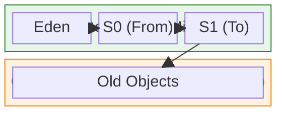

## Q1. Java의 메모리 구조를 설명해주세요. Heap과 Stack의 차이는 무엇인가요?

### 답변

Java 메모리는 크게 **Heap**, **Stack**, **Method Area**, **PC Register**, **Native Method Stack**으로 구성됩니다.

**Heap vs Stack 핵심 차이**:

| 구분 | Heap | Stack |
|------|------|-------|
| 저장 데이터 | 객체 인스턴스, 배열 | 지역 변수, 메서드 호출 정보 |
| 생명주기 | GC가 관리 | 메서드 종료 시 자동 제거 |
| 크기 | 상대적으로 큼 (-Xmx 설정) | 상대적으로 작음 (-Xss 설정) |
| 접근 속도 | 상대적으로 느림 | 빠름 (스레드 전용 메모리) |
| 공유 범위 | 모든 스레드가 공유 | 각 스레드마다 독립적 |
| 에러 | OutOfMemoryError: Java heap space | StackOverflowError |

**실무 예시**:

```java
public class MemoryExample {
    private int instanceVar;  // Heap에 저장 (객체의 일부)

    public void calculate(int param) {  // param은 Stack에 저장
        int localVar = 10;  // Stack에 저장
        String str = new String("Hello");  // 참조는 Stack, 실제 객체는 Heap

        // localVar과 param은 메서드 종료 시 Stack에서 제거
        // str 참조는 제거되지만, "Hello" 객체는 GC가 수거할 때까지 Heap에 남음
    }
}
```

### 꼬리 질문 1: StackOverflowError는 언제 발생하나요?

**답변**:

재귀 호출이 너무 깊어지거나, 메서드 호출이 스택 크기를 초과할 때 발생합니다.

```java
// StackOverflowError 발생 예시
public int factorial(int n) {
    return n * factorial(n - 1);  // 종료 조건 없음 → 무한 재귀
}
```

**실무 대응**:
- `-Xss` 옵션으로 스택 크기 조정 (예: `-Xss2m`)
- 재귀를 반복문으로 변경
- 꼬리 재귀 최적화 적용

### 꼬리 질문 2: String Constant Pool은 어디에 위치하나요?

**답변**:

**Java 7 이전**: Permanent Generation (PermGen)
**Java 7 이후**: Heap 영역

이유는 PermGen 크기가 고정되어 있어 String이 많을 경우 `OutOfMemoryError: PermGen space`가 자주 발생했기 때문입니다.

---

## Q2. Java의 GC(Garbage Collection) 동작 원리를 설명해주세요.

### 답변

GC는 **Heap 메모리에서 더 이상 참조되지 않는 객체를 자동으로 제거**하는 메커니즘입니다.

**핵심 알고리즘**: Mark and Sweep

1. **Mark**: 루트 객체(GC Root)부터 시작해 참조되는 객체를 마킹
2. **Sweep**: 마킹되지 않은 객체를 메모리에서 제거

**GC Root 종류**:
- Stack의 지역 변수
- Method Area의 static 변수
- JNI로 생성된 객체

**Generational GC 개념**:



**동작 과정**:

1. 새 객체는 Eden에 할당
2. Eden이 가득 차면 **Minor GC** 발생
3. 살아남은 객체는 S0(또는 S1)로 이동 (age++)
4. Age가 임계값(기본 15) 도달 시 Old Generation으로 승격
5. Old Generation이 가득 차면 **Major GC** 발생

### 꼬리 질문 1: Minor GC와 Full GC의 차이는?

**답변**:

| 구분 | Minor GC | Full GC |
|------|----------|---------|
| 대상 | Young Generation | Heap 전체 (Young + Old) |
| 빈도 | 자주 발생 | 드물게 발생 |
| 속도 | 빠름 (보통 수십 ms) | 느림 (수백 ms ~ 수 초) |
| STW 시간 | 짧음 | 길음 (애플리케이션 일시 정지) |

**실무 경험**:

프로덕션에서 Full GC가 5초 이상 소요되어 서비스 타임아웃이 발생한 적이 있습니다. `-XX:+PrintGCDetails`로 로그를 확인했더니 Old Generation이 계속 가득 차고 있었고, 메모리 누수(캐시 무제한 증가)가 원인이었습니다.

해결: 캐시에 TTL 설정 + Heap 크기 조정 → Full GC 빈도 감소

---

## Q3. G1 GC와 ZGC의 차이점을 설명해주세요.

### 답변

**G1 GC (Garbage First)**:

**특징**:
- Heap을 동일한 크기의 Region으로 나눔 (기본 2048개)
- 쓰레기가 많은 Region을 우선적으로 수거 (Garbage First)
- Young/Old를 고정 영역이 아닌 동적 Region으로 관리

**장점**:
- 예측 가능한 STW 시간 (`-XX:MaxGCPauseMillis=200` 기본 200ms)
- 대용량 Heap(4GB~64GB)에서 효율적

**단점**:
- 작은 Heap(<4GB)에서는 오버헤드
- Full GC 발생 시 여전히 긴 STW

**설정 예시**:

```bash
java -XX:+UseG1GC \
     -XX:MaxGCPauseMillis=200 \
     -XX:G1HeapRegionSize=16m \
     -Xms4g -Xmx4g \
     -jar application.jar
```

**ZGC (Z Garbage Collector)**:

**특징**:
- **매우 짧은 STW**: 10ms 이하 보장 (Heap 크기 무관)
- Colored Pointers와 Load Barriers 사용
- 동시성(Concurrent) GC (애플리케이션과 병렬 실행)

**장점**:
- 초대용량 Heap(수 TB)에서도 일정한 STW
- Low-latency 요구사항에 적합

**단점**:
- CPU 사용률 높음 (GC 스레드 추가 필요)
- 메모리 오버헤드 (약 15~20%)
- Java 15 이상에서 Production Ready

**비교표**:

| 구분 | G1 GC | ZGC |
|------|-------|-----|
| STW 시간 | 수십~수백 ms | < 10ms |
| Heap 크기 | 4GB ~ 64GB 최적 | 수백 GB ~ TB 가능 |
| CPU 오버헤드 | 보통 | 높음 |
| 메모리 오버헤드 | 낮음 | 약 15~20% |
| 사용 사례 | 일반 서버 애플리케이션 | Low-latency 요구사항 |

**실무 선택 기준**:

- **일반 웹 애플리케이션**: G1 GC (안정성과 성능 밸런스)
- **실시간성 중요**: ZGC (주식 거래, 게임 서버)
- **작은 Heap (<4GB)**: Serial GC 또는 Parallel GC

### 꼬리 질문: Shenandoah GC는 어떤가요?

**답변**:

Shenandoah도 ZGC처럼 Low-latency GC입니다.

**차이점**:
- **ZGC**: Colored Pointers 사용, Load Barriers
- **Shenandoah**: Brooks Pointers 사용, Read/Write Barriers

**실무 경험**:

개인적으로는 ZGC를 선호합니다. OpenJDK에서 공식 지원하고, 성능 튜닝 자료가 더 많기 때문입니다.

---

## Q4. OutOfMemoryError가 발생했을 때 어떻게 대응하나요?

### 답변

**1단계: 에러 유형 파악**

OutOfMemoryError는 여러 종류가 있습니다:

```
java.lang.OutOfMemoryError: Java heap space
→ Heap 메모리 부족

java.lang.OutOfMemoryError: GC overhead limit exceeded
→ GC에 시간을 너무 많이 소모 (98% 이상)

java.lang.OutOfMemoryError: Metaspace
→ Class 메타데이터 영역 부족 (Java 8+)

java.lang.OutOfMemoryError: unable to create new native thread
→ 스레드 생성 한계 도달
```

**2단계: Heap Dump 분석**

```bash
# Heap Dump 자동 생성 설정
java -XX:+HeapDumpOnOutOfMemoryError \
     -XX:HeapDumpPath=/var/logs/heapdump.hprof \
     -jar application.jar
```

**3단계: 도구로 분석**

- **Eclipse MAT (Memory Analyzer Tool)**
- **VisualVM**
- **JProfiler**

**실무 사례**:

**문제**: 프로덕션에서 매일 새벽 3시경 OOM 발생

**분석**:
1. Heap Dump 확인 → 특정 HashMap이 100만 개 엔트리 보유
2. 코드 확인 → 배치 작업에서 전체 사용자 데이터를 메모리에 로드
3. GC 로그 → Old Generation이 계속 증가

**해결**:
```java
// Before: 전체 데이터를 메모리에 로드
List<User> users = userRepository.findAll();  // 100만 건
for (User user : users) {
    process(user);
}

// After: 페이징 처리
int pageSize = 1000;
int pageNumber = 0;

while (true) {
    Page<User> page = userRepository.findAll(
        PageRequest.of(pageNumber++, pageSize)
    );

    if (page.isEmpty()) break;

    for (User user : page) {
        process(user);
    }

    // 명시적 GC 힌트 (선택사항)
    if (pageNumber % 10 == 0) {
        System.gc();
    }
}
```

**결과**: 메모리 사용량 2GB → 500MB로 감소

### 꼬리 질문 1: Metaspace OOM은 왜 발생하나요?

**답변**:

Metaspace는 클래스 메타데이터를 저장하는 영역입니다 (Java 8+).

**발생 원인**:
- 클래스 로딩이 계속 증가 (예: 동적 프록시 생성)
- 클래스 언로딩이 안 됨
- Hot Deployment 반복 (개발 환경)

**해결**:

```bash
# Metaspace 크기 조정
-XX:MetaspaceSize=256m
-XX:MaxMetaspaceSize=512m

# 사용하지 않는 클래스 언로딩 활성화 (기본값)
-XX:+CMSClassUnloadingEnabled  # Java 8
```

### 꼬리 질문 2: System.gc()를 호출하면 즉시 GC가 실행되나요?

**답변**:

**아니오**. `System.gc()`는 GC 실행을 **제안**하는 것일 뿐, JVM이 무시할 수 있습니다.

**실무 권장사항**:
- 명시적 `System.gc()` 호출은 피하기
- JVM에게 GC 타이밍 맡기기
- 정말 필요한 경우 `-XX:+ExplicitGCInvokesConcurrent` 옵션 사용

---

## Q5. GC 튜닝 경험이 있나요? 어떤 지표를 보고 튜닝하나요?

### 답변

**핵심 모니터링 지표**:

1. **GC 빈도 및 시간**
   - Minor GC: 빈도는 높아도 OK, 시간은 짧아야 함 (<100ms)
   - Full GC: 빈도 낮고, 시간도 짧아야 함 (<500ms)

2. **Throughput (처리량)**
   - GC에 소모되는 시간 비율 (<5%)
   - 계산: (총 실행 시간 - GC 시간) / 총 실행 시간

3. **Latency (지연 시간)**
   - P99 응답 시간에 GC가 영향을 주는지 확인

**실무 튜닝 사례**:

**상황**: Spring Boot 애플리케이션에서 P99 응답 시간이 3초를 초과

**분석**:

```bash
# GC 로그 활성화
java -Xlog:gc*:file=/var/logs/gc.log:time,uptime,level,tags \
     -XX:+UseG1GC \
     -Xms4g -Xmx4g \
     -jar application.jar
```

**GC 로그 확인**:

```
[2025-01-26 14:23:45] GC(152) Pause Young (Normal) 1024M->256M(4096M) 180.234ms
[2025-01-26 14:25:12] GC(153) Pause Full (Allocation Failure) 3800M->2100M(4096M) 4521.123ms
```

**문제 발견**:
- Full GC가 자주 발생 (5분마다)
- Full GC 시간이 4.5초 (너무 김)

**튜닝 적용**:

```bash
# Before
-Xms4g -Xmx4g
-XX:+UseG1GC

# After
-Xms8g -Xmx8g  # Heap 크기 증가
-XX:+UseG1GC
-XX:MaxGCPauseMillis=200  # 목표 STW 시간 설정
-XX:G1HeapRegionSize=16m  # Region 크기 조정
-XX:InitiatingHeapOccupancyPercent=45  # Old Gen 45% 차면 GC 시작
-XX:G1ReservePercent=10  # 예비 메모리 10%
```

**결과**:
- Full GC 빈도: 5분마다 → 6시간마다
- Full GC 시간: 4.5초 → 800ms
- P99 응답 시간: 3초 → 450ms

### 꼬리 질문: GC 로그는 어떻게 분석하나요?

**답변**:

**도구 활용**:
- **GCeasy**: https://gceasy.io/ (온라인 분석)
- **GCViewer**: 오프라인 GUI 도구

**주요 확인 항목**:
1. GC 빈도 및 패턴
2. Heap 사용률 추이
3. STW 시간 분포
4. Promotion Rate (Young → Old 승격 속도)

---

## Q6. Memory Leak을 어떻게 찾고 해결하나요?

### 답변

**메모리 누수 증상**:
- Heap 사용량이 계속 증가
- Full GC 후에도 메모리가 회수되지 않음
- 결국 OutOfMemoryError 발생

**실무 사례**:

**문제**: 서비스 시작 후 12시간마다 재시작 필요

**분석 과정**:

1. **Heap Dump 비교**

```bash
# 서비스 시작 1시간 후
jmap -dump:live,format=b,file=heap-1h.hprof <PID>

# 서비스 시작 10시간 후
jmap -dump:live,format=b,file=heap-10h.hprof <PID>
```

2. **Eclipse MAT로 분석**

- Leak Suspects Report 실행
- Dominator Tree 확인 → `HashMap`이 메모리의 60% 차지

3. **원인 코드 발견**

```java
// 문제 코드
public class EventCache {
    private static final Map<String, Event> cache = new HashMap<>();

    public void addEvent(Event event) {
        cache.put(event.getId(), event);  // 영원히 삭제 안 됨!
    }
}
```

4. **해결 방법**

```java
// 해결 1: TTL 기반 캐시 사용
private static final Cache<String, Event> cache = Caffeine.newBuilder()
    .expireAfterWrite(1, TimeUnit.HOURS)
    .maximumSize(10_000)
    .build();

// 해결 2: WeakHashMap 사용 (참조가 없으면 GC 대상)
private static final Map<String, Event> cache = new WeakHashMap<>();

// 해결 3: 명시적 제거 로직
@Scheduled(fixedRate = 3600000)  // 1시간마다
public void cleanupOldEvents() {
    long threshold = System.currentTimeMillis() - 3600000;
    cache.entrySet().removeIf(entry ->
        entry.getValue().getTimestamp() < threshold
    );
}
```

**결과**: 메모리 사용량 안정화, 재시작 불필요

---

## 핵심 요약

### 학습 체크리스트

**메모리 구조**:
- Heap vs Stack 차이점 명확히 설명
- StackOverflowError vs OutOfMemoryError 구분
- String Constant Pool 위치 변경 이유 (Java 7+)

**GC 원리**:
- Mark and Sweep 알고리즘 설명
- Generational GC (Young/Old) 이해
- Minor GC vs Full GC 차이

**GC 종류**:
- G1 GC vs ZGC 비교
- 각 GC의 장단점 및 사용 사례
- GC 선택 기준 (Heap 크기, Latency 요구사항)

**실무 대응**:
- OutOfMemoryError 유형별 대응 방법
- Heap Dump 분석 도구 사용 경험
- GC 튜닝 지표 및 실제 적용 사례
- Memory Leak 탐지 및 해결 방법

### 추가 학습 자료

- **JVM Specification**: https://docs.oracle.com/javase/specs/jvms/se17/html/
- **GC Tuning Guide**: https://docs.oracle.com/en/java/javase/17/gctuning/
- **Eclipse MAT Tutorial**: https://help.eclipse.org/latest/topic/org.eclipse.mat.ui.help/welcome.html

---

## 🔗 Related Deep Dive

더 깊이 있는 학습을 원한다면 심화 과정을 참고하세요:

- **[Java GC 기본](/learning/deep-dive/deep-dive-java-gc/)**: 세대별 GC와 로그 분석.
- **Java 동시성** *(준비 중)*: 스레드, synchronized, volatile 시각화.
