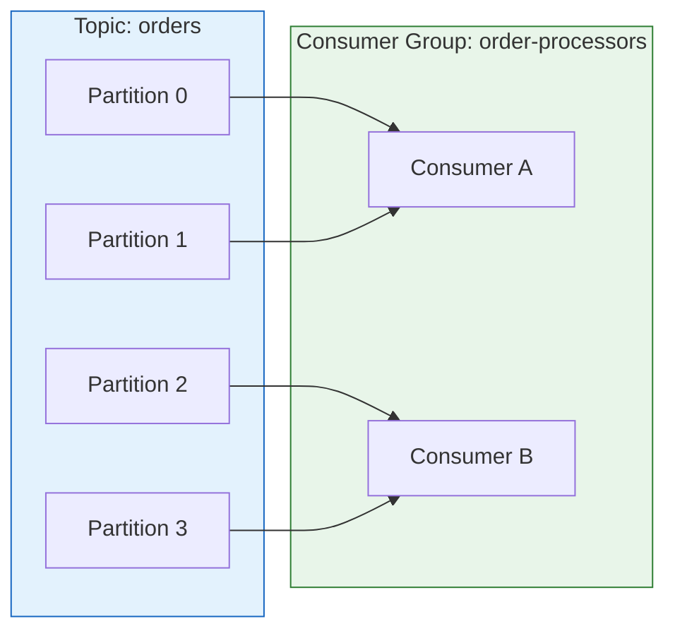

# Kafka Consumer Group 정리

## Q1. Kafka Consumer Group이란 무엇이고, 왜 필요한가요?

### 답변

**Consumer Group**은 **여러 Consumer가 협력하여 Topic의 메시지를 분산 처리**하는 메커니즘입니다.

**핵심 개념**:
1. **Partition 단위 분배**: 각 Partition은 Consumer Group 내에서 하나의 Consumer에게만 할당
2. **수평 확장**: Consumer를 추가하여 처리량 증가
3. **장애 복구**: Consumer 장애 시 자동으로 Partition 재분배 (Rebalance)

**동작 방식**:



**코드 예시**:

```java
// Consumer 설정
Properties props = new Properties();
props.put("bootstrap.servers", "localhost:9092");
props.put("group.id", "order-processors");  // Consumer Group ID
props.put("key.deserializer", StringDeserializer.class.getName());
props.put("value.deserializer", StringDeserializer.class.getName());

KafkaConsumer<String, String> consumer = new KafkaConsumer<>(props);
consumer.subscribe(Arrays.asList("orders"));

// 메시지 소비
while (true) {
    ConsumerRecords<String, String> records = consumer.poll(Duration.ofMillis(100));
    for (ConsumerRecord<String, String> record : records) {
        System.out.printf("Partition: %d, Offset: %d, Value: %s%n",
            record.partition(), record.offset(), record.value());
        // 비즈니스 로직 처리
        processOrder(record.value());
    }
}
```

**Consumer vs Consumer Group 비교**:

| 구분 | Consumer Group | 독립 Consumer |
|------|----------------|---------------|
| group.id | 동일 | 서로 다름 |
| Partition 할당 | 분산 (중복 없음) | 모든 Partition |
| 메시지 소비 | 한 번만 소비 | 각각 소비 |
| 용도 | 병렬 처리 | 브로드캐스트 |

### 꼬리 질문 1: Consumer 수와 Partition 수의 관계는?

**최적 비율**: Consumer 수 ≤ Partition 수

```
Case 1: Partition 4개, Consumer 2개
→ 각 Consumer가 2개 Partition 처리 ✅

Case 2: Partition 4개, Consumer 4개
→ 각 Consumer가 1개 Partition 처리 ✅ (최대 병렬화)

Case 3: Partition 4개, Consumer 6개
→ 2개 Consumer는 유휴 상태 ⚠️ (비효율)
```

**실무 예시**:

```java
// ❌ Consumer가 Partition보다 많음 (비효율)
// Topic: orders (Partition 4개)
// Consumer Group: order-processors (Consumer 6개)
// → Consumer 2개는 아무 일도 하지 않음

// ✅ 적절한 비율
// Topic: orders (Partition 12개)
// Consumer Group: order-processors (Consumer 6개)
// → 각 Consumer가 2개 Partition 처리 (효율적)
```

### 꼬리 질문 2: 여러 Consumer Group이 동일 Topic을 구독하면?

**각 Consumer Group은 독립적으로 모든 메시지를 소비**합니다.

```
Topic: user-events (Partition 3개)

Consumer Group 1: email-service
  → 이메일 발송용

Consumer Group 2: analytics-service
  → 분석용

Consumer Group 3: notification-service
  → 푸시 알림용

→ 동일한 메시지를 3개 Consumer Group이 각각 소비
  (브로드캐스트 효과)
```

**코드 예시**:

```java
// Consumer Group 1: 이메일 발송
Properties emailProps = new Properties();
emailProps.put("group.id", "email-service");
KafkaConsumer<String, String> emailConsumer = new KafkaConsumer<>(emailProps);
emailConsumer.subscribe(Arrays.asList("user-events"));

// Consumer Group 2: 분석
Properties analyticsProps = new Properties();
analyticsProps.put("group.id", "analytics-service");
KafkaConsumer<String, String> analyticsConsumer = new KafkaConsumer<>(analyticsProps);
analyticsConsumer.subscribe(Arrays.asList("user-events"));

// 동일한 메시지를 각각 처리
```

---

## Q2. Rebalance란 무엇이고, 언제 발생하나요?

### 답변

**Rebalance**는 **Consumer Group 내에서 Partition을 재분배**하는 과정입니다.

**발생 조건**:
1. **Consumer 추가**: 새 Consumer가 Consumer Group에 합류
2. **Consumer 제거**: Consumer 종료 또는 장애
3. **Partition 증가**: Topic에 Partition 추가
4. **Heartbeat 실패**: Consumer가 `session.timeout.ms` 내에 Heartbeat 미전송

**Rebalance 과정** (3단계):

```
1. Stop the World (모든 Consumer 멈춤)
   ├─ 메시지 소비 중단
   └─ 처리 중인 작업 완료 대기

2. Partition 재할당
   ├─ Group Coordinator가 새로운 Partition 할당 계획 수립
   └─ 각 Consumer에게 새 Partition 정보 전달

3. 재시작 (새 Partition으로 소비 재개)
   └─ 할당된 Partition부터 메시지 소비 시작
```

**문제점**:

```java
// ❌ Rebalance 중 메시지 처리 중단
Consumer A: Partition 0, 1 처리 중...
  → 새 Consumer C 추가됨
  → Rebalance 시작! (모든 Consumer 멈춤)
  → 5초간 메시지 처리 중단 ⚠️
  → Rebalance 완료 후 재개

Consumer A: Partition 0
Consumer B: Partition 1  (새로 할당)
Consumer C: Partition 2
```

**성능 영향**:

| 항목 | 값 |
|------|-----|
| Rebalance 시간 | 3-10초 (일반적) |
| 메시지 처리 중단 | Rebalance 동안 전체 중단 |
| 발생 빈도 | Consumer 변경 시마다 |

**Rebalance 최소화 전략**:

```java
// ✅ Heartbeat 및 Session Timeout 조정
Properties props = new Properties();
props.put("session.timeout.ms", "30000");     // 30초 (기본 10초)
props.put("heartbeat.interval.ms", "3000");   // 3초 (session.timeout의 1/3)
props.put("max.poll.interval.ms", "300000");  // 5분 (poll() 간격)

// ✅ 긴 처리 작업은 별도 스레드로
while (true) {
    ConsumerRecords<String, String> records = consumer.poll(Duration.ofMillis(100));

    for (ConsumerRecord<String, String> record : records) {
        // poll() 루프를 빨리 돌아야 Heartbeat 전송 가능
        executor.submit(() -> {
            // 시간이 오래 걸리는 작업은 별도 스레드에서
            processOrder(record.value());  // 5초 소요
        });
    }
}
```

### 꼬리 질문 1: Rebalance를 완전히 피할 수 있나요?

**불가능**하지만, **Static Membership**으로 불필요한 Rebalance 방지 가능.

```java
// ✅ Static Membership (Kafka 2.3+)
Properties props = new Properties();
props.put("group.id", "order-processors");
props.put("group.instance.id", "consumer-1");  // 고정 ID
// → Consumer 재시작 시에도 Rebalance 발생하지 않음
//   (session.timeout.ms 내 재시작 시)
```

**비교**:

| 구분 | Dynamic Membership | Static Membership |
|------|-------------------|-------------------|
| Consumer 재시작 | Rebalance 발생 | Rebalance 없음 (timeout 내) |
| group.instance.id | 자동 생성 | 수동 설정 |
| 용도 | 일반적 | 재시작 빈번한 환경 |

### 꼬리 질문 2: Incremental Cooperative Rebalance란?

**Kafka 2.4+**에서 도입된 **점진적 Rebalance** 방식입니다.

**기존 방식 (Eager Rebalance)**:
- 모든 Consumer가 Partition 해제
- Rebalance 완료 후 재할당
- **전체 중단 발생** ⚠️

**새 방식 (Incremental Cooperative Rebalance)**:
- 필요한 Partition만 재할당
- 나머지 Consumer는 계속 작업
- **부분 중단만 발생** ✅

```java
// ✅ Incremental Cooperative Rebalance 활성화
Properties props = new Properties();
props.put("partition.assignment.strategy",
    "org.apache.kafka.clients.consumer.CooperativeStickyAssignor");
// → Rebalance 시에도 대부분 Consumer는 계속 작업
```

**효과**:

| 구분 | Eager | Incremental Cooperative |
|------|-------|------------------------|
| 중단 범위 | 전체 Consumer | 일부 Partition만 |
| Rebalance 시간 | 5-10초 | 1-3초 |
| 메시지 처리 | 전체 중단 | 부분 중단 |

---

## Q3. Offset Commit은 어떻게 동작하나요?

### 답변

**Offset Commit**은 **Consumer가 처리한 메시지의 위치를 Kafka에 저장**하는 과정입니다.

**Offset 저장 위치**:
- **Topic**: `__consumer_offsets` (내부 Topic)
- **Key**: `(Consumer Group, Topic, Partition)`
- **Value**: `마지막 처리한 Offset + 1`

**Offset Commit 방식**:

### 1. Auto Commit (기본 설정)

```java
// ✅ Auto Commit (기본값)
Properties props = new Properties();
props.put("enable.auto.commit", "true");           // 기본값
props.put("auto.commit.interval.ms", "5000");      // 5초마다 자동 커밋

KafkaConsumer<String, String> consumer = new KafkaConsumer<>(props);
consumer.subscribe(Arrays.asList("orders"));

while (true) {
    ConsumerRecords<String, String> records = consumer.poll(Duration.ofMillis(100));
    for (ConsumerRecord<String, String> record : records) {
        processOrder(record.value());
        // 5초마다 자동으로 Offset 커밋됨
    }
}
```

**문제점**:

```java
// ❌ 메시지 중복 처리 가능
poll()로 메시지 100개 가져옴
  ↓
메시지 50개 처리 완료
  ↓
5초 경과 → Auto Commit (Offset 150 커밋)
  ↓
메시지 51번째 처리 중 Consumer 장애 발생! ⚠️
  ↓
Rebalance 후 다른 Consumer가 Offset 150부터 읽음
  ↓
메시지 51-100번이 다시 처리됨 (중복!)
```

### 2. Manual Commit (동기)

```java
// ✅ Manual Commit (동기)
Properties props = new Properties();
props.put("enable.auto.commit", "false");

KafkaConsumer<String, String> consumer = new KafkaConsumer<>(props);
consumer.subscribe(Arrays.asList("orders"));

while (true) {
    ConsumerRecords<String, String> records = consumer.poll(Duration.ofMillis(100));
    for (ConsumerRecord<String, String> record : records) {
        processOrder(record.value());
        // 메시지 처리 완료 후 즉시 커밋
    }
    try {
        consumer.commitSync();  // 동기 커밋 (블로킹)
    } catch (CommitFailedException e) {
        log.error("Commit 실패", e);
    }
}
```

**장점**: 정확한 처리 보장
**단점**: 성능 저하 (블로킹)

### 3. Manual Commit (비동기)

```java
// ✅ Manual Commit (비동기)
while (true) {
    ConsumerRecords<String, String> records = consumer.poll(Duration.ofMillis(100));
    for (ConsumerRecord<String, String> record : records) {
        processOrder(record.value());
    }

    // 비동기 커밋 (논블로킹)
    consumer.commitAsync((offsets, exception) -> {
        if (exception != null) {
            log.error("Commit 실패: {}", offsets, exception);
        } else {
            log.debug("Commit 성공: {}", offsets);
        }
    });
}
```

**장점**: 높은 성능 (논블로킹)
**단점**: 실패 시 재시도 복잡

### 4. 개별 메시지 커밋

```java
// ✅ 메시지별로 커밋
while (true) {
    ConsumerRecords<String, String> records = consumer.poll(Duration.ofMillis(100));
    for (ConsumerRecord<String, String> record : records) {
        try {
            processOrder(record.value());

            // 현재 메시지만 커밋
            Map<TopicPartition, OffsetAndMetadata> offsets = new HashMap<>();
            offsets.put(
                new TopicPartition(record.topic(), record.partition()),
                new OffsetAndMetadata(record.offset() + 1)
            );
            consumer.commitSync(offsets);

        } catch (Exception e) {
            log.error("처리 실패: {}", record, e);
            // 이 메시지는 커밋되지 않아 재처리됨
        }
    }
}
```

### Commit 전략 비교

| 전략 | 성능 | 정확성 | 중복 가능성 | 사용 시나리오 |
|------|------|--------|-------------|---------------|
| Auto Commit | 높음 | 낮음 | 높음 | 중복 허용 가능 |
| Sync Commit | 낮음 | 높음 | 낮음 | 정확성 중요 |
| Async Commit | 높음 | 중간 | 중간 | 성능 중요 |
| Manual per Message | 매우 낮음 | 매우 높음 | 없음 | 금융, 결제 |

### 꼬리 질문 1: At-Least-Once vs At-Most-Once는?

**At-Least-Once** (최소 한 번):
- Commit 전에 메시지 처리
- **중복 처리 가능** ⚠️

```java
// ✅ At-Least-Once
for (ConsumerRecord<String, String> record : records) {
    processOrder(record.value());  // 1. 처리
    consumer.commitSync();          // 2. 커밋
    // → 1과 2 사이 장애 시 재처리 (중복)
}
```

**At-Most-Once** (최대 한 번):
- Commit 후 메시지 처리
- **메시지 유실 가능** ⚠️

```java
// ⚠️ At-Most-Once
for (ConsumerRecord<String, String> record : records) {
    consumer.commitSync();          // 1. 커밋
    processOrder(record.value());  // 2. 처리
    // → 2에서 장애 시 메시지 유실
}
```

### 꼬리 질문 2: Exactly-Once는 어떻게 구현하나요?

**Kafka Transactions** + **멱등성 Producer** 사용.

```java
// ✅ Exactly-Once Semantics (Producer)
Properties producerProps = new Properties();
producerProps.put("enable.idempotence", "true");  // 멱등성
producerProps.put("transactional.id", "order-tx-1");

KafkaProducer<String, String> producer = new KafkaProducer<>(producerProps);
producer.initTransactions();

// ✅ Exactly-Once Semantics (Consumer)
Properties consumerProps = new Properties();
consumerProps.put("isolation.level", "read_committed");  // 커밋된 메시지만 읽기

KafkaConsumer<String, String> consumer = new KafkaConsumer<>(consumerProps);
consumer.subscribe(Arrays.asList("orders"));

// Consume-Process-Produce 패턴
while (true) {
    ConsumerRecords<String, String> records = consumer.poll(Duration.ofMillis(100));

    producer.beginTransaction();
    try {
        for (ConsumerRecord<String, String> record : records) {
            // 1. 메시지 처리
            String result = processOrder(record.value());

            // 2. 결과 발행
            producer.send(new ProducerRecord<>("order-results", result));
        }

        // 3. Offset과 메시지 발행을 하나의 트랜잭션으로 커밋
        producer.sendOffsetsToTransaction(
            getOffsets(records),
            consumer.groupMetadata()
        );
        producer.commitTransaction();

    } catch (Exception e) {
        producer.abortTransaction();  // 롤백
        log.error("트랜잭션 실패", e);
    }
}
```

**Exactly-Once 보장**:
1. **멱등성 Producer**: 동일 메시지 중복 발행 방지
2. **트랜잭션**: Offset 커밋과 메시지 발행을 원자적으로 처리
3. **read_committed**: 커밋된 메시지만 읽음

---

## Q4. Consumer Group Coordinator는 무엇인가요?

### 답변

**Group Coordinator**는 **Consumer Group의 멤버십과 Offset을 관리**하는 Kafka Broker입니다.

**주요 역할**:
1. **Consumer 등록/해제**: Consumer의 합류와 탈퇴 관리
2. **Heartbeat 수신**: Consumer의 생존 여부 확인
3. **Rebalance 조율**: Partition 재분배 조정
4. **Offset 저장**: `__consumer_offsets` Topic 관리

**동작 과정**:

```
Consumer 시작
  ↓
1. Group Coordinator 찾기
  ├─ Hash(group.id) % partition_count
  └─ __consumer_offsets Topic의 Partition Leader Broker

Consumer → Group Coordinator
  ↓
2. JoinGroup 요청
  ├─ Consumer가 group.id와 함께 등록
  └─ Coordinator가 Consumer 목록 관리

Consumer ← Group Coordinator
  ↓
3. SyncGroup 응답
  ├─ Partition 할당 정보 전달
  └─ Consumer가 할당된 Partition 소비 시작

Consumer → Group Coordinator (주기적)
  ↓
4. Heartbeat 전송
  ├─ session.timeout.ms 내에 전송 필수
  └─ 미전송 시 Consumer 제거 후 Rebalance
```

**코드 흐름**:

```java
// Consumer 시작
KafkaConsumer<String, String> consumer = new KafkaConsumer<>(props);
consumer.subscribe(Arrays.asList("orders"));
// → 내부적으로 Group Coordinator 찾기 및 등록

// poll() 호출 시 Heartbeat 전송
while (true) {
    ConsumerRecords<String, String> records = consumer.poll(Duration.ofMillis(100));
    // → poll()이 Heartbeat를 Group Coordinator에 전송

    for (ConsumerRecord<String, String> record : records) {
        processOrder(record.value());
    }
}
```

### 꼬리 질문 1: Heartbeat가 실패하면?

**Consumer가 죽은 것으로 간주**되어 Rebalance 발생.

```
Consumer A: Heartbeat 전송 (OK)
  ↓ 3초 후
Consumer A: Heartbeat 전송 (OK)
  ↓ 3초 후
Consumer A: 긴 GC 발생! (10초 동안 멈춤) ⚠️
  ↓
Group Coordinator: session.timeout.ms(10초) 초과!
  ↓
Consumer A를 Consumer Group에서 제거
  ↓
Rebalance 시작 (나머지 Consumer에게 Partition 재분배)
  ↓
Consumer A: GC 종료 후 Heartbeat 시도
  ↓
Group Coordinator: "너는 이미 제거됨" 응답
  ↓
Consumer A: 재등록 후 Rebalance 재시작
```

**해결책**:

```java
// ✅ GC 튜닝 및 Timeout 조정
Properties props = new Properties();
props.put("session.timeout.ms", "30000");     // 30초 (GC 허용)
props.put("heartbeat.interval.ms", "3000");   // 3초
props.put("max.poll.interval.ms", "300000");  // 5분 (긴 처리 허용)

// JVM GC 튜닝
java -Xms4g -Xmx4g -XX:+UseG1GC \
     -XX:MaxGCPauseMillis=200 \
     -jar consumer-app.jar
```

### 꼬리 질문 2: Partition Assignment Strategy는?

**3가지 전략**:

| 전략 | 설명 | 특징 |
|------|------|------|
| RangeAssignor | Partition 범위 기반 | 불균등 가능 |
| RoundRobinAssignor | 라운드 로빈 | 균등 분배 |
| StickyAssignor | 기존 할당 유지 | Rebalance 최소화 |

**예시** (Topic: orders, Partition 4개, Consumer 2개):

```java
// RangeAssignor
Consumer A: Partition 0, 1
Consumer B: Partition 2, 3

// RoundRobinAssignor
Consumer A: Partition 0, 2
Consumer B: Partition 1, 3

// StickyAssignor (Rebalance 후)
// 기존: Consumer A (0,1), Consumer B (2,3)
// Consumer C 추가됨
Consumer A: Partition 0      (기존 유지)
Consumer B: Partition 2      (기존 유지)
Consumer C: Partition 1, 3   (새로 할당)
```

**설정**:

```java
Properties props = new Properties();
props.put("partition.assignment.strategy",
    "org.apache.kafka.clients.consumer.StickyAssignor");
// → Rebalance 시 기존 할당 최대한 유지
```

---

## Q5. 실무에서 Consumer Group 관련 장애 대응 경험은?

### 답변

**장애 사례 1: Consumer Lag 증가**

**증상**:
- Consumer Lag이 계속 증가 (처리 속도 < 생산 속도)
- 메시지 처리 지연 발생

**원인 파악**:

```bash
# Lag 확인
kafka-consumer-groups.sh --bootstrap-server localhost:9092 \
  --group order-processors --describe

# 출력:
# TOPIC   PARTITION  CURRENT-OFFSET  LOG-END-OFFSET  LAG
# orders  0          1000            5000            4000  ⚠️
# orders  1          1200            5500            4300  ⚠️
```

**해결**:

```java
// 1. Consumer 개수 증가 (수평 확장)
// 기존: Consumer 2개 → 4개로 증가
// Partition 4개 → 각 Consumer가 1개씩 처리

// 2. 처리 로직 최적화
// ❌ 동기 처리 (느림)
for (ConsumerRecord<String, String> record : records) {
    processOrder(record.value());  // 100ms
    consumer.commitSync();
}

// ✅ 배치 처리 (빠름)
List<Order> batch = new ArrayList<>();
for (ConsumerRecord<String, String> record : records) {
    batch.add(parseOrder(record.value()));
}
processOrderBatch(batch);  // 일괄 처리 (30ms)
consumer.commitSync();

// 3. Partition 개수 증가
kafka-topics.sh --bootstrap-server localhost:9092 \
  --topic orders --alter --partitions 12
// → Consumer를 12개까지 늘려 병렬 처리 가능
```

**장애 사례 2: 잦은 Rebalance**

**증상**:
- 3분마다 Rebalance 발생
- 메시지 처리 중단 반복

**원인**:

```java
// ❌ 긴 처리 작업으로 max.poll.interval.ms 초과
while (true) {
    ConsumerRecords<String, String> records = consumer.poll(Duration.ofMillis(100));
    for (ConsumerRecord<String, String> record : records) {
        processOrder(record.value());  // 5초 소요
        // 100개 메시지 → 500초 소요!
        // max.poll.interval.ms(300초) 초과 ⚠️
    }
}
```

**해결**:

```java
// ✅ 별도 스레드로 처리
ExecutorService executor = Executors.newFixedThreadPool(10);

while (true) {
    ConsumerRecords<String, String> records = consumer.poll(Duration.ofMillis(100));

    List<Future<?>> futures = new ArrayList<>();
    for (ConsumerRecord<String, String> record : records) {
        // 별도 스레드에서 처리
        Future<?> future = executor.submit(() -> {
            processOrder(record.value());
        });
        futures.add(future);
    }

    // 모든 처리 완료 대기
    for (Future<?> future : futures) {
        future.get();
    }

    consumer.commitSync();  // 배치 커밋
}
```

**장애 사례 3: Duplicate Message 처리**

**증상**:
- 동일 주문이 2번 처리됨
- 결제 중복 발생

**원인**:

```java
// ❌ Auto Commit + 장애 발생
props.put("enable.auto.commit", "true");
props.put("auto.commit.interval.ms", "5000");

// 메시지 100개 처리 중 50번째에서 장애
//   → Auto Commit은 5초마다이므로 Offset 커밋 안 됨
//   → 재시작 후 1번부터 다시 처리 (중복!)
```

**해결**:

```java
// ✅ 멱등성 보장 (Idempotent Processing)
@Transactional
public void processOrder(Order order) {
    // 1. 중복 체크 (DB Unique 제약 조건)
    Optional<ProcessedOrder> existing =
        processedOrderRepository.findByKafkaOffsetAndPartition(
            order.getOffset(),
            order.getPartition()
        );

    if (existing.isPresent()) {
        log.warn("이미 처리된 주문: {}", order.getId());
        return;  // 중복 처리 방지
    }

    // 2. 비즈니스 로직 실행
    Payment payment = paymentService.processPayment(order);

    // 3. 처리 기록 저장 (Offset 포함)
    processedOrderRepository.save(new ProcessedOrder(
        order.getId(),
        order.getPartition(),
        order.getOffset(),
        payment.getId()
    ));
}
```

---

## 요약

### Consumer Group 기본 개념
- **Consumer Group**: 여러 Consumer가 Partition을 분산 처리
- **Partition 할당**: Consumer Group 내에서 각 Partition은 1개 Consumer에게만 할당
- **최적 비율**: Consumer 수 ≤ Partition 수

### Rebalance 메커니즘
- **발생 조건**: Consumer 추가/제거, Partition 증가, Heartbeat 실패
- **Rebalance 과정**: Stop the World → Partition 재할당 → 재시작
- **최소화 전략**: Static Membership, Incremental Cooperative Rebalance

### Offset Commit 전략
- **Auto Commit**: 편리하지만 중복/유실 가능
- **Sync Commit**: 정확하지만 성능 저하
- **Async Commit**: 성능 좋지만 실패 처리 복잡
- **Exactly-Once**: Kafka Transactions + 멱등성 Producer

### Group Coordinator
- **역할**: Consumer 등록/해제, Heartbeat 수신, Rebalance 조율
- **Heartbeat**: `session.timeout.ms` 내에 전송 필수
- **Assignment Strategy**: Range, RoundRobin, Sticky

### 실무 장애 대응
- **Consumer Lag**: Consumer 증가, 배치 처리, Partition 증가
- **잦은 Rebalance**: `max.poll.interval.ms` 조정, 별도 스레드 처리
- **중복 처리**: 멱등성 보장 (Offset 기반 중복 체크)

---

## 🔗 Related Deep Dive

더 깊이 있는 학습을 원한다면 심화 과정을 참고하세요:

- **[Kafka 기초](/learning/deep-dive/deep-dive-kafka-foundations/)**: Topic, Partition, Consumer Group의 기본 개념.
- **[Kafka 재시도/DLQ 설계](/learning/deep-dive/deep-dive-kafka-retry-dlq/)**: 실패 처리와 Dead Letter Queue 구현.
