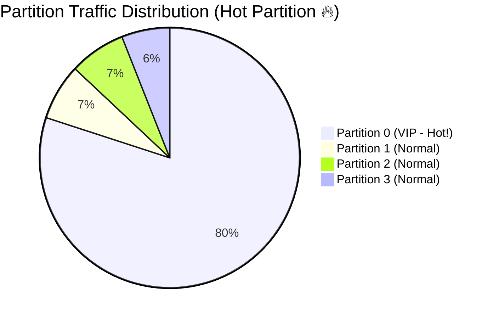

# Kafka Partition 설계 정리

## Q1. Kafka에서 메시지는 어떻게 Partition에 분배되나요?

### 답변

**Partition 분배 방식**은 **메시지의 Key**에 따라 결정됩니다.

**3가지 분배 전략**:

### 1. Key가 있는 경우 (Key-based)

```java
// ✅ Key 기반 분배 (동일 Key는 동일 Partition)
ProducerRecord<String, String> record = new ProducerRecord<>(
    "orders",           // Topic
    "user-123",         // Key (User ID)
    "order-data"        // Value
);
producer.send(record);

// 분배 로직
int partition = hash(key) % partition_count;
// "user-123" → hash → 12345 → 12345 % 4 = 1
// → Partition 1로 전송
```

**특징**:
- **동일 Key = 동일 Partition**: 같은 사용자의 메시지는 항상 같은 Partition
- **순서 보장**: Partition 내에서 메시지 순서 보장
- **부하 분산**: Key의 분포에 따라 자동으로 분산

### 2. Key가 없는 경우 (Round-Robin)

```java
// ✅ Round-Robin 분배 (균등 분산)
ProducerRecord<String, String> record = new ProducerRecord<>(
    "logs",        // Topic
    null,          // Key 없음
    "log-data"     // Value
);
producer.send(record);

// 분배 로직
// Partition 0 → Partition 1 → Partition 2 → Partition 3 → Partition 0...
```

**특징**:
- **균등 분산**: 모든 Partition에 골고루 분배
- **순서 보장 없음**: Partition이 다르므로 순서 보장 안 됨
- **성능 우선**: 특정 Partition에 부하 집중 방지

### 3. Custom Partitioner (사용자 정의)

```java
// ✅ Custom Partitioner
public class CustomPartitioner implements Partitioner {
    @Override
    public int partition(String topic, Object key, byte[] keyBytes,
                        Object value, byte[] valueBytes,
                        Cluster cluster) {
        int partitionCount = cluster.partitionCountForTopic(topic);

        // 비즈니스 로직 기반 분배
        if (key instanceof String) {
            String keyString = (String) key;

            // VIP 고객은 Partition 0 (전용 Consumer)
            if (keyString.startsWith("VIP-")) {
                return 0;
            }

            // 일반 고객은 나머지 Partition
            return (Math.abs(keyString.hashCode()) % (partitionCount - 1)) + 1;
        }

        return 0;
    }
}

// 설정
Properties props = new Properties();
props.put("partitioner.class", CustomPartitioner.class.getName());
```

**비교표**:

| 방식 | Key | 순서 보장 | 부하 분산 | 사용 시나리오 |
|------|-----|-----------|-----------|---------------|
| Key-based | 있음 | Partition 내 보장 | Key 분포 의존 | 사용자별 이벤트, 주문 |
| Round-Robin | 없음 | 보장 안 됨 | 균등 | 로그, 메트릭 |
| Custom | 사용자 정의 | 로직 의존 | 로직 의존 | VIP 전용, 지역별 |

### 꼬리 질문 1: Hash 함수는 어떤 것을 사용하나요?

**murmur2** 해시 함수를 사용합니다 (Kafka 기본값).

```java
// DefaultPartitioner.java (Kafka 내부 코드)
public static int toPositive(int number) {
    return number & 0x7fffffff;  // 음수 제거
}

int partition = toPositive(Utils.murmur2(keyBytes)) % numPartitions;
```

**특징**:
- **빠른 속도**: 고성능 해시 함수
- **균등 분포**: Key가 골고루 분산
- **충돌 최소화**: 해시 충돌 적음

### 꼬리 질문 2: Partition 개수를 변경하면?

**Key 기반 분배의 일관성이 깨집니다** ⚠️

```java
// 초기 상태: Partition 4개
hash("user-123") % 4 = 1  → Partition 1

// Partition 개수를 8개로 증가
hash("user-123") % 8 = 5  → Partition 5

// → 동일 Key인데 다른 Partition으로 분배됨!
// → 순서 보장이 깨짐 ⚠️
```

**해결책**:

```java
// ✅ Consistent Hashing Partitioner (사용자 정의)
public class ConsistentHashPartitioner implements Partitioner {
    // Partition 증가 시에도 일부만 재분배
    // → 대부분의 Key는 기존 Partition 유지
}

// ✅ Partition 개수를 처음부터 충분히 설정
kafka-topics.sh --create --topic orders \
  --partitions 50  \  # 여유 있게 설정
  --replication-factor 3
```

---

## Q2. Kafka에서 메시지 순서는 어떻게 보장되나요?

### 답변

**Kafka는 Partition 단위로만 순서를 보장**합니다.

**순서 보장 규칙**:

```
Topic: orders (Partition 3개)

Partition 0: [msg1, msg2, msg3]  ✅ 순서 보장
Partition 1: [msg4, msg5, msg6]  ✅ 순서 보장
Partition 2: [msg7, msg8, msg9]  ✅ 순서 보장

하지만,
전체 Topic 순서: msg1 → msg4 → msg2 → msg7 → ... ❌ 보장 안 됨
```

**순서 보장이 필요한 경우**:

### Case 1: 사용자별 이벤트 순서

```java
// ✅ User ID를 Key로 사용
public void sendUserEvent(String userId, String event) {
    ProducerRecord<String, String> record = new ProducerRecord<>(
        "user-events",
        userId,        // Key: User ID
        event
    );
    producer.send(record);
}

// 결과:
// User "user-123"의 모든 이벤트는 동일 Partition
// → 순서 보장 ✅
sendUserEvent("user-123", "LOGIN");
sendUserEvent("user-123", "VIEW_PRODUCT");
sendUserEvent("user-123", "ADD_TO_CART");
// → Partition 1: [LOGIN, VIEW_PRODUCT, ADD_TO_CART]
```

### Case 2: 주문 처리 순서

```java
// ✅ Order ID를 Key로 사용
public void sendOrderEvent(String orderId, String event) {
    ProducerRecord<String, String> record = new ProducerRecord<>(
        "order-events",
        orderId,       // Key: Order ID
        event
    );
    producer.send(record);
}

// 결과:
// Order "order-456"의 모든 이벤트는 동일 Partition
// → 순서 보장 ✅
sendOrderEvent("order-456", "CREATED");
sendOrderEvent("order-456", "PAID");
sendOrderEvent("order-456", "SHIPPED");
// → Partition 2: [CREATED, PAID, SHIPPED]
```

### Case 3: 전체 Topic 순서 보장 (비권장)

```java
// ⚠️ Partition을 1개로 설정 (성능 저하)
kafka-topics.sh --create --topic global-events \
  --partitions 1  \  # 순서 보장되지만...
  --replication-factor 3
// → Producer 1개, Consumer 1개만 사용 가능
// → 병렬 처리 불가 ⚠️
```

**순서 보장 비교**:

| 방식 | Partition 수 | 순서 보장 범위 | 성능 | 사용 시나리오 |
|------|--------------|----------------|------|---------------|
| Key 기반 | 여러 개 | Key별 순서 보장 | 높음 | 사용자별, 주문별 |
| Partition 1개 | 1개 | 전체 순서 보장 | 낮음 | 글로벌 이벤트 로그 |
| Round-Robin | 여러 개 | 순서 보장 안 됨 | 매우 높음 | 로그, 메트릭 |

### 꼬리 질문 1: Producer의 `max.in.flight.requests.per.connection` 설정의 영향은?

**순서 보장에 영향**을 줍니다.

```java
// ❌ max.in.flight.requests.per.connection > 1
// → 재전송 시 순서가 바뀔 수 있음
props.put("max.in.flight.requests.per.connection", "5");  // 기본값

// 시나리오:
// 1. msg1 전송 → 실패 (재전송 대기)
// 2. msg2 전송 → 성공
// 3. msg1 재전송 → 성공
// 결과: [msg2, msg1]  ← 순서 바뀜! ⚠️

// ✅ 순서 보장이 중요하다면
props.put("max.in.flight.requests.per.connection", "1");
// → 한 번에 1개 요청만 전송 (느리지만 순서 보장)

// ✅ 또는 멱등성 Producer 사용 (Kafka 0.11+)
props.put("enable.idempotence", "true");
// → max.in.flight.requests.per.connection = 5여도 순서 보장 ✅
```

### 꼬리 질문 2: Consumer에서 순서를 보장하려면?

**Partition별로 순차 처리**해야 합니다.

```java
// ❌ 멀티 스레드 처리 (순서 깨짐)
ExecutorService executor = Executors.newFixedThreadPool(10);

while (true) {
    ConsumerRecords<String, String> records = consumer.poll(Duration.ofMillis(100));
    for (ConsumerRecord<String, String> record : records) {
        executor.submit(() -> {
            processEvent(record.value());
            // 여러 스레드가 동시에 처리 → 순서 보장 안 됨 ⚠️
        });
    }
}

// ✅ Partition별로 순차 처리
Map<Integer, Queue<ConsumerRecord<String, String>>> partitionQueues = new HashMap<>();

while (true) {
    ConsumerRecords<String, String> records = consumer.poll(Duration.ofMillis(100));

    // Partition별로 분류
    for (ConsumerRecord<String, String> record : records) {
        int partition = record.partition();
        partitionQueues.computeIfAbsent(partition, k -> new LinkedList<>())
            .add(record);
    }

    // Partition별로 순차 처리
    partitionQueues.forEach((partition, queue) -> {
        while (!queue.isEmpty()) {
            ConsumerRecord<String, String> record = queue.poll();
            processEvent(record.value());  // 순서 보장 ✅
        }
    });

    consumer.commitSync();
}
```

---

## Q3. Hot Partition 문제는 무엇이고, 어떻게 해결하나요?

### 답변

**Hot Partition**은 **특정 Partition에 트래픽이 집중**되어 병목이 발생하는 문제입니다.

**발생 원인**:

```java
// ❌ Key 분포가 불균등한 경우
// 전체 사용자: 100만 명
// VIP 사용자: 1000명 (전체의 0.1%)
// 일반 사용자: 999,000명 (전체의 99.9%)

// 하지만 VIP 사용자가 전체 트래픽의 80%를 차지!
// → VIP 사용자가 몰린 Partition에 부하 집중 ⚠️


```

**문제 증상**:

```bash
# Lag 확인
kafka-consumer-groups.sh --bootstrap-server localhost:9092 \
  --group user-processors --describe

# 출력:
# PARTITION  CURRENT-OFFSET  LOG-END-OFFSET  LAG
# 0          1000            50000           49000  ← Hot Partition! 🔥
# 1          8000            9000            1000
# 2          7500            8500            1000
# 3          7800            8800            1000
```

**해결 방법**:

### 방법 1: Key 재설계 (추가 분산)

```java
// ❌ User ID만 사용 (Hot Partition 발생)
String key = userId;  // "VIP-user-123"

// ✅ User ID + Random Suffix (추가 분산)
String key = userId + "-" + (System.currentTimeMillis() % 10);
// "VIP-user-123-0", "VIP-user-123-1", ..., "VIP-user-123-9"
// → 동일 사용자의 메시지가 10개 Partition에 분산

ProducerRecord<String, String> record = new ProducerRecord<>(
    "user-events",
    key,  // Randomized key
    event
);

// 단점: 사용자별 순서 보장이 깨짐 ⚠️
```

### 방법 2: Custom Partitioner (VIP 전용 Partition)

```java
// ✅ VIP 사용자는 여러 Partition에 분산
public class VipAwarePartitioner implements Partitioner {
    @Override
    public int partition(String topic, Object key, byte[] keyBytes,
                        Object value, byte[] valueBytes,
                        Cluster cluster) {
        int partitionCount = cluster.partitionCountForTopic(topic);
        String keyString = (String) key;

        if (keyString.startsWith("VIP-")) {
            // VIP는 Partition 0-7 (8개 Partition에 분산)
            int vipPartitions = 8;
            return Math.abs(keyString.hashCode()) % vipPartitions;
        } else {
            // 일반 사용자는 Partition 8-11 (4개 Partition)
            int normalPartitions = partitionCount - 8;
            return 8 + (Math.abs(keyString.hashCode()) % normalPartitions);
        }
    }
}

// Partition 할당:
// 0-7: VIP 전용 (8개 → 부하 분산)
// 8-11: 일반 사용자 (4개)
```

### 방법 3: Partition 개수 증가

```bash
# ✅ Partition 개수 증가 (4개 → 12개)
kafka-topics.sh --bootstrap-server localhost:9092 \
  --topic user-events --alter --partitions 12

# → Key 분산이 더 세밀해짐
# → Hot Partition 완화
```

### 방법 4: 별도 Topic 분리

```java
// ✅ VIP와 일반 사용자를 별도 Topic으로 분리
public void sendUserEvent(String userId, String event) {
    String topic = userId.startsWith("VIP-") ?
        "vip-user-events" : "normal-user-events";

    ProducerRecord<String, String> record = new ProducerRecord<>(
        topic,
        userId,
        event
    );
    producer.send(record);
}

// vip-user-events: Partition 20개 (VIP 전용)
// normal-user-events: Partition 10개 (일반 사용자)
// → Consumer도 별도로 운영
```

**해결 방법 비교**:

| 방법 | 장점 | 단점 | 사용 시나리오 |
|------|------|------|---------------|
| Key 재설계 | 구현 간단 | 순서 보장 깨짐 | 순서 중요하지 않음 |
| Custom Partitioner | 유연한 제어 | 복잡한 로직 | 비즈니스 로직 분리 |
| Partition 증가 | 즉시 적용 | Key 분산 깨짐 | 기존 시스템 개선 |
| Topic 분리 | 완전 격리 | 운영 복잡도 증가 | VIP/일반 분리 |

### 꼬리 질문: Partition 개수는 어떻게 결정하나요?

**다음 요소를 고려**합니다:

```
Partition 개수 = max(
    예상 처리량 / Consumer 처리 속도,
    필요한 Consumer 수,
    Key 분포
)

예시:
- 초당 메시지: 10,000개
- Consumer 처리 속도: 1,000개/초
- 필요 Consumer 수: 10,000 / 1,000 = 10개
- → Partition 개수: 최소 10개 (여유 20%)
- → 권장: 12개
```

**권장 사항**:

```bash
# 1. 처리량 기반
# 초당 10,000 메시지, Consumer 1,000개/초 처리
# → 최소 10개 Partition

# 2. 확장성 고려 (2-3배 여유)
# → 20-30개 Partition

# 3. Consumer 수 고려
# 동시 Consumer 10개 → 10개 Partition

# 4. Key 분포 고려
# 100개 서로 다른 Key → 100개 Partition

# ✅ 최종 결정: 30개 (여유 있게)
kafka-topics.sh --create --topic orders \
  --partitions 30 \
  --replication-factor 3
```

---

## Q4. Partition Key 설계 시 고려할 점은?

### 답변

**5가지 핵심 고려사항**:

### 1. 순서 보장 요구사항

```java
// ✅ 사용자별 이벤트 순서 보장
String key = userId;  // "user-123"
// → 동일 사용자의 모든 이벤트는 동일 Partition

// ✅ 주문별 상태 변경 순서 보장
String key = orderId;  // "order-456"
// → 동일 주문의 모든 상태는 동일 Partition

// ❌ 순서가 중요하지 않은 경우
String key = null;  // Round-Robin
// → 로그, 메트릭 등
```

### 2. Key 분포 (Cardinality)

```java
// ❌ Cardinality가 낮음 (Hot Partition)
String key = userCountry;  // "KR", "US", "JP" (3개)
// → 한국 사용자가 90% → "KR" Partition에 부하 집중 ⚠️

// ✅ Cardinality가 높음 (균등 분산)
String key = userId;  // "user-1", "user-2", ..., "user-1000000"
// → 100만 개 Key → 균등하게 분산 ✅

// ✅ 복합 Key 사용
String key = userCountry + "-" + userId;  // "KR-user-123"
// → 국가별로 먼저 분산, 그 안에서 사용자별 분산
```

### 3. 트래픽 패턴

```java
// ❌ 시간대별 Key (Hot Partition)
String key = dateTime.format("yyyy-MM-dd-HH");  // "2025-01-26-14"
// → 현재 시간대에 모든 메시지가 몰림 ⚠️

// ✅ Entity ID 기반
String key = eventId;  // "event-12345"
// → 시간과 무관하게 분산 ✅

// ✅ Hash 기반 분산
String key = String.valueOf(eventId.hashCode() % 100);
// → 100개 Partition에 균등 분산
```

### 4. Consumer 처리 로직

```java
// ✅ Consumer가 사용자별로 처리해야 하는 경우
String key = userId;
// → Consumer는 사용자별 상태를 유지하며 처리

// ✅ Consumer가 독립적으로 처리 가능한 경우
String key = null;  // Round-Robin
// → Consumer는 어떤 메시지든 상태 없이 처리
```

### 5. 확장성

```java
// ❌ Partition 증가 시 문제 발생
String key = userId;
// Partition 4개 → 8개 증가
// → 동일 User의 메시지가 다른 Partition으로 분산 ⚠️

// ✅ Consistent Hashing 또는 고정 Partition
String key = userId;
// → Custom Partitioner로 일관성 유지
```

**Key 설계 체크리스트**:

| 항목 | 질문 | 권장 사항 |
|------|------|-----------|
| 순서 | 순서 보장 필요? | 필요 → Entity ID 사용 |
| 분포 | Key 개수 충분? | Cardinality ≥ Partition 수 × 10 |
| 트래픽 | 특정 Key에 몰림? | Hot Key 분산 전략 |
| 처리 | Consumer 상태 필요? | 상태 필요 → Entity ID 사용 |
| 확장 | Partition 증가 예상? | Consistent Hashing 고려 |

### 실무 예시

```java
// 전자상거래 주문 시스템
public class OrderEventProducer {

    public void sendOrderEvent(Order order, String eventType) {
        // ✅ Order ID를 Key로 사용
        // 이유:
        // 1. 순서 보장: 동일 주문의 이벤트 순서 보장
        // 2. 높은 Cardinality: 주문 수 = 수백만 개
        // 3. 균등 분산: 주문은 시간대별로 고르게 발생
        // 4. Consumer 처리: 주문별 상태 머신 유지 필요

        String key = order.getId();  // "order-123456"

        ProducerRecord<String, OrderEvent> record = new ProducerRecord<>(
            "order-events",
            key,
            new OrderEvent(order, eventType)
        );

        producer.send(record, (metadata, exception) -> {
            if (exception != null) {
                log.error("전송 실패: {}", key, exception);
            } else {
                log.info("전송 성공: {} → Partition {}",
                    key, metadata.partition());
            }
        });
    }
}

// 사용자 활동 로그
public class UserActivityProducer {

    public void sendUserActivity(String userId, String activity) {
        // ✅ User ID를 Key로 사용
        // 이유:
        // 1. 순서 보장: 사용자별 활동 순서 중요
        // 2. 높은 Cardinality: 사용자 수 = 수백만 명
        // 3. 불균등 분산: VIP 사용자 고려 필요

        String key = userId;

        // VIP 사용자는 추가 분산
        if (isVipUser(userId)) {
            key = userId + "-" + (System.currentTimeMillis() % 5);
            // → VIP 사용자도 5개 Partition에 분산
        }

        ProducerRecord<String, String> record = new ProducerRecord<>(
            "user-activities",
            key,
            activity
        );

        producer.send(record);
    }
}
```

---

## Q5. 실무에서 Partition 관련 장애 대응 경험은?

### 답변

**장애 사례 1: Hot Partition으로 인한 Lag 증가**

**증상**:
- Partition 0의 Lag이 100만 건 이상
- 나머지 Partition은 정상

**원인**:

```bash
# Partition별 메시지 분포 확인
kafka-run-class.sh kafka.tools.GetOffsetShell \
  --broker-list localhost:9092 \
  --topic user-events

# 출력:
# user-events:0:5000000  ← 500만 건 🔥
# user-events:1:50000    ← 5만 건
# user-events:2:48000
# user-events:3:52000

# → Partition 0에 메시지가 집중!
```

**분석**:

```java
// 원인: 특정 사용자(celebrity)의 트래픽이 전체의 80%
// Key: "user-celebrity-1"
// → hash(key) % 4 = 0
// → Partition 0에 모든 메시지 몰림
```

**해결**:

```java
// ✅ Celebrity 사용자 전용 분산 로직
public class CelebrityAwarePartitioner implements Partitioner {
    private final Set<String> celebrities = Set.of(
        "user-celebrity-1", "user-celebrity-2"
    );

    @Override
    public int partition(String topic, Object key, byte[] keyBytes,
                        Object value, byte[] valueBytes,
                        Cluster cluster) {
        int partitionCount = cluster.partitionCountForTopic(topic);
        String keyString = (String) key;

        if (celebrities.contains(keyString)) {
            // Celebrity는 timestamp 기반으로 분산
            long timestamp = System.currentTimeMillis();
            return (int) (timestamp % partitionCount);
            // → 순서는 깨지지만, 부하 분산 ✅
        }

        // 일반 사용자는 Key 기반
        return Math.abs(keyString.hashCode()) % partitionCount;
    }
}
```

**결과**:
- Partition 0 Lag: 100만 → 5만 건 (95% 감소)
- 전체 처리량: 5배 증가

---

**장애 사례 2: Partition 증가 후 순서 보장 깨짐**

**증상**:
- 주문 상태가 역순으로 처리됨
- SHIPPED → PAID → CREATED (잘못된 순서)

**원인**:

```bash
# Partition 개수를 4개 → 8개로 증가
kafka-topics.sh --alter --topic orders --partitions 8

# 결과:
# 기존 메시지 (Partition 4개 기준):
# "order-123" → hash % 4 = 1 (Partition 1)

# 새 메시지 (Partition 8개 기준):
# "order-123" → hash % 8 = 5 (Partition 5)

# → 동일 주문인데 다른 Partition!
# → Consumer가 병렬로 처리하여 순서 깨짐 ⚠️
```

**해결**:

```java
// ✅ 1단계: Partition 변경 전 모든 메시지 소비 대기
// Consumer Lag이 0이 될 때까지 대기

// ✅ 2단계: Custom Partitioner로 일관성 유지
public class ConsistentPartitioner implements Partitioner {
    private final int originalPartitionCount = 4;

    @Override
    public int partition(String topic, Object key, byte[] keyBytes,
                        Object value, byte[] valueBytes,
                        Cluster cluster) {
        int currentPartitionCount = cluster.partitionCountForTopic(topic);

        // 항상 원래 Partition 개수 기준으로 계산
        int basePartition = Math.abs(key.hashCode()) % originalPartitionCount;

        // 증가된 Partition에 균등 분배
        int factor = currentPartitionCount / originalPartitionCount;
        return basePartition * factor;
    }
}

// 결과:
// Partition 4개 → 8개 증가 시
// "order-123" → basePartition 1
//             → 1 * 2 = Partition 2
//             (일관성 유지 ✅)
```

---

**장애 사례 3: Rebalance로 인한 중복 처리**

**증상**:
- 동일 주문이 2번 결제됨
- Consumer Rebalance 시 발생

**원인**:

```java
// ❌ Auto Commit 사용 중 Rebalance 발생
props.put("enable.auto.commit", "true");
props.put("auto.commit.interval.ms", "5000");

// 시나리오:
// 1. 메시지 100개 처리 중
// 2. 50개 처리 완료
// 3. Consumer 추가로 Rebalance 시작
// 4. Auto Commit은 5초마다이므로 Offset 커밋 안 됨
// 5. Rebalance 후 1번부터 다시 처리 (중복!)
```

**해결**:

```java
// ✅ Manual Commit + 멱등성 보장
props.put("enable.auto.commit", "false");

// 멱등성 처리
@Transactional
public void processOrder(ConsumerRecord<String, Order> record) {
    Order order = record.value();

    // 1. 중복 체크 (Kafka Offset 기반)
    String idempotencyKey = String.format("%s-%d-%d",
        record.topic(),
        record.partition(),
        record.offset()
    );

    if (processedRecordRepository.existsByIdempotencyKey(idempotencyKey)) {
        log.warn("이미 처리된 메시지: {}", idempotencyKey);
        return;  // 중복 처리 방지 ✅
    }

    // 2. 비즈니스 로직 실행
    Payment payment = paymentService.processPayment(order);

    // 3. 처리 기록 저장
    processedRecordRepository.save(new ProcessedRecord(
        idempotencyKey,
        payment.getId(),
        Instant.now()
    ));
}

// Consumer
while (true) {
    ConsumerRecords<String, Order> records = consumer.poll(Duration.ofMillis(100));

    for (ConsumerRecord<String, Order> record : records) {
        processOrder(record);  // 멱등성 보장
    }

    consumer.commitSync();  // Manual Commit
}
```

---

## 요약

### Partition 분배 방식
- **Key 기반**: `hash(key) % partition_count` (동일 Key는 동일 Partition)
- **Round-Robin**: Key 없으면 균등 분산
- **Custom Partitioner**: 비즈니스 로직 기반 분배

### 순서 보장
- **Partition 단위**: Partition 내에서만 순서 보장
- **Key 선택**: 순서가 중요한 Entity를 Key로 사용
- **Idempotence**: `enable.idempotence=true`로 재전송 시 순서 유지

### Hot Partition 해결
- **Key 재설계**: Random Suffix로 추가 분산
- **Custom Partitioner**: 트래픽 패턴 기반 분배
- **Partition 증가**: 세밀한 분산 (일관성 주의)
- **Topic 분리**: 별도 Topic으로 격리

### Partition Key 설계
- **순서 요구사항**: Entity ID 사용
- **Cardinality**: Key 개수 ≥ Partition × 10
- **트래픽 패턴**: Hot Key 분산 전략
- **확장성**: Partition 증가 시 일관성 고려

### 실무 장애 대응
- **Hot Partition**: Celebrity 사용자 분산 처리
- **순서 깨짐**: Consistent Partitioner로 일관성 유지
- **중복 처리**: Offset 기반 멱등성 보장

---

## 🔗 Related Deep Dive

더 깊이 있는 학습을 원한다면 심화 과정을 참고하세요:

- **[Kafka 기본](/learning/deep-dive/deep-dive-kafka-foundations/)**: 토픽, 파티션, Consumer Group 시각화.
- **[Kafka 재시도/DLQ](/learning/deep-dive/deep-dive-kafka-retry-dlq/)**: 실패 처리 전략과 DLQ 패턴.
