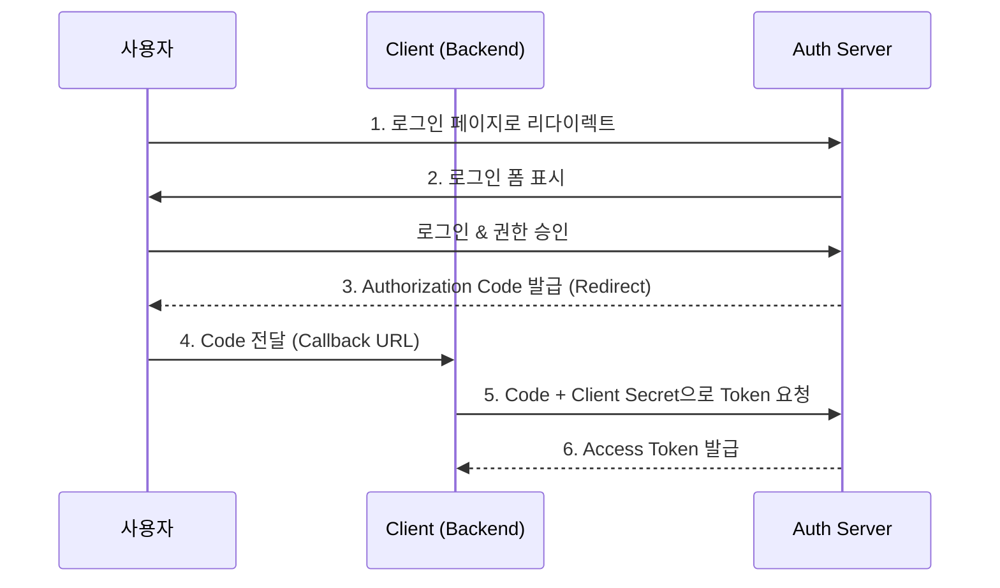
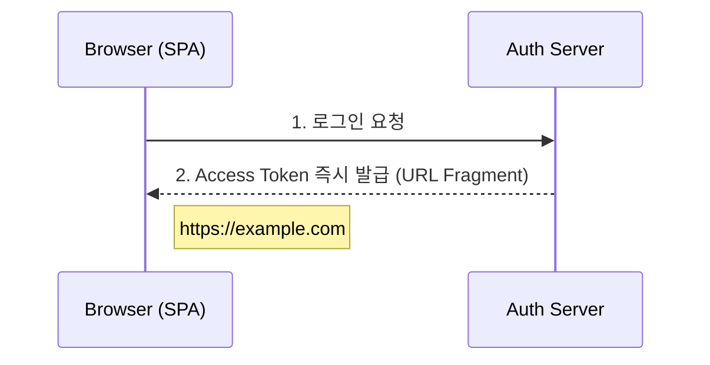

## Q1. OAuth2 인증 흐름을 설명하고, 4가지 Grant Type의 차이점을 비교해주세요.

### 답변

OAuth2는 **인증(Authentication)이 아닌 인가(Authorization) 프로토콜**입니다. 사용자가 제3자 애플리케이션에게 자신의 리소스 접근 권한을 부여하는 표준 프로토콜입니다.

#### 핵심 역할 4가지

| 역할 | 설명 | 예시 |
|------|------|------|
| **Resource Owner** | 리소스 소유자 (사용자) | Google 계정을 가진 사용자 |
| **Client** | 리소스 접근을 요청하는 애플리케이션 | 우리 서비스 앱 |
| **Authorization Server** | 인증/인가 서버 | Google OAuth2 서버 |
| **Resource Server** | 보호된 리소스를 제공하는 서버 | Google API 서버 |

#### 4가지 Grant Type 비교

##### 1. Authorization Code (가장 안전, 권장)


```mermaid
sequenceDiagram
    participant User as 사용자
    participant Client as Client (Backend)
    participant AuthServer as Auth Server

    User->>AuthServer: 1. 로그인 페이지로 리다이렉트
    AuthServer->>User: 2. 로그인 폼 표시
    User->>AuthServer: 로그인 & 권한 승인
    AuthServer-->>User: 3. Authorization Code 발급 (Redirect)
    User->>Client: 4. Code 전달 (Callback URL)
    Client->>AuthServer: 5. Code + Client Secret으로 Token 요청
    AuthServer-->>Client: 6. Access Token 발급
```

**실제 Spring Security 구현:**

```java
// application.yml
spring:
  security:
    oauth2:
      client:
        registration:
          google:
            client-id: ${GOOGLE_CLIENT_ID}
            client-secret: ${GOOGLE_CLIENT_SECRET}
            scope: profile, email
            redirect-uri: "{baseUrl}/login/oauth2/code/{registrationId}"
            authorization-grant-type: authorization_code

// SecurityConfig.java
@Configuration
@EnableWebSecurity
public class SecurityConfig {

    @Bean
    public SecurityFilterChain filterChain(HttpSecurity http) throws Exception {
        http
            .oauth2Login(oauth2 -> oauth2
                .userInfoEndpoint(userInfo -> userInfo
                    .userService(customOAuth2UserService)
                )
                .successHandler(oAuth2SuccessHandler)
            );
        return http.build();
    }
}

// CustomOAuth2UserService.java
@Service
public class CustomOAuth2UserService implements OAuth2UserService<OAuth2UserRequest, OAuth2User> {

    @Override
    public OAuth2User loadUser(OAuth2UserRequest userRequest) throws OAuth2AuthenticationException {
        // 1. Access Token으로 사용자 정보 요청
        OAuth2User oAuth2User = delegate.loadUser(userRequest);

        String registrationId = userRequest.getClientRegistration().getRegistrationId();
        String userNameAttributeName = userRequest.getClientRegistration()
            .getProviderDetails()
            .getUserInfoEndpoint()
            .getUserNameAttributeName();

        // 2. 사용자 정보 추출
        Map<String, Object> attributes = oAuth2User.getAttributes();

        // 3. DB에 저장 또는 업데이트
        User user = saveOrUpdate(attributes, registrationId);

        return new DefaultOAuth2User(
            Collections.singleton(new SimpleGrantedAuthority("ROLE_USER")),
            attributes,
            userNameAttributeName
        );
    }
}
```

##### 2. Implicit (보안 취약, Deprecated)


```mermaid
sequenceDiagram
    participant Browser as Browser (SPA)
    participant AuthServer as Auth Server

    Browser->>AuthServer: 1. 로그인 요청
    AuthServer-->>Browser: 2. Access Token 즉시 발급 (URL Fragment)
    Note right of Browser: https://example.com#access_token=xxx
```

**문제점:**
- Access Token이 브라우저에 노출 (URL Fragment)
- CSRF 공격에 취약
- Refresh Token 미지원
- **SPA는 Authorization Code + PKCE 사용 권장**

##### 3. Resource Owner Password Credentials

```java
// ⚠️ 신뢰할 수 있는 1st Party 앱만 사용 (예: 회사 내부 앱)
POST /oauth/token HTTP/1.1
Host: auth-server.com
Content-Type: application/x-www-form-urlencoded

grant_type=password&
username=user@example.com&
password=secretpassword&
client_id=my-client&
client_secret=my-secret
```

**사용 사례:**
- 회사 내부 모바일 앱
- Legacy 시스템 마이그레이션 과정

##### 4. Client Credentials (서버 간 통신)

```java
// 사용자 컨텍스트 없이 서버끼리 통신
@Configuration
public class OAuth2ClientConfig {

    @Bean
    public OAuth2AuthorizedClientManager authorizedClientManager(
            ClientRegistrationRepository clientRegistrationRepository,
            OAuth2AuthorizedClientRepository authorizedClientRepository) {

        OAuth2AuthorizedClientProvider authorizedClientProvider =
            OAuth2AuthorizedClientProviderBuilder.builder()
                .clientCredentials()  // Client Credentials Grant
                .build();

        DefaultOAuth2AuthorizedClientManager authorizedClientManager =
            new DefaultOAuth2AuthorizedClientManager(
                clientRegistrationRepository,
                authorizedClientRepository
            );

        authorizedClientManager.setAuthorizedClientProvider(authorizedClientProvider);
        return authorizedClientManager;
    }
}

// 사용
@Service
public class ExternalApiService {

    @Autowired
    private WebClient webClient;

    public String callExternalApi() {
        return webClient
            .get()
            .uri("https://api.example.com/data")
            .attributes(clientRegistrationId("external-api"))  // Client Credentials 자동 처리
            .retrieve()
            .bodyToMono(String.class)
            .block();
    }
}
```

#### Grant Type 선택 가이드

| 상황 | 권장 Grant Type |
|------|----------------|
| 웹 애플리케이션 (Backend 있음) | Authorization Code |
| SPA (React, Vue) | Authorization Code + PKCE |
| 모바일 앱 | Authorization Code + PKCE |
| 서버 간 통신 | Client Credentials |
| 신뢰할 수 있는 1st Party 앱 | Password (마이그레이션 시) |

### 꼬리 질문 1: PKCE가 무엇이고 왜 필요한가요?

**PKCE (Proof Key for Code Exchange)**: Authorization Code 탈취 공격을 방지하는 확장 메커니즘

```
1. Client가 code_verifier 생성 (랜덤 문자열)
   code_verifier = "dBjftJeZ4CVP-mB92K27uhbUJU1p1r_wW1gFWFOEjXk"

2. code_challenge 계산
   code_challenge = BASE64URL(SHA256(code_verifier))
                  = "E9Melhoa2OwvFrEMTJguCHaoeK1t8URWbuGJSstw-cM"

3. Authorization 요청 시 code_challenge 전송
   GET /authorize?
       response_type=code&
       client_id=xxx&
       code_challenge=E9Melhoa2OwvFrEMTJguCHaoeK1t8URWbuGJSstw-cM&
       code_challenge_method=S256

4. Token 요청 시 code_verifier 전송
   POST /token
   grant_type=authorization_code&
   code=AUTHORIZATION_CODE&
   code_verifier=dBjftJeZ4CVP-mB92K27uhbUJU1p1r_wW1gFWFOEjXk

5. 서버가 검증
   SHA256(code_verifier) == code_challenge ✅
```

**SPA에서 PKCE 사용 이유:**
- Client Secret을 안전하게 저장할 수 없음 (JS 코드 노출)
- PKCE로 동적으로 생성되는 code_verifier로 보안 강화

### 꼬리 질문 2: Authorization Code를 왜 사용하나요? Access Token을 바로 주면 안 되나요?

**2단계로 나눈 이유:**

1. **브라우저 노출 방지**
   - Authorization Code는 1회용이고 짧은 수명 (10분)
   - Access Token은 브라우저를 거치지 않고 Backend에서 직접 교환

2. **Client 인증**
   - Token 교환 시 `client_secret`으로 Client 검증
   - 공격자가 Code를 탈취해도 Secret 없이는 Token 발급 불가

3. **Refresh Token 발급**
   - Backend에서만 Refresh Token 저장 가능

---


---

👉 **[다음 편: OAuth2 인증 (Part 2: JWT/Token, 보안 심화)](/learning/qna/oauth2-authentication-qna-part2/)**
