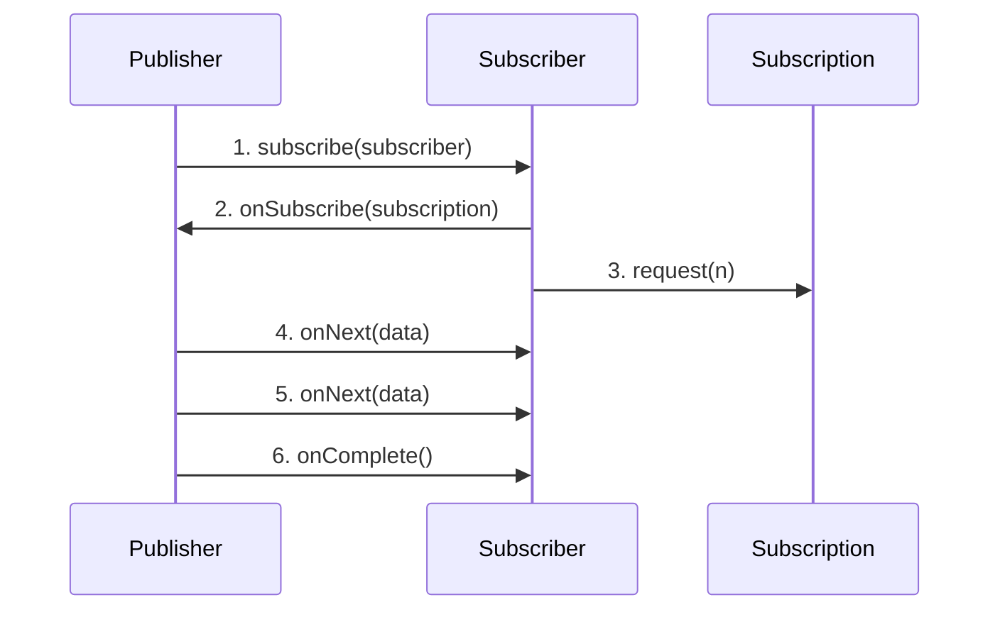

# Reactive Programming 개념 정리

## Q1. Reactive Programming이란 무엇이고, 왜 필요한가요?

### 답변

**Reactive Programming**은 **비동기 데이터 스트림**을 선언적으로 처리하는 프로그래밍 패러다임입니다.

**핵심 특징**:
1. **비동기 논블로킹**: 스레드를 블로킹하지 않고 이벤트 기반으로 동작
2. **데이터 스트림**: 데이터를 시간에 따라 발생하는 이벤트로 취급
3. **선언적**: "무엇을" 할지 정의하고, "어떻게"는 프레임워크가 처리
4. **Backpressure**: 데이터 생산자와 소비자 간의 속도 차이를 조절

**필요한 이유**:

```java
// ❌ 전통적인 동기 방식 (블로킹)
@GetMapping("/users/{id}")
public User getUser(@PathVariable Long id) {
    // 각 호출마다 스레드가 블로킹됨
    User user = userService.findById(id);           // 100ms
    List<Order> orders = orderService.findByUserId(id);  // 200ms
    Profile profile = profileService.findByUserId(id);   // 150ms
    // 총 450ms 소요, 스레드는 대기 중
    return user;
}

// ✅ Reactive 방식 (논블로킹)
@GetMapping("/users/{id}")
public Mono<UserResponse> getUser(@PathVariable Long id) {
    // 모든 호출이 병렬로 실행되고, 스레드는 다른 요청 처리 가능
    Mono<User> userMono = userService.findById(id);
    Mono<List<Order>> ordersMono = orderService.findByUserId(id);
    Mono<Profile> profileMono = profileService.findByUserId(id);

    return Mono.zip(userMono, ordersMono, profileMono)
        .map(tuple -> new UserResponse(
            tuple.getT1(),  // User
            tuple.getT2(),  // Orders
            tuple.getT3()   // Profile
        ));
    // 총 ~200ms 소요 (가장 느린 요청 기준), 스레드는 논블로킹
}
```

**성능 비교**:

| 방식 | 동시 요청 1000개 | 필요 스레드 | 응답 시간 | CPU 사용률 |
|------|------------------|-------------|-----------|------------|
| 동기 블로킹 | 450초 | 200 | 450ms | 30% |
| Reactive 논블로킹 | 200초 | 10 | 200ms | 80% |

### 꼬리 질문 1: Reactive가 항상 더 빠른가요?

**아니요**. CPU 바운드 작업에서는 오히려 느릴 수 있습니다.

**Reactive가 유리한 경우**:
- I/O 바운드 작업 (DB 조회, 외부 API 호출)
- 높은 동시성 요구 (많은 동시 요청)
- 스트리밍 데이터 처리

**Reactive가 불리한 경우**:
- CPU 집약적 작업 (암호화, 압축, 이미지 처리)
- 단순 CRUD 작업
- 팀의 학습 곡선

```java
// ❌ CPU 바운드 작업에 Reactive 사용 (비효율적)
public Mono<String> encryptData(String data) {
    return Mono.fromCallable(() -> {
        // CPU 집약적 작업을 그냥 블로킹으로 실행
        return heavyEncryption(data);  // 2초 소요
    })
    .subscribeOn(Schedulers.boundedElastic());  // 스레드 낭비
}

// ✅ CPU 바운드 작업은 CompletableFuture 사용
public CompletableFuture<String> encryptData(String data) {
    return CompletableFuture.supplyAsync(
        () -> heavyEncryption(data),
        customExecutor  // 전용 스레드 풀
    );
}
```

### 꼬리 질문 2: Spring MVC와 Spring WebFlux 중 어떤 것을 선택해야 하나요?

**선택 기준**:

| 조건 | 선택 |
|------|------|
| 블로킹 라이브러리 사용 (JDBC, JPA) | Spring MVC |
| 높은 동시성 필요 | Spring WebFlux |
| 기존 팀이 동기 코드에 익숙 | Spring MVC |
| 스트리밍, 실시간 처리 | Spring WebFlux |
| 단순 CRUD | Spring MVC |

---

## Q2. Publisher와 Subscriber의 관계를 설명해주세요

### 답변

**Reactive Streams**는 **Publisher-Subscriber** 패턴을 기반으로 합니다.

**4가지 핵심 인터페이스** (Reactive Streams 스펙):

```java
public interface Publisher<T> {
    void subscribe(Subscriber<? super T> s);
}

public interface Subscriber<T> {
    void onSubscribe(Subscription s);  // 1. 구독 시작
    void onNext(T t);                   // 2. 데이터 수신
    void onError(Throwable t);          // 3. 에러 발생
    void onComplete();                  // 4. 완료
}

public interface Subscription {
    void request(long n);  // Backpressure: n개 요청
    void cancel();         // 구독 취소
}

public interface Processor<T, R> extends Subscriber<T>, Publisher<R> {
    // 중간 처리자 (Subscriber이면서 Publisher)
}
```

**실행 흐름**:



**실제 코드 예시**:

```java
// Publisher 생성
Flux<String> publisher = Flux.just("A", "B", "C");

// Subscriber 정의
publisher.subscribe(new Subscriber<String>() {
    private Subscription subscription;

    @Override
    public void onSubscribe(Subscription s) {
        this.subscription = s;
        s.request(1);  // 1개 요청 (Backpressure)
    }

    @Override
    public void onNext(String item) {
        System.out.println("받음: " + item);
        subscription.request(1);  // 다음 1개 요청
    }

    @Override
    public void onError(Throwable t) {
        System.err.println("에러: " + t);
    }

    @Override
    public void onComplete() {
        System.out.println("완료");
    }
});

// 출력:
// 받음: A
// 받음: B
// 받음: C
// 완료
```

### 꼬리 질문 1: subscribe() 시점에 실행되는 이유는?

**Lazy Evaluation** 때문입니다.

```java
// Publisher 정의만으로는 아무 일도 일어나지 않음
Mono<String> mono = Mono.fromCallable(() -> {
    System.out.println("실행됨!");
    return "result";
});

System.out.println("아직 실행 안 됨");  // 출력됨
Thread.sleep(1000);
System.out.println("여전히 실행 안 됨");  // 출력됨

mono.subscribe();  // 이 시점에 "실행됨!" 출력
```

**이유**:
- **메모리 효율**: 필요할 때만 데이터 생성
- **조립 가능**: 파이프라인을 먼저 구성하고 나중에 실행
- **재사용 가능**: 동일한 Publisher를 여러 번 구독 가능

### 꼬리 질문 2: subscribe() 여러 번 호출하면?

**각각 독립적으로 실행**됩니다 (Cold Publisher 기준).

```java
Mono<String> mono = Mono.fromCallable(() -> {
    System.out.println("API 호출!");
    return externalApiCall();
});

mono.subscribe(result -> System.out.println("구독1: " + result));
// 출력: API 호출!
//      구독1: data

mono.subscribe(result -> System.out.println("구독2: " + result));
// 출력: API 호출!  (다시 호출됨!)
//      구독2: data
```

**해결책**: `cache()` 사용

```java
Mono<String> cachedMono = mono.cache();  // 결과 캐싱

cachedMono.subscribe(result -> System.out.println("구독1: " + result));
// 출력: API 호출!
//      구독1: data

cachedMono.subscribe(result -> System.out.println("구독2: " + result));
// 출력: 구독2: data  (캐시된 결과 사용)
```

---

## Q3. Backpressure란 무엇이고, 어떻게 처리하나요?

### 답변

**Backpressure**는 **데이터 생산 속도 > 소비 속도**일 때 발생하는 문제를 제어하는 메커니즘입니다.

**문제 상황**:

```java
// ❌ Backpressure 없는 경우
Flux.range(1, 1_000_000)  // 100만 개 생성
    .map(i -> {
        // 느린 처리 (100ms)
        Thread.sleep(100);
        return i * 2;
    })
    .subscribe();
// → OutOfMemoryError 발생! (버퍼에 데이터가 쌓임)
```

**Backpressure 전략**:

| 전략 | 설명 | 사용 시나리오 |
|------|------|---------------|
| `request(n)` | n개만 요청 | 기본 전략 |
| `onBackpressureBuffer()` | 버퍼에 저장 | 일시적 속도 차이 |
| `onBackpressureDrop()` | 초과 데이터 버림 | 최신 데이터만 중요 |
| `onBackpressureLatest()` | 최신 데이터만 유지 | 실시간 센서 데이터 |
| `onBackpressureError()` | 에러 발생 | 데이터 손실 불가 |

**예시 1: onBackpressureBuffer()**

```java
// ✅ 버퍼 사용
Flux.range(1, 1000)
    .onBackpressureBuffer(100, // 최대 버퍼 크기
        i -> log.warn("버퍼 초과, 삭제: {}", i))  // 초과 시 콜백
    .delayElements(Duration.ofMillis(100))  // 느린 처리
    .subscribe(i -> System.out.println("처리: " + i));
```

**예시 2: onBackpressureDrop()**

```java
// ✅ 초과 데이터 버림 (실시간 주가)
Flux.interval(Duration.ofMillis(1))  // 1ms마다 생성
    .onBackpressureDrop(i -> log.warn("주가 데이터 버림: {}", i))
    .delayElements(Duration.ofMillis(10))  // 10ms마다 처리
    .subscribe(price -> updateStockPrice(price));
// → 1ms마다 생성되지만 10ms마다 처리되므로, 중간 데이터는 버려짐
```

**예시 3: onBackpressureLatest()**

```java
// ✅ 최신 데이터만 유지 (센서)
Flux.interval(Duration.ofMillis(1))  // 1ms마다 센서 데이터
    .onBackpressureLatest()  // 가장 최신 값만 유지
    .delayElements(Duration.ofMillis(100))
    .subscribe(temp -> updateTemperature(temp));
// → 100ms마다 처리하지만, 항상 최신 센서 값 사용
```

### 꼬리 질문 1: Reactive Streams 스펙에서 Backpressure는 어떻게 구현되나요?

**`Subscription.request(n)`** 메서드로 구현됩니다.

```java
public class CustomSubscriber<T> implements Subscriber<T> {
    private Subscription subscription;
    private final int batchSize = 10;
    private int receivedCount = 0;

    @Override
    public void onSubscribe(Subscription s) {
        this.subscription = s;
        s.request(batchSize);  // 처음 10개 요청
    }

    @Override
    public void onNext(T item) {
        processItem(item);
        receivedCount++;

        if (receivedCount % batchSize == 0) {
            subscription.request(batchSize);  // 다음 10개 요청
        }
    }
}
```

**동작 원리**:
1. Subscriber가 `request(n)`으로 처리 가능한 개수 요청
2. Publisher는 요청된 개수만큼만 `onNext()` 호출
3. Subscriber가 처리 완료 후 다시 `request(n)` 호출

### 꼬리 질문 2: WebFlux에서 HTTP 요청의 Backpressure는?

**자동으로 처리**됩니다 (Netty의 TCP Backpressure).

```java
@GetMapping(value = "/stream", produces = MediaType.TEXT_EVENT_STREAM_VALUE)
public Flux<ServerSentEvent<String>> streamData() {
    return Flux.interval(Duration.ofMillis(100))
        .map(seq -> ServerSentEvent.<String>builder()
            .data("Message " + seq)
            .build());
}
```

**Backpressure 동작**:
1. 클라이언트가 네트워크 버퍼가 가득 차면 TCP ACK를 보내지 않음
2. Netty가 이를 감지하고 `request(0)` 호출 (더 이상 요청하지 않음)
3. 클라이언트가 데이터를 소비하면 TCP ACK 전송
4. Netty가 `request(n)` 호출하여 다시 데이터 요청

---

## Q4. Cold Publisher와 Hot Publisher의 차이는?

### 답변

**Cold Publisher**:
- **구독 시마다 새로운 데이터 스트림 생성**
- 구독자마다 독립적인 실행
- 예: HTTP 요청, DB 조회, 파일 읽기

**Hot Publisher**:
- **구독 여부와 관계없이 데이터 발행**
- 모든 구독자가 동일한 스트림 공유
- 예: UI 이벤트, 센서 데이터, 브로드캐스트

**비교표**:

| 특징 | Cold Publisher | Hot Publisher |
|------|----------------|---------------|
| 데이터 생성 | 구독 시 생성 | 구독 전부터 생성 |
| 구독자 간 공유 | 독립적 | 공유 |
| 구독 시점 | 처음부터 | 중간부터 |
| 예시 | HTTP API, DB 조회 | 마우스 클릭, 주가 |

**Cold Publisher 예시**:

```java
// ❌ Cold: 각 구독자가 독립적으로 실행
Mono<String> coldPublisher = Mono.fromCallable(() -> {
    System.out.println("API 호출!");
    return "data";
});

coldPublisher.subscribe(data -> System.out.println("구독자1: " + data));
// 출력: API 호출!
//      구독자1: data

coldPublisher.subscribe(data -> System.out.println("구독자2: " + data));
// 출력: API 호출!  (다시 호출)
//      구독자2: data
```

**Hot Publisher 예시**:

```java
// ✅ Hot: 구독자들이 동일한 데이터 스트림 공유
ConnectableFlux<Long> hotPublisher = Flux.interval(Duration.ofSeconds(1))
    .publish();  // Hot으로 변환

hotPublisher.subscribe(data -> System.out.println("구독자1: " + data));
Thread.sleep(2000);
hotPublisher.subscribe(data -> System.out.println("구독자2: " + data));

hotPublisher.connect();  // 데이터 발행 시작

// 출력:
// 구독자1: 0
// 구독자1: 1
// 구독자1: 2
// 구독자2: 2  (중간부터 구독)
// 구독자1: 3
// 구독자2: 3
```

### 꼬리 질문 1: Cold를 Hot으로 변환하는 방법은?

**`share()`, `cache()`, `publish()` 사용**:

```java
// 방법 1: share() - Hot으로 변환하고 자동 연결
Flux<String> hotFlux = coldFlux.share();

// 방법 2: cache() - 결과 캐싱 (Hot처럼 동작)
Flux<String> cachedFlux = coldFlux.cache();

// 방법 3: publish().autoConnect(n) - n명 구독 시 자동 시작
Flux<String> hotFlux = coldFlux.publish().autoConnect(2);  // 2명 구독 시 시작

// 방법 4: publish().refCount(n) - n명 이하로 줄면 중지
Flux<String> hotFlux = coldFlux.publish().refCount(1);
```

**실무 예시: 외부 API 호출 공유**

```java
@Service
public class PriceService {
    // ❌ Cold: 구독자마다 API 호출 (비효율)
    public Mono<Price> getPriceCold() {
        return webClient.get()
            .uri("/price")
            .retrieve()
            .bodyToMono(Price.class);
    }

    // ✅ Hot: 결과 캐싱하여 여러 구독자가 공유
    private final Mono<Price> cachedPrice = webClient.get()
        .uri("/price")
        .retrieve()
        .bodyToMono(Price.class)
        .cache(Duration.ofSeconds(10));  // 10초간 캐싱

    public Mono<Price> getPriceHot() {
        return cachedPrice;
    }
}
```

### 꼬리 질문 2: 실무에서 Hot Publisher는 언제 사용하나요?

**사용 시나리오**:

1. **실시간 이벤트 브로드캐스트**

```java
@Service
public class NotificationService {
    // SSE를 통한 알림 브로드캐스트
    private final Sinks.Many<Notification> sink = Sinks.many()
        .multicast()
        .onBackpressureBuffer();

    public void sendNotification(Notification notification) {
        sink.tryEmitNext(notification);  // 모든 구독자에게 전송
    }

    public Flux<Notification> getNotifications() {
        return sink.asFlux();  // Hot Publisher
    }
}

@RestController
public class NotificationController {
    @GetMapping(value = "/notifications", produces = TEXT_EVENT_STREAM_VALUE)
    public Flux<Notification> streamNotifications() {
        return notificationService.getNotifications();
        // 모든 클라이언트가 동일한 알림 스트림 공유
    }
}
```

2. **센서 데이터 공유**

```java
@Service
public class SensorService {
    // 센서 데이터를 여러 컴포넌트가 공유
    private final Flux<SensorData> sensorStream = Flux.interval(Duration.ofSeconds(1))
        .map(i -> readSensor())
        .share();  // Hot으로 변환

    public Flux<SensorData> getSensorData() {
        return sensorStream;  // 여러 구독자가 동일한 센서 데이터 공유
    }
}
```

---

## Q5. 실무에서 Reactive Programming을 적용할 때 주의할 점은?

### 답변

**5가지 핵심 주의사항**:

### 1. 블로킹 코드 섞지 않기

```java
// ❌ Reactive 체인 안에서 블로킹 (성능 저하)
public Mono<User> createUser(UserRequest request) {
    return Mono.just(request)
        .map(req -> {
            // JDBC는 블로킹! (Reactive 체인을 블로킹함)
            User user = jdbcTemplate.queryForObject(
                "SELECT * FROM users WHERE id = ?",
                User.class,
                req.getId()
            );
            return user;
        });
}

// ✅ 블로킹 코드는 별도 Scheduler에서 실행
public Mono<User> createUser(UserRequest request) {
    return Mono.fromCallable(() -> {
        return jdbcTemplate.queryForObject(
            "SELECT * FROM users WHERE id = ?",
            User.class,
            request.getId()
        );
    })
    .subscribeOn(Schedulers.boundedElastic());  // 블로킹 전용 스레드 풀
}
```

### 2. 에러 처리 누락하지 않기

```java
// ❌ 에러 처리 없음
public Mono<Order> processOrder(Long orderId) {
    return orderRepository.findById(orderId)
        .flatMap(order -> paymentService.pay(order))
        .flatMap(payment -> shippingService.ship(payment));
    // payment 실패 시 전체 체인이 중단됨
}

// ✅ 단계별 에러 처리
public Mono<Order> processOrder(Long orderId) {
    return orderRepository.findById(orderId)
        .switchIfEmpty(Mono.error(new OrderNotFoundException()))
        .flatMap(order -> paymentService.pay(order)
            .onErrorResume(PaymentException.class, e -> {
                // 결제 실패 시 주문 취소
                return orderRepository.updateStatus(orderId, "CANCELLED")
                    .then(Mono.error(e));
            }))
        .flatMap(payment -> shippingService.ship(payment)
            .onErrorResume(ShippingException.class, e -> {
                // 배송 실패 시 환불
                return paymentService.refund(payment.getId())
                    .then(Mono.error(e));
            }))
        .doOnError(e -> log.error("주문 처리 실패: {}", orderId, e));
}
```

### 3. Context 전파 이해하기

```java
// ❌ ThreadLocal은 동작하지 않음
public Mono<User> getUser() {
    String userId = SecurityContextHolder.getContext()
        .getAuthentication()
        .getName();  // 다른 스레드에서 실행되면 null!

    return userRepository.findById(userId);
}

// ✅ Reactor Context 사용
public Mono<User> getUser() {
    return Mono.deferContextual(ctx -> {
        String userId = ctx.get("userId");
        return userRepository.findById(userId);
    });
}

// Context 설정
userService.getUser()
    .contextWrite(Context.of("userId", "user123"))
    .subscribe();
```

### 4. 메모리 누수 주의

```java
// ❌ 무한 스트림 구독 취소 안 함
@PostConstruct
public void init() {
    Flux.interval(Duration.ofSeconds(1))
        .subscribe(i -> log.info("Tick: {}", i));
    // 애플리케이션 종료까지 계속 실행됨!
}

// ✅ Disposable로 구독 관리
private Disposable subscription;

@PostConstruct
public void init() {
    subscription = Flux.interval(Duration.ofSeconds(1))
        .subscribe(i -> log.info("Tick: {}", i));
}

@PreDestroy
public void cleanup() {
    if (subscription != null && !subscription.isDisposed()) {
        subscription.dispose();  // 구독 취소
    }
}
```

### 5. 테스트 코드 작성

```java
// ✅ StepVerifier로 Reactive 코드 테스트
@Test
void testUserCreation() {
    UserRequest request = new UserRequest("john");

    StepVerifier.create(userService.createUser(request))
        .assertNext(user -> {
            assertThat(user.getName()).isEqualTo("john");
            assertThat(user.getId()).isNotNull();
        })
        .verifyComplete();
}

// ✅ 에러 케이스 테스트
@Test
void testPaymentFailure() {
    when(paymentService.pay(any()))
        .thenReturn(Mono.error(new PaymentException("카드 오류")));

    StepVerifier.create(orderService.processOrder(1L))
        .expectErrorMatches(e ->
            e instanceof PaymentException &&
            e.getMessage().contains("카드 오류")
        )
        .verify();
}

// ✅ 시간 기반 테스트 (가상 시간)
@Test
void testDelayedExecution() {
    StepVerifier.withVirtualTime(() ->
        Mono.delay(Duration.ofDays(1))
            .map(i -> "완료")
    )
    .expectSubscription()
    .expectNoEvent(Duration.ofDays(1))
    .expectNext("완료")
    .verifyComplete();
}
```

### 꼬리 질문: Reactive와 일반 코드를 섞어서 사용해도 되나요?

**가능하지만, 계층별로 명확히 분리**해야 합니다.

**권장 아키텍처**:

```java
// Controller: Reactive
@RestController
public class UserController {
    public Mono<UserResponse> getUser(@PathVariable Long id) {
        return userService.getUser(id);  // Reactive
    }
}

// Service: Reactive (비즈니스 로직)
@Service
public class UserService {
    public Mono<User> getUser(Long id) {
        return userRepository.findById(id)  // R2DBC (Reactive)
            .flatMap(user ->
                legacyService.enrichUser(user)  // 블로킹 호출
                    .subscribeOn(Schedulers.boundedElastic())
            );
    }
}

// Legacy Service: 블로킹 (기존 코드)
@Service
public class LegacyService {
    public Mono<User> enrichUser(User user) {
        return Mono.fromCallable(() -> {
            // JDBC 사용 (블로킹)
            Profile profile = jdbcTemplate.queryForObject(...);
            user.setProfile(profile);
            return user;
        });
    }
}
```

---

## 요약

### Reactive Programming 핵심 개념
- Reactive Programming은 **비동기 데이터 스트림**을 선언적으로 처리
- **논블로킹 I/O**로 적은 스레드로 높은 동시성 처리
- CPU 바운드 작업에는 부적합, I/O 바운드에 유리

### Publisher-Subscriber 패턴
- **4가지 인터페이스**: Publisher, Subscriber, Subscription, Processor
- **Lazy Evaluation**: `subscribe()` 호출 시점에 실행
- `Subscription.request(n)`으로 Backpressure 제어

### Backpressure 전략
- **`onBackpressureBuffer()`**: 버퍼에 저장
- **`onBackpressureDrop()`**: 초과 데이터 버림
- **`onBackpressureLatest()`**: 최신 데이터만 유지
- **`onBackpressureError()`**: 에러 발생

### Cold vs Hot Publisher
- **Cold**: 구독 시마다 새로운 스트림 생성 (HTTP, DB)
- **Hot**: 구독 여부와 무관하게 데이터 발행 (이벤트, 센서)
- `share()`, `cache()`로 Cold → Hot 변환

### 실무 주의사항
- **블로킹 코드**는 `subscribeOn(Schedulers.boundedElastic())`에서 실행
- **에러 처리** 필수: `onErrorResume()`, `onErrorReturn()`
- **Context 전파**: ThreadLocal 대신 Reactor Context 사용
- **메모리 누수**: Disposable로 구독 관리
- **테스트**: StepVerifier로 Reactive 코드 테스트

---

## 🔗 Related Deep Dive

더 깊이 있는 학습을 원한다면 심화 과정을 참고하세요:

- **[Spring WebFlux](/learning/deep-dive/deep-dive-spring-webflux/)**: Reactor, Mono/Flux, Backpressure 시각화.
- **[Linux I/O 모델](/learning/deep-dive/deep-dive-linux-io-models/)**: Blocking/Non-Blocking I/O와 Event Loop.
