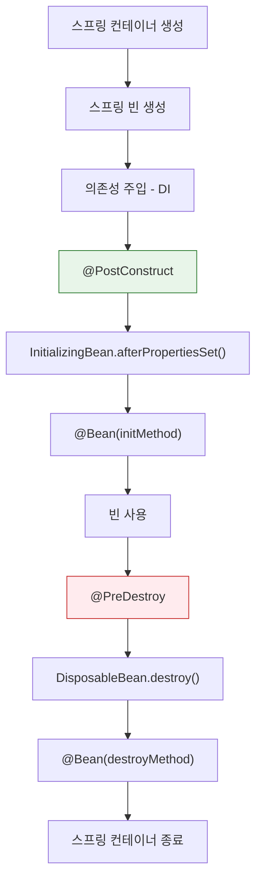

## Q1. Spring Bean의 생명주기를 설명해주세요.

### 답변

Spring Bean은 **컨테이너 시작 → 생성 → 의존성 주입 → 초기화 → 사용 → 소멸** 단계를 거칩니다.

**상세 생명주기**:



**코드 예시**:

```java
@Component
public class UserService implements InitializingBean, DisposableBean {

    private final UserRepository userRepository;

    // 1. 생성자 실행
    public UserService(UserRepository userRepository) {
        System.out.println("1. Constructor");
        this.userRepository = userRepository;
    }

    // 2. 의존성 주입 후 실행
    @PostConstruct
    public void init() {
        System.out.println("2. @PostConstruct");
    }

    // 3. InitializingBean 인터페이스
    @Override
    public void afterPropertiesSet() {
        System.out.println("3. afterPropertiesSet()");
    }

    // 4. 소멸 전 실행
    @PreDestroy
    public void preDestroy() {
        System.out.println("4. @PreDestroy");
    }

    // 5. DisposableBean 인터페이스
    @Override
    public void destroy() {
        System.out.println("5. destroy()");
    }
}
```

**실행 결과**:
```
1. Constructor
2. @PostConstruct
3. afterPropertiesSet()
(애플리케이션 실행 중...)
4. @PreDestroy
5. destroy()
```

### 꼬리 질문 1: @PostConstruct와 @Bean(initMethod)의 차이는?

**답변**:

| 구분 | @PostConstruct | @Bean(initMethod) |
|------|---------------|-------------------|
| 선언 위치 | 클래스 내부 | @Configuration 클래스 |
| 실행 순서 | 먼저 | 나중에 |
| 사용 권장 | 일반적 초기화 | 외부 라이브러리 빈 초기화 |

**예시**:

```java
@Configuration
public class DataSourceConfig {

    @Bean(initMethod = "init", destroyMethod = "close")
    public HikariDataSource dataSource() {
        HikariDataSource ds = new HikariDataSource();
        ds.setJdbcUrl("jdbc:mysql://localhost:3306/db");
        return ds;
        // init() 메서드가 자동으로 호출됨
    }
}
```

### 꼬리 질문 2: 순환 참조가 발생하면 어떻게 되나요?

**답변**:

**생성자 주입 시**: `BeanCurrentlyInCreationException` 발생 (권장)

```java
@Service
public class AService {
    private final BService bService;

    public AService(BService bService) {  // B가 A를 의존
        this.bService = bService;
    }
}

@Service
public class BService {
    private final AService aService;

    public BService(AService aService) {  // A가 B를 의존
        this.aService = aService;  // ❌ 순환 참조!
    }
}
```

**필드/Setter 주입 시**: 일시적으로 동작하지만 권장하지 않음

**해결 방법**:
1. 설계 개선 (가장 권장)
2. `@Lazy` 사용
3. `ObjectProvider` 또는 `Provider` 사용

```java
@Service
public class AService {
    private final ObjectProvider<BService> bServiceProvider;

    public AService(ObjectProvider<BService> bServiceProvider) {
        this.bServiceProvider = bServiceProvider;
    }

    public void doSomething() {
        BService bService = bServiceProvider.getObject();
        bService.process();
    }
}
```

---

## Q2. Spring AOP의 Proxy 객체는 어떻게 생성되나요?

### 답변

Spring AOP는 **런타임에 프록시 객체를 생성**하여 부가 기능(트랜잭션, 로깅 등)을 추가합니다.

**프록시 생성 방식**:

1. **JDK Dynamic Proxy** (인터페이스 기반)
2. **CGLIB Proxy** (클래스 기반)

**JDK Dynamic Proxy**:

```java
public interface UserService {
    void createUser(User user);
}

@Service
public class UserServiceImpl implements UserService {
    @Override
    public void createUser(User user) {
        // 실제 구현
    }
}

// Spring이 생성하는 프록시
UserService proxy = (UserService) Proxy.newProxyInstance(
    classLoader,
    new Class[]{UserService.class},
    new TransactionInvocationHandler(target)
);
```

**CGLIB Proxy** (Spring Boot 2.0+의 기본값):

```java
@Service
public class UserService {  // 인터페이스 없음
    @Transactional
    public void createUser(User user) {
        // 실제 구현
    }
}

// Spring이 생성하는 프록시 (UserService를 상속)
UserService$$EnhancerBySpringCGLIB$$12345678
```

**프록시 동작 원리**:

```
Client → Proxy → Target Object

@Transactional 메서드 호출 시:
1. Proxy가 호출 가로챔
2. Transaction 시작
3. Target 메서드 실행
4. Transaction 커밋/롤백
5. 결과 반환
```

### 꼬리 질문 1: 같은 클래스 내부 메서드 호출 시 @Transactional이 동작하지 않는 이유는?

**답변**:

**문제 코드**:

```java
@Service
public class UserService {

    @Transactional
    public void createUser(User user) {
        saveUser(user);
    }

    @Transactional(propagation = Propagation.REQUIRES_NEW)
    public void saveUser(User user) {
        // 새로운 트랜잭션을 기대하지만...
        userRepository.save(user);
    }
}
```

**이유**: `this.saveUser()`는 **프록시를 거치지 않고 직접 호출**되기 때문

```
createUser() 호출
  ↓ (프록시를 통해 호출됨 → @Transactional 동작)
Proxy → Target.createUser()
  ↓ (this.saveUser() → 직접 호출)
Target.saveUser()  ← 프록시를 거치지 않음! @Transactional 무시됨
```

**해결 방법**:

```java
// 1. 별도 클래스로 분리 (권장)
@Service
public class UserSaveService {
    @Transactional(propagation = Propagation.REQUIRES_NEW)
    public void saveUser(User user) {
        userRepository.save(user);
    }
}

@Service
public class UserService {
    private final UserSaveService userSaveService;

    @Transactional
    public void createUser(User user) {
        userSaveService.saveUser(user);  // ✅ 프록시를 통해 호출
    }
}

// 2. Self-Injection (비권장)
@Service
public class UserService {
    @Autowired
    private UserService self;  // 자기 자신의 프록시 주입

    @Transactional
    public void createUser(User user) {
        self.saveUser(user);  // 프록시를 통해 호출
    }
}

// 3. AopContext 사용 (비권장)
@EnableAspectJAutoProxy(exposeProxy = true)
public class UserService {
    @Transactional
    public void createUser(User user) {
        ((UserService) AopContext.currentProxy()).saveUser(user);
    }
}
```

### 꼬리 질문 2: CGLIB의 한계는 무엇인가요?

**답변**:

**CGLIB 제약사항**:

1. **final 클래스/메서드는 프록시 불가** (상속 불가)
2. **private 메서드는 프록시 불가**
3. **생성자가 2번 호출됨** (원본 + 프록시)

**예시**:

```java
@Service
public final class UserService {  // ❌ CGLIB 프록시 불가
    @Transactional
    public void createUser(User user) { }
}

@Service
public class UserService {
    @Transactional
    public final void createUser(User user) { }  // ❌ 프록시 불가
}
```

---

## Q3. @Configuration과 @Component의 차이는 무엇인가요?

### 답변

**핵심 차이**: `@Configuration`은 **CGLIB 프록시**가 적용되어 **싱글톤을 보장**합니다.

**@Component**:

```java
@Component
public class AppConfig {

    @Bean
    public UserRepository userRepository() {
        return new UserRepository();
    }

    @Bean
    public UserService userService() {
        return new UserService(userRepository());  // 새로운 인스턴스 생성!
    }

    @Bean
    public OrderService orderService() {
        return new OrderService(userRepository());  // 또 다른 인스턴스 생성!
    }
}

// userService와 orderService가 서로 다른 UserRepository 인스턴스를 사용
```

**@Configuration**:

```java
@Configuration
public class AppConfig {

    @Bean
    public UserRepository userRepository() {
        return new UserRepository();
    }

    @Bean
    public UserService userService() {
        return new UserService(userRepository());  // 프록시가 캐시된 인스턴스 반환
    }

    @Bean
    public OrderService orderService() {
        return new OrderService(userRepository());  // 동일한 인스턴스 반환
    }
}

// userService와 orderService가 동일한 UserRepository 인스턴스를 공유
```

**프록시 동작 원리**:

```java
// Spring이 생성하는 @Configuration 프록시
public class AppConfig$$EnhancerBySpringCGLIB extends AppConfig {

    private Map<String, Object> beanCache = new HashMap<>();

    @Override
    public UserRepository userRepository() {
        if (beanCache.containsKey("userRepository")) {
            return (UserRepository) beanCache.get("userRepository");
        }

        UserRepository bean = super.userRepository();
        beanCache.put("userRepository", bean);
        return bean;
    }
}
```

### 꼬리 질문 1: @Configuration(proxyBeanMethods = false)는 언제 사용하나요?

**답변**:

**proxyBeanMethods = false**: CGLIB 프록시를 생성하지 않음 → **성능 향상**

**사용 시기**:

```java
@Configuration(proxyBeanMethods = false)  // Lite Mode
public class DataSourceConfig {

    @Bean
    public DataSource dataSource() {
        return new HikariDataSource();
    }

    // @Bean 메서드 간 호출이 없을 때 사용
}
```

**장점**:
- 프록시 생성 비용 없음
- 스프링 부트 애플리케이션 시작 속도 향상

**주의**:
- @Bean 메서드 간 직접 호출 시 싱글톤 보장 안 됨

### 꼬리 질문 2: @Bean과 @Component의 차이는?

**답변**:

| 구분 | @Component | @Bean |
|------|-----------|-------|
| 선언 위치 | 클래스 레벨 | 메서드 레벨 |
| 생성 방식 | 컴포넌트 스캔 자동 | 수동 등록 |
| 사용 사례 | 직접 작성한 클래스 | 외부 라이브러리, 조건부 생성 |

**예시**:

```java
// @Component: 직접 작성한 클래스
@Component
public class UserService { }

// @Bean: 외부 라이브러리 또는 조건부 생성
@Configuration
public class RedisConfig {

    @Bean
    @ConditionalOnProperty(name = "redis.enabled", havingValue = "true")
    public RedisTemplate<String, Object> redisTemplate() {
        RedisTemplate<String, Object> template = new RedisTemplate<>();
        // 설정...
        return template;
    }
}
```

---

## Q4. BeanPostProcessor와 BeanFactoryPostProcessor의 차이는?

### 답변

**BeanPostProcessor**: **빈 초기화 전후**에 커스터마이징

**BeanFactoryPostProcessor**: **빈 정의(BeanDefinition) 수정**

**실행 순서**:

```
1. BeanFactoryPostProcessor 실행
   ↓
2. Bean 인스턴스 생성
   ↓
3. BeanPostProcessor.postProcessBeforeInitialization()
   ↓
4. @PostConstruct, InitializingBean
   ↓
5. BeanPostProcessor.postProcessAfterInitialization()
```

**BeanPostProcessor 예시**:

```java
@Component
public class LoggingBeanPostProcessor implements BeanPostProcessor {

    @Override
    public Object postProcessBeforeInitialization(Object bean, String beanName) {
        System.out.println("Before Initialization: " + beanName);
        return bean;
    }

    @Override
    public Object postProcessAfterInitialization(Object bean, String beanName) {
        System.out.println("After Initialization: " + beanName);
        return bean;  // 또는 프록시 객체 반환
    }
}
```

**BeanFactoryPostProcessor 예시**:

```java
@Component
public class CustomBeanFactoryPostProcessor implements BeanFactoryPostProcessor {

    @Override
    public void postProcessBeanFactory(ConfigurableListableBeanFactory beanFactory) {
        // BeanDefinition 수정
        BeanDefinition bd = beanFactory.getBeanDefinition("userService");
        bd.setScope(BeanDefinition.SCOPE_PROTOTYPE);  // 싱글톤 → 프로토타입
    }
}
```

**실무 사용 사례**:

- **BeanPostProcessor**: AOP 프록시 생성, 트랜잭션 어드바이스 적용
- **BeanFactoryPostProcessor**: 프로퍼티 치환 (`PropertySourcesPlaceholderConfigurer`)

---

## Q5. Lazy Initialization은 언제 사용하나요?

### 답변

**Lazy Initialization**: 빈을 **실제 사용 시점에 생성**

**기본 동작 (Eager)**:

```java
@SpringBootApplication
public class Application {
    public static void main(String[] args) {
        SpringApplication.run(Application.class, args);
        // 모든 싱글톤 빈이 여기서 생성됨
    }
}
```

**Lazy Initialization**:

```java
@Service
@Lazy
public class HeavyService {
    public HeavyService() {
        // 무거운 초기화 작업
        loadLargeDataset();
    }
}

@RestController
public class UserController {
    private final HeavyService heavyService;

    public UserController(@Lazy HeavyService heavyService) {
        this.heavyService = heavyService;
        // 아직 HeavyService 생성 안 됨
    }

    @GetMapping("/heavy")
    public String useHeavy() {
        heavyService.process();  // ← 여기서 생성됨
        return "done";
    }
}
```

**전역 Lazy 설정**:

```yaml
# application.yml
spring:
  main:
    lazy-initialization: true
```

**장점**:
- 애플리케이션 시작 속도 향상
- 사용하지 않는 빈은 메모리 절약

**단점**:
- 런타임에 에러 발생 가능 (설정 오류 발견 늦음)
- 첫 요청 응답 시간 증가

**권장 사용 사례**:
- 개발 환경에서 빠른 재시작
- 특정 기능만 사용하는 경우
- 테스트 환경

---

## 핵심 요약

### 학습 체크리스트

**Bean Lifecycle**:
- 생성 → 의존성 주입 → 초기화 → 소멸 단계
- @PostConstruct, InitializingBean, @Bean(initMethod) 순서
- 순환 참조 문제 및 해결 방법

**Proxy**:
- JDK Dynamic Proxy vs CGLIB
- 내부 메서드 호출 시 프록시 미적용 이유
- CGLIB 제약사항 (final, private)

**@Configuration**:
- @Configuration vs @Component 차이
- CGLIB 프록시를 통한 싱글톤 보장
- proxyBeanMethods = false 사용 시기

**Post Processor**:
- BeanPostProcessor vs BeanFactoryPostProcessor
- 실행 순서 및 사용 사례

**Lazy Initialization**:
- 장단점 및 사용 시기
- 전역 vs 개별 Lazy 설정

### 실무 포인트

- 순환 참조는 설계 개선으로 해결
- 트랜잭션은 별도 클래스로 분리
- @Configuration(proxyBeanMethods=false)로 성능 개선
- 프로덕션에서는 Eager 초기화 권장

---

## 🔗 Related Deep Dive

더 깊이 있는 학습을 원한다면 심화 과정을 참고하세요:

- **[Spring 빈 스코프](/learning/deep-dive/deep-dive-spring-bean-scopes/)**: Singleton vs Prototype, Proxy 패턴 시각화.
- **[Spring AOP 내부 동작](/learning/deep-dive/deep-dive-spring-aop-transaction-internals/)**: CGLIB vs JDK Dynamic Proxy 비교.
