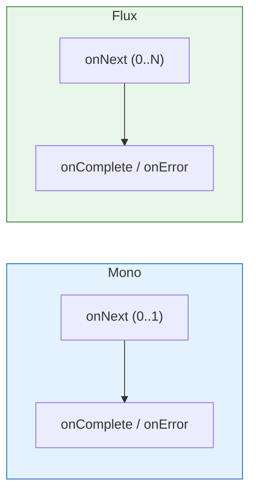

## Q1. Mono와 Flux의 차이는 무엇인가요?

### 답변

**Mono**: **0개 또는 1개**의 데이터를 비동기로 처리하는 Publisher

**Flux**: **0개 이상 N개**의 데이터를 비동기로 처리하는 Publisher



**코드 예시**:

```java
// Mono: 단일 사용자 조회
Mono<User> userMono = userRepository.findById(1L);
// 결과: User 1명 또는 empty

// Flux: 여러 사용자 조회
Flux<User> userFlux = userRepository.findAll();
// 결과: User 0명 이상
```

**사용 사례**:

| 타입 | 사용 사례 |
|------|---------|
| Mono | HTTP 응답, 단일 엔티티 조회, 단일 계산 결과 |
| Flux | 스트리밍 데이터, 컬렉션 조회, 이벤트 스트림 |

**Mono ↔ Flux 변환**:

```java
// Mono → Flux
Mono<String> mono = Mono.just("Hello");
Flux<String> flux = mono.flux();  // Flux.just("Hello")

// Flux → Mono
Flux<Integer> numbers = Flux.just(1, 2, 3, 4, 5);
Mono<List<Integer>> mono = numbers.collectList();  // Mono.just([1,2,3,4,5])
Mono<Integer> sum = numbers.reduce(0, Integer::sum);  // Mono.just(15)
```

### 꼬리 질문 1: Mono.empty()와 Mono.just(null)의 차이는?

**답변**:

```java
// Mono.empty(): 정상적으로 데이터가 없음
Mono<User> user = userRepository.findById(999L);
// → Mono.empty() 반환
// → onComplete 시그널

// Mono.just(null): NullPointerException 발생!
Mono<String> mono = Mono.just(null);  // ❌ NPE

// null을 표현하려면 Optional 사용
Mono<Optional<User>> mono = Mono.just(Optional.empty());
```

**실무 패턴**:

```java
public Mono<User> findUser(Long id) {
    return userRepository.findById(id)
        .switchIfEmpty(Mono.error(new UserNotFoundException()));
        // empty일 때 에러로 변환
}
```

### 꼬리 질문 2: Mono와 CompletableFuture의 차이는?

**답변**:

| 구분 | Mono | CompletableFuture |
|------|------|-------------------|
| Lazy | ✅ subscribe 시 실행 | ❌ 생성 즉시 실행 |
| Cancellation | ✅ 지원 | ❌ 미지원 |
| Backpressure | ✅ 지원 | ❌ 미지원 |
| Operators | ✅ 풍부 (map, flatMap, filter 등) | ⚠️ 제한적 |

**예시**:

```java
// CompletableFuture: 즉시 실행
CompletableFuture<String> future = CompletableFuture.supplyAsync(() -> {
    System.out.println("Executing...");  // 즉시 출력
    return "result";
});

// Mono: subscribe 전까지 실행 안 됨
Mono<String> mono = Mono.fromCallable(() -> {
    System.out.println("Executing...");  // 아직 출력 안 됨
    return "result";
});
mono.subscribe();  // 여기서 출력
```

---

## Q2. subscribe()는 언제 호출되나요?

### 답변

**핵심**: **subscribe()가 호출되어야 비로소 실행**됩니다 (Lazy Evaluation)

**WebFlux에서 subscribe 호출 시점**:

```
Client → HTTP 요청
  ↓
DispatcherHandler
  ↓
Controller 메서드 실행 → Mono/Flux 반환
  ↓
WebFlux가 자동으로 subscribe() 호출  ← 여기!
  ↓
실제 로직 실행
  ↓
응답 반환
```

**잘못된 코드 (subscribe를 직접 호출)**:

```java
@GetMapping("/users/{id}")
public Mono<User> getUser(@PathVariable Long id) {
    Mono<User> user = userRepository.findById(id);

    user.subscribe(u -> {
        // ❌ 절대 이렇게 하지 말 것!
        // 1. 응답과 무관하게 별도로 실행됨
        // 2. 에러 처리 안 됨
        // 3. 메모리 누수 가능
        System.out.println(u.getName());
    });

    return user;  // 새로운 구독이 발생 (중복 실행)
}
```

**올바른 코드**:

```java
@GetMapping("/users/{id}")
public Mono<User> getUser(@PathVariable Long id) {
    return userRepository.findById(id)
        .doOnNext(u -> System.out.println(u.getName()));  // ✅ 로깅만
    // WebFlux가 subscribe() 호출
}
```

### 꼬리 질문 1: 여러 번 subscribe하면 어떻게 되나요?

**답변**:

**각 subscribe마다 독립적으로 실행**됩니다 (Cold Publisher 특성)

```java
Mono<String> mono = Mono.fromCallable(() -> {
    System.out.println("Executing expensive operation");
    return "result";
});

mono.subscribe(s -> System.out.println("Sub1: " + s));
// 출력: "Executing expensive operation"
//       "Sub1: result"

mono.subscribe(s -> System.out.println("Sub2: " + s));
// 출력: "Executing expensive operation" (다시 실행!)
//       "Sub2: result"
```

**해결: cache() 사용**:

```java
Mono<String> mono = Mono.fromCallable(() -> {
    System.out.println("Executing expensive operation");
    return "result";
}).cache();  // 결과를 캐싱

mono.subscribe(s -> System.out.println("Sub1: " + s));
// 출력: "Executing expensive operation"
//       "Sub1: result"

mono.subscribe(s -> System.out.println("Sub2: " + s));
// 출력: "Sub2: result" (캐시된 결과 사용)
```

### 꼬리 질문 2: block()은 언제 사용하나요?

**답변**:

**block()**: Mono/Flux를 **동기적으로 변환** (Reactive의 이점 상실)

**사용 가능한 경우**:
- 테스트 코드
- Main 메서드
- 배치 작업

**절대 사용 금지**:
- WebFlux Controller (DeadLock 가능)
- Reactive Chain 내부

```java
// ❌ WebFlux Controller에서 block() 사용
@GetMapping("/users/{id}")
public User getUser(@PathVariable Long id) {
    return userRepository.findById(id).block();  // 절대 금지!
    // IllegalStateException: block() not supported in thread reactor-http-nio-2
}

// ✅ 테스트 코드에서는 OK
@Test
void testFindUser() {
    User user = userRepository.findById(1L).block();
    assertNotNull(user);
}

// ✅ Main 메서드에서는 OK
public static void main(String[] args) {
    Flux.range(1, 10)
        .map(i -> i * 2)
        .collectList()
        .block();
}
```

---

## Q3. Scheduler의 종류와 사용 사례를 설명해주세요.

### 답변

**Scheduler**: Reactive Stream이 **어느 스레드에서 실행될지** 결정

**주요 Scheduler**:

| Scheduler | 특징 | 사용 사례 |
|-----------|------|---------|
| `Schedulers.immediate()` | 현재 스레드에서 즉시 실행 | 테스트 |
| `Schedulers.single()` | 단일 스레드 재사용 | 가벼운 작업 |
| `Schedulers.parallel()` | CPU 코어 수만큼 스레드 풀 | CPU 집약적 작업 |
| `Schedulers.boundedElastic()` | 탄력적 스레드 풀 (최대 10 * CPU 코어) | I/O, Blocking 작업 |

**subscribeOn() vs publishOn()**:

```java
// subscribeOn: 구독 시작 스레드 지정
Flux.range(1, 5)
    .doOnNext(i -> log("subscribeOn 전: " + i))
    .subscribeOn(Schedulers.parallel())
    .doOnNext(i -> log("subscribeOn 후: " + i))
    .subscribe();

// 출력: 모두 parallel 스레드

// publishOn: 이후 Operator 실행 스레드 지정
Flux.range(1, 5)
    .doOnNext(i -> log("publishOn 전: " + i))  // main 스레드
    .publishOn(Schedulers.parallel())
    .doOnNext(i -> log("publishOn 후: " + i))  // parallel 스레드
    .subscribe();
```

**실무 예시**:

```java
@Service
public class UserService {

    public Mono<User> createUser(UserRequest request) {
        return Mono.fromCallable(() -> {
            // Blocking 작업 (외부 API 호출)
            return restTemplate.getForObject(
                "https://api.example.com/validate",
                ValidationResult.class
            );
        })
        .subscribeOn(Schedulers.boundedElastic())  // Blocking 작업은 여기서
        .flatMap(validation -> {
            if (validation.isValid()) {
                return userRepository.save(User.from(request));  // Non-blocking
            }
            return Mono.error(new ValidationException());
        });
    }
}
```

### 꼬리 질문 1: boundedElastic과 parallel의 차이는?

**답변**:

**parallel**:
- **CPU 코어 수**만큼 고정 스레드 (예: 8코어 = 8스레드)
- **CPU 집약적** 작업에 적합 (계산, 암호화)
- Blocking 작업 시 모든 스레드가 막힐 수 있음

**boundedElastic**:
- **동적으로 스레드 생성** (최대 CPU 코어 * 10, 기본 60초 TTL)
- **I/O 및 Blocking** 작업에 적합
- JDBC, RestTemplate, File I/O 등

```java
// ❌ 잘못된 사용
Mono.fromCallable(() -> {
    Thread.sleep(5000);  // Blocking
    return "result";
})
.subscribeOn(Schedulers.parallel())  // parallel 스레드 5초간 블로킹!

// ✅ 올바른 사용
Mono.fromCallable(() -> {
    Thread.sleep(5000);  // Blocking
    return "result";
})
.subscribeOn(Schedulers.boundedElastic())  // boundedElastic 사용
```

### 꼬리 질문 2: Schedulers.immediate()는 언제 사용하나요?

**답변**:

**immediate()**: 현재 스레드에서 즉시 실행 (스레드 전환 없음)

**사용 사례**:
- 테스트에서 동기적 실행 보장
- 이미 적절한 스레드에 있을 때

```java
// 테스트 코드
@Test
void testFlux() {
    StepVerifier.create(
        Flux.just(1, 2, 3)
            .subscribeOn(Schedulers.immediate())  // 테스트 스레드에서 실행
            .map(i -> i * 2)
    )
    .expectNext(2, 4, 6)
    .verifyComplete();
}
```

---

## Q4. flatMap과 map의 차이는 무엇인가요?

### 답변

**map**: **동기적 변환** (값 → 값)

**flatMap**: **비동기적 변환** (값 → Publisher)

```java
// map: 동기 변환
Flux.just(1, 2, 3)
    .map(i -> i * 2)  // Integer → Integer
    .subscribe(System.out::println);
// 출력: 2, 4, 6

// flatMap: 비동기 변환
Flux.just(1, 2, 3)
    .flatMap(i -> Mono.just(i * 2))  // Integer → Mono<Integer>
    .subscribe(System.out::println);
// 출력: 2, 4, 6 (비동기로)
```

**실무 예시**:

```java
// map: 동기 변환
public Flux<UserDTO> getUsers() {
    return userRepository.findAll()
        .map(user -> new UserDTO(user));  // User → UserDTO
}

// flatMap: 비동기 호출
public Flux<OrderWithUser> getOrdersWithUser() {
    return orderRepository.findAll()
        .flatMap(order ->
            userRepository.findById(order.getUserId())  // Mono<User> 반환
                .map(user -> new OrderWithUser(order, user))
        );
}
```

**flatMap의 동시성**:

```java
Flux.range(1, 10)
    .flatMap(i ->
        Mono.delay(Duration.ofSeconds(1))
            .map(d -> i)
    )
    .subscribe(System.out::println);
// 약 1초 후 1~10이 동시에 출력 (병렬 실행)

// concurrency 제한
Flux.range(1, 10)
    .flatMap(i ->
        Mono.delay(Duration.ofSeconds(1))
            .map(d -> i),
        3  // 최대 3개만 동시 실행
    )
    .subscribe(System.out::println);
// 약 4초 소요 (3개씩 4번)
```

### 꼬리 질문 1: concatMap과 flatMap의 차이는?

**답변**:

| 구분 | flatMap | concatMap |
|------|---------|-----------|
| 순서 | 보장 안 됨 | 보장됨 |
| 동시성 | 병렬 실행 | 순차 실행 |
| 성능 | 빠름 | 느림 |

```java
// flatMap: 순서 보장 안 됨
Flux.just(3, 1, 2)
    .flatMap(i ->
        Mono.delay(Duration.ofMillis(i * 100))
            .map(d -> i)
    )
    .subscribe(System.out::println);
// 출력: 1, 2, 3 (지연 시간 짧은 순)

// concatMap: 순서 보장
Flux.just(3, 1, 2)
    .concatMap(i ->
        Mono.delay(Duration.ofMillis(i * 100))
            .map(d -> i)
    )
    .subscribe(System.out::println);
// 출력: 3, 1, 2 (원본 순서 유지)
```

### 꼬리 질문 2: flatMap 내부에서 block()을 호출하면?

**답변**:

**절대 금지!** IllegalStateException 발생

```java
// ❌ 잘못된 코드
Flux.just(1, 2, 3)
    .flatMap(i -> {
        User user = userRepository.findById(i).block();  // 에러!
        return Mono.just(user);
    });

// ✅ 올바른 코드
Flux.just(1, 2, 3)
    .flatMap(i -> userRepository.findById(i));  // Mono를 그대로 반환
```

---

## Q5. onErrorResume과 onErrorReturn의 차이는?

### 답변

**onErrorReturn**: 에러 발생 시 **기본값 반환**

**onErrorResume**: 에러 발생 시 **대체 Publisher 실행**

```java
// onErrorReturn: 기본값 반환
Mono.error(new RuntimeException("Error"))
    .onErrorReturn("default")
    .subscribe(System.out::println);
// 출력: "default"

// onErrorResume: 대체 Publisher
Mono.error(new RuntimeException("Error"))
    .onErrorResume(e -> Mono.just("fallback"))
    .subscribe(System.out::println);
// 출력: "fallback"
```

**실무 예시**:

```java
// onErrorReturn: 단순 기본값
public Mono<User> findUser(Long id) {
    return userRepository.findById(id)
        .onErrorReturn(new User("Unknown"));
}

// onErrorResume: 복잡한 Fallback 로직
public Mono<User> findUserWithCache(Long id) {
    return userRepository.findById(id)
        .onErrorResume(e -> {
            log.error("Database error, trying cache", e);
            return cacheRepository.findById(id);  // Fallback to cache
        })
        .onErrorResume(e -> {
            log.error("Cache also failed", e);
            return Mono.just(new User("Guest"));  // Final fallback
        });
}
```

**조건부 에러 처리**:

```java
public Mono<User> findUser(Long id) {
    return userRepository.findById(id)
        .onErrorResume(UserNotFoundException.class, e ->
            // UserNotFoundException만 처리
            Mono.just(new User("Guest"))
        )
        .onErrorResume(e ->
            // 그 외 에러는 그대로 전파
            Mono.error(e)
        );
}
```

---

## 핵심 요약

### 학습 체크리스트

**Mono vs Flux**:
- Mono는 0..1, Flux는 0..N 데이터 처리
- Mono.empty() vs Mono.just(null) 차이
- Mono vs CompletableFuture 차이 (Lazy, Cancellation)

**subscribe**:
- subscribe 전까지 실행 안 됨 (Lazy)
- WebFlux가 자동으로 subscribe 호출
- 여러 번 subscribe 시 각각 독립 실행
- block()은 WebFlux Controller에서 금지

**Scheduler**:
- immediate, single, parallel, boundedElastic 차이
- subscribeOn vs publishOn
- Blocking 작업은 boundedElastic 사용

**Operators**:
- map (동기) vs flatMap (비동기)
- flatMap vs concatMap (순서 보장)
- onErrorReturn vs onErrorResume

### 실무 핵심 포인트

- WebFlux Controller에서 절대 block() 사용 금지
- Blocking 작업은 boundedElastic Scheduler 사용
- flatMap으로 비동기 호출 체이닝
- 순서가 중요하면 concatMap 사용
- 에러 처리는 onErrorResume으로 Fallback 구현

---

## 🔗 Related Deep Dive

더 깊이 있는 학습을 원한다면 심화 과정을 참고하세요:

- **[Spring WebFlux](/learning/deep-dive/deep-dive-spring-webflux/)**: Reactor, Mono/Flux, Backpressure 시각화.
- **[Spring MVC 요청 흐름](/learning/deep-dive/deep-dive-spring-mvc-request-lifecycle/)**: WebFlux와의 차이점 비교.
